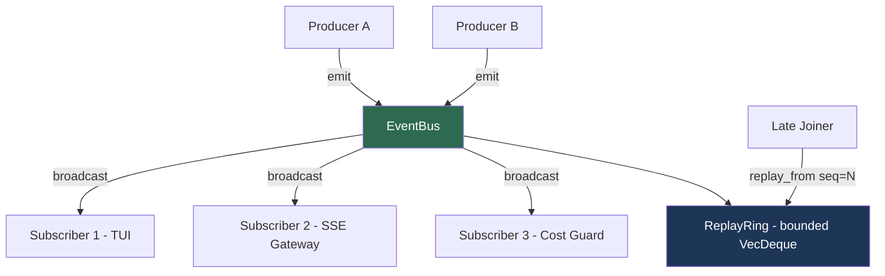
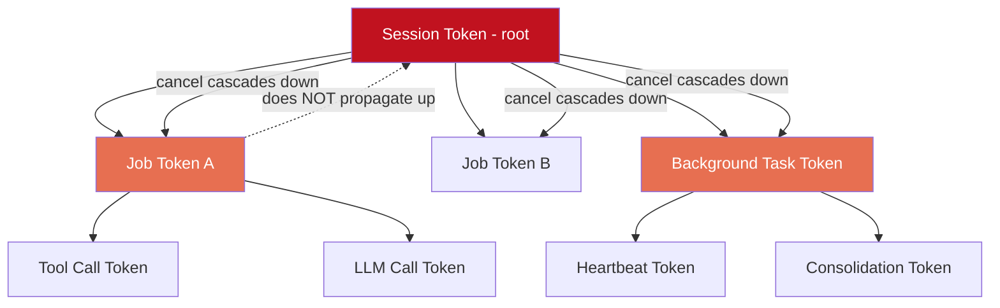
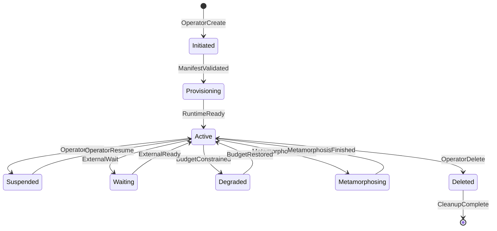
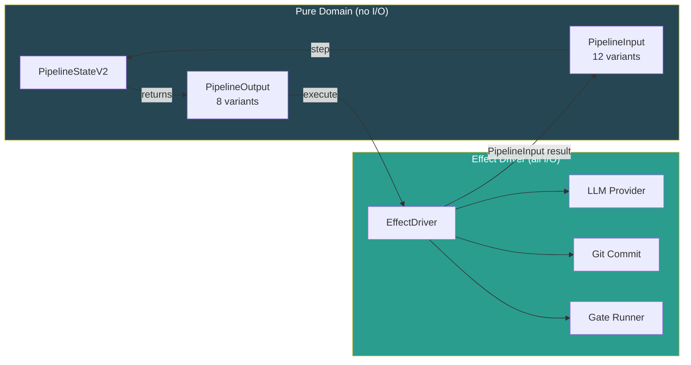
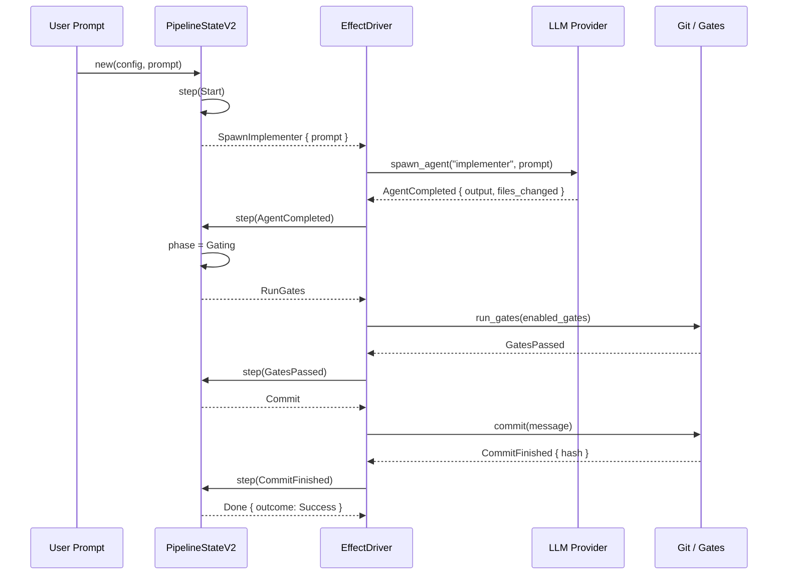
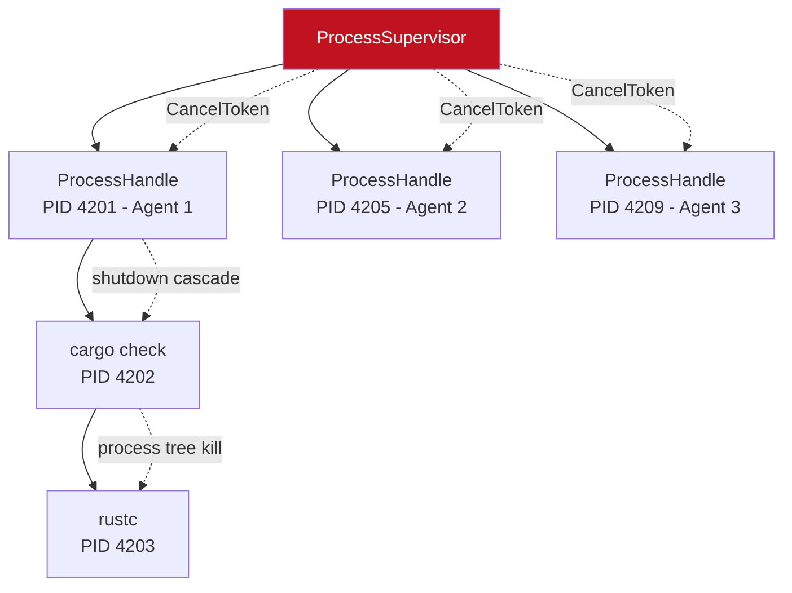
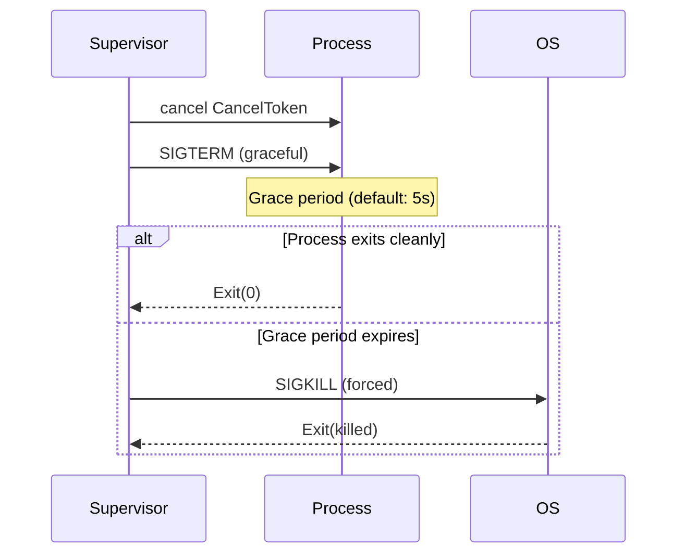
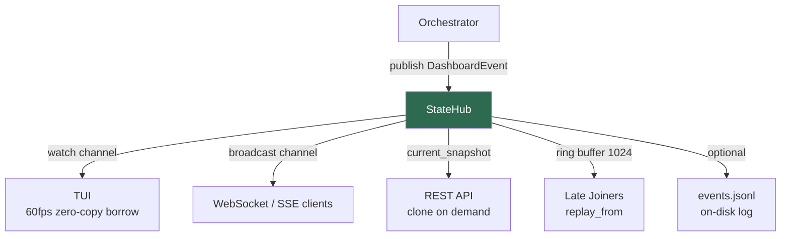

# Runtime Infrastructure

**Source reference**: `roko-runtime` (`crates/roko-runtime/src/`)
**Priority**: MEDIUM — system resilience, process management, observability
**Reference docs**:
- `docs/v1/00-architecture/07b-bus-transport-fabric.md`
- `docs/v2-depth/07-agent-runtime/26-agent-lifecycle-type-state.md`
- `docs/v1/07-conductor/13-process-supervision-wiring.md`
- `docs/v1/12-interfaces/22-statehub-projection-layer.md`

> **Self-contained implementation note**: Source references point to the captured roko codebase as provenance anchors, not build dependencies. Section 15 maps every pattern to IronClaw's existing `src/agent/`, `src/observability/`, and `src/context/` modules.

---

## Related Documents

- [orchestrator-swarm.md](orchestrator-swarm.md) — Event sourcing, journal replay, and recovery built on top of the EventBus and state snapshot primitives described here
- [conductor-anomaly.md](conductor-anomaly.md) — Circuit breakers and anomaly detection that drive lifecycle state transitions (especially `Degraded` stages) and trigger `CancelToken` cascades
- [../agent-intelligence/agent-patterns.md](../agent-intelligence/agent-patterns.md) — Retry policies with classified errors and resumable checkpoint patterns that depend on the pure state machine + effect driver separation described in section 7

---

## Table of Contents

1. [Why Runtime Infrastructure Matters](#1-why-runtime-infrastructure-matters)
2. [Academic Foundations](#2-academic-foundations)
3. [Crate Overview](#3-crate-overview)
4. [EventBus with Bounded Replay Ring](#4-eventbus-with-bounded-replay-ring)
5. [Hierarchical CancellationTokens](#5-hierarchical-cancellationtokens)
6. [FIPA Lifecycle State Machine](#6-fipa-lifecycle-state-machine)
7. [Pure State Machine + Effect Driver Separation](#7-pure-state-machine--effect-driver-separation)
8. [Process Supervision](#8-process-supervision)
9. [StateHub and Dashboard Projections](#9-statehub-and-dashboard-projections)
10. [State Snapshots and Event Persistence](#10-state-snapshots-and-event-persistence)
11. [Resource Accounting](#11-resource-accounting)
12. [Run Ledger](#12-run-ledger)
13. [Benchmarking](#13-benchmarking)
14. [Practical Examples](#14-practical-examples)
15. [IronClaw Integration Plan](#15-ironclaw-integration-plan)
16. [Complexity Assessment](#16-complexity-assessment)
17. [References](#17-references)

---

## 1. Why Runtime Infrastructure Matters

Traditional software has a well-understood lifecycle: start, run, stop. AI agent systems break this model. An agent loop makes LLM calls that may hang for 30+ seconds, spawns tool-execution subprocesses that may orphan grandchild processes, runs verification gates that may infinite-loop, and operates on multi-minute workflows where a crash mid-pipeline means restarting expensive computation from scratch. Without structured runtime infrastructure, four failure classes emerge:

**1. Silent resource leaks.** An LLM call times out, but the HTTP connection stays alive. A `cargo check` subprocess is killed, but its `rustc` grandchild keeps running. Over hours of operation, these orphans consume CPU and memory until the system starves.

**2. Unrecoverable crashes.** A workflow completes 80% of its pipeline and then the process crashes. Without checkpointing and event replay, the entire pipeline restarts from zero — burning tokens, time, and money.

**3. Opaque failures.** An agent is "running" but producing no output. Without structured events, health probes, and lifecycle state machines, the operator cannot distinguish a healthy slow agent from a stuck broken one.

**4. Cascading cancellation failures.** A user cancels a session, but only the top-level task stops. Background heartbeat tasks, in-flight tool calls, and spawned subprocesses continue running, consuming resources and potentially producing stale side effects.

The `roko-runtime` crate addresses all four with a cohesive set of primitives: an EventBus for structured event flow, hierarchical CancellationTokens for cascading shutdown, a FIPA-informed lifecycle state machine, a pure state machine + effect driver separation for testable workflow logic, process supervision for OS-level process management, and a StateHub for unified dashboard projections.

---

## 2. Academic Foundations

**Event sourcing and append-only logs.** Fowler's 2005 Event Sourcing pattern [1] and Kleppmann's *Designing Data-Intensive Applications* (2017) [2] established storing state as an ordered sequence of immutable events for replay, audit, and crash recovery. Helland's "Immutability Changes Everything" (CIDR, 2015) [3] extended this to distributed systems. The EventBus (section 4) and JSONL persistence (section 10) implement this pattern directly; see [orchestrator-swarm.md](orchestrator-swarm.md) for the durable journal and hash-linked audit chain built on top.

**Structured concurrency and hierarchical cancellation.** Go's `context` package (2014) [4] introduced tree-structured cancellation where cancelling a parent context cancels all children. Elizarov's structured concurrency in Kotlin coroutines (2018) [5] and Smith's nursery pattern in Python's Trio (2017) [6] independently formalized the same parent-child cancellation invariant: no child task outlives its parent scope. Section 5 implements this directly.

**FIPA agent lifecycle.** The Foundation for Intelligent Physical Agents (FIPA) Agent Management Specification (FIPA00023, 2002) [7] defined the normative framework for agent creation, registration, operation, migration, and retirement. Roko's lifecycle state machine adapts the FIPA model with cloud-native extensions (health probes, degradation stages, GitOps). Section 6 covers the full mapping; see [conductor-anomaly.md](conductor-anomaly.md) for the circuit breakers that trigger lifecycle transitions.

**Process supervision.** Armstrong's 2003 PhD thesis [8] formalized the Erlang/OTP supervision tree: a hierarchical arrangement of processes where supervisors monitor children and restart them on failure. The "let it crash" philosophy ensures crashes are always observed by a supervisor. Section 8 applies this to OS processes.

**Type-state provisioning.** The type-state pattern encodes runtime state in compile-time types, making invalid state transitions impossible. Roko uses Rust's `PhantomData` to enforce provisioning pipeline order, following Cliffle (2019) [9] and session type theory (Honda, 1993; Kiselyov & Imai, 2020) [10].

**Pure state machines and effect separation.** The Elm Architecture (Czaplicki, 2012) [11] and algebraic effect systems (Bauer & Pretnar, 2013) [12] both formalize expressing computation as a pure function from state and input to state and effects, with a separate runtime that interprets the effects. Section 7 implements this; [../agent-intelligence/agent-patterns.md](../agent-intelligence/agent-patterns.md) covers retry policies and resumable checkpoints built on top of this foundation.

---

## 3. Crate Overview

The `roko-runtime` crate is the shared async runtime substrate for all Roko applications. Its design principles:

> No domain types. This crate knows nothing about agents, plans, gates, or TUI. It provides generic infrastructure that higher layers parameterise. Tokio-native. All primitives are `Send + Sync + 'static` and designed for multi-task Tokio runtimes. Zero unsafe. All concurrency goes through `tokio::sync` or `std::sync::atomic`.

**Source**: `crates/roko-runtime/src/lib.rs`

| Module | Purpose |
|--------|---------|
| `event_bus` | Typed broadcast channel with bounded replay ring |
| `pulse_bus` | Topic-filtered Pulse transport (Bus trait implementation) |
| `cancel` | Hierarchical cooperative cancellation tokens |
| `lifecycle` | FIPA-informed agent lifecycle state machine |
| `process` | OS-level process supervision (spawn, track, kill, reap) |
| `pipeline_state` | Pure state machine for config-driven workflows |
| `effect_driver` | Side-effect executor bridging state machine to I/O |
| `workflow_engine` | High-level workflow orchestration (state machine + driver) |
| `state_hub` | Unified dashboard projection hub |
| `state_snapshot` | Checksummed atomic state snapshots |
| `projection` | JSONL event log reconstruction into per-run summaries |
| `run_ledger` | Typed workflow run record (replaces event bus replay) |
| `heartbeat` | Cognitive heartbeat policy (gamma/theta/delta ticks) |
| `heartbeat_probes` | Health probe evaluation logic |
| `heartbeat_attention` | Attention auction and tick gating |
| `metrics` | Append-only JSONL metric recording |
| `jsonl_logger` | RuntimeEvent persistence to JSONL files |
| `http_event_sink` | HTTP-based event forwarding |
| `resource` | Token, cost, and time budget accounting |
| `energy` | Cognitive energy model for metabolic cost tracking |
| `task_scheduler` | Schedulable task management |
| `delta_consumer` | Delta tick event consumer |
| `theta_consumer` | Theta tick event consumer |
| `demurrage_consumer` | Demurrage decay consumer |

---

## 4. EventBus with Bounded Replay Ring

### What It Is

The EventBus is a typed, bounded broadcast channel with a monotonically sequenced replay ring. It generalizes the ad-hoc `mpsc::UnboundedSender<AgentEvent>` channels that were scattered through earlier agent code into a single, generic primitive.

**Source**: `crates/roko-runtime/src/event_bus.rs`

### Architecture



The bus combines three mechanisms:
- A `tokio::sync::broadcast` channel for live fan-out to all subscribers
- A bounded `VecDeque` ring for durable replay (late subscribers can catch up)
- An `AtomicU64` counter for monotonic sequence numbering, enabling gap detection

### Core Data Structure

```rust
// crates/roko-runtime/src/event_bus.rs, lines 199-204
struct Shared<E> {
    tx: broadcast::Sender<Envelope<E>>,
    ring: Mutex<VecDeque<Envelope<E>>>,
    seq: AtomicU64,
    capacity: usize,
}
```

Every event is wrapped in a timestamped envelope:

```rust
// crates/roko-runtime/src/event_bus.rs, lines 62-71
#[derive(Debug, Clone)]
pub struct Envelope<E> {
    pub seq: u64,       // Monotonically increasing, bus-scoped
    pub ts_millis: u64, // Unix timestamp in milliseconds
    pub payload: E,
}
```

### The `emit_inner` Critical Path

```rust
// crates/roko-runtime/src/event_bus.rs, lines 206-229
impl<E: Clone + Send + Sync + 'static> Shared<E> {
    fn emit_inner(&self, event: E) -> u64 {
        let envelope = Envelope {
            seq: self.seq.fetch_add(1, Ordering::Relaxed),
            ts_millis: current_ts_millis(),
            payload: event,
        };
        let seq = envelope.seq;
        {
            let mut ring = self.ring.lock();
            if ring.len() >= self.capacity {
                ring.pop_front();
            }
            ring.push_back(envelope.clone());
        }
        let _ = self.tx.send(envelope);
        seq
    }
}
```

Key design decisions:
- **Never blocks producers.** If a subscriber falls behind, it misses live events but can catch up via `replay_from()`.
- **`parking_lot::Mutex`, not `tokio::sync::Mutex`.** The lock is held only for a `VecDeque::push_back` — microsecond-scale, no async mutex overhead needed.
- **`Ordering::Relaxed` for sequence counter.** Monotonicity is guaranteed by `fetch_add` atomicity; strict cross-CPU ordering is not needed because the ring is mutex-protected.

### Public API

```rust
// crates/roko-runtime/src/event_bus.rs, lines 248-314
impl<E: Clone + Send + Sync + 'static> EventBus<E> {
    pub fn new(capacity: usize) -> Self;
    pub fn emit(&self, event: E) -> u64;                     // Never blocks. Returns seq number.
    pub fn subscribe(&self) -> broadcast::Receiver<Envelope<E>>;
    pub fn replay_from(&self, after_seq: u64) -> Vec<Envelope<E>>;
    pub fn total_emitted(&self) -> u64;
    pub fn ring_len(&self) -> usize;
    pub fn sender(&self) -> BusSender<E>;                    // Clone+Send emit-only handle
}
```

The `BusSender` lets subsystems emit events without access to the full bus API (no subscribe, no replay).

Ring default capacities: **1024** for the global `RokoEvent` bus, **2048** for per-type `RuntimeEvent` buses.

### Concrete Event Types

```rust
// crates/roko-runtime/src/event_bus.rs, lines 116-196
pub enum RokoEvent {
    PlanRevision { request_id, plan_id, task_id, reason, .. },
    PrdPublished { slug, path, published_at, origin },
    HeartbeatTick(HeartbeatTick),
    HeartbeatWakeup { condition, issued_at },
    CognitiveSignal { signal, issued_at },
    AgentLifecycleTransition(LifecycleTransition),
    TickBroadcast { tick_id, agent_id, tier, passed, cost_usd, broadcast_at },
    ReactDecision { tick_id, decision, signals, decided_at },
}
```

### PulseBus: Topic-Filtered Transport

The `PulseBus` wraps `EventBus<Pulse>` and adds topic-based filtering:

```rust
// crates/roko-runtime/src/pulse_bus.rs, lines 35-81
pub struct PulseBus {
    inner: Arc<EventBus<Pulse>>,
}

impl Bus for PulseBus {
    fn publish(&self, pulse: Pulse) -> Result<u64>;
    fn subscribe(&self, filter: TopicFilter) -> Result<PulseBusReceiver>;
}
```

Non-matching pulses are silently skipped. Lagged receivers log a warning and continue. The bus architecture doc summarizes the design intent:

> Bus is the kernel's ephemeral transport fabric at L0. It exists for communication, not durable storage. The design separates transport from persistence so that high-frequency Pulses can move without forcing storage writes, late subscribers can catch up from the bounded replay ring, and cross-layer couplings can be expressed as topics instead of direct crate dependencies.

See [orchestrator-swarm.md](orchestrator-swarm.md) for the durable journal layer that complements this ephemeral transport.

---

## 5. Hierarchical CancellationTokens

### What It Is

A cooperative cancellation system where tokens form a tree: cancelling a parent automatically cancels all descendants, but cancelling a child does not affect its parent. This enables scoped resource cleanup — cancel a session and all its jobs, tools, and background tasks stop; cancel just one tool call and the session keeps running.

**Source**: `crates/roko-runtime/src/cancel.rs`

### Architecture



The critical safety property is **one-way propagation**: cancellation flows strictly from parent to children, never from children to parent. A failing tool call cannot bring down an entire session. This implements the core invariant of structured concurrency [5][6]: no child task outlives its parent scope. Go's `context.WithCancel` [4] established the same tree-structured pattern.

### Core Data Structure

```rust
// crates/roko-runtime/src/cancel.rs, lines 37-47
#[derive(Clone)]
pub struct CancelToken {
    inner: Arc<CancelInner>,
}

struct CancelInner {
    cancelled: AtomicBool,
    notify: Notify,
    parent: Option<CancelToken>, // Entire ancestry kept alive through Arc chain
}
```

### Creating the Hierarchy

```rust
// crates/roko-runtime/src/cancel.rs, lines 49-73
impl CancelToken {
    pub fn new() -> Self; // Root token, no parent

    pub fn child(&self) -> Self { // Child cancelled when parent OR self is cancelled
        Self {
            inner: Arc::new(CancelInner {
                cancelled: AtomicBool::new(false),
                notify: Notify::new(),
                parent: Some(self.clone()),
            }),
        }
    }
}
```

### Cancellation Check

`is_cancelled()` walks the entire parent chain iteratively (O(depth), typically 3-4 levels):

```rust
// crates/roko-runtime/src/cancel.rs, lines 76-95
pub fn cancel(&self) {
    self.inner.cancelled.store(true, Ordering::Release);
    self.inner.notify.notify_waiters();
}

pub fn is_cancelled(&self) -> bool {
    if self.inner.cancelled.load(Ordering::Acquire) { return true; }
    let mut current = self.inner.parent.as_ref();
    while let Some(parent) = current {
        if parent.inner.cancelled.load(Ordering::Acquire) { return true; }
        current = parent.inner.parent.as_ref();
    }
    false
}
```

The `cancelled()` async method collects `Notify` handles from every token in the ancestor chain and uses `tokio::select!` to wake on whichever fires first.

### Test Coverage

- `child_inherits_cancel`: grandchild reports cancelled when root is cancelled
- `child_independent_cancel`: child cancel does NOT propagate upward
- `child_cancelled_when_parent_cancelled`: async `cancelled()` resolves when parent is cancelled

See [conductor-anomaly.md](conductor-anomaly.md) for circuit breaker patterns that issue `CancelToken` cancellations based on health signals.

---

## 6. FIPA Lifecycle State Machine

### What It Is

A structured model for agent process lifecycle based on FIPA standard FIPA00023 [7], extended with cloud-native concepts: health probes, degradation stages, and GitOps configuration management.

**Source**: `crates/roko-runtime/src/lifecycle.rs`

### FIPA Background

The FIPA Agent Management Specification (FIPA00023, 2002) [7] defines the normative framework for agent creation, registration, location, communication, migration, and retirement. The original FIPA states (Initiated, Active, Suspended, Waiting, Transit) map to Roko's extended set, with additions for budget-constrained operation (`Degraded`), capability evolution (`Metamorphosing`), cold storage (`Hibernated`), and explicit compute provisioning (`MachineLifecycleState`).

### All Nine Agent Lifecycle States

```rust
// crates/roko-runtime/src/lifecycle.rs, lines 15-37
pub enum AgentLifecycleState {
    Initiated,       // Manifest accepted, process not yet running (FIPA: Initiated)
    Provisioning,    // Infrastructure being allocated (cloud-native addition)
    Active,          // Registered, cognitive loop running (FIPA: Active)
    Suspended,       // Operator-initiated pause with state retained (FIPA: Suspended)
    Waiting,         // Self-blocked on external event (FIPA: Waiting)
    Hibernated,      // Logical state to cold storage, process stopped (FIPA: Transit analog)
    Metamorphosing,  // Role/capability/tool transition in progress (cloud-native addition)
    Degraded { stage: DegradationStage }, // Budget-constrained reduced operation
    Deleted,         // Process terminated, resources released (FIPA: Deleted)
}
```

### IronClaw Mapping

The table below makes the FIPA mapping concrete and actionable for IronClaw. IronClaw states use `JobState` (8 values in `src/context/state.rs`) and `ThreadState` (5 values in `src/agent/session.rs:147`).

| IronClaw State | FIPA Lifecycle State | Transition Reason | IronClaw Location |
|----------------|---------------------|-------------------|-------------------|
| Session created | `Initiated` | `OperatorCreate` | `src/agent/session_manager.rs` |
| LLM provider connected | `Provisioning` | `ManifestValidated` | `src/agent/session.rs` |
| First message processed | `Active` | `RuntimeReady` | `src/agent/agentic_loop.rs` |
| `ThreadState::Idle` | `Waiting` | `ExternalWait` | `src/agent/session.rs:149` |
| User disconnected | `Suspended` | `OperatorPause` | `src/channels/web/` |
| `CostLimitExceeded::DailyBudget` | `Degraded(BudgetPaused)` | `BudgetConstrained` | `src/agent/cost_guard.rs:33` |
| `CostLimitExceeded::HourlyRate` | `Degraded(ReducedFrequency)` | `BudgetConstrained` | `src/agent/cost_guard.rs:35` |
| `CostLimitExceeded::UserDailyBudget` | `Degraded(ModelDowngrade)` | `BudgetConstrained` | `src/agent/cost_guard.rs:37` |
| Session destroyed | `Deleted` | `OperatorDelete` | `src/agent/session_manager.rs` |

### State Transition Diagram



### Transition Records

Every lifecycle transition is captured as a serializable record:

```rust
// crates/roko-runtime/src/lifecycle.rs, lines 108-120
pub struct LifecycleTransition {
    pub agent_id: String,
    pub from: AgentLifecycleState,
    pub to: AgentLifecycleState,
    pub reason: LifecycleTransitionReason,
    pub occurred_at: chrono::DateTime<chrono::Utc>,
}
```

Transitions are emitted as `RokoEvent::AgentLifecycleTransition(LifecycleTransition)` on the EventBus, making them available to dashboards, audit logs, and reactive policies.

### Transition Reasons (14 variants)

```rust
// crates/roko-runtime/src/lifecycle.rs, lines 74-105
pub enum LifecycleTransitionReason {
    OperatorCreate, ManifestValidated, RuntimeReady,
    OperatorPause, OperatorResume,
    ExternalWait, ExternalReady,
    OperatorDelete,
    BudgetConstrained, BudgetRestored,
    MetamorphosisStarted, MetamorphosisFinished,
    CleanupComplete,
    Custom(String),
}
```

### Budget Degradation Stages (5 levels)

```rust
// crates/roko-runtime/src/lifecycle.rs, lines 40-53
pub enum DegradationStage {
    ModelDowngrade,    // Cheaper models preferred
    T0Emphasis,        // Zero-LLM probes emphasized
    ReducedFrequency,  // Runtime tick frequency reduced
    MonitoringOnly,    // Observe and report, avoid taking actions
    BudgetPaused,      // Cognitive loop paused until budget window resets
}
```

Each stage represents a progressively more restrictive operating mode. The degradation → reduced cost → budget recovery → degradation lifted loop self-corrects via reduced spending. For anomaly-driven degradation (stuck loops, repeated failures), see the circuit breaker patterns in [conductor-anomaly.md](conductor-anomaly.md).

### Machine Lifecycle State (6 states)

Separate from the agent's logical lifecycle, there is a machine-level lifecycle for compute provisioning:

```rust
// crates/roko-runtime/src/lifecycle.rs, lines 56-71
pub enum MachineLifecycleState {
    Provisioning, // Manifest validated, resources requested
    Booting,      // VM or local process spawned and booting
    Ready,        // Health checks pass, can accept work
    Draining,     // Deletion requested, work draining before shutdown
    Destroyed,    // Resources released
    Crashed,      // Supervisor restart budget exceeded
}
```

### Health Probes (Kubernetes-style)

Three probe types modeled after Kubernetes probe specifications:

```rust
// crates/roko-runtime/src/lifecycle.rs, lines 181-262
pub struct HealthProbeConfig {
    pub liveness: ProbeSpec,   // Process is responsive
    pub readiness: ProbeSpec,  // Can accept new work
    pub startup: ProbeSpec,    // Gates liveness/readiness during initial boot
}

pub enum ProbeHandler {
    Internal,                       // Runtime health check
    Http { path, port },            // HTTP GET
    Tcp { port },                   // TCP connection
    Exec { command: Vec<String> },  // Custom command (exit 0 = healthy)
}
```

Default probe configuration:

| Probe | Initial Delay | Period | Timeout | Failure Threshold |
|-------|---------------|--------|---------|-------------------|
| Liveness | 15s | 20s | 1s | 3 |
| Readiness | 5s | 10s | 1s | 3 |
| Startup | 0s | 10s | 1s | 30 (bootstrapping takes time) |

### Type-State Provisioning Pipeline

The lifecycle module enforces correct provisioning order at compile time using Rust's type-state pattern [9]:

```rust
// crates/roko-runtime/src/lifecycle.rs, lines 397-592

// Pipeline stages as phantom types:
pub struct Unvalidated;
pub struct Validated;
pub struct ResourcesAllocated;
pub struct NeuroInitialized;
pub struct RoutingConfigured;
pub struct ToolsLoaded;
pub struct MeshRegistered;
pub struct Ready;

pub struct Agent<S> {
    manifest_id: String,
    state: AgentState,
    stage: PhantomData<S>,
}

// Usage: linear pipeline enforced at compile time.
// Calling .ready() on an Agent<Validated> is a compile error.
let agent = Agent::new("manifest-1")
    .validate()
    .allocate_resources("small")
    .init_neuro()
    .configure_routing()
    .load_tools("standard")
    .register_mesh(true)
    .ready();
```

### Restart Backoff

Failed agent processes use base-10 exponential backoff (not the more common base-2):

```rust
// crates/roko-runtime/src/lifecycle.rs, lines 265-306
pub struct RestartBackoff {
    pub failure_count: u32,
    pub base_delay_ms: u64,   // default: 100ms
    pub max_delay_ms: u64,    // default: 300,000ms (5 minutes)
    pub reset_after_ms: u64,  // default: 300,000ms (5 minutes of clean run)
}
```

With a 100ms base delay: failure 1 = 1s, failure 2 = 10s, failure 3 = 100s, capped at 300s. `reset_after_ms` tracks how long the agent must run successfully before the failure count resets.

---

## 7. Pure State Machine + Effect Driver Separation

### Why This Pattern Matters

The most architecturally significant pattern in `roko-runtime` is the separation between a **pure state machine** (no I/O, no side effects, fully deterministic) and an **effect driver** (executes I/O, talks to external services). This follows the Elm Architecture [11] and algebraic effect systems [12]: express the "what" as a pure function, delegate the "how" to a separate runtime.

Benefits:

1. **Testability.** The state machine is a pure function: given a state and an input, it produces a deterministic output. Every state transition is testable without mocking LLM providers, git commands, or network calls.
2. **Replayability.** Feed a recorded sequence of `PipelineInput` events through the state machine to reproduce the exact state transitions that occurred in production.
3. **Serializability.** The state machine's state can be serialized to JSON at any point and later restored to resume the workflow exactly where it left off.
4. **Composability.** Different effect drivers can be plugged in (test mocks, production services, replay drivers) without changing the state machine logic.

See [../agent-intelligence/agent-patterns.md](../agent-intelligence/agent-patterns.md) (Pattern 8: Retry Policy with Classified Errors; Pattern 3: Resumable Checkpoints) for patterns built on top of this foundation.

### Architecture



### The Pure State Machine: PipelineStateV2

**Source**: `crates/roko-runtime/src/pipeline_state.rs`

The state machine represents a config-driven workflow pipeline:

```rust
// crates/roko-runtime/src/pipeline_state.rs, lines 426-450
pub enum Phase {
    Pending,
    Strategizing,
    Implementing,
    Gating,
    AutoFixing,
    Reviewing,
    Committing,
    Complete,
    Halted { reason: String },
    Cancelled,
}
```

Three workflow configurations determine active phases:

```
Express:  Implement -> Gate -> Commit
Standard: Implement -> Gate -> Review -> Commit
Full:     Strategy -> Implement -> Gate -> Review -> Commit
```

### PipelineInput (12 variants) and PipelineOutput (8 variants)

```rust
// crates/roko-runtime/src/pipeline_state.rs, lines 477-591
pub enum PipelineInput {
    Start,
    StrategyComplete { brief: String },
    StrategySkipped,
    AgentCompleted { output: String, files_changed: u32 },
    AgentFailed { error: String },
    GatesPassed,
    GateFailed { gate: String, output: String },
    ReviewApproved { summary: String },
    ReviewRejected { reason: String },
    ReviewUnclear { summary: String },
    ReviewRevise { findings: Vec<String> },
    CommitFinished { outcome: CommitOutcome },
    UserCancel,
    ResourceExhausted { reason: String },
}

pub enum PipelineOutput {
    SpawnStrategist { prompt: String },
    SpawnImplementer { prompt: String, context: Option<String> },
    SpawnAutoFixer { error_output: String },
    RunGates,
    SpawnReviewer { diff_context: Option<String> },
    Commit,
    Done { outcome: WorkflowOutcome },
    Halt { reason: String },
}
```

### The `step()` Function

The `step()` function is the core pure function from `(Phase, PipelineInput) -> PipelineOutput`:

```rust
// crates/roko-runtime/src/pipeline_state.rs, lines 663-688
pub fn step(&mut self, input: PipelineInput) -> PipelineOutput {
    match (&self.phase, input) {
        (Phase::Pending, PipelineInput::Start) => {
            if self.config.has_strategy {
                self.phase = Phase::Strategizing;
                PipelineOutput::SpawnStrategist { prompt: self.original_prompt.clone() }
            } else {
                self.phase = Phase::Implementing;
                self.iteration = 1;
                PipelineOutput::SpawnImplementer {
                    prompt: self.original_prompt.clone(),
                    context: None,
                }
            }
        }
        // ... more transitions
    }
}
```

### Checkpoint and Restore

```rust
// crates/roko-runtime/src/pipeline_state.rs, lines 643-658
pub fn checkpoint(&self) -> Result<String, serde_json::Error> {
    Ok(serde_json::to_string(self)?)
}

pub fn from_checkpoint(json: &str) -> Result<Self, serde_json::Error> {
    Ok(serde_json::from_str(json)?)
}
```

The state machine contains no I/O handles — only plain data — making it fully serializable. See [../agent-intelligence/agent-patterns.md](../agent-intelligence/agent-patterns.md) (Pattern 3: Resumable Checkpoints) for the higher-level checkpoint/resume pattern.

### The Effect Driver

**Source**: `crates/roko-runtime/src/effect_driver.rs`

```rust
// crates/roko-runtime/src/effect_driver.rs, lines 40-74
pub struct EffectServices {
    pub default_model: String,
    pub model_caller: Arc<dyn ModelCaller>,
    pub prompt_assembler: Arc<dyn PromptAssembler>,
    pub feedback_sink: Arc<dyn FeedbackSink>,
    pub gate_runner: Arc<dyn GateRunner>,
    pub affect_policy: Option<Arc<tokio::sync::Mutex<dyn AffectPolicy>>>,
}

impl EffectDriver {
    /// PipelineOutput::SpawnImplementer -> PipelineInput::AgentCompleted/AgentFailed
    pub async fn spawn_agent(&self, role: &str, prompt: &str, context: Option<&str>)
        -> PipelineInput;

    /// PipelineOutput::RunGates -> PipelineInput::GatesPassed/GateFailed
    pub async fn run_gates(&self, gates: &[String], shell_gates: &[ShellGateCommand])
        -> PipelineInput;

    /// PipelineOutput::Commit -> PipelineInput::CommitFinished
    pub async fn commit(&self, message: &str) -> PipelineInput;

    pub async fn save_checkpoint(&self, state: &PipelineStateV2, path: &Path) -> Result<()>;
}
```

The driver integrates affect policy modulation, adjusting three parameters: `tier_bias` (model selection), `turn_limit_factor` (token budget scaling 0.25x-2.0x), and `exploration_rate` (temperature and cache bypass).

### Complete Event Flow



The state machine never makes any I/O call — it only decides what should happen next. At any point, it can be checkpointed to JSON and restored later.

---

## 8. Process Supervision

### What It Is

OS-level process lifecycle management: spawn, track, monitor, timeout, kill, and reap child processes and their entire process trees.

**Source**: `crates/roko-runtime/src/process.rs`

The `ProcessSupervisor` applies Armstrong's Erlang/OTP supervision tree principles [8] to OS processes: every process has a supervisor, supervisors restart failed processes, and cascading failures are bounded by the supervision tree structure.

### Architecture



### Key Types

```rust
// crates/roko-runtime/src/process.rs, lines 59, 555-567, 839-844
pub struct ProcessId(pub u64); // Monotonically increasing, runtime-unique

pub struct ProcessHandle {
    pub id: ProcessId,
    pub label: String,
    child: Child,
    os_pid: Option<u32>,
    grace_period: Duration,
    cancel: CancelToken,
    spawn_config: SpawnConfig,
    session: Option<ProcessSessionConfig>,
    started_at: Instant,
}

pub struct ProcessSupervisor {
    handles: Arc<Mutex<HashMap<ProcessId, ProcessHandle>>>,
    restart_history: Mutex<HashMap<String, Vec<Instant>>>,
    cancel: CancelToken,
    strategy: SupervisionStrategy,
}
```

### Five Guarantees

1. **PID tracking.** Every spawned process is registered with its PID, parent PID, attempt ID, and plan association.
2. **Descendant discovery.** For any registered PID, the supervisor enumerates the full process tree via platform-specific mechanisms (cgroups on Linux, `pgrep -P` on macOS).
3. **Lifecycle management.** Spawn, monitor, timeout, and terminate are atomic operations on the process tree, not individual processes.
4. **Orphan prevention.** On parent exit, all registered descendants are terminated.
5. **Attempt isolation.** Each spawn attempt gets a monotonically increasing attempt ID, preventing confusion between retries.

### SIGTERM to SIGKILL Escalation



Default grace period: 5 seconds (`DEFAULT_GRACE_PERIOD`, line 44). The `shutdown()` method first cancels the `CancelToken`, drops stdin, and waits for the process to exit. If it does not exit within the grace period, SIGKILL is sent.

### Supervisor Operations

```rust
// crates/roko-runtime/src/process.rs, lines 845-951
impl ProcessSupervisor {
    pub fn new(cancel: CancelToken) -> Self;
    pub async fn shutdown(&self, id: ProcessId) -> Option<ProcessOutcome>;
    pub async fn shutdown_all(&self) -> Vec<ProcessOutcome>;
    // shutdown_all cancels root CancelToken first, then drains all handles.
}
```

---

## 9. StateHub and Dashboard Projections

### What It Is

The StateHub bridges the event bus to a materialized `DashboardSnapshot` via a `tokio::sync::watch` channel, serving three consumer interfaces with different performance characteristics.

**Source**: `crates/roko-runtime/src/state_hub.rs`

### Architecture



### Implementation

```rust
// crates/roko-runtime/src/state_hub.rs, lines 80-86
pub struct StateHub {
    snapshot_tx: watch::Sender<DashboardSnapshot>,
    snapshot_rx: watch::Receiver<DashboardSnapshot>,
    event_bus: EventBus<DashboardEvent>,
    event_log: Option<SharedEventLog>,
}
```

Each `publish()` call does four things atomically:

```rust
// crates/roko-runtime/src/state_hub.rs, lines 144-153
pub fn publish(&self, event: DashboardEvent) -> u64 {
    let seq = self.event_bus.emit(event.clone());             // 1. Broadcast to live subscribers
    self.snapshot_tx.send_modify(|snap| snap.apply(&event));  // 2. Update materialized snapshot
    if let Some(log) = &self.event_log {
        if let Ok(mut writer) = log.lock() {
            writer.append(&event);                            // 3. Append to on-disk event log
        }
    }
    seq
}
```

### Three Consumer Interfaces

| Consumer | Method | Performance |
|----------|--------|-------------|
| **TUI** | `snapshot()` returns `watch::Receiver` | 60fps, zero-copy borrow via `borrow_and_update()` |
| **WebSocket/SSE** | `subscribe_events()` returns `broadcast::Receiver` | Live event stream |
| **REST API** | `current_snapshot()` returns `DashboardSnapshot` | Clone on demand |

### Event Log Replay

```rust
// crates/roko-runtime/src/state_hub.rs, lines 201-205
pub fn replay_from_log(log_path: &Path) -> (Self, usize) {
    let mut hub = Self::default_capacity();
    let count = hub.ingest_log(log_path);
    (hub, count)
}
```

See [orchestrator-swarm.md](orchestrator-swarm.md) for the higher-level event sourcing journal that uses this replay infrastructure for multi-job recovery.

---

## 10. State Snapshots and Event Persistence

### Checksummed State Snapshots

**Source**: `crates/roko-runtime/src/state_snapshot.rs`

```rust
// crates/roko-runtime/src/state_snapshot.rs, lines 17-34
pub struct StateSnapshot {
    pub version: u32,
    pub timestamp_ms: u64,
    pub executor_json: String,
    pub orchestrator_json: String,
    pub run_state_json: String,
    pub gate_thresholds_json: String,
    pub checksum: String, // SHA-256 over all four payloads
}
```

The `verify()` method checks both version compatibility and checksum integrity, preventing two bug classes: using a snapshot from an incompatible code version, and loading a snapshot that was partially written during a crash.

### JSONL Event Logger

**Source**: `crates/roko-runtime/src/jsonl_logger.rs`

Each event is wrapped in a `RuntimeEventEnvelope` with run_id, sequence number, source label, and event payload, then serialized as a single JSON line and flushed immediately. A contract guard test enforces that events are serialized with `serde_json`, not Rust `Debug` formatting — ensuring forward-compatible deserialization.

### RuntimeProjection: Reconstructing State from Logs

**Source**: `crates/roko-runtime/src/projection.rs`

```rust
pub struct RunSummary {
    pub run_id: String,
    pub template: Option<String>,
    pub prompt: Option<String>,
    pub current_phase: Option<String>,
    pub phases_visited: Vec<String>,
    pub gates_passed: Vec<String>,
    pub gates_failed: Vec<String>,
    pub agents_spawned: u32,
    pub agents_completed: u32,
    pub agents_failed: u32,
    pub total_tokens: u64,
    pub total_cost_usd: f64,
    pub is_complete: bool,
    pub outcome: Option<String>,
    pub last_checkpoint: Option<String>,
    pub agent_errors: Vec<String>,
}
```

This enables the "resume" workflow: read the event log, reconstruct where the workflow was, and continue from the last checkpoint.

---

## 11. Resource Accounting

**Source**: `crates/roko-runtime/src/resource.rs`

Per-plan and per-task resource consumption tracked against budgets:

```rust
// crates/roko-runtime/src/resource.rs, lines 11-25
pub struct ResourceAccount {
    pub tokens: BudgetEntry<u64>,
    pub cost: BudgetEntry<f64>,
    pub time_limit: Duration,
    pub started_at: Option<Instant>,
    pub label: String,
}

pub struct BudgetEntry<T: PartialOrd + Copy> {
    pub used: T,
    pub limit: T,
}

impl<T: PartialOrd + Copy> BudgetEntry<T> {
    pub fn exceeded(&self) -> bool { self.used >= self.limit }
    pub fn utilisation(&self) -> f64 { /* used/limit as f64 */ }
}
```

Pre-defined budget tiers:

| Tier | Token Limit | Cost Limit | Time Limit |
|------|-------------|------------|------------|
| Trivial | 50,000 | $0.50 | 5 minutes |
| Simple | 200,000 | $2.00 | 15 minutes |
| Standard | 500,000 | $5.00 | 30 minutes |
| Complex | 2,000,000 | $20.00 | 60 minutes |

When a budget is exceeded, the system can throttle (reduce model tier, entering `Degraded(ModelDowngrade)`), warn (emit degradation event), or halt (terminate the workflow). The `any_exceeded()` method checks all three dimensions; utilisation fractions drive dashboard rendering and degradation policy decisions.

---

## 12. Run Ledger

**Source**: `crates/roko-runtime/src/run_ledger.rs`

The `RunLedger` provides a typed source of truth for a single workflow run, replacing the need to replay the entire event bus to reconstruct a report:

```rust
pub struct RunLedger {
    pub run_id: String,
    pub prompt: String,
    pub workflow: WorkflowConfig,
    pub started_at_ms: u64,
    pub phase_history: Vec<PhaseTransitionRecord>,
    pub agent_outcomes: Vec<AgentOutcome>,
    pub gate_runs: Vec<GateRunOutcome>,
    pub artifacts: Vec<ArtifactOutcome>,
    pub commit: Option<CommitOutcome>,
    pub cancellation: Option<CancellationOutcome>,
    pub event_persistence: EventPersistenceHealth,
    pub checkpoint_path: Option<PathBuf>,
}

pub enum AgentOutcome {
    Completed {
        role: String,
        output: String,
        files_changed: u32,
        requested_model: String,
        routed_model: Option<String>,
        final_model: String,
        provider_id: String,
        usage: TokenUsage,
        request_id: Option<String>,
    },
    Failed { role: String, kind: EffectErrorKind, message: String },
}
```

The ledger provides a `to_report_compat()` method that bridges typed ledger fields to the legacy `WorkflowRunReport` shape without replaying the event bus.

---

## 13. Benchmarking

Performance characteristics of the six core subsystems.

### EventBus Throughput

**Regression target**: `emit()` latency p99 < 5μs with 10 subscribers.

Expected characteristics:
- Ring lock hold time: ~50-100ns (two `VecDeque` operations)
- Broadcast send: ~200-500ns for 10 subscribers
- Sustained throughput: 500k-2M events/sec depending on event size and subscriber count

If this regresses: check for lock contention on the ring `Mutex` (indicates high producer concurrency — consider sharding) or broadcast channel backpressure (indicates slow subscriber).

### CancellationToken Propagation Latency

**Regression target**: p99 propagation latency < 500μs.

Expected characteristics:
- `cancel()` is synchronous: atomic store + `notify_waiters()`
- End-to-end latency: typically 1-100μs (dominated by scheduler wake latency)
- Depth has minimal impact: `is_cancelled()` is O(depth) but depth is bounded at 3-4

### Checkpoint Save/Restore Overhead

**Regression target**: roundtrip < 200μs for prompts up to 50KB.

Expected characteristics:
- `checkpoint()` is pure `serde_json::to_string()` on the state struct
- For a 10KB prompt, checkpoint completes in < 50μs; `from_checkpoint()` < 100μs

### Process Supervision Recovery Time

**Regression target**: cooperative shutdown p95 < 500ms.

Breakdown:
```
shutdown() call
  -> CancelToken.cancel()          < 1us
  -> stdin drop                    < 1us
  -> process.wait() with timeout   0-5000ms
  -> if timeout: SIGKILL           < 100ms
Total: 1us - 5.2s
```

### StateHub Projection Latency

**Regression target**: `publish()` to `borrow_and_update()` roundtrip < 10μs.

Expected characteristics:
- `publish()` calls `send_modify()` on `watch::Sender` — synchronous, < 1μs
- TUI reads via `borrow_and_update()` — read guard, no allocation, < 100ns

### Resource Accounting Accuracy

**Regression target**: single-threaded `any_exceeded()` < 50ns.

Expected characteristics:
- `any_exceeded()` is a simple comparison: O(1), no heap allocation
- Single-threaded: ~50M ops/sec; 8 threads contended: ~5-10M ops/sec (mutex serialization)

---

## 14. Practical Examples

### Example 1: Preventing Orphaned Background Tasks

**Problem**: An IronClaw session is destroyed while a heartbeat task and two in-flight tool calls are still running. Without cancellation, these continue consuming resources and may write stale results to the database.

**Solution using hierarchical CancellationTokens**:

```rust
// In session creation (src/agent/session_manager.rs):
let session_token = CancelToken::new();
let session = Session { cancel_token: session_token.clone(), /* ... */ };

// In heartbeat spawning (src/agent/heartbeat.rs):
let heartbeat_token = session_token.child();
tokio::spawn(async move {
    loop {
        tokio::select! {
            () = heartbeat_token.cancelled() => {
                tracing::debug!("heartbeat cancelled, exiting");
                break;
            }
            () = tokio::time::sleep(interval) => { run_heartbeat_tick().await; }
        }
    }
});

// In tool execution (src/agent/agentic_loop.rs):
let tool_token = job_token.child();
tokio::select! {
    result = execute_tool(tool_call) => { handle_result(result) }
    () = tool_token.cancelled() => { return LoopOutcome::Stopped; }
}

// On session destruction (src/agent/session_manager.rs):
fn destroy_session(&self, session_id: &Uuid) {
    if let Some(session) = self.sessions.remove(session_id) {
        // Single call cascades to heartbeat, all tool calls, all job tokens.
        session.cancel_token.cancel();
    }
}
```

**Before**: heartbeat continues every 30 minutes; tool calls complete and write to database for a session that no longer exists.

**After**: all descendant tasks observe `cancelled()` within microseconds of `session.cancel_token.cancel()`.

### Example 2: Crash Recovery with Checkpoint + Event Replay

**Problem**: IronClaw is running a long job that has made three LLM calls and is midway through gate execution. The process crashes. Without state preservation, the job must restart from the beginning, burning ~$0.30 in LLM tokens.

**Solution using pipeline checkpointing**:

```rust
// During job execution (src/worker/job.rs equivalent):
async fn run_pipeline(state: &mut AgentPhaseState, checkpoint_path: &Path) {
    loop {
        let output = state.step(input);

        // Checkpoint before executing the effect.
        let snapshot = state.checkpoint().unwrap();
        tokio::fs::write(checkpoint_path, snapshot.as_bytes()).await.unwrap();

        let next_input = effect_driver.execute(output).await;
        input = next_input;
    }
}

// On startup, check for an existing checkpoint:
async fn start_or_resume_job(job_id: Uuid, checkpoint_dir: &Path) -> AgentPhaseState {
    let checkpoint_path = checkpoint_dir.join(format!("{}.checkpoint.json", job_id));
    if checkpoint_path.exists() {
        let json = tokio::fs::read_to_string(&checkpoint_path).await.unwrap();
        match AgentPhaseState::from_checkpoint(&json) {
            Ok(state) => {
                tracing::info!(job_id = %job_id, phase = ?state.phase(), "resuming from checkpoint");
                return state;
            }
            Err(e) => { tracing::warn!(error = %e, "checkpoint corrupt, starting fresh"); }
        }
    }
    AgentPhaseState::new(/* initial config */)
}

// Event replay for debugging:
let (hub, event_count) = StateHub::replay_from_log(&log_path);
let snapshot = hub.current_snapshot();
println!("Replayed {} events. Job was in phase: {:?}.", event_count, snapshot.current_phase);
```

**After**: job resumes from the last checkpointed phase. A crash during the third gate check resumes at that exact gate with all prior context intact.

### Example 3: Graceful Shutdown Cascading Through Supervision Tree

**Problem**: A user sends `SIGTERM` to IronClaw. Three jobs are in progress, a heartbeat is running, and one job has spawned a `cargo check` subprocess. Everything must shut down cleanly.

**Solution using ProcessSupervisor + CancellationTokens**:

```rust
async fn run_with_graceful_shutdown(config: Config) {
    let root_token = CancelToken::new();
    let supervisor = ProcessSupervisor::new(root_token.clone());

    let shutdown_token = root_token.clone();
    tokio::spawn(async move {
        tokio::signal::ctrl_c().await.unwrap();
        shutdown_token.cancel();
    });

    let agent = setup_agent(&config, root_token.child()).await;
    agent.run().await;

    let outcomes = supervisor.shutdown_all().await;
    for outcome in &outcomes {
        tracing::info!(outcome = ?outcome, "process exited");
    }
}
```

**Shutdown sequence**:

```
T+0ms:   User sends SIGTERM
T+1ms:   root_token.cancel() fires
T+2ms:   All job_tokens, heartbeat_tokens, tool_tokens observe cancelled()
T+5ms:   In-flight LLM calls detect cancellation and return LoopOutcome::Stopped
T+10ms:  cargo check receives SIGTERM from ProcessSupervisor
T+12ms:  cargo check exits (graceful), rustc exits via process group
T+100ms: All ProcessHandles report exit
T+110ms: supervisor.shutdown_all() returns
```

**Before**: SIGTERM kills the main process. `cargo check` and `rustc` become orphans. Three jobs leave database rows in `InProgress` state, causing `self_repair.rs` to re-queue them on next startup.

**After**: all processes exit cleanly. Jobs are checkpointed at their last phase boundary and resume from checkpoint rather than re-queuing.

### Example 4: Projecting System State for a Live Dashboard

**Problem**: IronClaw's web gateway needs a live dashboard showing all active jobs, their current phase, gate results, and token costs. Currently this requires polling the database.

**Solution using StateHub**:

```rust
// Global StateHub initialization (src/app.rs):
static STATE_HUB: OnceLock<SharedStateHub> = OnceLock::new();
pub fn state_hub() -> &'static SharedStateHub {
    STATE_HUB.get_or_init(SharedStateHub::new_in_process)
}

// In job dispatcher (src/agent/dispatcher.rs):
fn on_tool_completed(&self, tool: &str, duration_ms: u64, success: bool) {
    state_hub().publish(DashboardEvent::ToolCompleted {
        job_id: self.job_id, tool: tool.to_string(), duration_ms, success,
    });
}

// In web SSE handler (src/channels/web/handlers/sse.rs):
async fn sse_stream(State(state): State<AppState>, Query(params): Query<SseParams>)
    -> impl IntoResponse
{
    let hub = state_hub();
    let recent = hub.replay_from(params.last_seq.unwrap_or(0));
    let mut initial_events: Vec<Event> = recent.into_iter()
        .map(|env| Event::default().data(serde_json::to_string(&env.payload).unwrap()))
        .collect();

    let mut rx = hub.subscribe_events();
    let stream = async_stream::stream! {
        for ev in initial_events.drain(..) { yield Ok(ev); }
        while let Ok(envelope) = rx.recv().await {
            let data = serde_json::to_string(&envelope.payload).unwrap();
            yield Ok(Event::default().data(data).id(envelope.seq.to_string()));
        }
    };
    Sse::new(stream)
}

// In TUI render loop (src/channels/cli/):
fn render_dashboard(&self, frame: &mut Frame) {
    let snapshot = state_hub().borrow_snapshot(); // No allocation
    render_jobs_table(frame, &snapshot.active_jobs);
    render_cost_summary(frame, snapshot.total_cost_usd);
}
```

**Before**: dashboard requires N database queries per render tick with 5-20ms latency each.

**After**: TUI borrows the materialized snapshot (< 100ns). SSE clients receive events in realtime. Dashboard is always current with < 1ms latency from event emission to client delivery.

---

## 15. IronClaw Integration Plan

IronClaw's `src/agent/` uses different patterns than `roko-runtime`, but solves the same problems. This section maps each roko pattern to IronClaw's existing architecture with concrete integration points.

### Current IronClaw Architecture

IronClaw's agent module (verified against source in `src/agent/`):

- **Session/Thread/Turn model**: Sessions contain threads, threads contain turns. Each turn pairs a user input with a response, tool calls, and a state.
- **Shared agentic loop** (`src/agent/agentic_loop.rs`): Three delegates (`ChatDelegate`, `JobDelegate`, `ContainerDelegate`) drive a common loop via the `LoopDelegate` trait with six methods: `check_signals()`, `before_llm_call()`, `call_llm()`, `handle_text_response()`, `execute_tool_calls()`, `after_iteration()`.
- **Scheduler** (`src/agent/scheduler.rs`): Manages concurrent jobs under `Arc<RwLock<HashMap>>`. Uses `mpsc::Sender<WorkerMessage>` for per-job signaling with four variants: `Start`, `Stop`, `Ping`, `UserMessage(String)`.
- **Cost guard** (`src/agent/cost_guard.rs`): Three `CostLimitExceeded` variants: `DailyBudget { spent_cents, limit_cents }`, `HourlyRate { actions, limit }`, `UserDailyBudget { user_id, spent_usd, limit_usd }`.
- **Heartbeat** (`src/agent/heartbeat.rs`): Proactive periodic execution reading `HEARTBEAT.md`. Default interval: 30 minutes, or fixed time-of-day.
- **Self-repair** (`src/agent/self_repair.rs`): Stuck job detection via `ContextManager::find_stuck_jobs()` in `src/context/manager.rs`. Polling-based — checks on a timer.
- **Job state machine** (`src/context/state.rs`): `JobState` enum with 8 states: `Pending | InProgress | Completed | Submitted | Accepted | Failed | Stuck | Cancelled`.
- **Thread state** (`src/agent/session.rs:147`): `ThreadState` enum with 5 states: `Idle | Processing | AwaitingApproval | Completed | Interrupted`.

### A. Hierarchical Cancellation

**Target files**: `src/agent/agentic_loop.rs`, `src/agent/scheduler.rs`, `src/agent/heartbeat.rs`, `src/agent/session_manager.rs`

**Current state**: IronClaw uses `mpsc::Sender<WorkerMessage>` channels (`Start`, `Stop`, `Ping`, `UserMessage`) for per-job cancellation. The `check_signals()` method in `LoopDelegate` checks for stop/cancel via channel reads. Each subsystem manages its own shutdown independently.

**Gap**: When a session is destroyed, the scheduler removes the job entry but the spawned tokio task continues until its next `check_signals()` call. Heartbeat tasks have no connection to session lifecycle — they run indefinitely as independent tasks.

**Integration plan**:

```rust
// src/agent/cancel.rs (new file, ~165 lines):
// Adapt CancelToken from roko-runtime/src/cancel.rs — trivial to implement locally.

// Keep cancellation handles in runtime-only state, keyed by persisted IDs.
// Do not store CancelToken directly on persisted Session structs.
pub struct CancellationRegistry {
    sessions: DashMap<Uuid, CancelToken>,
    jobs: DashMap<Uuid, CancelToken>,
}

// src/agent/session_manager.rs — on session destroy:
pub fn destroy_session(&self, session_id: &Uuid) {
    if let Some(token) = self.cancellations.remove_session(session_id) {
        token.cancel();
        let session = session_arc.lock();
        session.cancel_token.cancel(); // Cascades to all children
    }
}

// src/agent/scheduler.rs — child tokens per job:
pub async fn dispatch_job(&self, job: Job, session_token: CancelToken) -> Result<Uuid> {
    let job_token = session_token.child();
    self.schedule(job, job_token).await
}

// src/agent/agentic_loop.rs — use token alongside existing check_signals():
pub async fn run_agentic_loop(
    delegate: &dyn LoopDelegate,
    cancel_token: CancelToken, // NEW parameter
) -> LoopOutcome {
    loop {
        if cancel_token.is_cancelled() { return LoopOutcome::Stopped; }
        tokio::select! {
            result = delegate.call_llm(messages, &reason_ctx) => { /* handle */ }
            () = cancel_token.cancelled() => { return LoopOutcome::Stopped; }
        }
    }
}

// src/agent/heartbeat.rs — child token ties heartbeat to session lifetime:
pub async fn run_heartbeat(cancel_token: CancelToken, ...) {
    loop {
        tokio::select! {
            () = cancel_token.cancelled() => { return; }
            () = tokio::time::sleep(config.interval) => { /* run tick */ }
        }
    }
}
```

**Benefits**: New background tasks automatically inherit cancellation without manual `mpsc` channel wiring. `SessionManager` pruning no longer needs separate shutdown channels per job. Heartbeat is cleanly tied to session lifetime.

**Estimated complexity**: ~200-300 lines changed across 5 files. No behavioral change — only the shutdown path changes.

**Risk**: Low to medium. `CancelToken` coexists alongside existing `WorkerMessage::Stop` signaling during transition, but shutdown behavior is user-visible and needs caller-level tests.

### B. EventBus for Observability

**Target files**: `src/observability/`, `src/channels/web/`, `src/agent/cost_guard.rs`, `src/agent/self_repair.rs`

**Current state**: `src/observability/` provides an `Observer` trait with `noop` and `log` backends. The web gateway constructs SSE events ad-hoc in handler code. `self_repair.rs` polls `ContextManager::find_stuck_jobs()` on a timer rather than reacting to state changes.

**Gap**: SSE clients that reconnect after a network blip miss all events during disconnection. There is no replay capability. The `self_repair.rs` polling creates unnecessary CPU usage.

**Integration plan**:

```rust
// src/observability/event_bus.rs (new file, ~300 lines):
#[derive(Debug, Clone, Serialize)]
pub enum IronClawEvent {
    SessionStarted { session_id: Uuid, user_id: String },
    SessionEnded { session_id: Uuid, reason: SessionEndReason },
    JobDispatched { job_id: Uuid, session_id: Uuid, prompt_len: usize },
    JobStateChanged { job_id: Uuid, from: JobState, to: JobState },
    ToolDispatched { job_id: Uuid, tool: String, params_hash: String },
    ToolCompleted { job_id: Uuid, tool: String, duration_ms: u64, success: bool },
    LlmCallStarted { job_id: Uuid, provider: String, model: String },
    LlmCallCompleted { job_id: Uuid, tokens_in: u64, tokens_out: u64, cost_usd: f64 },
    HeartbeatFired { findings_count: usize },
    CostGuardTriggered { kind: CostLimitExceeded },
    SelfRepairAttempted { job_id: Uuid, result: RepairResultKind },
}

static EVENT_BUS: OnceLock<EventBus<IronClawEvent>> = OnceLock::new();
pub fn event_bus() -> &'static EventBus<IronClawEvent> {
    EVENT_BUS.get_or_init(|| EventBus::new(2048))
}

// src/agent/self_repair.rs — react to events instead of polling:
pub async fn run_reactive(&self) {
    let mut rx = event_bus().subscribe();
    while let Ok(envelope) = rx.recv().await {
        if let IronClawEvent::JobStateChanged { job_id, to: JobState::Stuck, .. }
            = &envelope.payload
        {
            self.attempt_repair(*job_id).await;
        }
    }
}
```

**Estimated complexity**: ~400-500 lines for event type definitions, bus initialization, SSE adapters, and emission points.

**Risk**: Low to medium. The EventBus starts as an observability layer and does not replace existing logging or the `Observer` trait, but event ordering and user scoping need tests.

### C. Agent Lifecycle Management

**Target files**: `src/agent/session.rs`, `src/agent/cost_guard.rs`, `src/channels/web/`

**Current state**: Agent state is tracked through `JobState` (8 states in `src/context/state.rs`) and `ThreadState` (5 states in `src/agent/session.rs:147`). There is no unified health probe system and no structured degradation path when budgets are constrained.

**Integration plan**: The FIPA mapping table in section 6 is directly actionable. Concrete implementation:

```rust
// src/agent/lifecycle.rs (new file, ~200 lines):
pub enum IronClawLifecycleState {
    Initiated, Active, Waiting, Suspended, Degraded(DegradationStage), Deleted,
}

impl LifecycleManager {
    pub fn transition(&mut self, reason: LifecycleTransitionReason) {
        let next = self.next_state(&reason);
        event_bus().emit(IronClawEvent::LifecycleTransition(LifecycleTransition {
            session_id: self.session_id,
            from: self.state.clone(),
            to: next.clone(),
            reason,
            occurred_at: Utc::now(),
        }));
        self.state = next;
    }
}

// Two health checks mapping directly to existing logic:
fn liveness_check(&self) -> bool {
    self.last_activity_at.elapsed() < Duration::from_secs(300)
}

fn readiness_check(&self) -> bool {
    matches!(self.thread_state, ThreadState::Idle)
        && !self.cost_guard.budget_exceeded()
        && self.llm_provider.is_available()
}

// Budget degradation — maps directly to CostLimitExceeded variants:
fn on_cost_limit_exceeded(&mut self, exceeded: &CostLimitExceeded) {
    let stage = match exceeded {
        CostLimitExceeded::DailyBudget { .. }    => DegradationStage::BudgetPaused,
        CostLimitExceeded::HourlyRate { .. }      => DegradationStage::ReducedFrequency,
        CostLimitExceeded::UserDailyBudget { .. } => DegradationStage::ModelDowngrade,
    };
    self.lifecycle.transition(LifecycleTransitionReason::BudgetConstrained);
}
```

**Estimated complexity**: ~300 lines to add lifecycle state tracking and probe checks.

**Risk**: Low. This is metadata and health reporting, not control flow changes.

### D. Pure State Machine Extraction (Long-term Refactor)

**Target files**: `src/agent/agentic_loop.rs`, `src/agent/dispatcher.rs`, `src/worker/job.rs`

**Current state**: The shared agentic loop in `src/agent/agentic_loop.rs` mixes state transitions with I/O operations. The `LoopDelegate` trait partially separates concerns but delegates still perform I/O directly in all six methods. There is no built-in checkpointing.

**Migration path**: Define `AgentPhase`, `AgentInput`, and `AgentOutput` types that mirror the `PipelineStateV2` pattern, then implement a pure `step()` function mapping existing `LoopDelegate` method behavior:

| LoopDelegate method | Input that triggers it | Output it produces |
|--------------------|-----------------------|-------------------|
| `check_signals()` -> `Stop` | n/a (loop start) | `Done(Stopped)` or `CallLlm` |
| `before_llm_call()` -> `Some(outcome)` | n/a | `Done(outcome)` or `CallLlm` |
| `call_llm()` response | `LlmResponse(text)` | `SendResponse` -> `Done` |
| `call_llm()` tool use | `LlmResponse(tools)` | `DispatchTool` |
| `execute_tool_calls()` | `ToolResult` | `CallLlm` (next iteration) |
| `after_iteration()` | n/a | `Done` or continue |

**Benefits**: Agent loop becomes fully testable without mocking any external service. Replay and crash recovery become straightforward (serialize `messages`, `phase`, `iteration`).

**Estimated complexity**: 1000+ lines changed across `src/agent/`. Requires splitting `agentic_loop.rs` into a pure `agent_state.rs` and an I/O-performing `agent_driver.rs`.

**Risk**: High. Touches the core agent loop. Start with `JobDelegate` (simpler, no approval flow) as a pilot after A and B are stable.

### Recommended Adoption Order

```
Phase 1 — Low risk, high safety value (~2 days):
  A. CancellationTokens (~200-300 lines)
     - Replace channel-based shutdown in agent_loop, scheduler, heartbeat
     - Immediate win: no more orphaned background tasks on session destroy
     - Coexists with existing WorkerMessage::Stop signaling during transition

Phase 2 — Low risk, additive observability (~3 days):
  B. EventBus (~400-500 lines)
     - Add structured event emission to tool dispatch, LLM calls, cost guard
     - Wire SSE gateway to EventBus subscribers with replay
     - Change self_repair from polling to reactive event subscription

Phase 3 — Low risk, metadata only (~2 days):
  C. Lifecycle State Machine (~300 lines)
     - Add FIPA-informed lifecycle tracking to sessions
     - Health probe endpoints for monitoring
     - Budget degradation stages integrated with cost guard

Phase 4 — High risk, highest long-term value (~2 weeks):
  D. Pure State Machine Extraction (~1000+ lines)
     - Refactor agentic loop into pure step() + effect driver
     - Enables checkpointing, replay, exhaustive testing
     - Start with JobDelegate as pilot
```

---

## 16. Complexity Assessment

| Component | Estimated Lines | Risk Level | IronClaw Dependencies |
|-----------|----------------|------------|----------------------|
| Hierarchical cancellation | ~200-300 | Low | `tokio::sync::Notify` (already available) |
| EventBus with replay ring | ~400-500 | Low | `tokio`, `parking_lot` |
| IronClaw event types | ~100 | Low | Existing domain types |
| SSE gateway replay integration | ~150 | Low | `axum`, EventBus |
| Lifecycle state machine | ~300 | Low | `chrono`, `serde` |
| Health probe endpoints | ~200 | Low | `axum` |
| Budget degradation stages | ~100 | Low | `cost_guard.rs` |
| StateHub projections | ~500 | Medium | EventBus, `serde_json` |
| Pure state machine extraction | ~1000+ | High | Core agent loop refactor |
| Process supervision | ~800 | Medium | Platform-specific (`nix` for Unix signals) |
| State snapshots + JSONL persistence | ~300 | Low | `serde_json`, `sha2` |
| Resource accounting | ~200 | Low | `serde` |
| Run ledger | ~300 | Low | `serde`, pipeline state types |

---

## 17. References

[1] M. Fowler, "Event Sourcing," martinfowler.com, December 2005. Available: https://martinfowler.com/eaaDev/EventSourcing.html

[2] M. Kleppmann, *Designing Data-Intensive Applications*, O'Reilly Media, 2017.

[3] P. Helland, "Immutability Changes Everything," in *Proc. 7th Biennial Conference on Innovative Data Systems Research (CIDR)*, January 2015.

[4] S. Ajmani, "Go Concurrency Patterns: Context," The Go Blog, July 2014. Available: https://pkg.go.dev/context

[5] R. Elizarov, "Structured Concurrency," Medium, October 2018. Available: https://elizarov.medium.com/structured-concurrency-722d765aa952

[6] N. J. Smith, "Notes on Structured Concurrency, or: Go Statement Considered Harmful," April 2018. Available: https://vorpus.org/blog/notes-on-structured-concurrency-or-go-statement-considered-harmful/

[7] Foundation for Intelligent Physical Agents, "FIPA Agent Management Specification," FIPA00023, 2002. Available: http://www.fipa.org/specs/fipa00023/XC00023H.html. Now maintained under IEEE Computer Society.

[8] J. Armstrong, "Making Reliable Distributed Systems in the Presence of Software Errors," PhD thesis, Royal Institute of Technology (KTH), Stockholm, 2003.

[9] Cliffle, "The Typestate Pattern in Rust," 2019. Available: https://cliffle.com/blog/rust-typestate/

[10] O. Kiselyov and K. Imai, "Session Types Without Sophistry: System Description," in *Proc. FLOPS*, 2020.

[11] E. Czaplicki, "Elm: Concurrent FRP for Functional GUIs," Senior thesis, Harvard University, 2012.

[12] A. Bauer and M. Pretnar, "An Effect System for Algebraic Effects and Handlers," in *Logical Methods in Computer Science*, vol. 10, no. 4, 2014. Available: https://arxiv.org/abs/1306.6316
