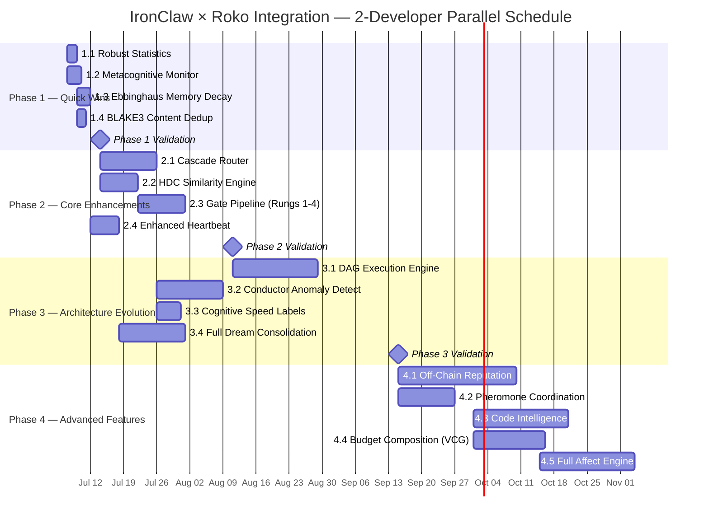
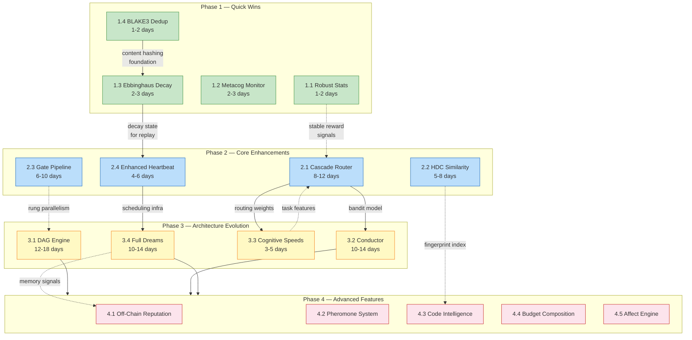

# IronClaw × Roko Implementation Tracker

Master implementation tracker for integrating research-grade agent intelligence
from the Roko framework into IronClaw's production codebase. This document is
the single authoritative entry point for scheduling, status, dependencies, and
definition of done across all four phases.

---

## Executive Summary

This plan adapts 25 concepts from the Roko agent framework into IronClaw — a
secure personal AI assistant written in Rust. Roko is a research-grade
autonomous agent system (~727K LOC, 30 crates, 8,300 tests) with a proven set
of algorithms for memory management, LLM cost reduction, agent self-regulation,
and code verification. The integration is **clean-room**: no Roko source code
is imported. Every feature is reimplemented inside IronClaw-owned modules using
the captured concept documentation as the specification.

**Total scope:**

| Metric | Value |
|--------|-------|
| Concepts to adopt | 25 |
| Phases | 4 |
| Estimated calendar time (2 devs) | ~14 weeks (vs. 26 weeks serial) |
| Estimated LOC (top 10 features) | ~5,250–5,950 |
| New crates to be created | 4 (`ironclaw_hdc`, `ironclaw_gate`, `ironclaw_graph`, `ironclaw_dreams`) |
| Existing files touched | ~25 across `src/` and `crates/ironclaw_llm/` |
| Feature flags required | 1 per feature, all default-off |
| DB migrations required | 2 (Phase 2: HDC fingerprint column; Phase 3: DAG run table) |

**Primary expected outcomes:**

- 30–50% LLM cost reduction (Cascade Router, Phase 2)
- Memory workspace stays "sharp" as it scales (Ebbinghaus Decay, Phase 1)
- Runaway agent spend and stuck loops detected and corrected (Metacognitive Monitor, Phase 1)
- Generated code verified before submission (Gate Pipeline, Phase 2)
- Agent learns which LLM provider wins for each task class (Cascade Router, Phase 2+3)

**Source documents**: [`tmp/strategy/integration-roadmap.md`](../strategy/integration-roadmap.md)
and [`tmp/strategy/priority-matrix/README.md`](../strategy/priority-matrix/README.md). No
access to the Roko source tree is required to implement any feature.

---

## Mermaid Gantt Chart



**Critical path (longest chain, 11 weeks):**

```
Phase 1.3 Ebbinghaus Decay (2w)
  → Phase 2.4 Enhanced Heartbeat (3w)
    → Phase 3.4 Full Dream Consolidation (6w)
```

**Parallel path (7 weeks alongside dreams):**

```
Phase 2.1 Cascade Router (3w)
  → Phase 3.2 Conductor (4w)
  → Phase 3.3 Cognitive Speeds (2w)
```

---

## Mermaid Dependency Graph

Solid arrows are hard dependencies (must be built first). Dashed arrows are
soft dependencies (the later feature benefits from but does not require the
earlier one).



---

## Phase Summary Table

| Phase | Items | Est. Effort | Key Risks | Prerequisites | Primary Metric |
|-------|-------|-------------|-----------|---------------|----------------|
| **1 — Quick Wins** | 4 (Robust Stats, Metacog Monitor, Ebbinghaus Decay, BLAKE3 Dedup) | 1–2 weeks, ~500–800 LOC | Minimal. Purely additive. Estimation tests must stay green. | None | Outlier-induced false alerts down 50%; loop/runaway detection live |
| **2 — Core Enhancements** | 4 (Cascade Router, HDC, Gate Pipeline, Enhanced Heartbeat) | 4–6 weeks, ~2,500–3,000 LOC | Cascade Router touches LLM routing critical path. HDC requires dual-backend DB migration. | Phase 1 (robust stats for reward signals; Ebbinghaus for heartbeat replay) | 30% LLM cost reduction; gate blocks bad code; dedup rate up 20% |
| **3 — Architecture Evolution** | 4 (DAG Engine, Conductor, Cognitive Speeds, Full Dreams) | 6–10 weeks, ~3,000–4,000 LOC | DAG engine is the largest single piece (18 dev-days). Full Dreams requires HDC + Heartbeat. Conductor requires Cascade Router live data. | Phase 2 fully validated | Parallel workflow wall-clock -15%; provider degradation detected 1 request early |
| **4 — Advanced Features** | 5 (Reputation, Pheromone, Code Intelligence, VCG Budget, Affect Engine) | 8–12 weeks, ~3,000–5,000 LOC | NEAR on-chain dependency; Affect Engine is research-grade; Code Intelligence adds indexing overhead | Phase 3 stable; NEAR SDK available for reputation | LLM cost down further; workspace code search live; reputation signals in routing |

---

## Quick Reference — All 25 Concepts

Status column uses: `not started` / `in progress` / `complete`.

| # | Concept | Status | Phase | Tier | Composite ROI | Est. Effort | Checklist Section | Concept Doc |
|---|---------|--------|-------|------|--------------|-------------|-------------------|-------------|
| 1 | Metacognitive Monitor | not started | 1 | Stars | 4.55 | 2–3 days | [Phase 1](#phase-1-quick-wins-checklist) | [agent-patterns](../agent-intelligence/agent-patterns.md) |
| 2 | Ebbinghaus Memory Decay | not started | 1 | Stars | 4.50 | 2–3 days | [Phase 1](#phase-1-quick-wins-checklist) | [universal-engram](../core-concepts/universal-engram.md) |
| 3 | BLAKE3 Content Dedup | not started | 1 | Stars | 4.30 | 1–2 days | [Phase 1](#phase-1-quick-wins-checklist) | [universal-engram](../core-concepts/universal-engram.md) |
| 4 | Robust Statistics | not started | 1 | Stars | 4.20 | 1–2 days | [Phase 1](#phase-1-quick-wins-checklist) | [mathematical-primitives](../core-concepts/mathematical-primitives.md) |
| 5 | Composable Scorers | not started | 1 | Stars | 3.90 | 1–2 days | [Phase 1](#phase-1-quick-wins-checklist) | [agent-patterns](../agent-intelligence/agent-patterns.md) |
| 6 | Hierarchical Cancellation | not started | 1 | Stars | 3.50 | 3–5 days | [Phase 1](#phase-1-quick-wins-checklist) | [runtime-infrastructure](../execution-verification/runtime-infrastructure.md) |
| 7 | Cascade Router (LinUCB) | not started | 2 | Big Bets | 4.15 | 2–3 weeks | [Phase 2](#phase-2-core-enhancements-checklist) | [online-learning](../agent-intelligence/online-learning.md) |
| 8 | Cognitive Speed Labels | not started | 2/3 | Big Bets | 3.50 | 3–5 days | [Phase 2](#phase-2-core-enhancements-checklist) | [cognitive-architecture](../core-concepts/cognitive-architecture.md) |
| 9 | HDC Similarity Engine | not started | 2 | Big Bets | 3.85 | 2–3 weeks | [Phase 2](#phase-2-core-enhancements-checklist) | [hyperdimensional-computing](../core-concepts/hyperdimensional-computing/README.md) |
| 10 | Gate Pipeline (Rungs 1–4) | not started | 2 | Big Bets | 3.85 | 2–4 weeks | [Phase 2](#phase-2-core-enhancements-checklist) | [gate-verification](../execution-verification/gate-verification.md) |
| 11 | Enhanced Heartbeat | not started | 2 | Nice to Have | 3.30 | 4–6 days | [Phase 2](#phase-2-core-enhancements-checklist) | [dream-consolidation](../agent-intelligence/dream-consolidation.md) |
| 12 | DAG Execution Engine | not started | 3 | Nice to Have | 3.35 | 12–18 days | [Phase 3](#phase-3-architecture-evolution-checklist) | [dag-execution](../execution-verification/dag-execution.md) |
| 13 | EventBus / Replay | not started | 3 | Nice to Have | 3.25 | 5–8 days | [Phase 3](#phase-3-architecture-evolution-checklist) | [runtime-infrastructure](../execution-verification/runtime-infrastructure.md) |
| 14 | Conductor Anomaly Detect | not started | 3 | Nice to Have | 3.25 | 10–14 days | [Phase 3](#phase-3-architecture-evolution-checklist) | [conductor-anomaly](../execution-verification/conductor-anomaly.md) |
| 15 | Resumable Checkpoints | not started | 3 | Nice to Have | 3.20 | 3–5 days | [Phase 3](#phase-3-architecture-evolution-checklist) | [agent-patterns](../agent-intelligence/agent-patterns.md) |
| 16 | Declarative TOML Tools | not started | 3 | Nice to Have | 3.15 | 3–5 days | [Phase 3](#phase-3-architecture-evolution-checklist) | [plugin-extension](../ecosystem/plugin-extension.md) |
| 17 | User Engagement PAD | not started | 3 | Nice to Have | 3.00 | 3–5 days | [Phase 3](#phase-3-architecture-evolution-checklist) | [affect-engine](../agent-intelligence/affect-engine.md) |
| 18 | Full Dream Consolidation | not started | 3 | Long-Term | 2.80 | 10–14 days | [Phase 3](#phase-3-architecture-evolution-checklist) | [dream-consolidation](../agent-intelligence/dream-consolidation.md) |
| 19 | Budget Composition (VCG) | not started | 4 | Long-Term | 2.75 | 3–4 weeks | [Phase 4](#phase-4-advanced-features-checklist) | [budget-composition](../context-memory/budget-composition.md) |
| 20 | Code Intelligence | not started | 4 | Long-Term | 2.65 | 3–4 weeks | [Phase 4](#phase-4-advanced-features-checklist) | [code-intelligence](../context-memory/code-intelligence.md) |
| 21 | NEAR On-Chain Reputation | not started | 4 | Long-Term | 2.30 | 4–6 weeks | [Phase 4](#phase-4-advanced-features-checklist) | [chain-reputation](../ecosystem/chain-reputation/README.md) |
| 22 | Pheromone System | not started | 4 | Long-Term | 2.25 | 3–5 weeks | [Phase 4](#phase-4-advanced-features-checklist) | [cognitive-architecture](../core-concepts/cognitive-architecture.md) |
| 23 | Pure SM Extraction | not started | 4 | Long-Term | 2.20 | 8+ weeks | [Phase 4](#phase-4-advanced-features-checklist) | [runtime-infrastructure](../execution-verification/runtime-infrastructure.md) |
| 24 | Full Affect Engine | not started | 4 | Long-Term | 2.10 | 4–6 weeks | [Phase 4](#phase-4-advanced-features-checklist) | [affect-engine](../agent-intelligence/affect-engine.md) |
| 25 | TDA / Sheaves | not started | 4 | Long-Term | 1.55 | 8+ weeks | [Phase 4](#phase-4-advanced-features-checklist) | [mathematical-primitives](../core-concepts/mathematical-primitives.md) |

---

## Phase 1: Quick Wins Checklist

Target window: **Week 1–2** (July 7–14, 2026). All items are independent.

### 1.1 Robust Statistics
- [ ] Add `trimmed_mean()`, `median()`, `mad()` to `src/util.rs`
- [ ] Wire outlier-dampening into `src/estimation/learner.rs` (dampens alpha when ratio > 3 MAD)
- [ ] Use `trimmed_mean` in `src/estimation/cost.rs` and `src/estimation/time.rs`
- [ ] 6 unit tests in `util.rs`; 2 outlier scenario tests in `learner.rs`
- [ ] `cargo clippy` zero warnings; `cargo test` green
- [ ] Outlier injection test: 10x cost spike dampens EMA update to <10% of undampened value
- [ ] No behavioral change for non-outlier inputs

### 1.2 Metacognitive Monitor
- [ ] Create `src/agent/metacognitive.rs` with `MetacognitiveMonitor`, `Pathology`, `Correction`
- [ ] Hook `observe()` after each turn in `src/agent/agentic_loop.rs`
- [ ] Hook `diagnose()` in the turn loop; apply `recommend()` correction when pathology detected
- [ ] Feature flag `experimental.metacognitive_monitor` defaults off
- [ ] Tests: stuck loop (10 identical turns), cost runaway (30c/turn × 10 remaining > 50c budget), contradiction detection
- [ ] `cargo test` green; no `info!` logging (use `debug!`)

### 1.3 Ebbinghaus Memory Decay
- [ ] Add `DecayVariant` enum and `DecayState` helper to `src/workspace/document.rs`
- [ ] Set default Ebbinghaus decay on write in `src/workspace/mod.rs`
- [ ] Add `archive_decayed()` in `src/workspace/mod.rs` (archive, never delete)
- [ ] Factor `current_strength()` into ranking in `src/workspace/search.rs`
- [ ] Bump `stability_seconds` on each `memory_read` access in `src/tools/builtin/memory.rs`
- [ ] No DB migration (state lives in `metadata: serde_json::Value`)
- [ ] Feature flag `experimental.memory_decay` defaults off
- [ ] Tests: fresh memory strength ~1.0; 30-day-old strength < 0.1; access doubles stability

### 1.4 BLAKE3 Content Dedup
- [ ] Verify `blake3 = "1"` in `Cargo.toml` (already present)
- [ ] Add `content_hash: Option<String>` field to `MemoryDocument.metadata` JSON
- [ ] Check existing hash on `memory_write`; if match, increment `access_count` instead of inserting
- [ ] Expose dedup stats via `memory_tree` tool
- [ ] Feature flag `experimental.content_dedup` defaults off
- [ ] Tests: identical content → single document; near-identical (whitespace) → separate; stress: 1000 writes, 500 dupes

### 1.5 Composable Scorers (bonus)
- [ ] Add `Scorer` trait to `src/evaluation/` with `fn score(&self, input: &ScoreInput) -> f64`
- [ ] Implement: `LengthScorer`, `ToolCallCountScorer`, `KeywordScorer`
- [ ] `CompositeScorer` with weighted sum
- [ ] Tests: each scorer in isolation; composite matches manual weighted sum

### 1.6 Hierarchical Cancellation (bonus)
- [ ] Add `CancellationToken` to `src/context/` (or wire tokio's CancellationToken)
- [ ] Propagate from session → job → tool call chain
- [ ] Test: cancelling session cancels in-flight tool calls within 100ms

---

## Phase 2: Core Enhancements Checklist

Target window: **Weeks 3–8** (July 14 – August 11, 2026). Items 2.1 and 2.2
are parallel; 2.3 begins after 2.2; 2.4 begins after 1.3 lands.

### 2.1 Cascade Router (LinUCB)
- [ ] Create `crates/ironclaw_llm/src/cascade_router.rs` with `CascadeRouter`, `LinUcbBandit`
- [ ] 18-dimensional context vector (task type, token count, complexity, history, etc.)
- [ ] Three-stage cascade: static rules → confidence check → UCB selection
- [ ] Audit log: every routing decision records context vector + selected provider + outcome
- [ ] Feature flag `experimental.cascade_router` defaults off; static router remains authoritative when off
- [ ] Safety invariant: high-risk requests always bypass bandit (safety routing preserved)
- [ ] Caller-level test: high-risk request uses safe provider even when bandit would choose cheaper
- [ ] Integration test: 100 fixture requests, bandit converges cost down without pass rate > -2 pp
- [ ] Both DB backends record routing episodes if persistence is enabled
- [ ] `cargo test --features integration` green

### 2.2 HDC Similarity Engine
- [ ] Create `crates/ironclaw_hdc/` with `HdcVector`, `HdcCodebook`, `HdcIndex`
- [ ] 10,240-bit binary vectors; tokenize with `HdcCodebook` (BPE-style)
- [ ] Similarity via Hamming distance: `similarity = 1.0 - hamming(a, b) / DIMS`
- [ ] `HdcIndex::scan_nearest()` returns top-k in < 10ms for 100K vectors (Apple Silicon)
- [ ] Add `hdc_fingerprint: Option<Vec<u8>>` to `MemoryDocument.metadata` JSON
- [ ] Wire `HdcIndex` as third signal in `src/workspace/search.rs` RRF merge
- [ ] Feature flag `experimental.hdc_memory_search` defaults off
- [ ] DB: add fingerprint column to both PostgreSQL and libSQL backends
- [ ] Tests: `similarity("rust async", "async rust") > 0.85`; unrelated topics < 0.30; 100K scan < 10ms

### 2.3 Gate Pipeline (Rungs 1–4)
- [ ] Create `crates/ironclaw_gate/` with `GatePipeline`, `Rung` trait, `GateContext`, `GateVerdict`
- [ ] Implement four rungs: `CompileRung`, `LintRung`, `TestRung`, `SymbolRung`
- [ ] `ComplexityAssessor`: select rungs to run based on change size and language
- [ ] Integrate into `src/tools/builder/validation.rs` as the validation step
- [ ] Feature flag `experimental.progressive_gates` defaults off
- [ ] All tool calls through `ToolDispatcher`, never direct
- [ ] Caller-level test: code-edit workflow blocks submission on compile failure
- [ ] Test: false block rate < 5% on fixture corpus; p95 gate overhead bounded by tier
- [ ] Cycle detection impossible (pipeline is linear rungs, not a graph)

### 2.4 Enhanced Heartbeat (Dream Consolidation Lite)
- [ ] Add `ConsolidationEngine` to `src/agent/heartbeat.rs` (or new `heartbeat_consolidation.rs`)
- [ ] During heartbeat: sample recent N turns, propose summaries, write staged memories
- [ ] Staged memories go into `metadata["staging_tier"]` — only promoted after confidence threshold
- [ ] Feature flag `experimental.dream_consolidation` defaults off
- [ ] No LLM calls during heartbeat if budget is exhausted (check `CostGuard` before running)
- [ ] Test: heartbeat fixture writes promoted memories; no secrets leak into workspace

---

## Phase 3: Architecture Evolution Checklist

Target window: **Weeks 9–22** (August 11 – September 15, 2026). Items run
in parallel across two developers.

### 3.1 DAG Execution Engine
- [ ] Create `crates/ironclaw_graph/` with `DagGraph`, `Cell` trait, `DagRunner`, `Budget`
- [ ] Cell types: `LlmCell`, `ToolCell`, `ShellCell`, `GateCell`
- [ ] TOML workflow definitions loadable from `~/.ironclaw/workflows/`
- [ ] Topological sort at load time; cycle detection is a hard error
- [ ] `ToolCell` dispatches through `ToolDispatcher` only (never direct)
- [ ] `ShellCell` routes through sandbox (never bare shell)
- [ ] Budget tracking: tokens + cost + deadline; partial results on exhaustion
- [ ] Feature flag `experimental.dag_workflow_runner` defaults off
- [ ] DB: `dag_run_record` table in both PostgreSQL and libSQL (optional, but consistent)
- [ ] Integration test: 5-node DAG with 3 parallel steps executes and reaches same final state as serial

### 3.2 Conductor Anomaly Detection
- [ ] Create `crates/ironclaw_llm/src/conductor.rs` with `ProviderConductor`, `HoltForecast`
- [ ] Watcher ensemble: latency, error rate, token usage, cost, quality
- [ ] Holt double exponential smoothing: L_t = α·y_t + (1-α)·(L_{t-1} + T_{t-1})
- [ ] Predictive alert: if forecast_5_steps > threshold, pre-warm fallback provider
- [ ] Integrate with `CircuitBreakerProvider` in `crates/ironclaw_llm/`
- [ ] Feature flag `experimental.provider_conductor` defaults off; observe mode available
- [ ] Test: latency ramp (mock: +50ms every 5 requests) triggers pre-warming before circuit breaks
- [ ] Test: healthy provider has no p95 latency regression > 10%

### 3.3 Cognitive Speed Labels
- [ ] Add `CognitiveSpeed` enum (`Gamma`/reactive, `Theta`/reflective, `Delta`/consolidation)
- [ ] `SpeedClassifier` in `src/agent/dispatcher.rs` classifies each request before dispatch
- [ ] Gamma: < 15s budget, cheap model; Theta: < 75s, balanced model; Delta: background
- [ ] Wire into `SmartRoutingProvider` / `CascadeRouter` as a classification feature
- [ ] Feature flag `experimental.cognitive_speeds` defaults off
- [ ] Test: urgent tasks (classified Gamma) dispatched within p95 < 2s; background work (Delta) never starves foreground

### 3.4 Full Dream Consolidation
- [ ] Create `crates/ironclaw_dreams/` with NREM, REM, Hypnagogic, Threat pipelines
- [ ] NREM: replay high-utility episodes, strengthen via Ebbinghaus `strengthen()`
- [ ] REM: counterfactual synthesis — LLM generates "what if" variants, stores as staged memories
- [ ] Hypnagogic: cross-domain pair detection via HDC (surprise threshold 0.30)
- [ ] Threat: replay failure scenarios, identify leading indicators
- [ ] Schedule via heartbeat extended scheduling slot; honor daily budget cap
- [ ] Feature flag `experimental.full_dream_consolidation` defaults off
- [ ] All derived writes go to workspace via `memory_write` tool (through dispatcher)
- [ ] Test: heartbeat cycle promotes memories; no private-channel data leaks; background spend within budget

---

## Phase 4: Advanced Features Checklist

Target window: **Weeks 23+** (September 15, 2026 onwards). Research-grade or
long-tail. Tackle in priority order as resources allow.

### 4.1 Off-Chain Reputation
- [ ] Design `ReputationLedger` table (7 domains, EMA score, half-life decay) in both DBs
- [ ] Tool/agent outcome events write reputation updates through dispatcher
- [ ] Feature flag `experimental.local_reputation` defaults off
- [ ] Optional NEAR bridge: if `NEAR_REPUTATION_CONTRACT` env set, sync events on-chain
- [ ] Test: failed tool outcome reduces score; half-life decay correct after 30 days

### 4.2 Pheromone Coordination
- [ ] Stigmergic trail map for workspace paths (write → leave trail; search → follow strong trails)
- [ ] Evaporation: trails decay with half-life configurable in settings
- [ ] Feature flag `experimental.pheromone_trails` defaults off
- [ ] Test: repeated writes to a path strengthen its trail; evaporation correct after idle period

### 4.3 Code Intelligence
- [ ] Symbol index + HDC fingerprints + FTS merged via RRF for workspace code search
- [ ] Language providers: Rust first; TypeScript and Go via `LanguageProvider` trait
- [ ] Index stored in workspace metadata JSON (no new tables required for MVP)
- [ ] Feature flag `experimental.workspace_code_search` defaults off
- [ ] Test: fixture repo indexed; top-5 symbol recall > previous FTS-only baseline by +15pp

### 4.4 Budget Composition (VCG)
- [ ] VCG auction: skills, memory, tools, history bid for context window tokens
- [ ] U-shaped placement: critical items at start and end of context window
- [ ] Feature flag `experimental.vcg_budget_composition` defaults off
- [ ] Test: input tokens/request down 15%; answer quality within -2pp of baseline

### 4.5 Full Affect Engine
- [ ] PAD (Pleasure-Arousal-Dominance) state tracked per session
- [ ] OCC appraisal events update PAD state
- [ ] PAD exposed as low-weight routing metadata only (does not affect safety rules)
- [ ] Feature flag `experimental.affect_engine` defaults off
- [ ] Test: PAD updates do not change safety routing; update cost < 1ms p95

---

## Definition of Done

Every item — regardless of phase — must satisfy ALL of these before it is
marked complete.

```
[ ] Feature flag exists and defaults to off (key named `experimental.<feature>`)
[ ] cargo test passes (zero failures, zero ignored tests added)
[ ] cargo clippy --all --benches --tests --examples --all-features → zero warnings
[ ] cargo fmt applied
[ ] No .unwrap() or .expect() in production code paths added by this PR
[ ] No info! or warn! logging added in background/heartbeat paths (use debug!)
[ ] All new DB writes implement both PostgreSQL and libSQL backends (or explicitly
    use metadata JSON to avoid a migration)
[ ] All agent actions go through ToolDispatcher::dispatch() (no direct workspace/
    store/extension_manager calls from handlers)
[ ] Caller-level test exists — drives the real boundary where the behavior matters,
    not only the helper function under test
[ ] Benchmark or recorded scenario captures baseline and candidate metrics
[ ] Rollback documented: what flag to disable, what data persists after rollback
[ ] Security review area named in PR description
[ ] Feature linked to at least one measurable metric with a target value
[ ] No LLM data deleted (archive, never delete; use metadata flags for filtered states)
[ ] Evidence bundle answerable (see 07-implementation-readiness-contract.md §3)
```

---

## Decision Log

See [`decision-log.md`](decision-log.md) for all Architecture Decision Records
(ADRs) capturing the rationale for key implementation choices.

---

## Links

### Phase Checklists (inline above)
- [Phase 1 — Quick Wins](#phase-1-quick-wins-checklist)
- [Phase 2 — Core Enhancements](#phase-2-core-enhancements-checklist)
- [Phase 3 — Architecture Evolution](#phase-3-architecture-evolution-checklist)
- [Phase 4 — Advanced Features](#phase-4-advanced-features-checklist)

### Strategy Documents
- [`tmp/strategy/integration-roadmap.md`](../strategy/integration-roadmap.md) — full implementation code, PR checklists, benchmarking targets, before/after comparisons
- [`tmp/strategy/priority-matrix/README.md`](../strategy/priority-matrix/README.md) — all 25 concepts scored on 5 axes, priority quadrant, dependency chain, decision flowchart

### Implementation Blueprints
- [`01-rust-core-blueprints.md`](01-rust-core-blueprints.md) — HDC, Signal identity, decay, robust stats, LinUCB
- [`02-runtime-workflow-blueprints.md`](02-runtime-workflow-blueprints.md) — DAG cells, gates, conductor, event bus
- [`03-ironclaw-integration-recipes.md`](03-ironclaw-integration-recipes.md) — where each feature fits in IronClaw + tests
- [`04-reputation-contract-blueprints.md`](04-reputation-contract-blueprints.md) — off-chain reputation, Solidity identity, NEAR registry
- [`05-per-file-action-matrix.md`](05-per-file-action-matrix.md) — every concept mapped to IronClaw target + metric gate
- [`06-rollout-runbook.md`](06-rollout-runbook.md) — feature flag, staged deployment, rollback, DB parity, security review
- [`07-implementation-readiness-contract.md`](07-implementation-readiness-contract.md) — entry/exit criteria for any item to become mergeable
- [`08-caller-test-matrix.md`](08-caller-test-matrix.md) — caller-level regression coverage map
- [`09-plan-runner-readiness.md`](09-plan-runner-readiness.md) — TOML task plans, dependency checks, execution records

### Concept Documents by Category
**Core Concepts**
- [`tmp/core-concepts/README.md`](../core-concepts/README.md)
- [`tmp/core-concepts/hyperdimensional-computing/README.md`](../core-concepts/hyperdimensional-computing/README.md)
- [`tmp/core-concepts/universal-engram.md`](../core-concepts/universal-engram.md)
- [`tmp/core-concepts/mathematical-primitives.md`](../core-concepts/mathematical-primitives.md)
- [`tmp/core-concepts/cognitive-architecture.md`](../core-concepts/cognitive-architecture.md)

**Agent Intelligence**
- [`tmp/agent-intelligence/README.md`](../agent-intelligence/README.md)
- [`tmp/agent-intelligence/dream-consolidation.md`](../agent-intelligence/dream-consolidation.md)
- [`tmp/agent-intelligence/affect-engine.md`](../agent-intelligence/affect-engine.md)
- [`tmp/agent-intelligence/online-learning.md`](../agent-intelligence/online-learning.md)
- [`tmp/agent-intelligence/agent-patterns.md`](../agent-intelligence/agent-patterns.md)

**Execution and Verification**
- [`tmp/execution-verification/README.md`](../execution-verification/README.md)
- [`tmp/execution-verification/dag-execution.md`](../execution-verification/dag-execution.md)
- [`tmp/execution-verification/gate-verification.md`](../execution-verification/gate-verification.md)
- [`tmp/execution-verification/conductor-anomaly.md`](../execution-verification/conductor-anomaly.md)
- [`tmp/execution-verification/orchestrator-swarm.md`](../execution-verification/orchestrator-swarm.md)
- [`tmp/execution-verification/runtime-infrastructure.md`](../execution-verification/runtime-infrastructure.md)

**Context and Memory**
- [`tmp/context-memory/README.md`](../context-memory/README.md)
- [`tmp/context-memory/budget-composition.md`](../context-memory/budget-composition.md)
- [`tmp/context-memory/code-intelligence.md`](../context-memory/code-intelligence.md)
- [`tmp/context-memory/persistence-storage.md`](../context-memory/persistence-storage.md)
- [`tmp/context-memory/language-support.md`](../context-memory/language-support.md)

**Ecosystem**
- [`tmp/ecosystem/README.md`](../ecosystem/README.md)
- [`tmp/ecosystem/chain-reputation/README.md`](../ecosystem/chain-reputation/README.md)
- [`tmp/ecosystem/plugin-extension.md`](../ecosystem/plugin-extension.md)
- [`tmp/ecosystem/mcp-editor-integration.md`](../ecosystem/mcp-editor-integration.md)
- [`tmp/ecosystem/control-plane.md`](../ecosystem/control-plane.md)
- [`tmp/ecosystem/smart-contracts/README.md`](../ecosystem/smart-contracts/README.md)

**Reference**
- [`tmp/reference/README.md`](../reference/README.md)
- [`tmp/reference/architecture-overview.md`](../reference/architecture-overview.md)
- [`tmp/reference/research-citations/README.md`](../reference/research-citations/README.md)
- [`tmp/reference/v2-depth-research.md`](../reference/v2-depth-research.md)
- [`tmp/reference/plans-catalog.md`](../reference/plans-catalog.md)

### Rollout and Risk
- [`rollout/README.md`](rollout/README.md)
- [`rollout/01-feature-rollout-runbooks.md`](rollout/01-feature-rollout-runbooks.md)
- [`rollout/02-security-and-risk-register.md`](rollout/02-security-and-risk-register.md)
- [`rollout/03-feature-flag-inventory.md`](rollout/03-feature-flag-inventory.md)
- [`rollout/04-feature-threat-models.md`](rollout/04-feature-threat-models.md)

### Schemas and Data Models
- [`schemas/README.md`](schemas/README.md)
- [`schemas/01-runtime-data-models.md`](schemas/01-runtime-data-models.md)
- [`schemas/02-storage-and-migrations.md`](schemas/02-storage-and-migrations.md)
- [`schemas/03-correlation-and-ids.md`](schemas/03-correlation-and-ids.md)
- [`schemas/04-canonical-event-and-persistence-contract.md`](schemas/04-canonical-event-and-persistence-contract.md)

### Benchmarking
- [`benchmarking/README.md`](benchmarking/README.md)
- [`benchmarking/01-measurement-framework.md`](benchmarking/01-measurement-framework.md)
- [`benchmarking/02-feature-playbooks.md`](benchmarking/02-feature-playbooks.md)
- [`benchmarking/03-harness-code.md`](benchmarking/03-harness-code.md)
- [`benchmarking/04-rollout-metrics.md`](benchmarking/04-rollout-metrics.md)
- [`benchmarking/05-runner-contract.md`](benchmarking/05-runner-contract.md)
