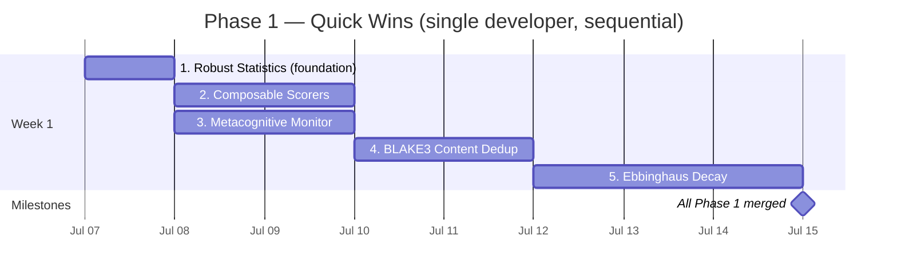

# Phase 1 Implementation Checklists: Quick Wins

> **Navigation**: [Integration roadmap](../strategy/integration-roadmap.md) |
> [Priority matrix](../strategy/priority-matrix/README.md) |
> [Integration recipes](03-ironclaw-integration-recipes.md) |
> [Per-file action matrix](05-per-file-action-matrix.md)

**Phase 1 summary**: Five independent items, each completable in 1–3 developer-days
with no hard dependencies between them. They establish the patterns (decay, hashing,
monitoring, statistics, scoring) that Phase 2 features build on. Every item ships as
its own PR. The Phase 1 MVP stores per-document learning state in
`MemoryDocument.metadata`; no database migration is required unless benchmarking
proves an indexed column or side table is needed.

Priority matrix composite scores (from [priority-matrix.md](../strategy/priority-matrix/README.md)):

| Item | Rank | Composite | Est. Days |
|------|------|-----------|-----------|
| Metacognitive Monitor | 1 | 4.55 | 1–2 |
| Ebbinghaus Decay | 2 | 4.50 | 2–3 |
| BLAKE3 Content Dedup | 3 | 4.30 | 1–2 |
| Robust Statistics | 4 | 4.20 | 1–2 |
| Composable Scorers | 5 | 3.90 | 1–2 |

---

## Prerequisites

What must exist in IronClaw **before** beginning any Phase 1 item.

| Prerequisite | Location | Status | Notes |
|---|---|---|---|
| `DuplicateToolCallTracker` in agent loop | `src/agent/agentic_loop.rs` | Already exists | Metacognitive Monitor evolves this struct |
| `CostGuard` daily/hourly budget | `src/agent/cost_guard.rs` | Already exists | Monitor needs `remaining_budget_cents()` accessor |
| `LearningModel` with EMA fields | `src/estimation/learner.rs` | Already exists | Robust stats add MAD-based outlier dampening |
| `MemoryDocument` with `metadata: serde_json::Value` | `src/workspace/document.rs` | Already exists | Decay state and content hash stored here, no migration needed |
| `blake3 = "1"` in Cargo.toml | `Cargo.toml` | Already exists | BLAKE3 dedup adds zero new deps |
| Workspace `write()` / `search()` | `src/workspace/mod.rs` | Already exists | Dedup check and decay state inject here |
| `src/evaluation/` module | `src/evaluation/` | Already exists | Composable scorers extend this module |
| `src/util.rs` | `src/util.rs` | Already exists | Robust stats drop into this existing file |
| `src/tools/builtin/memory.rs` | `src/tools/builtin/memory.rs` | Already exists | Decay metadata and dedup call added to `memory_write` |
| Dual DB backends (PostgreSQL + libSQL) | `src/db/` | Already exists | Any promoted schema/index change must update PostgreSQL migrations and `src/db/libsql_migrations.rs` together |

---

## Implementation Order Gantt



**Recommended order for a single developer:**

1. **Robust Statistics** first — pure functions, no integration, confirms the testing
   discipline pattern for the rest.
2. **Composable Scorers** second — new file in `src/evaluation/`, no existing code
   touched. Confirms the new-module pattern.
3. **Metacognitive Monitor** — replaces `DuplicateToolCallTracker` in-place, builds
   on the testing confidence from items 1 and 2.
4. **BLAKE3 Dedup** — adds a metadata-backed workspace query method first;
   add an index only after the fixture scan shows it is needed.
5. **Ebbinghaus Decay** last — most invasive (touches `document.rs`, `mod.rs`,
   `search.rs`, `memory.rs`); BLAKE3 dedup should be merged first because dedup
   bumping `access_count` is the first consumer of the decay stability model.

**For two developers in parallel:**

- Dev A: items 1 + 3 (stats foundation, then monitor)
- Dev B: items 2 + 4 + 5 (scorers, then dedup, then decay)

---

## Item 1: Metacognitive Monitor

**Concept doc**: [`../agent-intelligence/agent-patterns.md`](../agent-intelligence/agent-patterns.md) — Pattern 4: Metacognitive Monitor
**Integration recipes**: [`03-ironclaw-integration-recipes.md`](03-ironclaw-integration-recipes.md) — Recipe 1

**What it does**: Evolves `DuplicateToolCallTracker` (which only catches exact
consecutive repetition) into a three-mode monitor: (a) consecutive-duplicate detection
(preserved), (b) sliding-window diversity check that catches A/B/A/B alternating
patterns the old tracker misses, (c) EWMA cost-per-turn projection that detects
budget runaways before `CostGuard` hard-limits.

**IronClaw integration points**: `src/agent/agentic_loop.rs` (inline — replaces existing
struct), `src/agent/cost_guard.rs` (add `remaining_budget_cents()` accessor).

### Checklist

#### Design

- [ ] Read `src/agent/agentic_loop.rs` in full; map every call site of
  `DuplicateToolCallTracker` so none are missed during the rename.
  **File**: `src/agent/agentic_loop.rs`
  **Dependency**: None.

- [ ] Read `src/agent/cost_guard.rs`; confirm `CostGuard` holds remaining budget in
  cents and identify the field name to expose as a new accessor.
  **File**: `src/agent/cost_guard.rs`
  **Dependency**: None.

- [ ] Decide feature-flag approach: `experimental.metacognitive_monitor` read through
  the existing settings/config facade, defaulting `false`. Struct carries an
  `enabled: bool` field so the flag takes effect at construction with zero
  hot-path overhead when disabled.
  **File**: `src/config/agent.rs`
  **Dependency**: None.

#### Implement

- [ ] Add `remaining_budget_cents() -> Option<u32>` to `CostGuard` in
  `src/agent/cost_guard.rs`. Returns `None` when no daily budget is configured
  (unlimited mode). Required by Mode 3.
  **File**: `src/agent/cost_guard.rs`
  **Dependency**: Design step above.

- [ ] Replace `DuplicateToolCallTracker` struct definition in
  `src/agent/agentic_loop.rs` with `MetacognitiveMonitor`. New fields:
  `recent_fingerprints: VecDeque<u64>` (window capacity 10),
  `diversity_threshold: f64` (default 0.33),
  `total_spend_cents: u32`,
  `budget_cents: Option<u32>`,
  `max_expected_iterations: u32` (default 20).
  Preserve all existing Mode 1 fields (`last_fingerprint`, `consecutive_dup_count`,
  `consecutive_dup_threshold`).
  **File**: `src/agent/agentic_loop.rs`
  **Dependency**: `CostGuard` accessor above.

- [ ] Implement `record(fingerprint: u64, tool_failed: bool)`, `record_spend_cents(u32)`,
  `is_consecutive_duplicate() -> bool`, `is_low_diversity() -> bool`,
  `is_cost_runaway() -> bool`, and `projected_total_cents() -> u32` methods.
  All internal diagnostics logged at `debug!` level (never `info!`).
  **File**: `src/agent/agentic_loop.rs`
  **Dependency**: Struct definition above.

- [ ] Wire into `run_agentic_loop()`: after each tool-call batch, call `record()` and
  `record_spend_cents()`. After recording, call all three detection methods. For
  `is_consecutive_duplicate()` and `is_low_diversity()`, inject a corrective
  `ChatMessage::user(...)` before the next LLM call. For `is_cost_runaway()`, emit a
  `debug!` event (Phase 2.1 cascade router will act on this signal).
  **File**: `src/agent/agentic_loop.rs`
  **Dependency**: Method implementations above.

#### Test

- [ ] Test `is_consecutive_duplicate()`: feed same fingerprint 3 times with
  `tool_failed=true`, assert `true`; feed same fingerprint 3 times with
  `tool_failed=false`, assert `false` (only failed repetitions trigger Mode 1).
  Test name: `test_consecutive_duplicate_only_on_failure`.
  **File**: `src/agent/agentic_loop.rs` (inline `#[cfg(test)]` module)

- [ ] Test `is_low_diversity()` detects alternating A/B pattern: alternate two
  fingerprints 5 times each (10 calls total), assert `is_low_diversity() == true`
  and `is_consecutive_duplicate() == false`. This is the critical regression: the
  old tracker would not have caught this.
  Test name: `test_diversity_detects_alternating_pattern_old_tracker_missed`.
  **File**: `src/agent/agentic_loop.rs`

- [ ] Test `is_low_diversity()` has no false positive for varied tools: 10 calls
  each with a unique fingerprint (0, 100, 200, ...), assert `is_low_diversity() ==
  false`.
  Test name: `test_diversity_no_false_positive_varied_tools`.
  **File**: `src/agent/agentic_loop.rs`

- [ ] Test `is_cost_runaway()`: set budget 100 cents, `max_expected_iterations=10`,
  record 5 iterations at 15 cents each. Assert `is_cost_runaway() == true` (projected
  150 cents > 90% of 100 cents = 90 cents). Assert `is_cost_runaway() == false`
  before minimum observations accumulated.
  Test name: `test_cost_runaway_projects_correctly`.
  **File**: `src/agent/agentic_loop.rs`

- [ ] Test warm-up guard: after < 4 observations, all three detection methods return
  `false` / `is_consecutive_duplicate` may return true but diversity and cost must
  wait for minimum data.
  Test name: `test_minimum_observations_before_detection`.
  **File**: `src/agent/agentic_loop.rs`

#### Integrate

- [ ] Run full test suite: `cargo test`. All pre-existing `agentic_loop` tests must
  pass (zero regressions — the monitor is a strict superset).
  **Dependency**: All implementation steps above.

- [ ] Run clippy: `cargo clippy --all --benches --tests --examples --all-features`.
  Zero warnings. Pay special attention to `VecDeque` capacity and `Option<u32>`
  arithmetic.
  **Dependency**: Implementation and test steps above.

#### Benchmark

- [ ] Record baseline before starting: `cargo test agentic_loop -- --nocapture 2>&1`
  to capture existing test timings. The monitor adds < 1 µs per iteration (two
  `VecDeque` pushes + a `HashSet` construction on detection queries).

- [ ] After implementation, confirm the monitor overhead is < 5 µs per tool call
  by examining the inline test timings.

#### Document

- [ ] Add `/// MetacognitiveMonitor: replaces DuplicateToolCallTracker` doc comment
  at the struct. Explain the three modes and their thresholds.

### Success Criteria

- All 5 new unit tests pass.
- All existing `agentic_loop.rs` tests pass (zero regressions).
- A/B/A/B alternating pattern of 10 tool calls triggers `is_low_diversity()` within
  the first full window.
- Cost projected at > 90% of budget triggers `is_cost_runaway()`.
- `cargo clippy` zero warnings.
- No `info!` or `warn!` calls added to the agent loop for internal monitor state.

---

## Item 2: Ebbinghaus Decay for Memories

**Concept doc**: [`../core-concepts/universal-engram.md`](../core-concepts/universal-engram.md) — Section 6: Four Decay Variants
**Schema reference**: [`schemas/02-storage-and-migrations.md`](schemas/02-storage-and-migrations.md)

**What it does**: Attaches a decay model to every new workspace memory entry.
The default model is the Ebbinghaus forgetting curve: `strength = exp(-elapsed /
stability_seconds)`. Each time a memory is read, its `stability_seconds` doubles
(spaced-repetition strengthening). Entries below 5% strength are filtered from
search results and archived during the heartbeat. Identity files (SOUL.md, USER.md,
AGENTS.md, IDENTITY.md, HEARTBEAT.md) use `DecayVariant::None` — they never fade.

**Architecture note**: Decay state lives in `MemoryDocument.metadata`. Do not add
Phase 1 columns for the MVP. If a later benchmark proves an indexed archive scan is
needed, add an additive PostgreSQL migration plus matching libSQL incremental entry.

**IronClaw integration points**: `src/workspace/document.rs` (new `DecayVariant`
enum), `src/workspace/mod.rs` (set decay on write; add `archive_decayed()`),
`src/workspace/search.rs` (filter faded entries; weight by strength),
`src/tools/builtin/memory.rs` (call `strengthen` on `memory_read`).

### Checklist

#### Design

- [ ] Read `src/workspace/document.rs` in full; identify where to add `DecayVariant`
  and how `MemoryDocument.metadata` is currently used. Confirm `metadata` is
  `serde_json::Value` (JSON object). The `decay` key will be inserted under this
  field.
  **File**: `src/workspace/document.rs`
  **Dependency**: None.

- [ ] Read `src/workspace/search.rs` to understand the current FTS + vector RRF
  merge. Identify where decay strength weighting should multiply into the final score.
  **File**: `src/workspace/search.rs`
  **Dependency**: None.

- [ ] If an indexed query is needed, read the DB migration rules first:
  PostgreSQL uses versioned files under `migrations/`, and libSQL uses
  `src/db/libsql_migrations.rs` incremental entries.
  **File**: `src/db/` directory
  **Dependency**: None.

#### Implement

- [ ] Add `DecayVariant` enum to `src/workspace/document.rs`:
  ```rust
  pub enum DecayVariant { None, HalfLife { half_life_seconds: i64 },
    Ttl { expires_at_epoch: i64 },
    Ebbinghaus { stability_seconds: f64, last_accessed_epoch: i64, access_count: u32 } }
  ```
  Add `fn current_strength(created_epoch: i64, now_epoch: i64) -> f64`,
  `fn strengthen(now_epoch: i64)`, `fn is_below_archive_threshold(...) -> bool`,
  `fn default_new(now: DateTime<Utc>) -> Self` (returns Ebbinghaus with 3600s
  stability).
  **File**: `src/workspace/document.rs`
  **Dependency**: Design steps above.

- [ ] In `src/workspace/mod.rs` `write()` path: before persisting, check whether
  the path starts with `identity/`, `system/`, or the filename is one of
  `[SOUL.md, USER.md, AGENTS.md, IDENTITY.md, HEARTBEAT.md]`. If so, set
  `DecayVariant::None`. Otherwise set `DecayVariant::default_new(Utc::now())`.
  Serialize and insert into `metadata["decay"]` before the workspace write call.
  **File**: `src/workspace/mod.rs`
  **Dependency**: `DecayVariant` above.

- [ ] In `src/workspace/mod.rs`, add `pub async fn archive_decayed(&self, user_id: UserId) -> Result<usize>`
  that queries all entries where metadata decay strength < 0.01, marks them
  `archived = true` (or moves to an archive tag), and returns a count. This is
  called from the heartbeat, not from active request paths.
  **File**: `src/workspace/mod.rs`
  **Dependency**: `DecayVariant` above.

- [ ] In `src/workspace/search.rs`, after computing RRF score for each result,
  deserialize `metadata["decay"]` into `DecayVariant`. If strength < 0.05, exclude
  the entry from results. Otherwise multiply the RRF score by `strength`. Re-sort
  after weighting.
  **File**: `src/workspace/search.rs`
  **Dependency**: `DecayVariant` above.

- [ ] In `src/tools/builtin/memory.rs` `memory_read` handler: after fetching the
  document, deserialize decay from metadata, call `strengthen()`, serialize back,
  and update the metadata in the workspace. This is the "access bump" that makes
  frequently-read memories effectively permanent.
  **File**: `src/tools/builtin/memory.rs`
  **Dependency**: `DecayVariant` above.

- [ ] Keep the MVP metadata-only. If an index is later justified, add an
  additive migration against the current `memory_documents` table and a matching
  libSQL incremental migration; update the shared DB contract test in the same PR.
  **File**: `migrations/VN__memory_decay_index.sql`,
  `src/db/libsql_migrations.rs`
  **Dependency**: Benchmark evidence that metadata scan is insufficient.

#### Test

- [ ] Unit test `DecayVariant::None` always returns 1.0 at any elapsed time.
  Test name: `none_variant_always_full_strength`.
  **File**: `src/workspace/document.rs` inline `#[cfg(test)]`.

- [ ] Unit test `DecayVariant::Ebbinghaus` at zero elapsed: strength = 1.0.
  At elapsed = stability_seconds: strength ≈ 0.368 (i.e., `e^(-1)`).
  Test name: `ebbinghaus_decay_at_one_stability_period`.
  **File**: `src/workspace/document.rs`

- [ ] Unit test `strengthen()` doubles `stability_seconds` and increments
  `access_count`. After 5 calls starting at 3600s: `stability_seconds = 115200.0`.
  Test name: `five_accesses_yield_32x_stability`.
  **File**: `src/workspace/document.rs`

- [ ] Unit test `is_below_archive_threshold()` returns `true` after sufficient
  elapsed time (set stability to 100s, elapsed to 500s → `exp(-5) ≈ 0.0067 < 0.01`).
  Test name: `archive_threshold_crossed_after_decay`.
  **File**: `src/workspace/document.rs`

- [ ] Unit test `is_below_archive_threshold()` returns `false` for `DecayVariant::None`
  even after a very long elapsed time (99,999,999 seconds).
  Test name: `identity_files_never_archived`.
  **File**: `src/workspace/document.rs`

- [ ] Unit test search weighting: construct two `MemoryDocument` entries with
  identical RRF scores, one with a recently-accessed Ebbinghaus entry (high strength)
  and one with a stale entry (low strength). After decay weighting, confirm the
  recent entry ranks higher.
  Test name: `search_ranks_fresh_memory_above_stale`.
  **File**: `src/workspace/search.rs` (or new test in `tests/` if integration context
  needed).

- [ ] Unit test identity file paths use `DecayVariant::None`: write a memory at
  path `identity/USER.md` and a memory at path `user/notes/todo.md`. Confirm the
  first has `DecayVariant::None` and the second has `DecayVariant::Ebbinghaus` in
  metadata.
  Test name: `identity_paths_get_none_decay_user_paths_get_ebbinghaus`.
  **File**: `src/tools/builtin/memory.rs` or `src/workspace/mod.rs` tests.

#### Integrate

- [ ] `cargo test` — all existing workspace, memory tool, and search tests pass.
  Especially confirm `memory_search` still returns results (the new filter has a
  side-effect of removing stale entries; most test-created entries are brand-new so
  strength ≈ 1.0).

- [ ] `cargo clippy --all --benches --tests --examples --all-features` — zero warnings.

- [ ] `cargo test --features integration` — metadata reads/writes work against both
  DB backends; no schema migration is expected for the MVP.

#### Benchmark

- [ ] Record baseline `memory_search` latency before adding decay filtering.
  Decay weight computation is O(n) over search results; for typical workspace
  sizes (< 10k entries), this adds < 1 ms.

- [ ] After implementation, run `cargo test workspace -- --nocapture` and confirm
  no performance regressions in the integration test timings.

#### Document

- [ ] Add module-level doc comment to `DecayVariant` explaining the Ebbinghaus
  forgetting curve formula and the initial stability of 3600 seconds.

### Success Criteria

- New entries get `DecayVariant::Ebbinghaus` metadata with `stability_seconds = 3600`.
- Identity file entries (paths matching `identity/`, `system/`, or the 5 named files)
  get `DecayVariant::None`.
- After 5 `memory_read` accesses, `stability_seconds >= 115200` (32 hours).
- `memory_search` does not return entries with strength < 0.05.
- Both PostgreSQL and libSQL preserve decay metadata through write/read/search paths.
- 6 new unit tests pass.
- Zero regressions in existing workspace and memory tool tests.

---

## Item 3: BLAKE3 Content Deduplication

**Concept doc**: [`../core-concepts/universal-engram.md`](../core-concepts/universal-engram.md) — Section 4: Content-Addressed Identity

**What it does**: Before each `memory_write`, compute the BLAKE3 hash of the
normalized content. If an entry with that hash already exists, merge (bump
`access_count`, union tags, update `last_modified`) rather than creating a
duplicate. The write tool returns "Merged with existing memory at `<path>`" in
the dedup case. Normalization collapses internal whitespace so "User prefers dark
mode" and "User  prefers dark  mode" hash identically.

**Prerequisites**: BLAKE3 is already in `Cargo.toml` (used by WASM storage). Zero
new dependencies. Ideally merged after Ebbinghaus Decay so that dedup's
`access_count` bump is processed by the decay strengthening logic.

**IronClaw integration points**: `src/workspace/dedup.rs` (new file: hash and
normalization), `src/workspace/mod.rs` (`find_by_content_hash()`,
`merge_memory_entry()`), `src/tools/builtin/memory.rs` (dedup check before write).

### Checklist

#### Design

- [ ] Read `src/workspace/mod.rs` `write()` method signature; confirm the parameter
  types (user ID, path, content, metadata) and return type. The dedup check wraps
  the write path, not the storage layer.
  **File**: `src/workspace/mod.rs`
  **Dependency**: None.

- [ ] Read `src/tools/builtin/memory.rs` `memory_write` handler; identify the exact
  call site where `workspace.write()` is invoked. The dedup check inserts before
  this call.
  **File**: `src/tools/builtin/memory.rs`
  **Dependency**: None.

- [ ] Decide content normalization scope: strip leading/trailing whitespace + collapse
  internal runs of whitespace to single space. This is not lossy for semantic content
  but catches the majority of "same thing written slightly differently" duplicates. Do
  NOT normalize case (preserves proper nouns).
  **Dependency**: None.

#### Implement

- [ ] Create `src/workspace/dedup.rs` with:
  - `pub fn content_hash(content: &str) -> [u8; 32]` — normalizes then BLAKE3-hashes
  - `fn normalize_content(s: &str) -> String` — strips/collapses whitespace (private)
  - `pub fn format_hash(hash: &[u8; 32]) -> String` — 64-char hex string for logging
  - `pub enum DedupOutcome { New { hash: [u8; 32] }, Duplicate { existing_id: String, existing_path: String, hash: [u8; 32] } }`
  **File**: `src/workspace/dedup.rs` (new file)
  **Dependency**: Design steps above.

- [ ] Add to `src/workspace/mod.rs`:
  - `pub async fn find_by_content_hash(&self, user_id: UserId, hash: &[u8; 32]) -> Result<Option<MemoryDocument>>` — queries existing memory documents by metadata hash for the MVP; add an indexed path only after benchmarking
  - `pub async fn merge_memory_entry(&self, entry_id: &str, new_tags: &[String], now: DateTime<Utc>) -> Result<()>` — increments `access_count`, unions tags, updates `updated_at`
  **File**: `src/workspace/mod.rs`
  **Dependency**: `dedup.rs` types.

- [ ] Modify `src/tools/builtin/memory.rs` `memory_write` handler:
  1. Compute `content_hash(content)` from `src::workspace::dedup`
  2. Call `workspace.find_by_content_hash(user_id, &hash).await?`
  3. If `Some(existing)`: call `workspace.merge_memory_entry(...)`, return
     `ToolOutput::text(format!("Merged with existing memory at `{}`...", existing.path))`
  4. If `None`: proceed with normal write, include `content_hash` in metadata
     `meta.insert("content_hash", serde_json::json!(format_hash(&hash)))`
  **File**: `src/tools/builtin/memory.rs`
  **Dependency**: `dedup.rs`, workspace methods above.

- [ ] Keep the MVP metadata-only: store the normalized BLAKE3 digest under
  `metadata["blake3"]`. If benchmark data shows metadata scans exceed the write
  latency budget, add a `memory_documents` index or side table through the DB
  trait with PostgreSQL and libSQL parity in the same PR.
  **File**: optional `migrations/VN__memory_content_hash_index.sql`,
  `src/db/libsql_migrations.rs`
  **Dependency**: Benchmark evidence that metadata scan is insufficient.

#### Test

- [ ] Unit test `content_hash` determinism: hash "Hello world" twice, assert equal.
  Test name: `identical_content_same_hash`.
  **File**: `src/workspace/dedup.rs` inline `#[cfg(test)]`.

- [ ] Unit test whitespace normalization: hash "Hello   world" and "Hello world",
  assert equal (3 spaces normalized to 1).
  Test name: `whitespace_normalized_same_hash`.
  **File**: `src/workspace/dedup.rs`

- [ ] Unit test different content yields different hash: "Hello world" ≠ "Goodbye world".
  Test name: `different_content_different_hash`.
  **File**: `src/workspace/dedup.rs`

- [ ] Unit test empty and whitespace-only normalize to the same hash (both normalize
  to empty string before hashing).
  Test name: `empty_and_whitespace_same_hash`.
  **File**: `src/workspace/dedup.rs`

- [ ] Integration test (requires workspace fixture): write the same content at two
  different paths; confirm only one entry exists in the workspace; confirm the tool
  output for the second write contains "Merged".
  Test name: `test_dedup_same_content_creates_one_entry`.
  **File**: Extend existing workspace write tests or `tests/workspace.rs`.

- [ ] Integration test: write two entries with different content; confirm both exist.
  Test name: `test_no_dedup_for_different_content`.
  **File**: Same as above.

- [ ] Confirm BLAKE3 is not newly added to `Cargo.toml` (it should already be
  present): run `cargo tree | grep blake3` and assert it appears without changes.
  Test name: (manual pre-commit check, not a Rust test).

#### Integrate

- [ ] `cargo test` — all workspace write and read tests pass.
- [ ] `cargo clippy --all --benches --tests --examples --all-features` — zero warnings.
- [ ] `cargo test --features integration` — dedup metadata reads/writes work against
  both DB backends.

#### Benchmark

- [ ] BLAKE3 hash computation is ~13ns per KB — negligible. Confirm the
  `find_by_content_hash` DB query adds < 2 ms for a workspace with 1000 entries
  (single indexed lookup).

#### Document

- [ ] Add `/// Content deduplication via BLAKE3` module-level doc comment to
  `src/workspace/dedup.rs`. Note that the normalized hash catches whitespace
  differences but not semantic duplicates.

### Success Criteria

- Duplicate content (exact or whitespace-only difference) results in one workspace
  entry, not two.
- The `memory_write` tool output for a duplicate says "Merged with existing memory at".
- The deduplicated entry's `access_count` is incremented.
- Different content (even 1 character changed) creates a separate entry.
- No new `Cargo.toml` dependencies.
- Both PostgreSQL and libSQL preserve dedup metadata through the memory write path.
- 4 unit tests + 2 integration tests pass.

---

## Item 4: Robust Statistics (Trimmed Mean, MAD)

**Concept doc**: [`../core-concepts/mathematical-primitives.md`](../core-concepts/mathematical-primitives.md) — Section 5: Robust Statistics

**What it does**: Adds five pure functions to `src/util.rs` — `median`, `trimmed_mean`,
`mad`, `hodges_lehmann`, `robust_z_score`, and `ewma_update` — and wires `trimmed_mean`
+ `mad` into `src/estimation/learner.rs` to dampen EMA updates when the observed
cost/time ratio is a statistical outlier (> 3 MAD from the recent median). Without this,
a single $50 anomalous LLM call distorts the EMA cost factor by 50%+ and inflates
estimates for the next 20+ requests.

**IronClaw integration points**: `src/util.rs` (new functions), `src/estimation/learner.rs`
(MAD-based outlier dampening), `src/estimation/cost.rs` (trimmed mean aggregation),
`src/estimation/time.rs` (trimmed mean aggregation). No DB migrations. No new
dependencies.

### Checklist

#### Design

- [ ] Read `src/util.rs` to understand the existing structure (helper functions, existing
  tests). The new stats functions are appended to this file — do not create a new
  `stats.rs` module.
  **File**: `src/util.rs`
  **Dependency**: None.

- [ ] Read `src/estimation/learner.rs` to understand `LearningModel`. Identify the
  EMA update call for `cost_factor` and `time_factor`. The outlier dampening wraps
  these exact update sites.
  **File**: `src/estimation/learner.rs`
  **Dependency**: None.

- [ ] Read `src/estimation/cost.rs` and `src/estimation/time.rs` to identify any
  arithmetic mean aggregations that should be replaced with `trimmed_mean`.
  **File**: `src/estimation/cost.rs`, `src/estimation/time.rs`
  **Dependency**: None.

#### Implement

- [ ] Add to `src/util.rs`:
  ```rust
  pub(crate) fn median(values: &[f64]) -> f64
  pub(crate) fn trimmed_mean(values: &[f64], trim_fraction: f64) -> f64
  pub(crate) fn mad(values: &[f64]) -> f64
  pub(crate) fn hodges_lehmann(values: &[f64]) -> f64
  pub(crate) fn robust_z_score(value: f64, values: &[f64]) -> f64
  pub(crate) fn ewma_update(current_ewma: f64, new_value: f64, alpha: f64) -> f64
  ```
  All return `f64::NAN` (or 0.0 for `ewma_update`) for empty input. `trimmed_mean`
  panics if `trim_fraction` not in `[0.0, 0.5)`.
  **File**: `src/util.rs`
  **Dependency**: Design steps above.

- [ ] Add to `LearningModel` in `src/estimation/learner.rs`:
  - `recent_cost_ratios: VecDeque<f64>` with capacity 50
  - `recent_time_ratios: VecDeque<f64>` with capacity 50
  Constant `OUTLIER_MAD_MULTIPLIER: f64 = 3.0`.
  **File**: `src/estimation/learner.rs`
  **Dependency**: `util.rs` functions above.

- [ ] Modify `update_cost()` in `LearningModel`: after computing `ratio = actual /
  estimated`, if `recent_cost_ratios.len() >= 5`, compute `mad` and `median` of the
  window. If `|ratio - median| > 3 * mad`, use `alpha * 0.1` instead of full `alpha`
  for the EMA update. Log the dampening at `debug!` level with the ratio, median, and
  spread.
  **File**: `src/estimation/learner.rs`
  **Dependency**: New fields and `util.rs` functions above.

- [ ] Apply the same outlier-dampening pattern to `update_time()` using
  `recent_time_ratios`.
  **File**: `src/estimation/learner.rs`
  **Dependency**: `update_cost()` implementation above.

- [ ] In `src/estimation/cost.rs` and `src/estimation/time.rs`: replace any arithmetic
  mean aggregations (`.sum::<f64>() / count as f64`) over tool cost/time samples with
  `trimmed_mean(samples, 0.1)`. This removes the top and bottom 10% before averaging.
  **File**: `src/estimation/cost.rs`, `src/estimation/time.rs`
  **Dependency**: `util.rs` functions above.

#### Test

- [ ] `trimmed_mean_removes_outlier`: input `[1.0, 2.0, 3.0, 4.0, 100.0]` with 20%
  trim. Removes 1.0 and 100.0. Mean of `[2.0, 3.0, 4.0]` = 3.0. Assert result within
  1e-6 of 3.0.
  Test name: `trimmed_mean_removes_outlier`.
  **File**: `src/util.rs` inline `#[cfg(test)]`.

- [ ] `median_even_length`: `[1.0, 2.0, 3.0, 4.0]` → 2.5. `median_odd_length`:
  `[1.0, 3.0, 5.0]` → 3.0. `median_empty`: returns NaN.
  Test names: `median_even_length`, `median_odd_length`, `median_empty`.
  **File**: `src/util.rs`

- [ ] `mad_standard_example`: `[1.0, 1.0, 2.0, 2.0, 4.0, 6.0, 9.0]` → MAD = 1.0
  (median = 2.0; deviations sorted = [0, 0, 1, 1, 2, 4, 7]; median of deviations = 1.0).
  `mad_of_constant_is_zero`: all-same input returns 0.0.
  Test names: `mad_standard_example`, `mad_of_constant_is_zero`.
  **File**: `src/util.rs`

- [ ] `robust_z_score_flags_outlier`: `[1.0, 2.0, 3.0, 4.0, 5.0, 100.0]` — the value
  100.0 should have `|z| > 3.0`.
  Test name: `robust_z_score_flags_outlier`.
  **File**: `src/util.rs`

- [ ] `ewma_update_converges`: starting from 0.0, feed 10.0 fifty times with alpha=0.3;
  result should be within 0.01 of 10.0.
  Test name: `ewma_update_converges`.
  **File**: `src/util.rs`

- [ ] `outlier_spike_dampens_ema`: create a `LearningModel`, seed it with 10 observations
  of ratio=1.0 (normal cost), then inject ratio=50.0 (10x anomaly spike). Assert that
  `cost_factor` after the spike is within 5% of the pre-spike value (dampening reduced the
  update to near-zero effect). Assert that without dampening (using plain EMA), the same
  spike would move `cost_factor` by > 30%.
  Test name: `outlier_spike_dampens_ema`.
  **File**: `src/estimation/learner.rs` `#[cfg(test)]`.

- [ ] `normal_ratios_not_dampened`: feed 20 ratios between 0.8–1.2 (normal variance).
  Assert that the EMA `cost_factor` converges to the expected range without any dampening
  being applied (no `debug!` log lines for dampening in the test output).
  Test name: `normal_ratios_not_dampened`.
  **File**: `src/estimation/learner.rs`

#### Integrate

- [ ] `cargo test` — all existing estimation tests pass. `cargo test estimation --
  --nocapture` to verify no unexpected dampening events.
- [ ] `cargo clippy --all --benches --tests --examples --all-features` — zero warnings.
  Watch for `clippy::float_cmp` in test assertions (use `(a - b).abs() < epsilon`).

#### Benchmark

- [ ] Record `cargo test estimation -- --nocapture` baseline before. After: confirm
  the timing test for estimation does not regress. MAD and trimmed mean over a 50-
  element window add < 5 µs per EMA update.

#### Document

- [ ] Add doc comments on each function in `src/util.rs` describing the statistical
  concept, the return value for edge cases (empty input), and when to prefer each
  estimator over arithmetic mean.

### Success Criteria

- 8 new unit tests pass (6 in `util.rs`, 2 in `learner.rs`).
- A 10x cost spike (ratio = 10× the recent median) reduces the EMA update to < 10% of
  the undampened value.
- Normal variance inputs (0.8–1.2× ratio) produce no dampening.
- No behavioral change for non-outlier estimation sequences (verified by EMA convergence
  test).
- No new `Cargo.toml` dependencies.
- `cargo clippy` zero warnings.

---

## Item 5: Composable Scorers

**Concept doc**: [`../agent-intelligence/agent-patterns.md`](../agent-intelligence/agent-patterns.md) — Pattern 6: Composable Scorers
**Integration recipes**: [`03-ironclaw-integration-recipes.md`](03-ironclaw-integration-recipes.md)

**What it does**: Introduces a `Scorer` trait and a set of combinators
(`WeightedScorer`, `ThresholdScorer`, `ChainScorer`) plus four concrete scorers
(`RecencyScorer`, `UtilityScorer`, `PopularityScorer`, `TagScorer`) in a new
`src/evaluation/scorer.rs` file. Replaces any ad-hoc numeric scoring in
`src/evaluation/` and `src/skills/` with reusable, testable, object-safe components.
Provides the evaluation infrastructure that Phase 2 Gate Pipeline (rank 10) depends on.

**IronClaw integration points**: `src/evaluation/scorer.rs` (new file),
`src/evaluation/mod.rs` (pub-export the new types), optionally wire into
skill selection scoring in `src/skills/` (soft — new scorers can be used
immediately for skill ranking without modifying existing skill-selection logic).

### Checklist

#### Design

- [ ] Read `src/evaluation/mod.rs` and any existing scorer or evaluation types to
  understand what already exists and what the new `Scorer` trait must be compatible
  with. Identify any existing ad-hoc scoring that the new trait can absorb.
  **File**: `src/evaluation/mod.rs`
  **Dependency**: None.

- [ ] Read `src/skills/` selection pipeline to understand how skills are currently
  scored (keywords, patterns, tags). The new `TagScorer` and `WeightedScorer` can
  replace or augment this logic in a future PR; for now, just confirm the interfaces
  are compatible.
  **File**: `src/skills/` (scoring-related files)
  **Dependency**: None.

- [ ] Confirm `src/evaluation/scorer.rs` does not already exist (it is a new file).
  **Dependency**: None.

#### Implement

- [ ] Create `src/evaluation/scorer.rs` with:
  - `pub trait Scoreable`: `timestamp() -> Option<DateTime<Utc>>`, `content() ->
    Option<&str>`, `utility() -> Option<f64>`, `access_count() -> Option<u32>`,
    `tags() -> &[String]`. All methods have default implementations returning `None`
    or `&[]`.
  - `pub trait Scorer: Send + Sync`: `fn score(&self, item: &dyn Scoreable) -> f64`,
    `fn name(&self) -> &str`. Object-safe.
  **File**: `src/evaluation/scorer.rs` (new file)
  **Dependency**: Design steps above.

- [ ] Add combinator structs:
  - `pub struct WeightedScorer { components: Vec<(f64, Arc<dyn Scorer>)>, name: String }` — normalized weighted sum.
  - `pub struct ThresholdScorer { inner: Arc<dyn Scorer>, threshold: f64 }` — returns 1.0 if inner ≥ threshold, else 0.0.
  - `pub struct ChainScorer { stages: Vec<Arc<dyn Scorer>> }` — short-circuits on 0.0, returns last stage's score.
  **File**: `src/evaluation/scorer.rs`
  **Dependency**: Trait definitions above.

- [ ] Add concrete scorers:
  - `pub struct RecencyScorer { half_life_hours: f64 }` — `exp(-elapsed_hours / half_life_hours)`.
  - `pub struct UtilityScorer` — passes through `item.utility().unwrap_or(0.5)`.
  - `pub struct PopularityScorer { saturation: f64 }` — `min(1.0, access_count / saturation)`.
  - `pub struct TagScorer { required_tags: Vec<String> }` — fraction of required tags present.
  **File**: `src/evaluation/scorer.rs`
  **Dependency**: Trait definitions above.

- [ ] Re-export from `src/evaluation/mod.rs`:
  ```rust
  pub use scorer::{Scorer, Scoreable, WeightedScorer, ThresholdScorer, ChainScorer,
      RecencyScorer, UtilityScorer, PopularityScorer, TagScorer};
  ```
  **File**: `src/evaluation/mod.rs`
  **Dependency**: `scorer.rs` file above.

#### Test

- [ ] `weighted_scorer_normalizes_weights`: construct `WeightedScorer` with weights
  `(3.0, util_scorer), (1.0, util_scorer)` and an item with `utility = 1.0`. Assert
  result = 1.0 (weights 3 and 1 normalize to same as 0.75 and 0.25 — result is still 1.0
  since both sub-scorers return 1.0).
  Test name: `weighted_scorer_normalizes_weights`.
  **File**: `src/evaluation/scorer.rs` inline `#[cfg(test)]`.

- [ ] `threshold_scorer_gates_at_threshold`: item with `utility = 0.4` returns 0.0; item
  with `utility = 0.6` returns 1.0 (threshold = 0.5).
  Test name: `threshold_scorer_gates_at_threshold`.
  **File**: `src/evaluation/scorer.rs`

- [ ] `chain_scorer_short_circuits_on_zero`: chain = `[ThresholdScorer(utility >= 0.5),
  PopularityScorer(100)]`. Item with `utility = 0.3, access_count = 50`. Assert result = 0.0
  (gate fails → chain does not evaluate popularity).
  Test name: `chain_scorer_short_circuits_on_zero`.
  **File**: `src/evaluation/scorer.rs`

- [ ] `recency_scorer_fresh_item_scores_near_one`: item with `timestamp = Utc::now()` and
  24-hour half-life. Assert `score > 0.99`.
  Test name: `recency_scorer_fresh_item_scores_near_one`.
  **File**: `src/evaluation/scorer.rs`

- [ ] `popularity_scorer_caps_at_one`: item with `access_count = 150`, `saturation = 100`.
  Assert score = 1.0 (does not exceed 1.0).
  Test name: `popularity_scorer_caps_at_saturation`.
  **File**: `src/evaluation/scorer.rs`

- [ ] `tag_scorer_partial_match`: item has tags `["rust", "async"]`. `TagScorer` requires
  `["rust", "async", "tokio"]`. Assert score = 2.0/3.0 ≈ 0.667.
  Test name: `tag_scorer_partial_match`.
  **File**: `src/evaluation/scorer.rs`

- [ ] `tag_scorer_empty_required_returns_one`: `TagScorer` with empty required tags. Assert
  score = 1.0 for any item.
  Test name: `tag_scorer_empty_required_returns_one`.
  **File**: `src/evaluation/scorer.rs`

#### Integrate

- [ ] `cargo test` — all existing evaluation and skills tests pass.
- [ ] `cargo clippy --all --benches --tests --examples --all-features` — zero warnings.
  Note: `Arc<dyn Scorer>` is expected; clippy may warn about trait object sizes — resolve
  with `Box<dyn Scorer>` if needed for object-safety, but `Arc` is preferred for shared
  ownership in this use case.

#### Benchmark

- [ ] Scorer computation is O(n) in the number of components. For typical use (3–5
  component weighted scorers), this is < 1 µs. No benchmarking infrastructure needed;
  just confirm the test suite completes without timeout.

#### Document

- [ ] Add module-level doc comment to `src/evaluation/scorer.rs` describing: the three
  combinators, when to use each, and the contract that all scorers return values in
  `[0.0, 1.0]`.

### Success Criteria

- `src/evaluation/scorer.rs` is a new file with < 200 lines (trait + 3 combinators +
  4 concrete scorers + tests).
- All 7 new unit tests pass.
- Re-exports in `src/evaluation/mod.rs` allow other modules to use
  `use crate::evaluation::WeightedScorer` without a module path.
- Zero existing evaluation tests regress.
- `cargo clippy` zero warnings.
- No new `Cargo.toml` dependencies.

---

## Cross-Item Synergies

These interactions create compounding value when items are implemented together:

| Combination | Synergy |
|---|---|
| BLAKE3 Dedup (item 3) + Ebbinghaus Decay (item 2) | Dedup bumps `access_count`; decay reads `access_count` to determine how quickly stability grows. Together they create a self-reinforcing loop where frequently-written facts become more stable. |
| Robust Stats (item 4) + Composable Scorers (item 5) | `robust_z_score` can be used inside a future scorer to filter outlier-scored items before weighting. The `util.rs` functions are directly available to `scorer.rs`. |
| Metacognitive Monitor (item 1) + Robust Stats (item 4) | Monitor's `cost_ewma` is the simplest EWMA; robust stats' `ewma_update` helper can replace the manual EWMA in the monitor for consistency. |
| All 5 items | Unlock Phase 2 immediately: BLAKE3 provides the content-addressed identity foundation for HDC (Phase 2.2); Ebbinghaus provides the decay infrastructure for Dream Consolidation (Phase 2.4); Metacognitive Monitor's cost runaway signal feeds Cascade Router (Phase 2.1); Composable Scorers are the rung-evaluation substrate for Gate Pipeline (Phase 2.3/rank 10). |

---

## Before/After Comparison

For each item, a concrete scenario showing the difference after Phase 1 is complete.

### Metacognitive Monitor

**Before**: Agent alternates between two failing approaches for 30 turns. Only exact
consecutive repetition is caught. The alternating A/B/A/B pattern runs until the
turn limit.

**After**: After 10 turns (one full window), `is_low_diversity()` triggers. A
corrective system message is injected: "You appear to be cycling between the same two
approaches. Try a fundamentally different strategy." Agent breaks out of the loop
within 1–2 additional turns.

### Ebbinghaus Decay

**Before**: After 6 months, a workspace has 400 entries. `memory_search "dark mode"`
returns 8 results: the current preference plus 7 stale variations from past sessions
that say "I think the user might prefer dark mode." All 8 rank equally.

**After**: The 7 stale variations have decayed below 5% strength after months without
access. `memory_search` returns 1 result: the current preference entry (accessed daily,
`stability_seconds > 2^7 * 3600 = 460,800` seconds ≈ 5 days). Signal-to-noise ratio
improves 8×.

### BLAKE3 Content Dedup

**Before**: Agent writes "User prefers dark mode" during Monday's session. Writes
"User prefers dark mode" again during Friday's session. Both exist; search returns
duplicates; context window fills with redundant facts.

**After**: Friday's write detects identical hash, merges with Monday's entry, bumps
`access_count`. Only one entry exists. Tool confirms: "Merged with existing memory at
`prefs/display.md`."

### Robust Statistics

**Before**: One $45 anomalous API call sets `cost_factor` from 1.0 to 1.12 (12%
inflation). The next 15 ordinary-cost requests are all over-estimated by 10–12%.

**After**: `mad` of the 50-element rolling window = 0.02. The spike ratio of ~45× is
137 MADs from the median — unambiguously an outlier. Dampening factor = 0.1. EMA
update moves `cost_factor` from 1.0 to 1.0 + (0.3 × 0.1) × (45 - 1.0) / 50 ≈
1.026. Inflation reduced from 12% to < 3%. Estimates return to accurate within 2
requests instead of 20.

### Composable Scorers

**Before**: Skill selection uses a custom scoring loop in `src/skills/`. Adding a new
scoring signal (e.g., "was this skill helpful last time?") requires modifying the
selection loop directly.

**After**: Add a `PopularityScorer` (backed by skill invocation history) to the
`WeightedScorer` with weight 0.2. The existing keyword and tag scorers are unchanged.
The `WeightedScorer` combines all signals. New signals are a one-liner addition.
