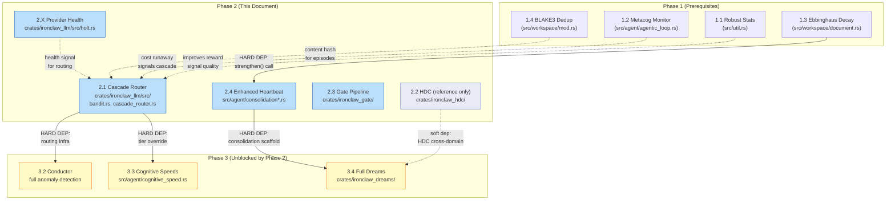
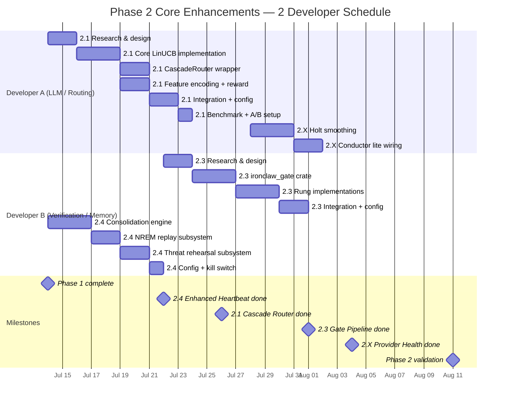

# Phase 2 Implementation Checklists: Core Enhancements

> **Scope**: Actionable per-item checklists for Phase 2 of the IronClaw concept
> integration. Each item is independently deliverable behind a feature flag. No
> Phase 2 item requires another Phase 2 item to ship — they are parallel
> workstreams.
>
> **Source of truth**: [../strategy/integration-roadmap.md](../strategy/integration-roadmap.md)
>
> **Phase 2 window (2-developer schedule)**: 2026-07-14 — 2026-08-11

---

## Table of Contents

1. [Phase 2 Dependency Diagram](#1-phase-2-dependency-diagram)
2. [Phase 2 Gantt Chart](#2-phase-2-gantt-chart)
3. [Item 2.1 — Cascade Router (LinUCB Contextual Bandit)](#3-item-21--cascade-router-linucb-contextual-bandit)
4. [Item 2.2 — (Reference Only) Hyperdimensional Computing](#4-item-22--reference-only-hyperdimensional-computing)
5. [Item 2.3 — Gate Verification Pipeline](#5-item-23--gate-verification-pipeline)
6. [Item 2.4 — Enhanced Heartbeat (Dream Consolidation Lite)](#6-item-24--enhanced-heartbeat-dream-consolidation-lite)
7. [Item 2.X — Provider Health Monitoring (Holt Smoothing Circuit Breakers)](#7-item-2x--provider-health-monitoring-holt-smoothing-circuit-breakers)
8. [Cross-Item Integration Checklist](#8-cross-item-integration-checklist)
9. [Rollback Reference](#9-rollback-reference)

---

## 1. Phase 2 Dependency Diagram

The diagram below shows what feeds into each Phase 2 item and what each Phase 2
item unblocks. Hard dependencies (items that must be complete before work can
start) are solid arrows. Soft dependencies (items that enrich but are not
required) are dashed arrows.

---

## 2. Phase 2 Gantt Chart

---

## 3. Item 2.1 — Cascade Router (LinUCB Contextual Bandit)

**Goal**: Replace static routing in `SmartRoutingProvider` with a 3-stage
cascade that learns from experience: (1) static rules for known-safe patterns,
(2) confidence guard for out-of-distribution contexts, (3) LinUCB bandit for
everything else.

**Concept doc**: [`../agent-intelligence/online-learning.md`](../agent-intelligence/online-learning.md)

**Risk**: HIGH. **Value**: VERY HIGH. Hypothesis: at least 20% median
cost/request reduction for eligible low-risk request classes after warmup, with
quality no worse than -2pp.

**Feature flag**: `experimental.cascade_router` (default `off`), with
`mode = "shadow"` for scoring without routing changes.

**Primary files to create**:

| File | Purpose |
|------|---------|
| `crates/ironclaw_llm/src/bandit.rs` | `LinUCBArm`, `LinUCBBandit`, `UcbBandit` |
| `crates/ironclaw_llm/src/cascade_router.rs` | `CascadeRouter` implementing `LlmProvider` trait |
| `crates/ironclaw_llm/src/routing_features.rs` | 8-dimensional context feature vector |
| `crates/ironclaw_llm/src/routing_episode.rs` | `RoutingEpisode`, reward computation |
| `crates/ironclaw_llm/src/holt.rs` | Holt double-EMA for trend forecasting (shared with 2.X) |

**Primary files to modify**:

| File | Change |
|------|--------|
| `crates/ironclaw_llm/src/smart_routing.rs` | Wrap with `CascadeRouter` when flag enabled; expose complexity score to feature encoder |
| `crates/ironclaw_llm/src/lib.rs` | Re-export `CascadeRouter`, gate behind feature flag |
| `src/config/llm.rs` | Add `LlmCascadeConfig` with `enabled`, `alpha`, `warmup_requests`, `shadow_mode` |
| `src/app.rs` | Wire `CascadeRouter` when `LlmCascadeConfig::enabled` |
| Migration (both backends) | `model_routing_episodes` table (PostgreSQL + libSQL) |

### Research & Design

- [ ] **R1** Read `crates/ironclaw_llm/src/smart_routing.rs` end-to-end; document the 13-dimension complexity scorer inputs and outputs
- [ ] **R2** Read [`../agent-intelligence/online-learning.md`](../agent-intelligence/online-learning.md) sections 4 (LinUCB math), 5 (18-D context vector), 6 (3-stage cascade), 9 (reward signal composition)
- [ ] **R3** Identify all call sites of `SmartRoutingProvider` in `src/app.rs` and `src/agent/` — list files that construct or inject it
- [ ] **R4** Verify `nalgebra` is already in `crates/ironclaw_llm/Cargo.toml`; if not, add it (used for DMatrix / DVector in LinUCB)
- [ ] **R5** Read [`rollout/03-feature-flag-inventory.md`](rollout/03-feature-flag-inventory.md) to confirm `experimental.cascade_router` flag shape

### Design Decisions to Document in PR

- [ ] **D1** Confirm feature dimension count (roadmap uses 8; online-learning doc uses 18) — choose one and record the decision; 8 is preferred for Phase 2 (extensible later)
- [ ] **D2** Decide persistence strategy for arm state: DB-backed `model_routing_episodes` table (preferred) vs JSON state file (local-dev fallback only)
- [ ] **D3** Define "task succeeded" signal source — maps to `SuccessEvaluator` output or user explicit approval; document the binding
- [ ] **D4** Confirm frontier-tier safety bypass: any request matching `safety`/`auth`/`crypto` path patterns goes directly to frontier, never through bandit

### Implement Core LinUCB

- [ ] **C1** Implement `LinUCBArm` in `crates/ironclaw_llm/src/bandit.rs`: `a: DMatrix<f64>`, `b: DVector<f64>`, `selection_count: u64`, `ucb_score()`, `update()`
- [ ] **C2** Implement `LinUCBBandit`: `select()` skips circuit-broken models via `excluded_models: &[&str]`, `update()` with arm index
- [ ] **C3** Use LU decomposition for numerically stable `A^{-1}` in UCB score; log `debug!` on singular matrix and fall back to identity — never panic
- [ ] **C4** Implement `RoutingFeatures::encode()` producing normalized `DVector<f64>` with 8 dimensions as specified in roadmap (complexity, message_count, tool_count, has_images, avg_message_length, hour_sin, hour_cos, recent_error_rate)
- [ ] **C5** Implement `RoutingEpisode::reward()` with composite formula: `0.5 × success + 0.3 × cost_savings + 0.2 × latency_factor`
- [ ] **C6** Implement serialization of arm state (`serde::Serialize/Deserialize`) so bandit can be persisted to and loaded from the `model_routing_episodes` DB table

### Implement 3-Stage CascadeRouter

- [ ] **C7** Implement `CascadeRouter` struct wrapping `SmartRoutingProvider` + `LinUCBBandit`; implement `LlmProvider` trait
- [ ] **C8** Stage 1 (static rules): preserve all existing `SmartRoutingProvider` decisions; cascade router delegates to it as first stage
- [ ] **C9** Stage 2 (confidence guard): if context vector is out-of-distribution (norm > 2 sigma from training mean), fall back to static routing
- [ ] **C10** Stage 3 (bandit): after `warmup_requests` episodes, use `LinUCBBandit::select()` for requests that passed confidence guard
- [ ] **C11** Shadow mode: when `shadow_mode = true`, log bandit selection via `debug!` but use static routing decision; never change provider selection in shadow mode

### Configuration

- [ ] **CF1** Add `LlmCascadeConfig` to `src/config/llm.rs` with `enabled`,
`mode`, `alpha`, and `warmup_requests`. Env/bootstrap names may map into this
struct, but the canonical rollout key is `experimental.cascade_router`.
- [ ] **CF2** Default `enabled = false` so `SmartRoutingProvider` behavior is completely unchanged without the env var
- [ ] **CF3** Add `cascade_router` entry to `.env.example` with documentation comment
- [ ] **CF4** Emit `FeatureExposureEvent` at the start of every request when `enabled = true` (required by feature flag inventory)

### Database Migration (Both Backends)

- [ ] **DB1** Write PostgreSQL migration: `model_routing_episodes` table with columns `(id, user_id, session_id, created_at, model_selected, feature_vector JSONB, reward REAL, task_succeeded BOOL, cost_cents INT, latency_ms BIGINT)`
- [ ] **DB2** Add the libSQL equivalent in `src/db/libsql_migrations.rs` with the
same semantic table and indexes
- [ ] **DB3** Verify both migrations run in `cargo test --features integration` without errors
- [ ] **DB4** Confirm table is append-only (no deletes, no updates); old episodes are never removed

### Tests

- [ ] **T1** Unit test `LinUCBBandit`: after 100 training samples where arm A always rewards 1.0 and arm B 0.5, arm A selected with > 90% probability
- [ ] **T2** Unit test `RoutingFeatures::encode()`: output is 8-dimensional, all values in `[0.0, 1.0]`
- [ ] **T3** Unit test `RoutingEpisode::reward()`: success=true, cost=0.5×baseline, latency=0.5×baseline → reward ≈ 0.85
- [ ] **T4** Unit test shadow mode: `CascadeRouter` in shadow mode always returns the same provider as `SmartRoutingProvider` (no bandit influence)
- [ ] **T5** Integration test with `StubLlm` (50 requests): bandit converges toward higher-reward model; selection share of good model > 70% by request 50
- [ ] **T6** Integration test: safety-critical path (file containing "auth" in path) always routed to frontier tier regardless of bandit state
- [ ] **T7** Regression test: `experimental.cascade_router.enabled=false` →
`CascadeRouter` is not instantiated; `SmartRoutingProvider` path is unchanged
end-to-end

### Benchmark Setup

- [ ] **B1** Enable shadow mode for 1 week before live routing; collect `model_routing_episodes` from DB to establish baseline cost distribution per request class
- [ ] **B2** Record baseline metrics: cost per request by model tier, quality pass rate (task success from `SuccessEvaluator`), model selection distribution
- [ ] **B3** Define A/B split criteria: users on the same instance A/B-tested by session parity (even session_id = control, odd = treatment)
- [ ] **B4** Target metrics: median cost/request down at least 20% on eligible
fixture classes; quality pass rate floor at baseline minus 2pp; cheap model
selection for greetings > 80% after warmup
- [ ] **B5** Shadow mode overhead target: < 2ms per request (measure with `criterion` bench)

### Feature Flag + A/B Test Infrastructure

- [ ] **F1** Verify kill switch: `experimental.cascade_router.enabled=false`
immediately routes all requests through `SmartRoutingProvider`; no state corruption
- [ ] **F2** Verify bandit state survives process restart (loaded from DB on startup)
- [ ] **F3** Add `cascade_router_enabled` field to any request-level telemetry struct (for A/B segmentation in analysis)

### Documentation

- [ ] **DOC1** Add `## Cascade Router` section to `crates/ironclaw_llm/CLAUDE.md` describing: what it does, the 3 stages, how to interpret `model_routing_episodes`, when to reset arm state
- [ ] **DOC2** Update `CLAUDE.md` project instructions or config docs with
`experimental.cascade_router` fields and any env/bootstrap aliases.

### Rollback Plan

- [ ] **ROLL1** Set `experimental.cascade_router.enabled=false`; `SmartRoutingProvider`
is the only active provider
- [ ] **ROLL2** The `model_routing_episodes` table stays populated but inert; no cleanup required
- [ ] **ROLL3** Revert `src/app.rs` wiring if flag-based switch is insufficient
- [ ] **ROLL4** Document single revert commit SHA in PR description

**Estimated effort**: 8–12 developer-days.
**Concept doc**: [`../agent-intelligence/online-learning.md`](../agent-intelligence/online-learning.md)

---

## 4. Item 2.2 — (Reference Only) Hyperdimensional Computing

> **Note**: Item 2.2 (HDC) is included in the roadmap as a Phase 2 item but is
> NOT one of the four items listed in the user's Phase 2 scope. It is tracked
> here for dependency reference only. Full implementation details are in the
> roadmap section 7.2 and concept doc
> [`../core-concepts/hyperdimensional-computing/README.md`](../core-concepts/hyperdimensional-computing/README.md).
>
> HDC is a soft dependency for Phase 3.4 (Full Dream Consolidation). It can be
> developed in parallel with other Phase 2 items if capacity allows. Crate:
> `crates/ironclaw_hdc/`. Feature flag: `experimental.hdc_memory_search`.

---

## 5. Item 2.3 — Gate Verification Pipeline

**Goal**: Introduce a new crate `crates/ironclaw_gate/` implementing a
progressive 4-rung verification pipeline (Compile → Lint → Tests → Symbol
resolution) for code generated by the agent or tool builder. Each rung is
selected based on the complexity of the changed files. Rungs 5–7 (LLM-generated
tests, property tests, integration) are deferred to Phase 4.

**Concept doc**: [`../execution-verification/gate-verification.md`](../execution-verification/gate-verification.md)

**Risk**: MEDIUM. **Value**: HIGH. Hypothesis: seeded defect catch rate improves
by at least 20% while false blocks stay under 5%.

**Feature flag**: `experimental.progressive_gates = off` (DB-backed runtime config)

**Primary files to create**:

| File | Purpose |
|------|---------|
| `crates/ironclaw_gate/Cargo.toml` | New crate manifest |
| `crates/ironclaw_gate/src/lib.rs` | Public API: `GatePipeline`, re-exports |
| `crates/ironclaw_gate/src/rung.rs` | `Rung` trait, `RungCost`, `RungResult`, `Diagnostic`, `GateContext`, `Language` |
| `crates/ironclaw_gate/src/pipeline.rs` | `GatePipeline`: sequential execution, abort on failure, complexity-driven rung selection |
| `crates/ironclaw_gate/src/complexity.rs` | `ComplexityAssessor`, `Complexity` enum |
| `crates/ironclaw_gate/src/rungs/compile.rs` | `CompileRung`: `cargo check --message-format=json` |
| `crates/ironclaw_gate/src/rungs/lint.rs` | `LintRung`: `cargo clippy --message-format=json` |
| `crates/ironclaw_gate/src/rungs/test.rs` | `TestRung`: `cargo test -- --format json` |
| `crates/ironclaw_gate/src/rungs/symbol.rs` | `SymbolRung`: parse compiler diagnostics for unresolved symbols |

**Primary files to modify**:

| File | Change |
|------|--------|
| `src/tools/builder/validation.rs` | Call `GatePipeline::run()` after WASM tool build, when `progressive_gates` flag is on |
| `src/agent/agentic_loop.rs` | Optionally invoke gate pipeline after code-writing tool calls (see design decision D2 below) |
| `Cargo.toml` (workspace) | Add `crates/ironclaw_gate` to workspace members |

### Research & Design

- [ ] **R1** Read `src/tools/builder/validation.rs` end-to-end — understand existing WASM validation flow and where `GatePipeline::run()` should be called
- [ ] **R2** Read [`../execution-verification/gate-verification.md`](../execution-verification/gate-verification.md) sections 5 (architecture), 6 (Verify trait), 7 (7-rung pipeline), 9 (complexity-driven rung selection), 22 (verdict flow)
- [ ] **R3** Identify what `GateContext::language` detection heuristic to use for Phase 2 (Rust-only; TypeScript and Python can be stubs returning `Language::Unknown` with no-op rung)
- [ ] **R4** Read `src/sandbox/` to understand whether gate rungs should run inside the Docker sandbox or on the host — document the decision
- [ ] **R5** Read [`rollout/04-feature-threat-models.md`](rollout/04-feature-threat-models.md) to understand security threat model for shell command invocation

### Design Decisions to Document in PR

- [ ] **D1** Confirm Phase 2 scope: only Rust; TypeScript and Python rungs are stubs that return `RungResult { passed: true, diagnostics: vec![], .. }` and log `debug!("language not supported in Phase 2")`
- [ ] **D2** Decide invocation surface: `GatePipeline` is called from `validation.rs` (tool builder path) in Phase 2; agent loop integration is Phase 3
- [ ] **D3** Define `stdout_preview` and `stderr_preview` truncation limit: 2048 characters per roadmap spec
- [ ] **D4** Define secret redaction strategy for diagnostic output: scan for `SECRET_PATTERN` (env var names matching `*_TOKEN`, `*_KEY`, `*_SECRET`) before including in `Diagnostic::message`

### Implement Core Crate

- [ ] **C1** Create `crates/ironclaw_gate/Cargo.toml` with dependencies: `async-trait`, `tokio` (process feature), `thiserror`, `serde`, `tracing`
- [ ] **C2** Implement `Rung` trait: `fn name() -> &str`, `fn cost_estimate() -> RungCost`, `async fn run(context: &GateContext) -> RungResult`
- [ ] **C3** Implement `RungCost` enum: `Cheap` (< 5s), `Medium` (5–30s), `Expensive` (30s–5min)
- [ ] **C4** Implement `RungResult`: `passed: bool`, `diagnostics: Vec<Diagnostic>`, `duration: Duration`, `stdout_preview: String` (truncated), `stderr_preview: String` (truncated)
- [ ] **C5** Implement `Diagnostic` with `file`, `line`, `column`, `severity`, `message`, `code` fields
- [ ] **C6** Implement `GateContext`: `working_dir: PathBuf`, `changed_files: Vec<PathBuf>`, `language: Language`, `rung_timeout: Duration`

### Implement Complexity Assessor

- [ ] **C7** Implement `ComplexityAssessor::assess(changed_files, lines_changed) -> Complexity` with four levels: `Trivial` (< 5 lines, 1 file) → compile+lint; `Simple` (< 50 lines) → compile+lint+symbol; `Standard` (50+ lines or 3+ files) → all 4 rungs; `Complex` (public API or security-sensitive path) → all 4 rungs with mandatory test pass
- [ ] **C8** Security-sensitive path heuristic: file path contains `auth`, `secret`, `safety`, `sandbox`, or `crypto` → `Complex`
- [ ] **C9** Public API heuristic: file name is `lib.rs`, `api.rs`, or `mod.rs` → `Complex`

### Implement Rungs

- [ ] **C10** `CompileRung`: invoke `cargo check --message-format=json` via `tokio::process::Command::new("cargo")` with explicit args array — never string interpolation; parse JSON output for error diagnostics; truncate stdout/stderr to 2048 chars
- [ ] **C11** `LintRung`: invoke `cargo clippy --message-format=json -- -D warnings`; parse JSON for warning diagnostics; truncate output
- [ ] **C12** `TestRung`: invoke `cargo test -- --format json`; parse output for test failures; truncate output
- [ ] **C13** `SymbolRung`: re-parse compile output from `CompileRung` looking specifically for `E0432` (unresolved import) and `E0433` (failed to resolve) error codes; return structured `Diagnostic` list
- [ ] **C14** All rungs enforce `rung_timeout` via `tokio::time::timeout()`; on timeout, return `RungResult { passed: false, diagnostics: vec![Diagnostic { message: "rung timed out", .. }], .. }`

### Security Requirements

- [ ] **SEC1** ALL subprocess invocations MUST use `tokio::process::Command::new(name).args([...])` with a fixed executable and argv list — never route through a shell command string or any form of string interpolation
- [ ] **SEC2** File paths from user input (changed_files, working_dir) must be validated: must be under `~/.ironclaw/` or project root; reject paths with `..` components
- [ ] **SEC3** Diagnostic output must be scanned for secrets before being returned: redact any string matching `[A-Z_]*(TOKEN|KEY|SECRET|PASSWORD)[A-Z_]*=\S+`
- [ ] **SEC4** `stdout_preview` and `stderr_preview` are always truncated to 2048 chars before leaving the crate

### Integration with Tool Builder

- [ ] **INT1** In `src/tools/builder/validation.rs`, after existing WASM validation, add: `if config.progressive_gates_enabled { let result = GatePipeline::new(context).run().await?; if !result.passed { return Err(ValidationError::GateFailed(result.summary())); } }`
- [ ] **INT2** Pass `GateContext { working_dir: project_dir, changed_files: built_files, language: Language::Rust, rung_timeout: Duration::from_secs(120) }` from validation context
- [ ] **INT3** Wire `experimental.progressive_gates` feature flag check in `validation.rs` before invoking gate pipeline

### Tests

- [ ] **T1** Integration test (`cargo test --features integration`): create a temp Rust project with a compile error (`let x: u32 = "bad"`); run `GatePipeline::run()`; assert `result.passed == false` and `result.diagnostics[0].severity == DiagnosticSeverity::Error`
- [ ] **T2** Integration test: clean Rust project (no errors); run pipeline; assert `result.passed == true`
- [ ] **T3** Integration test: Rust project with a failing unit test; assert `TestRung` returns `passed = false`
- [ ] **T4** Unit test `ComplexityAssessor::assess`: 1 file, 3 lines → `Trivial`; file named `lib.rs`, any size → `Complex`; file path contains `auth/` → `Complex`; 4 files, 60 lines → `Standard`
- [ ] **T5** Unit test secret redaction: `stdout_preview` containing `OPENAI_API_KEY=sk-abc123` is redacted to `OPENAI_API_KEY=<REDACTED>`
- [ ] **T6** Unit test output truncation: output of 10,000 chars → `stdout_preview` is exactly 2048 chars
- [ ] **T7** Regression test: `experimental.progressive_gates = false` (default) → `validation.rs` does not call `GatePipeline`; existing WASM validation path is unchanged

### Benchmark Targets

- [ ] **B1** Rung 0+1 (compile + lint) combined latency < 30s on a 200-line single-file Rust project (measure via integration test with `Instant`)
- [ ] **B2** Record baseline defect detection rate: count compile errors in agent-generated code over 1 week with gate disabled; compare vs gate enabled
- [ ] **B3** False block rate target: unchanged, correct Rust code should always pass all 4 rungs; measure by running gate against `src/` itself

### Feature Flag + Rollback

- [ ] **F1** Kill switch: `experimental.progressive_gates = false` (or env var unset) → `GatePipeline` is never constructed; `validation.rs` follows legacy path unchanged
- [ ] **F2** Verify gate errors are always non-fatal to the user interaction: gate failure logs `debug!` and returns structured error to agent for retry; never panics or kills the process
- [ ] **F3** Add `progressive_gates_enabled` to any per-request audit record for observability

### Documentation

- [ ] **DOC1** Write `crates/ironclaw_gate/README.md` (brief): what the crate does, the 4 rungs, how to add a new rung, language support status
- [ ] **DOC2** Update `CLAUDE.md` project instructions — note `crates/ironclaw_gate/` in the project structure table and the `experimental.progressive_gates` flag

### Rollback Plan

- [ ] **ROLL1** Set `experimental.progressive_gates = false`; gate is never called; tool builder validation reverts to existing behavior
- [ ] **ROLL2** The crate can remain compiled-in without any behavioral effect; no file removal needed for rollback
- [ ] **ROLL3** Document single-line config rollback in PR description

**Estimated effort**: 6–10 developer-days.
**Concept doc**: [`../execution-verification/gate-verification.md`](../execution-verification/gate-verification.md)

---

## 6. Item 2.4 — Enhanced Heartbeat (Dream Consolidation Lite)

**Goal**: Extend `src/agent/heartbeat.rs` with two dream consolidation
subsystems: (a) **NREM replay** — uses Mattar-Daw utility scoring to
strengthen high-priority workspace memories without any LLM calls; (b) **threat
rehearsal** — analyzes recent failed jobs and writes defensive strategies to
the workspace using at most 3 cheap LLM calls per cycle.

**Prerequisite**: Item 1.3 (Ebbinghaus Decay) must be merged before this item
starts. The `DecayVariant::strengthen()` method is called by the NREM replay
subsystem.

**Concept doc**: [`../agent-intelligence/dream-consolidation.md`](../agent-intelligence/dream-consolidation.md)

**Risk**: LOW-MEDIUM. **Value**: HIGH. Hypothesis: background spend stays under
the configured cycle cap and useful-memory hit rate improves by at least 5pp on
the repeated-failure fixture.

**Feature flag**: `experimental.dream_consolidation` (default `off`)

**Primary files to create**:

| File | Purpose |
|------|---------|
| `src/agent/consolidation.rs` | `ConsolidationEngine` — top-level orchestrator; checks active sessions, enforces budget cap, calls NREM and rehearsal subsystems |
| `src/agent/consolidation_replay.rs` | NREM replay: `mattar_daw_utility()`, `ReplaySelector`, `run_nrem_replay()` |
| `src/agent/consolidation_rehearsal.rs` | Threat rehearsal: `ThreatRehearsalEngine`, prompt loading, defensive memory write |

**Prompt template files to create** (per project rule: multi-line prompts in files, not Rust strings):

| File | Purpose |
|------|---------|
| `crates/ironclaw_engine/prompts/consolidation_threat_analysis.md` | LLM prompt for analyzing recent failures and generating threats |
| `crates/ironclaw_engine/prompts/consolidation_defense_synthesis.md` | LLM prompt for generating defensive strategies from threat list |

**Primary files to modify**:

| File | Change |
|------|--------|
| `src/agent/heartbeat.rs` | Add `ConsolidationEngine::run()` call inside idle heartbeat cycle when `experimental.dream_consolidation.enabled=true` |
| `src/config/heartbeat.rs` (or `src/config/mod.rs`) | Add `ConsolidationConfig` with `from_env()` |

### Research & Design

- [ ] **R1** Read `src/agent/heartbeat.rs` end-to-end — understand the idle detection logic, how `HEARTBEAT.md` is read, and the notification dispatch mechanism
- [ ] **R2** Read [`../agent-intelligence/dream-consolidation.md`](../agent-intelligence/dream-consolidation.md) sections 5 (NREM replay + Mattar-Daw utility), 8 (threat rehearsal), 12 (IronClaw integration architecture)
- [ ] **R3** Read `src/workspace/mod.rs` — understand `write()` signature and `search()` pagination for fetching candidate memories for NREM replay
- [ ] **R4** Read `src/workspace/document.rs` — confirm `DecayVariant::strengthen()` is available (Phase 1.3 must be merged)
- [ ] **R5** Identify where `ActionRecord` (failed jobs) is stored — confirm the DB query needed to fetch recent failures for threat rehearsal input

### Design Decisions to Document in PR

- [ ] **D1** Confirm hard budget cap enforcement: 3 LLM calls maximum per consolidation cycle is enforced in code (counter, not advisory); cycle aborts after 3rd call
- [ ] **D2** Confirm consolidation never runs during active agent sessions: check mechanism (in-flight session tracker or DB query for active jobs before starting)
- [ ] **D3** Confirm defensive memory write path: `memory_write` tool via `ToolDispatcher::dispatch()` — never direct `workspace.write()` — so audit trail is preserved
- [ ] **D4** Confirm output path: `daily/consolidation/YYYY-MM-DD.md` as the workspace path for defensive memories written by threat rehearsal

### Implement ConsolidationEngine

- [ ] **C1** Implement `ConsolidationEngine::new(workspace, llm, config)` with shared-state access via `Arc<T>`
- [ ] **C2** Implement `ConsolidationEngine::run()`: (1) check no active sessions; (2) run NREM replay (no LLM calls); (3) check `max_rehearsal_calls` budget; (4) run threat rehearsal up to budget; (5) log `debug!` with cycle summary
- [ ] **C3** Enforce active-session guard: query DB or in-memory session tracker; if any session is `InProgress`, skip this cycle entirely and log `debug!("consolidation skipped: active session")`
- [ ] **C4** All logging in `ConsolidationEngine` and sub-modules uses `debug!` or `trace!` — NEVER `info!` or `warn!` (would corrupt REPL display)

### Implement NREM Replay

- [ ] **C5** Implement `mattar_daw_utility(last_accessed_secs_ago, current_strength, access_count, max_access_count) -> f64` using the formula: `need × gain × probability` where `need = 1 / (1 + hours_since_access)`, `gain = 1 - current_strength`, `probability = access_count / max_access_count`
- [ ] **C6** Implement `ReplaySelector::select(entries: &[MemoryDocument], limit: usize) -> Vec<MemoryDocument>`: fetch all non-archived workspace entries, compute utility for each, return top `limit` by utility
- [ ] **C7** Implement `run_nrem_replay(workspace, config)`: select top `max_replay_entries` (default: 20) by Mattar-Daw utility, call `entry.metadata["decay"].strengthen(now)` on each, persist updated metadata via `workspace.update_metadata()`
- [ ] **C8** NREM replay must complete in < 2 seconds for 20 entries (no LLM calls; pure in-memory computation + one batch DB write)

### Implement Threat Rehearsal

- [ ] **C9** Implement `ThreatRehearsalEngine::run(llm, workspace, dispatcher, config)` with LLM call counter that aborts after `max_rehearsal_calls` (default: 3)
- [ ] **C10** Load recent failed jobs: query `ActionRecord` table for status `Failed` within the last 7 days, limit 10; extract error messages
- [ ] **C11** LLM Call 1 (threat analysis): send `consolidation_threat_analysis.md` prompt (loaded via `include_str!()`) with failed job summaries; receive list of threat categories
- [ ] **C12** LLM Call 2 (defense synthesis): send `consolidation_defense_synthesis.md` prompt with threat list; receive defensive strategies
- [ ] **C13** LLM Call 3 (optional validation): if budget remains, validate generated strategies against known constraints (e.g., "do not suggest deleting files")
- [ ] **C14** Write defensive memories to workspace path `daily/consolidation/YYYY-MM-DD.md` via `ToolDispatcher::dispatch("memory_write", ...)` — never direct workspace write

### Configuration

- [ ] **CF1** Add `ConsolidationConfig` struct with: `enabled: bool`, `interval_hours: u32` (default: 2), `max_replay_entries: usize` (default: 20), `max_rehearsal_calls: usize` (default: 3), `rem_enabled: bool` (false — Phase 3.4), `creativity_enabled: bool` (false — Phase 3.4)
- [ ] **CF2** Implement `ConsolidationConfig` through the existing heartbeat/config
path. Env/bootstrap aliases may map into it, but the canonical rollout key is
`experimental.dream_consolidation`.
- [ ] **CF3** Document the flag and interval setting in `.env.example` or config docs
without making env vars the only control plane.
- [ ] **CF4** Wire `ConsolidationEngine::run()` into `heartbeat.rs` behind `config.enabled` check

### Tests

- [ ] **T1** Unit test `mattar_daw_utility()`: high-utility case (accessed 1h ago, current_strength=0.3, frequent) → utility > 0.4; low-utility case (accessed 72h ago, current_strength=0.95, infrequent) → utility < 0.05
- [ ] **T2** Unit test `ReplaySelector::select()`: given 5 entries with known utility values, returns top `limit` in correct order
- [ ] **T3** Integration test NREM replay (uses `StubWorkspace`): 20 entries with varied decay states; after `run_nrem_replay()`, assert top-utility entries have increased `stability_seconds`; assert archived entries are not modified
- [ ] **T4** Integration test threat rehearsal (uses `StubLlm`): provide 3 failed job records; assert `StubLlm` receives exactly 2 calls (threat analysis + defense synthesis); assert defensive memory is written to correct workspace path
- [ ] **T5** Integration test budget cap: configure `max_rehearsal_calls = 1`; assert only 1 LLM call is made even when more failures are available
- [ ] **T6** Integration test active-session guard: set an active session in DB; call `ConsolidationEngine::run()`; assert 0 LLM calls and 0 workspace writes
- [ ] **T7** Regression test: `experimental.dream_consolidation.enabled=false` →
`ConsolidationEngine` is never instantiated; heartbeat behavior is identical to
pre-Phase-2.4

### Benchmark Targets

- [ ] **B1** Background cost per consolidation cycle: measure actual LLM cost in integration test with real provider; target < $0.05
- [ ] **B2** NREM replay latency for 20 entries (no LLM): measure with `Instant`; target < 2 seconds
- [ ] **B3** After 30 days of consolidated operation: manually sample 20 promoted defensive memories; target 80% precision (manually judged as useful by developer)

### Feature Flag + Rollback

- [ ] **F1** Kill switch: `experimental.dream_consolidation.enabled=false` →
heartbeat runs exactly as it did before Phase 2.4; no consolidation, no LLM
calls, no workspace writes
- [ ] **F2** Phase 3.4 readiness: `rem_enabled` and `creativity_enabled` flags are wired to `false` in `ConsolidationConfig` but the field must exist so Phase 3.4 can activate them without structural changes
- [ ] **F3** Verify consolidation cycles do not stack: if a previous cycle is still running when the interval fires, the new cycle is skipped

### Documentation

- [ ] **DOC1** Update `src/agent/CLAUDE.md` with a `## Dream Consolidation` section: what NREM replay does, what threat rehearsal does, how to read `daily/consolidation/` memories, how to interpret debug logs
- [ ] **DOC2** Update `src/agent/CLAUDE.md` or config docs with the canonical flag
and interval setting.

### Rollback Plan

- [ ] **ROLL1** Set `experimental.dream_consolidation.enabled=false`; heartbeat
reverts to pre-Phase-2.4 behavior immediately
- [ ] **ROLL2** Defensive memories written to `daily/consolidation/` are inert if consolidation is disabled; no cleanup needed
- [ ] **ROLL3** The three new source files (`consolidation.rs`, `consolidation_replay.rs`, `consolidation_rehearsal.rs`) can remain compiled-in without effect; no file removal needed for rollback

**Estimated effort**: 4–6 developer-days.
**Concept doc**: [`../agent-intelligence/dream-consolidation.md`](../agent-intelligence/dream-consolidation.md)

---

## 7. Item 2.X — Provider Health Monitoring (Holt Smoothing Circuit Breakers)

> **Note**: This item is labeled "2.X" because the user's request names it as
> "Provider Health Monitoring (Holt smoothing circuit breakers)" — it maps to
> Phase 3.2 (Conductor Anomaly Detection) in the roadmap but the Holt smoothing
> core belongs in Phase 2 as a foundation for the full Conductor. This checklist
> covers the Phase 2 deliverable: Holt EMA for trend-adjusted latency and error
> rate forecasting, wired into `CircuitBreakerProvider` as a predictive pre-trip
> signal. The full 10-watcher Conductor is Phase 3.2.

**Goal**: Add `HoltForecast` to `crates/ironclaw_llm/src/` to give the existing
`CircuitBreakerProvider` trend-aware predictive tripping. The conductor detects
degradation 1–2 requests before the reactive breaker would trip, eliminating
wasted spend on requests that are almost certainly going to fail.

**Concept doc**: [`../execution-verification/conductor-anomaly.md`](../execution-verification/conductor-anomaly.md)

**Risk**: LOW-MEDIUM. **Value**: HIGH. Hypothesis: warn at least 1 request
before the reactive circuit breaker on a simulated degradation fixture, with
false positives under 5% per provider-hour in shadow data.

**Feature flag**: `experimental.provider_conductor` (default `off`), with
`mode = "observe"` as the first explicit rollout stage and `mode = "active"`
only after shadow review.

**Primary files to create**:

| File | Purpose |
|------|---------|
| `crates/ironclaw_llm/src/holt.rs` | `HoltForecast` struct: level, trend, `update()`, `forecast(h)` |
| `crates/ironclaw_llm/src/conductor_lite.rs` | `ProviderHealthMonitor`: watches latency + error rate; emits `HealthSignal` |

**Primary files to modify**:

| File | Change |
|------|--------|
| `crates/ironclaw_llm/src/circuit_breaker.rs` | Add `ProviderHealthMonitor` alongside existing reactive logic; in `observe` mode, log warnings only; in `active` mode, pre-trip before reactive threshold |
| `src/config/llm.rs` | Add `ConductorConfig` with `mode: ConductorMode` (Off, Observe, Active) |

### Research & Design

- [ ] **R1** Read `crates/ironclaw_llm/src/circuit_breaker.rs` end-to-end — understand `Closed`, `Open`, `HalfOpen` state machine and the failure count threshold
- [ ] **R2** Read [`../execution-verification/conductor-anomaly.md`](../execution-verification/conductor-anomaly.md) sections 1 (motivation), 7 (circuit breaker predictive tripping), 8 (Holt smoothing math), 9 (compound pattern detection)
- [ ] **R3** Identify what latency and error rate metrics are currently tracked by `CircuitBreakerProvider`; note any gaps
- [ ] **R4** Decide observation window: how many data points before Holt forecast is trusted (recommend: 5 minimum, log `debug!("Holt: insufficient data")` below threshold)

### Design Decisions to Document in PR

- [ ] **D1** `observe` mode: `ProviderHealthMonitor` runs alongside the reactive breaker, logs `debug!("Holt forecast: degradation predicted in {} requests", h)` but takes no action; existing `CircuitBreakerProvider` behavior is unchanged
- [ ] **D2** `active` mode: when Holt forecaster predicts error rate will exceed 0.5 within 3 requests, pre-trip the circuit before the reactive threshold is reached
- [ ] **D3** `off` mode: `ProviderHealthMonitor` is not constructed; zero overhead
- [ ] **D4** Compound pattern trigger for Phase 2: detect `latency_spike AND error_rate_increase` pattern (two signals trending upward together); log `debug!("compound pattern: provider_degradation")` in observe mode; pre-trip in active mode

### Implement HoltForecast

- [ ] **C1** Implement `HoltForecast` struct: `level: f64`, `trend: f64`, `alpha: f64` (level smoothing, default 0.3), `beta: f64` (trend smoothing, default 0.1)
- [ ] **C2** Implement `HoltForecast::update(observation: f64)` using equations:
  - `L_t = alpha * y_t + (1 - alpha) * (L_{t-1} + T_{t-1})`
  - `T_t = beta * (L_t - L_{t-1}) + (1 - beta) * T_{t-1}`
- [ ] **C3** Implement `HoltForecast::forecast(h: u32) -> f64` = `L_t + h * T_t`
- [ ] **C4** Implement `HoltForecast::is_trending_up(threshold_delta: f64) -> bool` = `trend > threshold_delta`; caller uses this to detect worsening latency/error rate

### Implement ProviderHealthMonitor

- [ ] **C5** Implement `ProviderHealthMonitor` struct: holds one `HoltForecast` for latency and one for error rate (0.0 = success, 1.0 = failure); maintains observation count
- [ ] **C6** Implement `ProviderHealthMonitor::observe(latency_ms: u64, succeeded: bool)`: update both forecasters; increment observation count
- [ ] **C7** Implement `ProviderHealthMonitor::health_signal() -> HealthSignal` returning: `Healthy` (forecast error rate < 0.3), `Degrading` (forecast error rate 0.3–0.5, or latency trending up > 20% per step), `PredictedFailure` (forecast error rate > 0.5 within 3 steps)
- [ ] **C8** Implement compound pattern: if both latency and error rate are trending up simultaneously (`is_trending_up()` on both forecasters), emit `HealthSignal::Degrading` even if individual thresholds are not crossed

### Integration with CircuitBreaker

- [ ] **INT1** In `crates/ironclaw_llm/src/circuit_breaker.rs`, add `Option<ProviderHealthMonitor>` field to the circuit breaker struct (None when conductor mode is Off)
- [ ] **INT2** After each request in the circuit breaker, call `monitor.observe(latency_ms, succeeded)` if monitor is Some
- [ ] **INT3** In `observe` mode: on `HealthSignal::PredictedFailure`, log `debug!("Holt conductor: pre-trip signal")` only; do not change circuit state
- [ ] **INT4** In `active` mode: on `HealthSignal::PredictedFailure`, move circuit to `Open` state before the reactive failure threshold is reached; log `debug!("Holt conductor: pre-tripping circuit")`
- [ ] **INT5** The reactive circuit breaker logic must still function independently of the Holt monitor; adding the monitor cannot break existing reactive behavior

### Configuration

- [ ] **CF1** Add `ConductorConfig` to `src/config/llm.rs` with `mode: ConductorMode` (enum: `Off`, `Observe`, `Active`), `alpha: f64` (default 0.3), `beta: f64` (default 0.1)
- [ ] **CF2** Read config/env aliases into the canonical
`experimental.provider_conductor` flag; default is `off`
- [ ] **CF3** Add the flag and `mode` values to `.env.example` or config docs

### Tests

- [ ] **T1** Unit test `HoltForecast`: feed known time series (linear increase: 10, 12, 14, 16, 18); assert forecast for h=2 is close to 20 (within 10%); assert `is_trending_up(1.0) == true`
- [ ] **T2** Unit test `HoltForecast` stable series (10, 10, 10, 10): `is_trending_up(0.5) == false`; `forecast(3) ≈ 10`
- [ ] **T3** Unit test compound pattern: feed `ProviderHealthMonitor` with alternating latency increase + error increase; assert `health_signal() == HealthSignal::Degrading` even when neither individual forecast exceeds its threshold
- [ ] **T4** Integration test (observe mode): simulate degrading provider (increasing latency feed); assert `HealthSignal::PredictedFailure` is emitted; assert circuit state remains `Closed` (observe mode takes no action)
- [ ] **T5** Integration test (active mode): same degrading provider feed; assert circuit moves to `Open` before the reactive failure count threshold is reached
- [ ] **T6** Regression test: `experimental.provider_conductor.enabled=false` →
`ProviderHealthMonitor` is not constructed; `CircuitBreakerProvider` behavior is
identical to pre-Phase-2.X

### Benchmark Targets

- [ ] **B1** Lead time improvement: with Holt active mode, circuit should pre-trip at least 1 request earlier than the reactive breaker (measure in integration test with simulated degradation)
- [ ] **B2** False positive rate: run Holt monitor against 1 hour of stable synthetic traffic; assert 0 `PredictedFailure` signals are emitted
- [ ] **B3** Overhead per request: Holt update should take < 1 microsecond
(constant-size scalar math); assert with `criterion` bench

### Feature Flag + Rollback

- [ ] **F1** `experimental.provider_conductor.enabled=false` → zero overhead;
`ProviderHealthMonitor` not constructed; existing `CircuitBreakerProvider`
unaffected
- [ ] **F2** `mode=observe` → monitor runs but never trips circuit; only debug
logging; existing reactive behavior unchanged
- [ ] **F3** Kill switch from `observe` to `off`: set enabled false; takes effect
through the normal config reload or next startup, whichever the config facade supports

### Documentation

- [ ] **DOC1** Update `crates/ironclaw_llm/CLAUDE.md` with `## Provider Health Monitoring` section: what Holt smoothing does, how to read the debug logs, when to switch from observe to active mode, false positive mitigation
- [ ] **DOC2** Add `experimental.provider_conductor` and `mode` to config docs

### Rollback Plan

- [ ] **ROLL1** Set `experimental.provider_conductor.enabled=false`; circuit breaker
reverts to purely reactive behavior
- [ ] **ROLL2** The two new files (`holt.rs`, `conductor_lite.rs`) can remain compiled-in without effect; no removal needed for rollback
- [ ] **ROLL3** Document: if a false positive pre-trip is observed, switch to
`mode=observe` or disable the flag immediately; preserve health metrics for diagnosis

**Estimated effort**: 3–5 developer-days (Holt core) + 3–5 days (integration).
**Concept doc**: [`../execution-verification/conductor-anomaly.md`](../execution-verification/conductor-anomaly.md)

---

## 8. Cross-Item Integration Checklist

These items span multiple Phase 2 deliverables and must be verified after all
four items are merged.

- [ ] **XI-1** Cascade Router (2.1) consumes `HealthSignal` from Provider Health Monitor (2.X): when monitor emits `PredictedFailure` for a model, that model is added to the `excluded_models` list passed to `LinUCBBandit::select()`
- [ ] **XI-2** Enhanced Heartbeat (2.4) respects Cascade Router state: consolidation LLM calls go through the `CascadeRouter` when enabled, so they benefit from bandit routing (and count as routing episodes)
- [ ] **XI-3** Gate Pipeline (2.3) results feed into Cascade Router reward signal: if generated code consistently fails gate for a particular model selection, reward for that episode is reduced
- [ ] **XI-4** All four items' feature flags are independently toggleable: verify no combination of enabled/disabled flags produces a panic or broken state (4 items × 2 states = 16 combinations to smoke-test)
- [ ] **XI-5** No `info!` log messages added by any Phase 2 item (would corrupt REPL display); grep the diff for `info!(` and `warn!(` before merging each PR
- [ ] **XI-6** All `ActionRecord` writes from Phase 2 code go through `ToolDispatcher::dispatch()` (audited by pre-commit hook `scripts/pre-commit-safety.sh`)
- [ ] **XI-7** Both database backends (PostgreSQL + libSQL) support all new tables added by Phase 2: `model_routing_episodes` (2.1); no new tables for 2.3, 2.4, 2.X (metadata-only or no DB changes)
- [ ] **XI-8** `cargo clippy --all --benches --tests --examples --all-features` passes with zero warnings after all Phase 2 items are merged
- [ ] **XI-9** `cargo test` (unit) and `cargo test --features integration` (integration) pass after all Phase 2 items are merged
- [ ] **XI-10** Phase 2 validation milestone gate (2026-08-11): all four items have their feature flags enabled in staging; baseline metrics collected for Phase 3 planning

---

## 9. Rollback Reference

Quick reference for rolling back any Phase 2 item in production.

| Item | Kill Switch | Immediate Effect | Data Preserved? |
|------|------------|-----------------|-----------------|
| 2.1 Cascade Router | `experimental.cascade_router.enabled=false` | `SmartRoutingProvider` only | Yes — `model_routing_episodes` table inert |
| 2.3 Gate Pipeline | `experimental.progressive_gates=false` | Legacy `validation.rs` path | Yes — no DB changes |
| 2.4 Enhanced Heartbeat | `experimental.dream_consolidation.enabled=false` | Heartbeat as pre-Phase-2.4 | Yes — `daily/consolidation/` entries inert |
| 2.X Provider Health | `experimental.provider_conductor.enabled=false` | Reactive-only circuit breaker | Yes — no DB changes |

**Full Phase 2 rollback** (all items simultaneously):
1. Set all four kill switches in `.env` or service config
2. Restart the process
3. Confirm with `RUST_LOG=ironclaw=debug cargo run` that no Phase 2 debug log lines appear in startup output
4. All Phase 2 DB tables remain populated but inert — no cleanup required

---

*Document generated 2026-07-03. Relative links assume this file stays under*
*`tmp/implementation/`.*
