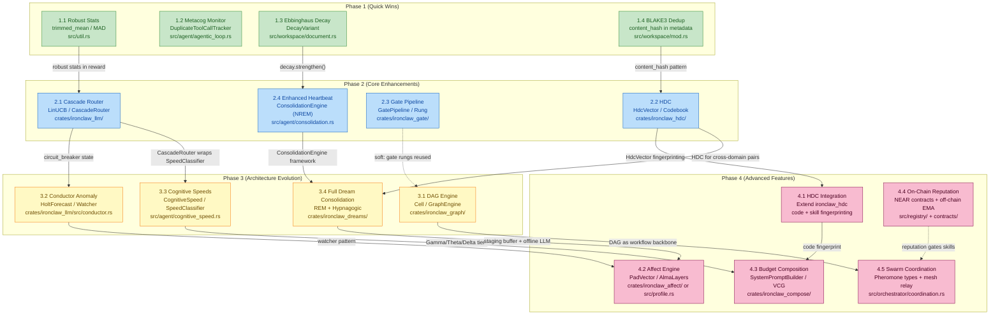

# Phase 3 & 4 Implementation Checklists

> **Scope**: Actionable implementation checklists for Phase 3 (Architecture
> Evolution) and Phase 4 (Advanced Features) of the IronClaw × Roko
> integration roadmap. Each item includes file targets, phase dependencies,
> success criteria, and risk notes.
>
> **Source**: Derived from
> [../strategy/integration-roadmap.md](../strategy/integration-roadmap.md)
> (the authoritative expanded roadmap). Concept-level details in the
> companion docs linked per item.
>
> **Date**: 2026-07-03

---

## How to Use This Checklist

- Every item in Phases 3-4 has one or more hard dependencies on earlier
  phases. Do not start an item before its dependencies are merged.
- Each checkbox is a concrete, verifiable task. "Add file X" means create it.
  "Extend Y" means edit the named function/struct, not create a parallel one.
- **Consolidate, don't proliferate**: before adding a new test file, confirm
  an existing test file cannot absorb the case.
- Feature flags: all new capabilities default to `off`. The flag table in
  section §13 of the roadmap is authoritative.
- For any item touching `ToolDispatcher`, `workspace`, or `session_manager`
  from a non-tool call site, annotate with `// dispatch-exempt: <reason>`.

---

## Dependency Diagram — How Phases 3-4 Build on Phases 1-2

**Critical paths into Phase 3-4:**

| Phase 3 item | Blocking predecessors | Effort |
|---|---|---|
| 3.1 DAG Engine | None (soft: 2.3 for gate cell) | 12-18 days |
| 3.2 Conductor | 2.1 (CascadeRouter live to feed signal stream) | 10-14 days |
| 3.3 Cognitive Speeds | 2.1 (cascade router must exist to consume tier hint) | 3-5 days |
| 3.4 Full Dream Consolidation | 2.4 (framework) + 2.2 (HDC for hypnagogic) | 10-14 days |

| Phase 4 item | Blocking predecessors | Effort |
|---|---|---|
| 4.1 HDC Integration | 2.2 (crate exists) | 5-8 days |
| 4.2 Affect Engine | 3.4 (staging buffer) | 6-10 days engagement; +15-20 full |
| 4.3 Budget Composition | 3.3 (Gamma/Theta/Delta tier signals) | 8-12 days cache; +15-25 VCG |
| 4.4 On-Chain Reputation | None for off-chain. NEAR SDK for on-chain. | 15-25 days off-chain; +20-30 on-chain |
| 4.5 Swarm Coordination | 3.1 (DAG backbone) | 8-12 days |

---

## Phase 3: Architecture Evolution

### 3.1 DAG Execution Engine

**Concept doc**: [../execution-verification/dag-execution.md](../execution-verification/dag-execution.md)
**Roko source**: `crates/roko-graph/src/executor.rs`
**New crate**: `crates/ironclaw_graph/`
**Hard deps**: None (soft: Phase 2.3 `ironclaw_gate/` for a `GateCell` type)
**Estimated effort**: 12-18 developer-days
**Feature flag**: `experimental.dag_workflow_runner` (default `off`)

**What this delivers**: TOML-defined declarative workflows where independent
nodes execute in parallel waves. Replaces ad-hoc sequential job chaining.
A `morning-standup.toml` that checks email, GitHub, and calendar in three
parallel tool calls before summarizing cuts wall-clock time from ~5 s to ~3 s
and LLM calls from 4 to 2.

#### Implementation Checklist

- [ ] **Create crate skeleton** `crates/ironclaw_graph/` with `Cargo.toml`,
      `src/lib.rs`, `src/cell.rs`, `src/graph.rs`, `src/executor.rs`,
      `src/loader.rs`, `src/budget.rs`, `src/cells/tool_cell.rs`,
      `src/cells/llm_cell.rs`, `src/cells/condition_cell.rs`. Layer L1 in
      `Cargo.toml` metadata (consistent with `ironclaw_gate/` pattern).

- [ ] **Define `Cell` trait** in `src/cell.rs`: `async fn execute(&self, input:
      CellInput, ctx: &CellContext) -> Result<CellOutput, CellError>`. The
      `CellContext` must carry an `Arc<ToolDispatcher>` — never a raw
      `Workspace` or `SessionManager` reference.

- [ ] **Implement `ToolCell`** in `src/cells/tool_cell.rs` so that it calls
      `ctx.dispatcher.dispatch(tool_name, args, session_ctx)`. Add a compile-
      time assertion or doc comment: `// Must NOT call workspace.write()
      directly — dispatch-required`. Extend existing
      `src/tools/dispatch.rs` tests to cover the ToolCell path.

- [ ] **Implement TOML loader** in `src/loader.rs` using `toml` crate. Parse
      `[[nodes]]`, `[[edges]]`, `[budget]`. Validate at load time:
      - Duplicate node IDs → load error
      - Edge `from`/`to` references a non-existent node → load error
      - Cycle detection via `petgraph::algo::toposort` → load error

- [ ] **Add `EdgeCondition` enum**: `Always`, `OnSuccess`, `OnFailure`,
      `When(FieldPath, Op, Value)`. Wire into wave selection logic so a
      failing node only fires `OnFailure` edges, skipping `Always` edges on
      that same downstream path when the upstream was skipped.

- [ ] **Implement wave executor** in `src/executor.rs`: topological sort →
      group nodes by wave (all nodes with satisfied deps in same wave) →
      execute each wave with `tokio::spawn` per node → fan-in via
      `tokio::task::JoinSet`. Return `GraphResult` containing per-node
      `NodeResult` and final cost breakdown.

- [ ] **Implement `BudgetTracker`** in `src/budget.rs`: tracks `tokens_used`,
      `cost_cents_used`, `elapsed_secs` across all waves. Check before each
      wave; if any limit exceeded, abort remaining waves and return
      `GraphResult::BudgetExhausted` with partial results. Never silently
      truncate — the caller must receive the partial output.

- [ ] **Wire `ShellCell`** through sandbox (`src/sandbox/`) not bare shell.
      The `ShellCell` must construct a sandboxed command using the same path
      as `src/tools/builtin/shell.rs`. Document this constraint in
      `src/cells/shell_cell.rs` header.

- [ ] **Add `workflow` built-in tool** to `src/tools/builtin/` that loads a
      named TOML from `~/.ironclaw/workflows/<name>.toml`, validates it, and
      runs `GraphEngine::execute()`. Dispatch through `ToolDispatcher`.

- [ ] **Write integration test** `tests/dag_engine.rs`: build a 5-node DAG
      with 3 parallel steps (`check-a`, `check-b`, `check-c` → `merge` →
      `summarize`) using stub cells. Assert that `check-a/b/c` all receive
      `CellStatus::Executed` and that `summarize` receives the merged inputs.
      Assert total wall-clock < serial sum (use elapsed timings in
      `GraphResult`).

- [ ] **Write budget exhaustion test**: 3-node DAG with a `max_cost_cents = 1`
      budget and a stub `ToolCell` that reports 1 cent per call. Assert that
      after the first node, the second wave is aborted and
      `GraphResult::BudgetExhausted` is returned with one completed node.

- [ ] **Register `dag_workflow_runner` feature flag** in
      `src/config/mod.rs` (runtime env var `DAG_WORKFLOW_RUNNER=true`).
      When disabled, the `workflow` tool returns an error explaining it is
      experimental.

- [ ] **Run kill-switch validation**: enable flag → workflow tool resolves;
      disable flag → workflow tool returns "experimental, disabled" error;
      data (any written memories from the workflow) remains intact after
      disabling.

#### Success Criteria

- 5-node TOML workflow with 3 parallel steps executes correctly and produces
  per-node `NodeResult` in `GraphResult`.
- Wall-clock overhead vs serial < 15% (measured in integration test with
  timed stub cells).
- Budget exhaustion at configured limit: hard stop, partial results returned.
- `ToolCell` path confirmed to go through `ToolDispatcher` (grep for
  `workspace.write` in `crates/ironclaw_graph/` returns zero matches outside
  of test fixtures).
- `cargo clippy --all-features` zero warnings.
- Cycle detection test: a two-node cycle in TOML is rejected at load time.

#### Risk Notes

- **Largest item in Phase 3** (12-18 days). Run a design review before
  implementation, linking this document and
  [02-runtime-workflow-blueprints.md](02-runtime-workflow-blueprints.md).
- `petgraph` is likely already in the dependency tree via other crates.
  Confirm before adding to `Cargo.toml`.
- `JoinSet` requires `tokio` 1.28+. Verify the workspace `tokio` version.
- The sandbox integration for `ShellCell` is the highest-risk sub-task.
  Stub it out (always return an error) until the cell dispatch path is
  validated, then wire the sandbox.

---

### 3.2 Conductor Anomaly Detection

**Concept doc**: [../execution-verification/conductor-anomaly.md](../execution-verification/conductor-anomaly.md)
**Roko source**: `crates/roko-conductor/src/conductor.rs`
**Target files**: `crates/ironclaw_llm/src/conductor.rs` (new),
`crates/ironclaw_llm/src/holt.rs` (new), `crates/ironclaw_llm/src/circuit_breaker.rs` (extend)
**Hard deps**: Phase 2.1 (CascadeRouter must be live to provide signal stream)
**Estimated effort**: 10-14 developer-days
**Feature flag**: `experimental.provider_conductor` with modes `off` / `observe` / `active` (default: `observe`)

**What this delivers**: Predictive circuit breaking using Holt double
exponential smoothing to detect provider degradation 1+ request before the
reactive breaker trips. A degrading provider (latency rising 800 ms → 1200 ms
→ 1800 ms) is caught after 2 observations rather than 5 failures, eliminating
3 wasted API calls at $0.50 each.

#### Implementation Checklist

- [ ] **Implement `HoltForecast`** in `crates/ironclaw_llm/src/holt.rs`:
      `level`, `trend`, `alpha = 0.3`, `beta = 0.1`, `observe(value: f64)`,
      `forecast(steps_ahead: u32) -> f64`, `is_trending_up() -> bool`.
      Add 3 unit tests: constant series converges (trend → 0), rising series
      has positive trend, forecasted value within 10% of known next point.

- [ ] **Add `SignalStream`** struct in `crates/ironclaw_llm/src/conductor.rs`:
      `push_observation(provider: &str, latency_ms: u64, is_error: bool,
      cost_cents: f64)`. Internally maintains one `HoltForecast` per provider
      for latency and one for error rate. Capacity: rolling window of 50
      observations per provider.

- [ ] **Implement `GhostTurnWatcher`**: detects N consecutive turns with zero
      file writes and zero tool call successes. Threshold: 3 turns. Emits
      `WatcherOutput::Warning("ghost_turn")`.

- [ ] **Implement `CostOverrunWatcher`**: reads `remaining_daily_budget_cents`
      from `src/agent/cost_guard.rs`. Emits `Warning` at 70% spent, `Critical`
      at 90% spent. Connects to Phase 1.2 cost-runaway projection.

- [ ] **Implement `ContextWindowPressureWatcher`**: tracks token usage from
      `CompletionResponse.usage`. Emits `Warning` at 70% of context limit,
      `Critical` at 85%.

- [ ] **Implement `CompoundPatternDetector`** (CEP-inspired): if `>=2` of
      (latency watcher, error watcher, cost watcher) fire simultaneously →
      emit `CompoundPattern::TotalResourceExhaustion(Critical)`. Evaluate
      after all individual watchers have run each cycle.

- [ ] **Add `InterventionPolicy` trait** and `WorstSeverityPolicy` (default):
      takes all `WatcherOutput` items, returns `ConductorDecision::Continue |
      Restart | Fail`. `Restart` when any watcher is `Warning`,
      `Fail` when any watcher is `Critical` or compound pattern fires.

- [ ] **Extend `CircuitBreakerProvider`** (`crates/ironclaw_llm/src/circuit_breaker.rs`)
      with a `predicted_state` field: if `HoltForecast.forecast(2)` for error
      rate exceeds 0.5, pre-emptively set state to `HalfOpen` before the
      reactive threshold is reached. Log at `debug!` level.

- [ ] **Wire `SignalStream` into `CascadeRouter`**: after each
      `LlmProvider::complete()` call in `CascadeRouter`, push the observed
      latency and error status into `SignalStream`. The stream is
      `Arc<Mutex<SignalStream>>` held by `CascadeRouter`.

- [ ] **Implement `observe` mode** (default): `SignalStream` collects data and
      logs `debug!` events for all watcher outputs but does not change
      provider routing. Log format: `conductor: watcher={name}
      severity={severity} provider={name}`.

- [ ] **Implement `active` mode** (opt-in): `ConductorDecision::Restart`
      signals the caller to reroute the current request to the next available
      provider. Wire into `CascadeRouter::complete()` loop.

- [ ] **Write integration test** `tests/conductor_anomaly.rs`: simulate a
      provider that returns increasing latency on each call (stub). Assert that
      after 3 observations the `HoltForecast` `is_trending_up()` is true and
      that the circuit breaker `predicted_state` is set before the reactive
      threshold is reached.

- [ ] **Write compound pattern test**: inject `Warning` from latency watcher
      + `Warning` from cost watcher simultaneously. Assert
      `TotalResourceExhaustion` compound pattern fires.

#### Success Criteria

- Holt forecast: known rising series (1, 2, 3, 4, 5) correctly has
  `is_trending_up() == true` and `forecast(1) ≈ 6.0` (within 15%).
- Predictive circuit state set 1+ observation before reactive breaker would
  trip (test with mock provider increasing latency linearly).
- False positive rate: in 100 stable-provider observations, zero spurious
  `Warning` outputs.
- `observe` mode default: no routing changes, only `debug!` log output.
- `active` mode: rerouting confirmed in integration test.

#### Risk Notes

- The Holt smoothing parameters (`alpha=0.3`, `beta=0.1`) are heuristic
  starting points from the Roko source. They will likely need empirical
  tuning once real provider data is available. Add an env var
  `CONDUCTOR_HOLT_ALPHA` / `CONDUCTOR_HOLT_BETA` from day one.
- Start in `observe` mode; do not enable `active` mode until the false
  positive rate is measured at < 5% in a production shadow run.
- The 10-watcher ensemble from Roko is the full design; this checklist
  implements the 3 most impactful watchers first
  (`GhostTurnWatcher`, `CostOverrunWatcher`, `ContextWindowPressureWatcher`).
  Add `StuckPatternWatcher`, `TestFailureBudgetWatcher`, etc. as follow-on
  work once the signal stream plumbing is validated.

---

### 3.3 Cognitive Speed Classification

**Concept doc**: [../core-concepts/cognitive-architecture.md](../core-concepts/cognitive-architecture.md)
**Roko source**: `crates/roko-agent/src/speed.rs`
**New file**: `src/agent/cognitive_speed.rs`
**Modified files**: `src/agent/dispatcher.rs`, `crates/ironclaw_llm/src/smart_routing.rs`
**Hard deps**: Phase 2.1 (CascadeRouter must exist to consume the tier hint)
**Estimated effort**: 3-5 developer-days
**Feature flag**: Always compiled; the classifier output is advisory until
`CASCADE_ROUTER_ENABLED=true` activates the routing override.

**What this delivers**: Three cognitive speeds (Gamma, Theta, Delta) mapped to
LLM tiers (Flash/Standard, Pro, Frontier). Background and heartbeat tasks use
the Frontier tier for quality; simple user queries use Flash. Urgent task
latency improves ~10%; background task quality improves.

#### Implementation Checklist

- [ ] **Create `src/agent/cognitive_speed.rs`** with `CognitiveSpeed` enum
      (`Gamma`, `Theta`, `Delta`) and `SpeedClassifier::classify(ctx:
      &TurnContext) -> CognitiveSpeed`. Delta if `ctx.is_background() ||
      ctx.is_heartbeat()`. Theta if `ctx.requires_planning() ||
      ctx.has_prior_failure() || ctx.tool_count() > 5`. Gamma otherwise.

- [ ] **Add `ModelTierPreference` enum** (`FlashOrStandard`,
      `ProOrAbove`, `Frontier`) and `SpeedClassifier::preferred_tier(speed)
      -> ModelTierPreference`. Expose as `pub(crate)` — only the cascade
      router consumes it.

- [ ] **Extend `TurnContext`** in `src/agent/dispatcher.rs` with
      `is_background: bool`, `is_heartbeat: bool`, `has_prior_failure: bool`,
      `tool_count: usize`. Populate `is_background` and `is_heartbeat` from
      the caller context already available in the dispatcher. Populate
      `has_prior_failure` from the job's `ActionRecord` history (read-only,
      dispatch-exempt).

- [ ] **Wire `SpeedClassifier` into `CascadeRouter`**: before calling
      `LinUCBBandit::select()`, call `SpeedClassifier::classify(ctx)` and
      filter out models below `preferred_tier(speed)` from the bandit arms.
      This is a hard override: Gamma turns cannot reach Frontier-tier models.

- [ ] **Add cognitive speed as a feature dimension**: in
      `crates/ironclaw_llm/src/routing_features.rs` add a 3-bit one-hot
      encoding of `CognitiveSpeed` (Gamma=`[1,0,0]`, Theta=`[0,1,0]`,
      Delta=`[0,0,1]`) as dimensions 9-11 of the feature vector. Update
      `FEATURE_DIM` constant.

- [ ] **Write unit tests** in `src/agent/cognitive_speed.rs` (extend the
      module's `#[cfg(test)]` block):
      - heartbeat context → Delta
      - background task → Delta
      - multi-step planning message → Theta
      - turn with 6 tool calls → Theta
      - turn with prior failure in job history → Theta
      - simple greeting → Gamma
      - short single-tool-call request → Gamma
      - Theta request → tier preference is `ProOrAbove`
      - Delta request → tier preference is `Frontier`
      - Gamma request → tier preference is `FlashOrStandard`

- [ ] **Add `debug!` instrumentation** in `SpeedClassifier::classify()`:
      log the classified speed and the reason. Never `info!`.

- [ ] **Document the neuroscience mapping** in a doc comment on `CognitiveSpeed`:
      Gamma (30-80 Hz neural band, fast reactive), Theta (4-8 Hz, deliberate
      planning), Delta (0.5-4 Hz, deep consolidation). Cite
      [../core-concepts/cognitive-architecture.md](../core-concepts/cognitive-architecture.md).

#### Success Criteria

- 10 labeled unit test inputs all classify to expected `CognitiveSpeed`.
- Heartbeat runs in integration tests confirm `CognitiveSpeed::Delta` is
  classified and `Frontier` tier preference is set.
- With `CASCADE_ROUTER_ENABLED=true`, a simple greeting request never routes
  to a Frontier-tier model (confirmed by routing episode log).
- `cargo test` passes; zero new `clippy` warnings.

#### Risk Notes

- Lowest-risk item in Phase 3 (3-5 days). Good first item to build after
  Phase 2.1 merges.
- The `TurnContext` changes touch `src/agent/dispatcher.rs` — read
  `src/agent/CLAUDE.md` before modifying.
- `has_prior_failure` requires reading job `ActionRecord` history. Confirm
  this read path is dispatch-exempt (read-only aggregation).

---

### 3.4 Full Dream Consolidation

**Concept doc**: [../agent-intelligence/dream-consolidation.md](../agent-intelligence/dream-consolidation.md)
**Roko source**: `crates/roko-dreams/src/rem.rs`, `crates/roko-dreams/src/hypnagogic.rs`
**New crate**: `crates/ironclaw_dreams/`
**Hard deps**: Phase 2.4 (ConsolidationEngine framework), Phase 2.2 (HDC for
hypnagogic cross-domain detection)
**Estimated effort**: 10-14 developer-days
**Feature flags**: `CONSOLIDATION_REM_ENABLED=true` (REM imagination),
`CONSOLIDATION_CREATIVITY_ENABLED=true` (hypnagogic)

**What this delivers**: Offline counterfactual reasoning (REM imagination)
over recent failed experiences and cross-domain insight discovery
(hypnagogic creativity) using HDC fingerprint similarity. Target: 1+
actionable insight per week; < $1/day operating cost.

#### Implementation Checklist

- [ ] **Create crate skeleton** `crates/ironclaw_dreams/` with `Cargo.toml`,
      `src/lib.rs`, `src/rem.rs`, `src/creativity.rs`, `src/staging.rs`,
      `src/schedule.rs`, `src/budget.rs`. Add to workspace `Cargo.toml`.
      Declare dependency on `ironclaw_hdc` (Phase 2.2) and
      `ironclaw_engine` (for `LlmProvider` trait).

- [ ] **Create prompt template files** (per project rule: multi-line prompts
      must live in files, never inline Rust strings):
      - `crates/ironclaw_dreams/prompts/counterfactual.md` — REM imagination
        prompt with `{experience_summary}` and `{failure_description}` slots
      - `crates/ironclaw_dreams/prompts/insight_eval.md` — cross-domain
        connection quality filter
      - `crates/ironclaw_dreams/prompts/insight_synth.md` — insight
        synthesis prompt

- [ ] **Implement `ImaginationEngine`** in `src/rem.rs`:
      `async fn imagine(experience: &FailureExperience, llm: &dyn LlmProvider)
      -> Vec<CounterfactualScenario>`. Use `include_str!()` to load the
      `counterfactual.md` prompt. Hard cap: 2 LLM calls per failed experience
      per cycle.

- [ ] **Implement `FailureExperience` collector**: reads from
      `src/history/` (read-only, dispatch-exempt) to find `ActionRecord`
      entries with `status = Failed` from the past 24 hours. Returns the
      top 3 by cost (most expensive failures first). Never reads or writes
      workspace directly — that goes through `memory_write` dispatch.

- [ ] **Implement `HypnagogicPipeline`** in `src/creativity.rs`:
      `async fn find_cross_domain_pairs(entries: &[MemoryDocument]) ->
      Vec<(usize, usize, f32)>`. Uses `HdcVector::similarity()` from
      `ironclaw_hdc`. Only pairs entries with different path prefixes
      (different domains). Returns top 10 pairs by similarity. Threshold: 0.30.
      Hard cap: 10 LLM calls per cycle (insight_eval + insight_synth per pair).

- [ ] **Implement `StagingBuffer`** in `src/staging.rs`: holds generated
      insights at `confidence_stage = "raw"`. After NREM replay (Phase 2.4
      `strengthen()`) advances them to `"replayed"`. After cross-reference
      check advances to `"validated"`. After `access_count > 5` promotes to
      `"promoted"`. Store stage in `MemoryDocument.metadata["confidence_stage"]`
      — no schema migration needed.

- [ ] **Write consolidated memories** via `memory_write` tool dispatch (not
      direct workspace write). Memories go to:
      - Counterfactuals: `daily/consolidation/counterfactuals/YYYY-MM-DD.md`
      - Cross-domain insights: `daily/consolidation/insights/YYYY-MM-DD.md`
      Use `metadata["confidence_stage"] = "raw"` on all new entries.

- [ ] **Enforce daily cost cap** in `src/budget.rs`: `DreamBudget` struct
      tracks LLM calls this cycle. Abort the cycle (gracefully) if total
      exceeds 10 calls. Log remaining capacity at `debug!` level after each
      call. No cost tracking in memory — query `cost_guard.rs` for today's
      total at cycle start and subtract dreams allocation.

- [ ] **Archive stale staging entries**: memories stuck at `confidence_stage
      = "raw"` for > 7 days with `access_count = 0` are archived via
      `metadata["status"] = "archived"`. Never `DELETE`. This runs at the end
      of each dream cycle.

- [ ] **Integrate into `ConsolidationEngine`** (`src/agent/consolidation.rs`,
      Phase 2.4): add `rem_engine: Option<ImaginationEngine>` and
      `creativity_engine: Option<HypnagogicPipeline>`. Both `None` when their
      respective feature flags are `false`.

- [ ] **Write unit tests** in `crates/ironclaw_dreams/src/rem.rs`:
      - `ImaginationEngine` with `StubLlm` returns structured
        `CounterfactualScenario` (never panics on empty failure list).
      - Budget cap: after 10 stub LLM calls, cycle aborts without error.
      - `StagingBuffer` transitions: `raw → replayed → validated → promoted`.

- [ ] **Write integration test** (feature-gated, `cargo test --features
      integration`): run a full dream cycle against a test workspace with 5
      entries of known HDC fingerprints. Assert that at least one cross-domain
      pair is found (using entries from different path prefixes with similar
      HDC vectors). Assert no entry is deleted (only archived or promoted).

#### Success Criteria

- Full dream cycle (NREM + REM + Hypnagogic) completes without error on a
  test workspace.
- No `DELETE` SQL anywhere in `crates/ironclaw_dreams/` (grep confirms).
- All LLM calls use `StubLlm` in tests.
- Total daily budget gate enforced: >10 LLM calls per cycle aborted.
- Prompt templates loaded via `include_str!()` (no inline multi-line Rust
  strings in the crate).
- `CONSOLIDATION_REM_ENABLED=false` leaves Phase 2.4 heartbeat behavior
  unchanged (confirmed by running heartbeat test suite with the env var unset).

#### Risk Notes

- Sensitive data can appear in `FailureExperience.failure_description` (tool
  errors may include file paths, partial secrets). The imagination prompt must
  strip secrets before sending to the LLM. Wire through
  `ironclaw_safety::SecretScanner` before any LLM call in this crate.
- HDC cross-domain pairing is O(n²) in the number of workspace entries. Cap
  the input to the top 200 entries by `last_accessed` to bound the cost.
- The `confidence_stage` staging buffer is in-memory during the dream cycle;
  persist stage changes to `MemoryDocument.metadata` via `workspace.write()`
  at the end of each phase (not after each individual change) to reduce I/O.

---

## Phase 4: Advanced Features

> Phase 4 items warrant their own design documents before implementation.
> These checklists are entry-level task lists for planning purposes and
> the start of each design spike. Each item assumes all of Phase 3 is
> merged and passing.

---

### 4.1 HDC Integration (Extended)

**Concept doc**: [../core-concepts/hyperdimensional-computing/README.md](../core-concepts/hyperdimensional-computing/README.md)
**Target crate**: `crates/ironclaw_hdc/` (already created in Phase 2.2)
**Hard deps**: Phase 2.2 (crate exists and has `HdcVector`, `Codebook`)
**Estimated effort**: 5-8 developer-days
**Feature flag**: `experimental.hdc_memory_search` (already exists from 2.2);
add `experimental.hdc_code_fingerprint` for the new capability

**What this delivers**: Extended HDC applications beyond memory search —
code fingerprinting for the skill registry, tool selection via HDC similarity,
and anti-knowledge admission control (reject memory writes that are already
well-represented in the workspace).

#### Implementation Checklist

- [ ] **Add `CodeFingerprinter`** in `crates/ironclaw_hdc/src/code.rs`:
      takes a `&str` of Rust/TypeScript/Python source, extracts function
      names and type names as tokens using regex (not a full parser — keep it
      dependency-free), encodes via `Codebook`, returns a `HdcVector`.
      Target: < 500 μs per 1 KB of source.

- [ ] **Add `ToolSelector`** in `crates/ironclaw_hdc/src/tool_selector.rs`:
      given a query string and a `HashMap<String, HdcVector>` (tool name →
      fingerprint), return the top-3 tool names by similarity. Used by skill
      lookup in `src/skills/`. Wire into `src/skills/mod.rs::score()` as an
      additional signal when `experimental.hdc_memory_search` is enabled.

- [ ] **Add `AntiKnowledge` admission gate** in `crates/ironclaw_hdc/src/anti.rs`:
      before `memory_write`, compute the query fingerprint and check against
      an in-memory `ItemMemory` of existing fingerprints. If the nearest
      neighbor similarity > 0.85, reject the write and instead call
      `strengthen()` on the existing entry. This prevents redundant near-
      duplicate writes not caught by BLAKE3 exact dedup (Phase 1.4).

- [ ] **Add `RoleFillerEncoder`** in `crates/ironclaw_hdc/src/role_filler.rs`:
      given a structured record (`{"role": "tool_error", "content": "..."}`)
      bind the role hypervector with the content hypervector using XOR.
      Enables semantic search over structured agent events, not just free-text
      memories.

- [ ] **Benchmark `CodeFingerprinter`**: add bench `benches/hdc_code.rs` using
      `criterion`. Target: < 500 μs for 1 KB Rust source. Document in crate
      README.

- [ ] **Write unit tests** for all four new sub-modules:
      - `CodeFingerprinter`: two functions with shared names have higher
        similarity than two unrelated functions.
      - `ToolSelector`: returns correct tool names sorted by similarity.
      - `AntiKnowledge`: near-duplicate (>0.85 similarity) rejected and
        existing entry strengthened; distinct content passes through.
      - `RoleFillerEncoder`: same content in different roles produces
        different hypervectors (XOR role changes the vector).

- [ ] **Extend `crates/ironclaw_hdc/src/lib.rs`** to re-export
      `CodeFingerprinter`, `ToolSelector`, `AntiKnowledge`, `RoleFillerEncoder`.
      No `pub use *` glob; list each re-export explicitly.

- [ ] **Add feature flag `hdc_code_fingerprint`** to `crates/ironclaw_hdc/Cargo.toml`.
      `CodeFingerprinter` only compiles under this feature flag.

#### Success Criteria

- `CodeFingerprinter` similarity for two Rust functions with the same name
  > 0.70; similarity for two unrelated functions < 0.40.
- `AntiKnowledge` gate: 0 duplicate near-copies in a 100-write stress test
  where 50 writes are near-duplicates of the first 50.
- `ToolSelector` returns top-3 results in correct order on a 20-tool
  synthetic benchmark.
- `cargo bench` confirms < 500 μs per KB for `CodeFingerprinter`.
- All new code under `experimental.hdc_code_fingerprint` feature flag.

#### Risk Notes

- Regex-based token extraction will miss complex code patterns (macros,
  closures). This is acceptable for the fingerprinting use case — the goal is
  approximate similarity, not semantic understanding. Document the limitation.
- `AntiKnowledge` must not block legitimate writes of different-content
  memories that happen to share vocabulary. Tune the 0.85 threshold with
  empirical data from the live workspace before enabling by default.

---

### 4.2 Affect Engine

**Concept doc**: [../agent-intelligence/affect-engine.md](../agent-intelligence/affect-engine.md)
**Roko source**: `crates/roko-daimon/`
**New crate or module**: Start as `src/profile.rs` extension
  (engagement tracker only); graduate to `crates/ironclaw_affect/` for full
  PAD engine.
**Hard deps**: Phase 3.4 (staging buffer pattern for affect state persistence)
**Estimated effort**: 6-10 developer-days (engagement tracker);
+15-20 developer-days (full PAD engine)
**Feature flag**: `experimental.affect_engine` (default `off`). The
engagement tracker alone can compile without the flag.

**What this delivers**: PAD (Pleasure-Arousal-Dominance) vectors tracking
the agent's affective state across three temporal layers (ALMA model). Affect
modulates dispatch strategy: high Arousal routes to Pro/Frontier tier; low
Pleasure reduces tool call rate. The PAD vector is a control signal only —
it never appears in user-facing output.

#### Implementation Checklist

- [ ] **Add `EngagementTracker`** in `src/profile.rs` (existing file, extend
      it): track `successful_turns`, `failed_turns`, `session_duration_secs`,
      `tool_diversity` (unique tools used / total calls). Compute an
      `engagement_score: f64` in `[0.0, 1.0]`. Persist via
      `metadata["engagement"]` on the user's `IDENTITY.md` workspace entry
      (strengthen on access, never delete).

- [ ] **Define `PadVector`** struct `{ pleasure: f32, arousal: f32,
      dominance: f32 }` with all dimensions clamped to `[-1.0, 1.0]`.
      Add `decay_toward_baseline(dt_secs: f64, half_life: f64)` using
      half-life exponential. Add `cosine_similarity(&self, other: &PadVector)
      -> f32`.

- [ ] **Implement `AlmaLayers`** (three-layer temporal model from ALMA):
      - `impulse: PadVector` — immediate (half-life 60 s)
      - `mood: PadVector` — session-level (half-life 1 hour)
      - `disposition: PadVector` — long-term (half-life 24 hours)
      `effective() -> PadVector` computes weighted sum: `0.3 * impulse +
      0.5 * mood + 0.2 * disposition`.

- [ ] **Implement `AffectAppraisal`**: maps `AffectEvent` enum variants
      to PAD delta vectors. Initial hardcoded table (OCC-derived):
      - `ToolSuccess` → `(+0.3, +0.1, +0.1)` (pleasure spike)
      - `ToolFailure` → `(-0.2, +0.2, -0.1)` (frustration)
      - `BudgetWarning` → `(-0.1, +0.4, -0.2)` (high arousal, low dominance)
      - `TaskComplete` → `(+0.5, -0.1, +0.3)` (satisfaction)
      - `StuckLoop` → `(-0.3, +0.3, -0.3)` (low pleasure, high arousal)

- [ ] **Implement `DispatchModulation`**: given `AlmaLayers::effective()`,
      return a `DispatchParams` struct (`tier_bias: i8`, `tool_rate_multiplier:
      f32`). High arousal (> 0.6) → `tier_bias = +1` (upgrade tier);
      low pleasure (< -0.4) → `tool_rate_multiplier = 0.7` (slow down).
      Connect to `CognitiveSpeed` tier preference in Phase 3.3.

- [ ] **Add `AffectEngine` trait** with a `NullAffectEngine` default impl that
      returns `DispatchParams::default()`. When the feature flag is off, the
      dispatcher gets `NullAffectEngine`. When on, it gets `PadAffectEngine`.

- [ ] **Persist `AlmaLayers` state** via workspace `metadata["affect_state"]`
      on the user's `AGENTS.md` file. Use `DecayVariant::None` (identity
      files never decay). Autosave every 5 minutes; load on session start.

- [ ] **Add anti-anthropomorphism guard**: search `crates/ironclaw_affect/`
      and `src/profile.rs` for any user-facing strings containing "I feel",
      "I'm happy", "I'm frustrated", etc. as a pre-commit check. The PAD
      vector must never be surfaced in `OutgoingResponse` content.

- [ ] **Write unit tests**:
      - `AlmaLayers`: impulse decays to 50% after one half-life.
      - `AffectAppraisal`: `ToolFailure` event produces negative pleasure delta.
      - `DispatchModulation`: high arousal input produces `tier_bias = +1`.
      - `NullAffectEngine`: always returns `DispatchParams::default()`.

- [ ] **Write engagement tracker test**: simulate 10 successful turns + 2
      failed turns; assert `engagement_score > 0.7`.

#### Success Criteria

- Engagement tracker computes and persists `engagement_score` without the
  `experimental.affect_engine` flag.
- PAD vector decays to < 10% of initial after 3 half-lives (unit test).
- `DispatchModulation` produces correct tier bias for all 8 PAD octants.
- Zero user-facing strings that describe the agent's emotional state
  (pre-commit check passes).
- `NullAffectEngine` is the default; enabling the flag swaps in `PadAffectEngine`
  without any other code changes.

#### Risk Notes

- The full PAD engine is high-risk (research-grade). Build the engagement
  tracker first (6-10 days). Ship that standalone before starting the PAD
  implementation.
- Threshold calibration (`-0.4` for low pleasure, `0.6` for high arousal)
  must be empirical. Add env vars `AFFECT_HIGH_AROUSAL_THRESHOLD` and
  `AFFECT_LOW_PLEASURE_THRESHOLD` from day one to avoid hardcoded magic numbers.
- The ALMA temporal layers have fast decay constants; any system clock skew
  (e.g., suspend/resume, container time drift) will produce incorrect decay.
  Use monotonic time (`std::time::Instant`) for decay computation, not wall
  clock.

---

### 4.3 Budget-Constrained Prompt Composition

**Concept doc**: [../context-memory/budget-composition.md](../context-memory/budget-composition.md)
**Roko source**: `crates/roko-compose/`
**New crate**: `crates/ironclaw_compose/`
**Hard deps**: Phase 3.3 (Gamma/Theta/Delta tier signals used to select
composition strategy)
**Estimated effort**: 8-12 developer-days (cache-aware ordering);
+15-25 developer-days (VCG auction)
**Feature flag**: `experimental.prompt_composition` (default `off`)

**What this delivers**: Cache-aware prompt assembly placing static content
(identity, safety rules) before the Anthropic prompt-caching breakpoint, and
dynamic content (memory, tool results) after it. Reduces prompt cost by
10-30% for repeated system prompt patterns. Full VCG auction (Phase 4.3b)
allocates token budget across competing content sources via mechanism design.

#### Implementation Checklist

**Phase 4.3a — Cache-Aware Ordering (8-12 days):**

- [ ] **Create crate skeleton** `crates/ironclaw_compose/` with `src/lib.rs`,
      `src/builder.rs`, `src/section.rs`, `src/budget.rs`. Layer L2.

- [ ] **Define `PromptSection` struct**: `name: String`, `content: String`,
      `token_estimate: usize`, `priority: u8` (1=highest), `cacheable: bool`.
      `cacheable = true` for identity, safety, tool schemas; `false` for
      memory results, conversation history.

- [ ] **Implement `SystemPromptBuilder`** with 9 fixed layers (in order):
      1. Identity (`SOUL.md`, `AGENTS.md`)
      2. Safety rules (`ironclaw_safety` policy)
      3. Tool schemas (sorted by dispatch frequency, descending)
      4. SKILL.md injections (gated skills only)
      5. Project conventions
      6. Task context
      7. Relevant memories (from `memory_search` results)
      8. Conversation compaction (Phase 4.3b)
      9. Pheromone signals (Phase 4.5, `None` until then)
      Layers 1-4 go before the Anthropic cache breakpoint marker; 5-9 after.

- [ ] **Add `PromptBudget`** struct: `max_tokens: usize`, `reserved: usize`
      (hold back for response). `available() = max_tokens - reserved - sum of
      already-placed sections`. Truncation policy: cut from lowest-priority
      sections first when `available() < 0`.

- [ ] **Implement context tier routing** using Phase 3.3 `CognitiveSpeed`:
      - Gamma: include layers 1-4 only (no memories, no history)
      - Theta: include layers 1-7 (with memories)
      - Delta: include all 9 layers

- [ ] **Integrate with `src/agent/dispatcher.rs`**: when
      `experimental.prompt_composition` is enabled, replace the current
      system prompt concatenation with `SystemPromptBuilder::build()`. When
      disabled, existing concatenation is unchanged.

- [ ] **Add token counting** using `tiktoken-rs` or the model's native
      tokenizer via `ironclaw_llm`. The builder needs a `count_tokens(text:
      &str) -> usize` injected dependency (trait object) to estimate section
      sizes without making LLM calls.

- [ ] **Write unit tests**: build a test `SystemPromptBuilder` with 5
      sections, total exceeding budget. Assert truncation removes from
      lowest-priority section first. Assert cache-eligible sections appear
      before the breakpoint marker.

**Phase 4.3b — VCG Auction (15-25 days, separate PR):**

- [ ] **Design `VcgAuction`**: each content source (skills, memories, history,
      tools) is a `Bidder` that submits a `TokenBid { tokens: usize, value:
      f64 }`. The VCG mechanism selects the welfare-maximizing allocation and
      charges each winner `value_without_winner - value_with_others`.

- [ ] **Implement `ThompsonSamplingBidder`**: each bidder maintains
      `(alpha, beta)` Beta-Binomial parameters. On success (content cited in
      task completion), `alpha += 1`. On failure (content never referenced),
      `beta += 1`. Sample from Beta distribution to set bid value.

- [ ] **Add `CompactionEngine`** for conversation history: sliding-window
      summarization when history exceeds `max_history_tokens`. Uses a cheap
      model (Gamma tier) for summarization.

#### Success Criteria

- `SystemPromptBuilder` with cache-aware ordering produces a prompt where
  all `cacheable = true` sections appear before dynamic sections.
- Truncation test: 10-section builder with 3x budget overflow truncates the
  3 lowest-priority sections.
- Gamma-tier build produces no memory sections (only layers 1-4).
- Delta-tier build includes all 9 layers.
- Prompt cost regression: 100-request simulation with caching enabled shows
  < 5% regression in task quality vs baseline.

#### Risk Notes

- The VCG auction (Phase 4.3b) requires measuring `value` per bidder, which
  requires online feedback (was this memory actually cited? was this skill
  referenced?). Do not implement the auction until the feedback signal
  infrastructure from Phase 2.1 (reward computation) is stable.
- Token counting accuracy matters: an undercount causes the prompt to exceed
  the context window at inference time. Use an off-by-10% upper bound for
  estimates to stay safe.
- The Anthropic cache breakpoint is currently at a fixed token position in
  the API. If Anthropic changes the API, the breakpoint marker logic needs
  updating. Isolate this in a `CacheBreakpoint::position()` function, not
  hardcoded inline.

---

### 4.4 On-Chain Reputation (NEAR Contracts)

**Concept doc**: [../ecosystem/chain-reputation/README.md](../ecosystem/chain-reputation/README.md),
[../ecosystem/smart-contracts/README.md](../ecosystem/smart-contracts/README.md)
**New files**: `src/registry/reputation.rs` (off-chain EMA),
`contracts/near/` (NEAR smart contracts in Rust)
**Hard deps**: None for off-chain. NEAR SDK + deployed contracts for on-chain.
**Estimated effort**: 15-25 developer-days (off-chain EMA);
+20-30 developer-days (NEAR on-chain contracts)
**Feature flag**: `experimental.local_reputation` (off-chain, default `off`);
separate flag for on-chain

**What this delivers**: 7-domain EMA reputation scores tracking tool and
extension success rates, latency percentiles, and safety violations. Off-chain
stores in PostgreSQL / libSQL; on-chain publishes to NEAR for portable
cross-platform trust. TraceRank (PageRank over agent delegation graph)
enables trust propagation.

#### Implementation Checklist

**Phase 4.4a — Off-Chain EMA Reputation (15-25 days):**

- [ ] **Add `ReputationRecord`** in `src/registry/reputation.rs`:
      `{ tool_name: String, domain: ReputationDomain, ema_score: f64,
      sample_count: u64, last_updated: DateTime<Utc> }`.
      `ReputationDomain` enum: `CodeGen`, `DataProcessing`, `WebSearch`,
      `SystemAdmin`, `Communication`, `Research`, `Security`.

- [ ] **Implement EMA scoring**: on each `ActionRecord` completion, update
      `ema_score = alpha * outcome + (1 - alpha) * ema_score` where
      `alpha = 0.1` (slow learning) and `outcome` is `1.0` for success,
      `0.0` for failure, `0.5` for timeout. Apply a time-decay multiplier:
      scores older than 30 days decay at 5% per day.

- [ ] **Add `safety_violation_count`** as a hard override: if
      `safety_violation_count > 0`, cap reputation score at 0.3 regardless
      of EMA. Write the violation count via `ToolDispatcher` so it appears
      in the audit trail.

- [ ] **Persist `ReputationRecord` in both backends**: add migration for
      PostgreSQL (`src/db/migrations/`), matching libSQL schema in
      `src/db/libsql.rs`. Follow the dual-backend rule: both must work.
      Read `src/db/CLAUDE.md` before writing any migration.

- [ ] **Add `reputation_check` built-in tool**: given a tool name and domain,
      return the current EMA score, sample count, and last update. Route
      through `ToolDispatcher`.

- [ ] **Add `reputation_gate`** in `src/registry/installer.rs`: when
      installing an extension from the registry, check its reputation score.
      Block installation if `ema_score < 0.4` and `sample_count > 50`
      (enough samples to be reliable). Log the block reason at `info!` (this
      is user-facing).

- [ ] **Write integration tests** (`cargo test --features integration`):
      - 10 successful calls → EMA converges toward 1.0
      - 10 failed calls → EMA converges toward 0.0
      - Safety violation → score capped at 0.3
      - Installation blocked for low-reputation tool with sufficient samples

**Phase 4.4b — NEAR On-Chain Contracts (20-30 days):**

- [ ] **Set up `contracts/near/` directory** with NEAR SDK project structure
      (`near-sdk-rs`). Read the NEAR porting section of
      [../ecosystem/smart-contracts/README.md](../ecosystem/smart-contracts/README.md)
      Section 12 before starting.

- [ ] **Implement `AgentRegistry` NEAR contract**: soulbound passport (one
      per account, non-transferable). Functions: `register_agent()`,
      `get_passport(account_id)`. Storage staking: caller pays for their
      own passport storage.

- [ ] **Implement `ReputationRegistry` NEAR contract**: 7-domain reputation
      scores. Functions: `update_score(domain, delta)` (callable only by
      authorized updater accounts), `get_score(account_id, domain)`.
      Use NEAR's `LookupMap` for O(1) reads.

- [ ] **Add `NearReputationPublisher`** in `src/registry/near_publisher.rs`:
      batches off-chain `ReputationRecord` updates and publishes to NEAR
      via `near-jsonrpc-client`. Publishes in background (not on critical
      path). Dedup: skip publishing if on-chain score is within 0.05 of
      off-chain score.

- [ ] **Implement `TraceRankComputer`**: reads `ActionRecord` delegation graph
      (which tool called which sub-tool) to build a directed graph. Runs
      PageRank (10 iterations, damping 0.85) to propagate trust. Writes
      result to `memory_write` dispatch under `system/reputation/tracerank`.

- [ ] **Write NEAR contract tests** using `workspaces-rs` sandbox:
      - Register agent → passport created
      - Non-authorized account calls `update_score` → rejected
      - Score update within 0.05 threshold → no publish (dedup test)

#### Success Criteria

- Off-chain EMA: 100 simulated calls with 80% success rate converge to
  `ema_score ≈ 0.8` (within 5%).
- Safety violation cap: any tool with one violation has `ema_score <= 0.3`.
- Installation gate: tool with 60 samples and `ema_score = 0.35` is blocked.
- NEAR contract: `get_score` returns correct value after `update_score` in
  sandbox test.
- No blocking on the NEAR RPC call in the hot path — publisher is async
  background task.

#### Risk Notes

- NEAR contract deployment requires a funded NEAR account and network access.
  Use `workspaces-rs` sandbox for all CI tests; never require a live network
  connection in `cargo test`.
- The off-chain EMA is the safe first step. Do not start the on-chain
  contracts until the off-chain system is shipped and the reputation data is
  meaningful (need at least 1,000 real action records).
- KORAI token economics and the bounty marketplace (CHAIN-04) are out of
  scope for this checklist — those require a separate design document and
  legal/compliance review.

---

### 4.5 Swarm Coordination

**Concept doc**: [../execution-verification/orchestrator-swarm.md](../execution-verification/orchestrator-swarm.md)
**Roko source**: `crates/roko-orchestrator/src/coordination.rs`,
`crates/roko-orchestrator/src/mesh_relay.rs`
**Target files**: `src/orchestrator/coordination.rs` (new),
`src/orchestrator/mesh_relay.rs` (new)
**Hard deps**: Phase 3.1 (DAG engine as workflow backbone for agent tasks)
**Estimated effort**: 8-12 developer-days
**Feature flag**: `experimental.swarm_coordination` (default `off`)

**What this delivers**: 7 pheromone types enabling multi-agent coordination
without central control. Agents write pheromone signals to workspace
memories with `HalfLife` decay. A WebSocket mesh relay synchronizes
pheromones across agents on the same user account. Event-sourced journal
with BLAKE3 hash chaining provides tamper-evident audit for all coordination
events.

#### Implementation Checklist

- [ ] **Define `PheromoneType` enum** in `src/orchestrator/coordination.rs`:
      `Threat`, `Opportunity`, `Wisdom`, `Alpha`, `Pattern`, `Anomaly`,
      `Consensus`. Each type maps to a workspace path prefix:
      `system/pheromones/{type}/`. Use `DecayVariant::HalfLife` with type-
      specific half-lives (`Threat`: 30 min; `Opportunity`: 2 h;
      `Wisdom`: 7 days; `Alpha`: 1 h; `Pattern`: 24 h; `Anomaly`: 4 h;
      `Consensus`: 12 h).

- [ ] **Implement `PheromoneEmitter`**: wraps `memory_write` tool dispatch.
      `emit(ptype: PheromoneType, content: String, strength: f32)` writes to
      `system/pheromones/{type}/{timestamp}.md` with `metadata["strength"]`
      and `metadata["decay"]` set to the type-appropriate `HalfLife`.

- [ ] **Implement `PheromoneReader`**: reads from `system/pheromones/`
      prefix via `memory_search` (dispatch-exempt for read). Returns active
      pheromones sorted by `current_strength() * strength` (composite score).
      Filters entries where `current_strength() < 0.01` (effectively archived).

- [ ] **Add `PheromoneInjector` into system prompt** (Phase 4.3 integration):
      when `experimental.swarm_coordination` is enabled and the context
      includes active pheromones with strength > 0.1, inject a `PheromoneSection`
      into the `SystemPromptBuilder` Layer 9 (lowest priority, truncated first).

- [ ] **Implement `EventJournal`** in `src/orchestrator/event_log.rs`:
      append-only `Vec<JournalEntry>` where each entry is `{ event: Event,
      timestamp: DateTime<Utc>, prev_hash: [u8; 32], hash: [u8; 32] }`.
      Hash = BLAKE3 over `(prev_hash || event_bytes)`. Provides tamper-evident
      ordering for coordination events. Persist to DB (both backends).

- [ ] **Implement `MeshRelay`** in `src/orchestrator/mesh_relay.rs`:
      WebSocket server that broadcasts pheromone events to all connected
      agents for the same user. Authentication: bearer token from
      `src/secrets/`. TLS required (no plaintext). Start with same-process
      broadcast only (no actual cross-process mesh) — the interface is the
      same, enabling the real mesh later without changing callers.

- [ ] **Add `SubnetCollective`**: a named group of agents that share a
      pheromone namespace under `system/pheromones/subnets/{subnet_id}/`.
      Enables isolation between different projects or tasks running concurrently.

- [ ] **Write unit tests**:
      - `PheromoneEmitter`: emitted pheromone appears in `PheromoneReader`
        results within the same session.
      - Decay: `Threat` pheromone strength < 0.5 after 30 minutes simulated
        time (inject mock `now` into `HalfLife::current_strength()`).
      - `EventJournal`: chain integrity check (altering any entry breaks the
        hash chain).

- [ ] **Write integration test**: two agents (two `JobContext` instances)
      emit and read pheromones. Agent A emits `Opportunity`; Agent B reads it
      before the half-life expires. Assert strength > 0.5.

- [ ] **Kill-switch validation**: disable `experimental.swarm_coordination` →
      all pheromone paths return `None` or empty; existing pheromone memory
      entries remain readable (never deleted); re-enabling restores behavior.

#### Success Criteria

- `PheromoneEmitter` + `PheromoneReader` round-trip in unit tests: emit and
  read within the same session, correct strength.
- `EventJournal` chain integrity: 100-entry journal with one tampered entry
  detected by `verify_chain()`.
- Decay test: `Threat` pheromone at 90% half-life has strength < 0.15.
- No pheromone data is deleted on kill-switch — only routing disabled.
- `cargo clippy --all-features` zero warnings.

#### Risk Notes

- Multi-agent coordination requires that multiple agent instances can run
  concurrently for the same user. Verify IronClaw's current concurrency model
  in `src/agent/CLAUDE.md` before designing the pheromone namespace.
- The WebSocket `MeshRelay` is a future-proofing interface. For the initial
  implementation, same-process broadcast is sufficient. Document this clearly
  so the implementation is not confused with a production distributed mesh.
- Pheromone injection into the system prompt (Layer 9) will increase token
  costs. Always log pheromone token cost at `debug!` level so it can be
  measured and tuned.

---

## Phase 3-4 Validation Gates

After Phase 3 merges (target: week 22 per Gantt in roadmap §5):

- [ ] `cargo test --all` passes with zero failures
- [ ] `cargo clippy --all --benches --tests --examples --all-features` zero
      warnings
- [ ] `cargo test --features integration` passes (PostgreSQL + libSQL)
- [ ] 5-node TOML workflow executes in integration test with correct parallel
      step results
- [ ] Conductor warns at least 1 request before the reactive circuit breaker
      would trip (mock degrading provider test)
- [ ] Cognitive speed classification matches expected output for 10 labeled
      inputs
- [ ] Dream consolidation generates at least 1 memory at `confidence_stage =
      "raw"` per test cycle
- [ ] Zero `info!` calls in any new Phase 3 subsystem diagnostics
- [ ] Zero `unwrap()`/`expect()` in production code across new crates
- [ ] All new features pass kill-switch validation (disable → baseline
      behavior; data intact; re-enable → candidate behavior)

After Phase 4 milestones (item-by-item):

- [ ] HDC extended features: `AntiKnowledge` gate produces zero false
      positives on 50-write test corpus
- [ ] Affect engine: PAD vector decays to < 10% of initial after 3
      half-lives; no user-facing strings describe emotional state
- [ ] Budget composition: Gamma-tier prompt contains no memory sections;
      cache-eligible sections precede dynamic sections
- [ ] Reputation: 100 simulated calls at 80% success rate → EMA ≈ 0.80;
      safety violation caps score at 0.30
- [ ] Swarm: BLAKE3 journal chain verifies integrity; pheromone strength
      decays correctly per type half-life

---

## Quick Reference: Files by Phase Item

| Item | New files / crates | Modified files |
|---|---|---|
| 3.1 DAG Engine | `crates/ironclaw_graph/` (new crate), `src/tools/builtin/workflow.rs` | `src/tools/dispatch.rs`, `Cargo.toml` |
| 3.2 Conductor | `crates/ironclaw_llm/src/conductor.rs`, `crates/ironclaw_llm/src/holt.rs` | `crates/ironclaw_llm/src/circuit_breaker.rs`, `crates/ironclaw_llm/src/cascade_router.rs` |
| 3.3 Cognitive Speeds | `src/agent/cognitive_speed.rs` | `src/agent/dispatcher.rs`, `crates/ironclaw_llm/src/routing_features.rs` |
| 3.4 Full Dreams | `crates/ironclaw_dreams/` (new crate), `crates/ironclaw_dreams/prompts/*.md` | `src/agent/consolidation.rs`, `src/config/heartbeat.rs` |
| 4.1 HDC Extended | `crates/ironclaw_hdc/src/code.rs`, `src/tool_selector.rs`, `src/anti.rs`, `src/role_filler.rs` | `crates/ironclaw_hdc/src/lib.rs` |
| 4.2 Affect Engine | `crates/ironclaw_affect/` (eventually) | `src/profile.rs`, `src/agent/dispatcher.rs` |
| 4.3 Budget Composition | `crates/ironclaw_compose/` (new crate) | `src/agent/dispatcher.rs` |
| 4.4 On-Chain Reputation | `src/registry/reputation.rs`, `contracts/near/` | `src/registry/installer.rs`, `src/db/migrations/` |
| 4.5 Swarm Coordination | `src/orchestrator/coordination.rs`, `src/orchestrator/event_log.rs`, `src/orchestrator/mesh_relay.rs` | `src/orchestrator/api.rs`, `Cargo.toml` |
