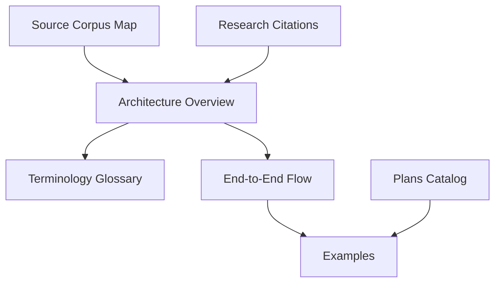

# Reference

Reference docs for the captured Roko material and its IronClaw adaptation
notes. Treat captured paths and crate names as provenance labels; verify
implementation claims against local IronClaw files or reference docs.

## Start Here

| Need | Read |
|---|---|
| System map | [architecture-overview.md](architecture-overview.md) |
| Captured-to-IronClaw comparison | [roko-vs-ironclaw.md](roko-vs-ironclaw.md) |
| Request-flow synthesis | [end-to-end-synthesis.md](end-to-end-synthesis.md), then [end-to-end-flow.md](end-to-end-flow.md) |
| Naming bridge | [terminology-glossary.md](terminology-glossary.md) |
| Quick definitions | [glossary.md](glossary.md) |
| Captured source-family map | [source-corpus-map.md](source-corpus-map.md) |
| v2 depth reading guide | [v2-depth-research.md](v2-depth-research.md) |
| Captured plan patterns | [plans-catalog.md](plans-catalog.md) |
| Research sources | [research-citations.md](research-citations.md), [research-citations/](research-citations/README.md) |
| Practical scenarios | [examples/](examples/README.md) |
| Editorial health checks | [quality-report.md](quality-report.md) |

## Provenance Rules

- `roko-*`, `docs/v1/*`, `docs/v2/*`, `docs/v2-depth/*`, and `plans/*`
  names are captured-source labels.
- Do not use those labels as file paths or implementation evidence.
- Prefer IronClaw-owned modules, existing composition roots, DB parity,
  `ToolDispatcher`, and caller-level tests when translating a captured idea.
- Avoid exact counts, savings claims, or implementation-status claims unless
  they were regenerated from local IronClaw evidence.

## Reference Shape

Use this folder as a map and citation index. Use the implementation folders and
subsystem specs before changing IronClaw code.
