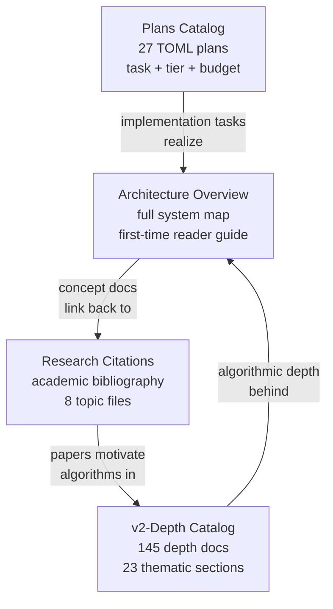

# Reference

Support documents for the knowledge base: a complete system overview, full academic bibliography, catalog of 145 v2 depth research documents, and the master implementation plans catalog. Start here when you need a map, a definition, or a bibliography — not an analysis or strategy recommendation.

## Documents

| Document | Purpose |
|----------|---------|
| [Roko Architecture Overview](architecture-overview.md) | First-time-reader reference for the entire Roko system. Five-layer model, crate dependency graph, nine protocol traits, agent lifecycle, gate pipeline, dream consolidation, IronClaw comparison table across 10 dimensions. Start here. |
| [v2-Depth Research Catalog](v2-depth-research.md) | Catalog of 145 depth documents across 23 thematic sections in `docs/v2-depth/`. Top-20 must-reads, 7 goal-based reading guides, per-section tables with IronClaw relevance ratings (52 HIGH / 40 MED / 53 LOW). |
| [Plans Catalog](plans-catalog.md) | Catalog of 27 TOML-defined implementation plans (P08–P34). TOML task format, tier classification (mechanical/focused/integrative/architectural), LoC budgets, dependency chains, cross-plan patterns, and anti-pattern taxonomy. |
| [Glossary of Terms](glossary.md) | Alphabetical quick-reference for 130+ domain-specific terms: HDC/VSA, affect, execution, memory, blockchain, protocol, math, architecture. Each entry is 1–2 sentences with a link to the full explanation. |
| [Terminology Glossary](terminology-glossary.md) | Maps v1/captured source terms (Engram, Substrate, Module, Workflow, Daimon, Neuro) to v2/spec terms (Signal, Store, Cell, Graph, Affect Engine, Memory/Search) and IronClaw-native targets. |
| [Cross-Reference Map](cross-reference-map.md) | Table connecting every concept document to its complementary deep dives, schema documents, benchmark scenarios, rollout runbooks, and example workflows. Recommended reading order: concept doc → deep dive → schema/benchmark → examples. |
| [Source Corpus Map](source-corpus-map.md) | Maps captured Roko crate families to concept documents and IronClaw-native implementation targets. Includes the no-external-dependency policy and Roko-to-IronClaw translation table. |
| [Roko vs IronClaw](roko-vs-ironclaw.md) | Side-by-side comparison across architecture, security model, memory, learning, and tooling. |
| [End-to-End Flow](end-to-end-flow.md) | Annotated walkthrough of a single request from channel ingress to response egress across all layers. |
| [Additional Papers](additional-papers.md) | Supplemental academic references beyond the main research-citations bibliography. |
| [Quality Report](quality-report.md) | Assessment of knowledge-base coverage gaps, confidence levels per domain, and recommended next investigations. |

## Subfolders

| Subfolder | Contents |
|-----------|---------|
| [research-citations/](research-citations/README.md) | Full bibliography split into 8 topic files: HDC/VSA, memory and learning, affect and cognition, verification and safety, agents and orchestration, blockchain and economics, context and search, math and statistics. Includes top-20 key papers table, research landscape diagram, and four reading guides. |
| [examples/](examples/README.md) | Operator runbooks, failure scenarios, end-to-end scenarios, real-world use cases, and user stories. |

## How These References Relate

## Quick Start

**Unfamiliar term** (hypervector, somatic marker, TraceRank, coboundary, demurrage)? Check [Glossary of Terms](glossary.md) first — 130+ terms from every domain area with precise 1–2 sentence definitions.

**New to Roko entirely?** Read [Roko Architecture Overview](architecture-overview.md) first. It gives you the full mental model of how all 30+ crates fit together and contains the IronClaw comparison table.

**Looking for the academic basis of a concept?** Open [Research Citations](research-citations/README.md) — 8 domain areas: HDC/VSA, memory/learning, affect/cognition, verification/safety, agents/orchestration, blockchain/economics, context/search, math/statistics.

**Evaluating which depth documents to read?** The [v2-Depth Research Catalog](v2-depth-research.md) has a curated top-20 list with IronClaw relevance scores and 7 goal-based reading paths.

**Planning an implementation sprint?** The [Plans Catalog](plans-catalog.md) documents the TOML task format, tier classification, verification command patterns, and anti-patterns that carry over from Roko to IronClaw.

**Navigating the full document set?** The [Cross-Reference Map](cross-reference-map.md) maps every concept document to adjacent deep dives, schema files, benchmark scenarios, and operator examples.

**Unfamiliar v1 vocabulary** (Engram, Substrate, Daimon)? The [Terminology Glossary](terminology-glossary.md) maps every captured term to its v2 equivalent and IronClaw-native target.

**Operator runbooks, failure scenarios, real-world use cases?** See [examples/](examples/README.md).
