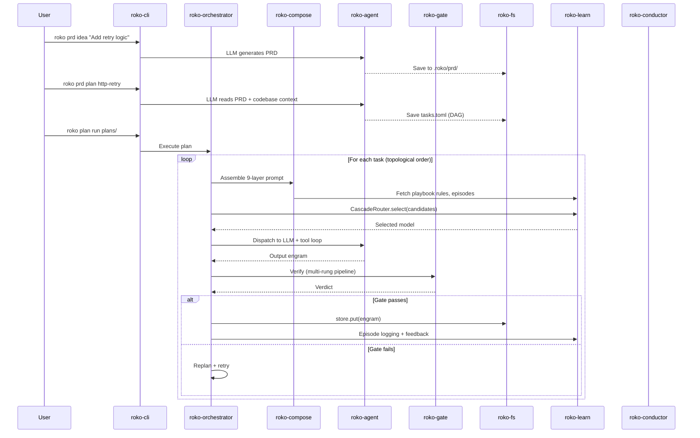
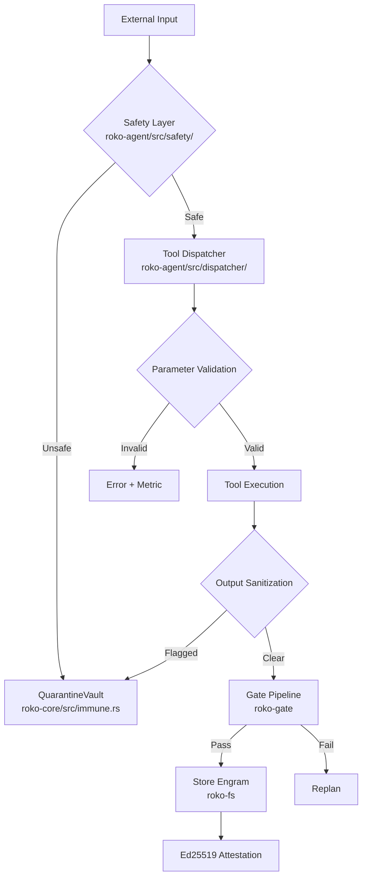
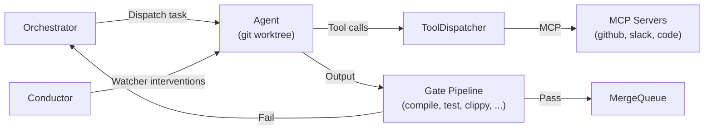

# Roko Architecture Overview

**First-time reader reference for Roko's complete architecture.**

Roko is a Rust platform for autonomous software agents that develops itself. It reads PRDs, generates implementation plans as TOML task DAGs, dispatches LLM agents, verifies output through a multi-rung gate pipeline, persists results as content-addressed Engrams, and learns from outcomes. Scale: 30 crates + 3 application binaries, ~727K lines of Rust, ~8,300 tests.

> All ``...`` links point to the authoritative source. For IronClaw-native build plans see `implementation/README.md`.

**Cross-references**: [v2-depth-research.md](v2-depth-research.md) — 145 depth docs behind these patterns | [plans-catalog.md](plans-catalog.md) — 27 TOML plans realizing this architecture | `./research-citations/README.md` — academic bibliography

---

## Table of Contents

1. [Core Mental Model: One Noun, Nine Verbs](#1-core-mental-model)
2. [Five-Layer Model (L0–L4)](#2-five-layer-model)
3. [Crate Dependency Graph](#3-crate-dependency-graph)
4. [Crate-by-Crate Reference](#4-crate-by-crate-reference)
5. [Data Flow: PRD to Merged Code](#5-data-flow)
6. [Universal Cognitive Loop](#6-universal-cognitive-loop)
7. [Key Data Types](#7-key-data-types)
8. [Agent Lifecycle and Coordination](#8-agent-lifecycle)
9. [Gate Pipeline and Verification](#9-gate-pipeline)
10. [Learning and Self-Improvement](#10-learning)
11. [Knowledge and Memory (Neuro)](#11-knowledge-and-memory)
12. [Offline Consolidation (Dreams)](#12-dreams)
13. [Conductor: Reactive Supervision](#13-conductor)
14. [Code Intelligence (Index)](#14-code-intelligence)
15. [Security Model](#15-security-model)
16. [Design Principles](#16-design-principles)
17. [IronClaw Comparison](#17-ironclaw-comparison)
18. [Terminology Glossary](#18-glossary)

---

## 1. Core Mental Model

The entire system is built from **one universal data type** and **nine trait operations**:

```
Engram              — the universal datum: addressable, decaying, scored, traced

  Core Six (roko-core/src/traits.rs):
    Store           — persist and retrieve engrams
    Score           — rate along multi-dimensional axes
    Verify          — check against ground truth
    Route           — select one candidate from many
    Compose         — combine under a budget into a new engram
    React           — watch engram streams and emit interventions

  Extended Three:
    Bus             — publish/subscribe transport for ephemeral Pulses
    ColdStore       — archival store for aged-out engrams
    Observe/Connect/Trigger — peripheral Cell-based protocols
```

The nine traits form a **dependency lattice** whose topological sort yields the five-layer architecture — layer ordering is not a design choice but a mathematical consequence of which protocols depend on which others. Source: `crates/roko-core/src/traits.rs`.

See depth doc `docs/v2-depth/00-index/architectural-thesis.md` — the SWE-bench data showing 30–65% performance variation from harness quality, not model quality. See also [`../core-concepts/cognitive-architecture.md`](../core-concepts/cognitive-architecture.md).

### Nine Protocol Signatures

**`Store`** — durable persistence
```rust
async fn put(&self, engram: Engram) -> Result<ContentHash>;
async fn get(&self, id: &ContentHash) -> Result<Option<Engram>>;
async fn query(&self, q: &Query, ctx: &Context) -> Result<Vec<Engram>>;
```

**`Score`** — multi-dimensional quality rating
```rust
async fn score(&self, engram: &Engram, ctx: &Context) -> Result<ScoreVector>;
fn axes(&self) -> &[ScoreAxis];
```

**`Verify`** — ground-truth checking
```rust
async fn verify(&self, engram: &Engram, ctx: &Context) -> Result<Verdict>;
fn is_blocking(&self) -> bool;
```

**`Route`** — candidate selection with learning
```rust
async fn select(&self, candidates: &[Engram], ctx: &Context) -> Result<Selection>;
async fn update(&self, id: &ContentHash, outcome: &Outcome) -> Result<()>;
```

**`Compose`** — budget-bounded assembly
```rust
async fn compose(&self, inputs: &[Engram], budget: &Budget, scorer: &dyn Score, ctx: &Context) -> Result<Engram>;
fn token_estimate(&self, engram: &Engram) -> usize;
```

**`React`** — stream-based intervention
```rust
async fn react(&self, stream: &EngramStream, ctx: &Context) -> Result<Vec<Engram>>;
fn pattern(&self) -> &Pattern;
```

**`Bus`** — ephemeral pub/sub (Pulses are not persisted)
```rust
fn publish(&self, pulse: Pulse) -> Result<()>;
fn subscribe(&self, channel: &ChannelId) -> Result<Receiver<Pulse>>;
```

**`ColdStore`** — archival (engrams below decay threshold move here, not deleted)
```rust
async fn archive(&self, engram: Engram) -> Result<()>;
async fn retrieve(&self, id: &ContentHash) -> Result<Option<Engram>>;
```

**`Engram` vs. `Pulse` duality**: Engrams are durable (committed Git blob analogy); Pulses are ephemeral (pub/sub messages). Valuable Pulses are promoted to Engrams.

---

## 2. Five-Layer Model

Each crate declares its layer via `[package.metadata.roko] layer = N`. CI script `scripts/layer_check.rs` enforces no upward dependencies.

```mermaid
graph TB
    subgraph L4["L4 — Applications"]
        direction LR
        CLI["roko-cli\n60+ subcommands"]
        SERVE["roko-serve\n~85 HTTP routes"]
        AGENT_SVR["roko-agent-server\nper-agent sidecar"]
        ACP["roko-acp\neditor integration"]
    end
    subgraph L3["L3 — Orchestration"]
        direction LR
        ORCH["roko-orchestrator\nDAG executor"]
        GATE["roko-gate\n42 files, 15 gates"]
        COND["roko-conductor\n10 watchers"]
    end
    subgraph L2["L2 — Capabilities"]
        direction LR
        AGT["roko-agent\nLLM backends"]
        COMP["roko-compose\n9-layer prompts"]
        LRN["roko-learn\nrouting+episodes"]
        NEURO["roko-neuro\nknowledge"]
        DAI["roko-daimon\naffect/PAD"]
        DRM["roko-dreams\nconsolidation"]
        FS["roko-fs\nJSONL store"]
        STD["roko-std\n19 built-in tools"]
        GRP["roko-graph\nDAG engine"]
        IDX["roko-index\ncode intel"]
    end
    subgraph L1["L1 — Kernel + Runtime"]
        direction LR
        CORE["roko-core\nEngram + 9 traits\n~30K LOC"]
        RT["roko-runtime\nbus + supervision"]
    end
    subgraph L0["L0 — Primitives"]
        PRIM["roko-primitives\nHDC, manifold, TDA, PAD, tropical"]
    end

    L4 --> L3
    L3 --> L2
    L2 --> L1
    L1 --> L0
```



| Layer | Can Depend On | Purpose |
|-------|---------------|---------|
| L0 | External only | HDC vectors, Riemannian manifolds, TDA, sheaf theory |
| L1 | L0 | Engram type, 9 traits, typed event bus, process supervision |
| L2 | L0, L1 | Agents, gates, composers, scorers, persistence, knowledge, learning |
| L3 | L0–L2 | DAG execution, plan discovery, gate pipeline composition |
| L4 | All layers | CLI binary, HTTP server, per-agent sidecar, editor integration |

---

## 3. Crate Dependency Graph

Arrows point from dependent to dependency.

```mermaid
graph TD
    subgraph L0["L0"]
        primitives["roko-primitives"]
    end
    subgraph L1["L1"]
        core["roko-core"] --> primitives
        runtime["roko-runtime"] --> primitives
        runtime --> core
    end
    subgraph L2["L2"]
        agent["roko-agent"] --> core
        compose["roko-compose"] --> core
        compose --> agent
        compose --> learn
        compose --> neuro
        learn["roko-learn"] --> core
        learn --> agent
        learn --> daimon
        neuro["roko-neuro"] --> core
        neuro --> fs
        neuro --> agent
        neuro --> learn
        daimon["roko-daimon"] --> core
        dreams["roko-dreams"] --> core
        dreams --> neuro
        dreams --> learn
        dreams --> agent
        fs["roko-fs"] --> core
        std["roko-std"] --> core
        graph["roko-graph"] --> core
        index["roko-index"] --> core
    end
    subgraph L3["L3"]
        gate["roko-gate"] --> core
        gate --> agent
        conductor["roko-conductor"] --> core
        conductor --> learn
        orchestrator["roko-orchestrator"] --> core
        orchestrator --> agent
        orchestrator --> compose
        orchestrator --> conductor
        orchestrator --> gate
        orchestrator --> learn
        orchestrator --> neuro
        orchestrator --> runtime
    end
    subgraph L4["L4"]
        cli["roko-cli"] --> orchestrator
        cli --> compose
        cli --> agent
        cli --> gate
        cli --> dreams
        serve["roko-serve"] --> orchestrator
        serve --> agent
        acp["roko-acp"] --> orchestrator
        acp --> gate
        acp --> dreams
    end
```

---

## 4. Crate-by-Crate Reference

### L0 — Primitives

#### `roko-primitives` — `crates/roko-primitives`

Zero-dependency compute primitives. No internal workspace dependencies.

| Module | Key Types | Description |
|--------|-----------|-------------|
| `hdc` | `HdcVector`, `BundleAccumulator`, `ItemMemory` | 10,240-bit hyperdimensional vectors. XOR bind, majority bundle, Hamming similarity. |
| `codebook` | `Codebook`, `PatternStore` | Pattern matching and cross-domain resonance. |
| `tier` | `InferenceTier` (T0/T1/T2), `TierRouter` | Three-tier model routing: T0 fast/cheap, T1 balanced, T2 powerful. |
| `manifold` | Riemannian metric tensors, geodesics, Ricci curvature | Execution cost manifolds for optimal routing geometry. |
| `tda` | Persistence diagrams, Takens embedding | Topological Data Analysis for behavioral pattern detection. |
| `sheaf` | Coboundary operators, sheaf Laplacian | Oracle consistency checking. |
| `pad` | `PadVector` | Pleasure-Arousal-Dominance affective state for Daimon. |
| `robust_stats` | Trimmed mean, MAD, Hodges-Lehmann | Outlier-resistant statistics for gate thresholds. |

---

### L1 — Kernel + Runtime

#### `roko-core` — `crates/roko-core`

The kernel. ~30K LOC. Defines `Engram`, all nine protocol traits, and ~100 supporting types.

| Module | Key Types |
|--------|-----------|
| `engram` | `Engram`, `EngramBuilder`, `HdcFingerprint` |
| `traits` | `Store`, `Score`, `Verify`, `Route`, `Compose`, `React`, `Bus`, `ColdStore`, `Observe`, `Connect`, `Trigger` |
| `loop_tick` | `loop_tick()`, `TickConfig`, `TickOutcome` — the universal cognitive loop |
| `agent` | `AgentBackend`, `AgentRole`, `ModelSpec`, `ModelTier`, `TurnBudget` |
| `tool` | `ToolDef`, `ToolHandler`, `ToolRegistry`, `ToolCall`, `ToolResult` |
| `kind` | `Kind` enum — Task, GateVerdict, Episode, Prompt, Insight, Warning, ... |
| `verdict` | `Verdict`, `Outcome`, `Selection`, `TestCount` |
| `decay` | `Decay` — None, HalfLife, Exponential |
| `provenance` | `Provenance`, `Taint`, `TaintInfo` — taint lattice for security |
| `immune` | `QuarantineVault`, `AnomalyScore`, `ImmuneResponse` |
| `attestation` | `Attestation`, `Ed25519Signature`, `ChainAttestation` |

Key files: `crates/roko-core/src/engram.rs`, `crates/roko-core/src/traits.rs`, `crates/roko-core/src/loop_tick.rs`

#### `roko-runtime` — `crates/roko-runtime`

Shared async runtime primitives: typed event bus, process supervision, pipeline state, cancellation.

| Module | Key Types |
|--------|-----------|
| `pulse_bus` | `PulseBus` — ephemeral Pulse transport implementing `Bus` |
| `workflow_engine` | `WorkflowEngine`, `PipelineStateV2` — DAG execution and state |
| `process` | `ProcessSupervisor` — agent lifecycle with restart policies |
| `heartbeat` | Heartbeat protocol — health monitoring across agents |

---

### L2 — Capabilities

#### `roko-agent` — `crates/roko-agent`

Agent trait and LLM backend implementations. Tool-use loop and dispatcher.

Backends: Claude API, Claude CLI, OpenAI, OpenAI-compatible, Codex, Cursor, Ollama, Gemini, Perplexity.

| Module | Description |
|--------|-------------|
| `dispatcher/` | Parallel execution, timeout, dedup cache, hook chains, validation, metric emission |
| `tool_loop/` | Multi-turn LLM conversation with tool calls |
| `safety/` | Pre/post execution safety checks |
| `mcp/` | MCP client for agent tool calls |

Key file: `crates/roko-agent/src/dispatcher/mod.rs`

#### `roko-compose` — `crates/roko-compose`

Prompt assembly and context composition. Implements the `Compose` trait.

9-layer `SystemPromptBuilder`: L1 Mission, L2 Role policy, L3 Domain, L4 Task brief, L5 Playbook, L6 Research, L7 Episodes, L8 Knowledge, L9 Affect.

Also: density-greedy token budget allocation with VCG-inspired displacement diagnostics, `AttentionBidder` variants, token counting (tiktoken-rs).

See depth docs `docs/v2-depth/02-block/vcg-attention-auction.md`, `docs/v2-depth/02-block/active-inference-context-selection.md`. See also [`../context-memory/budget-composition.md`](../context-memory/budget-composition.md).

#### `roko-learn` — `crates/roko-learn`

Learning without LLM fine-tuning — routing weights, gate thresholds, prompt A/B tests, playbook rules.

| Module | Description |
|--------|-------------|
| `cascade_router/` | 3-stage: confidence threshold → UCB exploration → contextual bandit (LinUCB; IronClaw adaptation uses a 14D context vector) |
| `episode_logger` | Records agent turns and gate results to `.roko/episodes.jsonl` |
| `playbook/` | Pattern extraction from successful episodes (0.95 confidence ceiling) |
| `bandits` | Epsilon-greedy and contextual bandit algorithms |
| `prompt_experiment` | A/B testing with Thompson sampling |
| `provider_health` | LLM provider health tracking |

Key file: `crates/roko-learn/src/cascade_router.rs`. See [`../agent-intelligence/online-learning.md`](../agent-intelligence/online-learning.md).

#### `roko-neuro` — `crates/roko-neuro`

Knowledge and memory — durable knowledge store with distillation and tier progression.

D1 (raw experience) → D2 (pattern-extracted) → D3 (principle-abstracted) distillation stages. Optional HDC-indexed similarity queries. See [`../core-concepts/universal-engram.md`](../core-concepts/universal-engram.md).

#### `roko-daimon` — `crates/roko-daimon`

Affect and motivation modeling (Pleasure-Arousal-Dominance somatic marker system).

| Module | Description |
|--------|-------------|
| `policy` | `DaimonPolicy` — affect-modulated decision making |
| `somatic_ta` | Somatic marker hypothesis (Damasio): k-d tree indexed embeddings |
| `mortality` | Temporal urgency modeling (deadline pressure) |

See depth doc `docs/v2-depth/07-agent-runtime/18-affect-as-functor.md`. See also [`../agent-intelligence/affect-engine.md`](../agent-intelligence/affect-engine.md).

#### `roko-dreams` — `crates/roko-dreams`

Offline consolidation — background processing during idle periods.

Three-phase dream cycle: NREM (replay high-utility episodes via Mattar-Daw scoring) → REM (HDC counterfactual synthesis) → Integration (promote/reject candidates).

| Module | Description |
|--------|-------------|
| `cycle` | Dream cycle orchestration |
| `hypnagogia` | Creative recombination with anti-correlated retrieval (inverted HDC vectors) |
| `imagination` | Counterfactual generation |
| `replay` | Experience replay with current knowledge |
| `threat` | Threat scenario simulation |

Key file: `crates/roko-dreams/src/cycle.rs`. See [`../agent-intelligence/dream-consolidation.md`](../agent-intelligence/dream-consolidation.md).

#### `roko-fs` — `crates/roko-fs`

`FileSubstrate`: JSONL append-only persistence (`.roko/signals.jsonl`). `ArchiveColdSubstrate`: implements `ColdStore`. Optional HDC-indexed similarity.

#### `roko-std` — `crates/roko-std`

19 built-in tools: `apply_patch`, `bash`, `edit_file`, `exit_plan_mode`, `glob`, `grep`, `ls`, `multi_edit`, `read_file`, `run_tests`, `sandbox`, `task_agent`, `todo_write`, `web_fetch`, `web_search`, `write_file`, plus `MemorySubstrate` (in-memory Store for testing), `StaticRouter`, `WeightedRouter`, `RelevanceScorer`, `RecencyScorer`.

#### `roko-graph` — `crates/roko-graph`

DAG-based graph execution engine. Topological sort with cycle detection (petgraph). TOML-based graph definition loader. Conditional edge evaluation. Hot-reloading. See [`../execution-verification/dag-execution.md`](../execution-verification/dag-execution.md).

#### `roko-index` — `crates/roko-index`

Code intelligence: source parsing, symbol graphs, PageRank scoring, HDC fingerprinting. Multi-language (Rust via tree-sitter; TypeScript, Go via regex). Optional SQLite-backed persistent index. See [`../context-memory/code-intelligence.md`](../context-memory/code-intelligence.md).

#### MCP Servers — `roko-mcp-*` (L2)

Standalone MCP servers invoked via `--mcp-config`. Transport: stdio JSON-RPC.

| Crate | Tools |
|-------|-------|
| `crates/roko-mcp-stdio` | Shared stdio transport (dependency for others) |
| `crates/roko-mcp-github` | GitHub API: PR management, file reading, issue tracking |
| `crates/roko-mcp-slack` | Slack Web API: channel messaging, search |
| `crates/roko-mcp-scripts` | Wraps arbitrary scripts as MCP tools |
| `crates/roko-mcp-code` | Code intelligence tools backed by roko-index |

See [`../ecosystem/mcp-editor-integration.md`](../ecosystem/mcp-editor-integration.md).

---

### L3 — Orchestration

#### `roko-gate` — `crates/roko-gate`

Concrete `Verify` implementations. 42 source files, 15 gate types.

| Module | Description |
|--------|-------------|
| `gate_pipeline` | Multi-rung composition |
| `compile` | Compilation gate (blocking) |
| `test_gate` / `property_test_gate` / `integration_gate` | Testing gates |
| `clippy_gate` | Lint gate |
| `diff_gate` | Diff analysis |
| `llm_judge_gate` | LLM-as-judge |
| `benchmark_gate` | Performance gate (non-blocking) |
| `security_scan_gate` | Vulnerability scan |
| `adaptive_threshold` | EMA-based threshold adaptation |
| `ratchet` | Quality only moves upward |
| `spc` | Statistical process control |
| `pelt` | PELT changepoint detection |

Key file: `crates/roko-gate/src/gate_pipeline.rs`. See [`../execution-verification/gate-verification.md`](../execution-verification/gate-verification.md).

#### `roko-orchestrator` — `crates/roko-orchestrator`

Plan discovery, task DAG management, worktree isolation, parallel execution.

| Module | Description |
|--------|-------------|
| `plan_discovery` | Scan filesystem for plan files |
| `dag` | Task DAG construction and traversal |
| `executor/` | Parallel task executor with concurrency control |
| `worktree` | Git worktree manager for task isolation |
| `merge_queue` | Merge queue for completed tasks |
| `replan` | Replanning on gate failure |
| `runtime_snapshot` | Execution state snapshots for `--resume` |

See [`../execution-verification/orchestrator-swarm.md`](../execution-verification/orchestrator-swarm.md).

#### `roko-conductor` — `crates/roko-conductor`

Reactive supervision — 10 watcher Cells that monitor execution and trigger interventions.

| Watcher | What it monitors |
|---------|-----------------|
| `compile_fail_repeat` | Repeated compilation failure |
| `context_window_pressure` | Context utilization |
| `cost_overrun` | Budget overrun |
| `ghost_turn` | Unproductive turns |
| `iteration_loop` | Infinite loop detection |
| `review_loop` | Review cycle detection |
| `spec_drift` | Specification drift |
| `stuck_pattern` | Stuck agent patterns |
| `test_failure_budget` | Test failure budget |
| `time_overrun` | Time budget overrun |

Also: `circuit_breaker` (Closed/Open/Half-Open with predictive breaking via Holt forecaster), `yerkes_dodson` (optimal arousal pressure), `threshold_learner` (adaptive watcher thresholds). See [`../execution-verification/conductor-anomaly.md`](../execution-verification/conductor-anomaly.md).

---

### L4 — Applications

#### `roko-cli` — `crates/roko-cli`

Main `roko` binary. 60+ subcommands: plan management, PRD workflow, research, knowledge inspection, agent management, deployment, TUI dashboard, chat REPL.

Key: `crates/roko-cli/src/orchestrate.rs` — the plan execution engine wiring all subsystems. TUI dashboard at `crates/roko-cli/src/tui` with F1–F7 tabs.

#### `roko-serve` — `crates/roko-serve`

HTTP control plane: ~85 REST routes, SSE streaming, WebSocket. Port 6677 via `roko serve`. JWKS auth, OpenAPI (utoipa). See [`../ecosystem/control-plane.md`](../ecosystem/control-plane.md).

#### `roko-agent-server` — `crates/roko-agent-server`

Per-agent HTTP sidecar. Endpoints: `/message`, `/stream` (WebSocket), `/predictions`, `/research`, `/tasks`. Handles ERC-8004 agent card registration.

#### `roko-acp` — `crates/roko-acp`

Agent Client Protocol server for editor integrations (VS Code, JetBrains, Zed). Bridges editor events to the Roko pipeline. See [`../ecosystem/mcp-editor-integration.md`](../ecosystem/mcp-editor-integration.md).

### Application Binaries (`apps/`)

| Binary | Purpose |
|--------|---------|
| `apps/mirage-rs` | In-process Ethereum fork simulator (lazy upstream reads, copy-on-write branching, JSON-RPC server) |
| `apps/agent-relay` | In-memory relay for agent WebSocket presence and message forwarding |
| `apps/roko-chain-watcher` | Long-running agent subscribing to chain events, posting insights via HTTP |

---

## 5. Data Flow

### PRD to Merged Code



### Security Data Flow



---

## 6. Universal Cognitive Loop

Every operation reduces to `loop_tick()` with different trait implementations. Defined in `crates/roko-core/src/loop_tick.rs`:

```rust
pub async fn loop_tick(
    store:    &dyn Store,
    scorer:   &dyn Score,
    gate:     &dyn Verify,
    router:   &dyn Route,
    composer: &dyn Compose,
    policy:   &dyn React,
    query:    &Query,
    budget:   &Budget,
    ctx:      &Context,
) -> Result<TickOutcome>
```

Execution: `store.query()` → `router.select()` → `composer.compose()` → `gate.verify()` → if passed: `store.put()` + `policy.react()`

By plugging in different implementations, the same loop serves multiple purposes:

| Use Case | store | gate | router | composer |
|----------|-------|------|--------|---------|
| Task executor | `FileSubstrate` | `CompileGate+TestGate` | `CascadeRouter` | `SystemPromptBuilder` |
| Model selector | `MemorySubstrate` | `NoopVerify` | `LinUCBRouter` | `IdentityCompose` |
| Context assembler | `HdcSubstrate` | `NoopVerify` | `RelevanceRouter` | `ContextAssembler` |
| Knowledge retriever | `HdcSubstrate` | `NoopVerify` | `RecencyRouter` | `SummaryComposer` |

See [`../core-concepts/cognitive-architecture.md`](../core-concepts/cognitive-architecture.md) and depth doc `docs/v2-depth/05-execution-engine/cognitive-loop-as-graph.md`.

---

## 7. Key Data Types

### Engram

```rust
pub struct Engram {
    pub id: ContentHash,                      // BLAKE3(kind+body+author+taint+lineage+tags)
    pub fingerprint: Option<HdcFingerprint>,  // 10,240-bit HDC vector
    pub kind: Kind,                           // Task, GateVerdict, Episode, Prompt, Insight, ...
    pub body: Body,                           // Text, Json, Binary, Empty
    pub created_at_ms: i64,
    pub decay: Decay,                         // None | HalfLife { seconds } | Exponential { rate }
    pub provenance: Provenance,               // Author + taint chain
    pub score: Score,                         // confidence, novelty, utility, reputation
    pub lineage: Vec<ContentHash>,            // Parent engrams (DAG)
    pub tags: BTreeMap<String, String>,
    pub attestation: Option<Attestation>,     // Ed25519 cryptographic proof
    pub emotional_tag: Option<EmotionalTag>,  // PAD affect state
}
```

Effective weight: `weight(t) = score.effective() * decay.apply(t - created_at_ms)`

Score effective: `0.4*confidence + 0.2*novelty + 0.3*utility + 0.1*reputation`

### Score

```rust
pub struct Score {
    pub confidence: f32,  // certainty
    pub novelty: f32,     // how new/original
    pub utility: f32,     // immediate actionability
    pub reputation: f32,  // source reputation
}
```

### HdcVector

```rust
pub struct HdcVector {
    data: [u64; 160],  // 160 * 64 = 10,240 bits
}
// XOR bind, majority bundle, normalized Hamming similarity
```

False positive rate for HDC similarity: approximately 1 in 10^307.

### Decay half-lives (typical)

| Data type | Half-life |
|-----------|-----------|
| Compiler warning | 2–4 hours |
| Task result | 24–48 hours |
| Design insight | 7–14 days |
| Architectural knowledge | 90–180 days |

---

## 8. Agent Lifecycle

### Agent Backends

| Backend | Transport |
|---------|-----------|
| Claude API (`claude_agent.rs`) | HTTP (Anthropic API) |
| Claude CLI (`claude_cli_agent.rs`) | Process spawn |
| OpenAI / OpenAI-compatible | HTTP |
| Codex, Cursor, Ollama, Gemini, Perplexity | HTTP / Process |

### Tool Dispatcher Features

Parallel execution, parameter validation, timeout enforcement, dedup cache, hook chains, output truncation, metric emission, cooperative cancellation, result cache, relevance-based tool selection.

### Agent Coordination



---

## 9. Gate Pipeline

7-rung multi-stage pipeline (cheapest to most expensive):

| Rung | Gate | Blocking | Notes |
|------|------|----------|-------|
| R1 | Compile | Yes | `cargo build` / `tsc` / `go build` |
| R2 | Test | Yes | `cargo test` |
| R3 | Clippy | Yes | Zero warnings policy |
| R4 | Diff analysis | No | Change size and coherence |
| R5 | LLM judge | No | Quality scoring |
| R6 | Property tests | No | Proptest invariants |
| R7 | Benchmarks | No | Performance regression |

**Gate ratchet**: Quality thresholds only move upward (`GateRatchet`). CUSUM/EWMA control charts detect drift. BOCPD identifies regime shifts.

**Gate feedback**: Structured `GateFeedback` type encodes failure mode, location, reason, and suggested fix. 97.75% token reduction vs prose feedback. Model escalation: stronger model after N retries.

See [`../execution-verification/gate-verification.md`](../execution-verification/gate-verification.md) and depth doc `docs/v2-depth/02-block/verify-as-universal-oracle.md`.

---

## 10. Learning

Roko learns without LLM fine-tuning by adjusting:

| Mechanism | Where | What changes |
|-----------|-------|-------------|
| `CascadeRouter` | `roko-learn` | LLM routing weights (30–50% cost reduction projected) |
| Gate EMA | `roko-gate` | Pass/fail thresholds |
| Prompt experiments | `roko-learn` | A/B test sections, Thompson sampling |
| Playbook rules | `roko-learn` | Reusable patterns from successful episodes |
| Episode distillation | `roko-neuro` | D1→D2→D3 knowledge compression |

**Four learning loops:**
- L1 (per-tick): parameter tuning within a single execution
- L2 (per-episode): strategy selection across tasks
- L3 (per-batch): knowledge consolidation and representation change
- L4 (per-approval): architecture evolution with human oversight

See [`../agent-intelligence/online-learning.md`](../agent-intelligence/online-learning.md) and depth doc `docs/v2-depth/10-learning-loops/bandit-routing-and-cascade.md`.

---

## 11. Knowledge and Memory

Three-tier hierarchy: working memory → episodic → semantic.

6 knowledge types (Signal subtypes): Fact, Procedure, Heuristic, Context, Insight, Pattern — each with distinct decay parameters.

**AntiKnowledge**: First-class Signal Kind for things proven false. Never fully decays (floor rate). Cognitive immune system uses SIR epidemiological model to track false belief spread.

**Query**: Hybrid search (FTS + HDC vector similarity). HDC resonance enables cross-domain retrieval.

See [`../core-concepts/universal-engram.md`](../core-concepts/universal-engram.md) and depth docs `docs/v2-depth/11-memory/01-knowledge-as-signal.md`, `docs/v2-depth/11-memory/04-antiknowledge-and-immunity.md`.

---

## 12. Offline Consolidation (Dreams)

Three-phase dream cycle runs between active sessions:

```
NREM (replay)    → select high-utility episodes via Mattar-Daw scoring
                   (replay_utility = need × expected_reward × replay_ease)
REM (synthesis)  → HDC counterfactual: what would have happened with a different action?
                   Anti-correlated retrieval: 15% dissimilar signals (Horowitz TDI: 43% creativity boost)
Integration      → promote/reject candidates against confidence thresholds
                   SHY renormalization: reduce all weights periodically to prevent saturation
```

See [`../agent-intelligence/dream-consolidation.md`](../agent-intelligence/dream-consolidation.md) and depth doc `docs/v2-depth/11-memory/06-dream-cycle-as-loop.md`.

---

## 13. Conductor

Reactive intelligence layer. Implements supervision as a `Verify` Pipeline with 10 watcher Cells (see Section 4). OODA Loop feedback structure: Observe-Orient-Decide-Act.

**Circuit breaker** (Closed/Open/Half-Open): predictive breaking via Holt double exponential forecaster opens before failure rather than after. AIMD concurrency control (borrowed from TCP).

**Yerkes-Dodson**: too little supervision pressure → low performance; too much → failure. Conductor maintains optimal pressure via `ConductorBandit` (CMAB).

**Stuck detection**: 20 error categories, 34 detection patterns, 9 interventions by severity (scratchpad clear → agent restart). 6 Lens Cells monitoring: action repetition, tool failure rate, progress velocity, context growth, score stagnation, output diversity.

See [`../execution-verification/conductor-anomaly.md`](../execution-verification/conductor-anomaly.md).

---

## 14. Code Intelligence

The blindness problem: a 200K-token context window covers at most 16% of a modest Rust workspace.

6-stage pipeline in `roko-index`:
1. Parse (tree-sitter for Rust, regex for TypeScript/Go)
2. Symbol graph construction
3. PageRank scoring for importance
4. HDC fingerprinting (~10ns similarity lookup)
5. Multi-strategy search (FTS + vector + symbol)
6. Budget-constrained context assembly

See [`../context-memory/code-intelligence.md`](../context-memory/code-intelligence.md) and depth doc `docs/v2-depth/22-code-intelligence/01-code-intelligence-as-cell-pipeline.md`.

---

## 15. Security Model

**Taint lattice**: Bottom < Trusted < External < Untrusted < Tainted. Join propagation: any operation on Tainted input produces Tainted output. Declassification capabilities allow controlled trust elevation with audit trail.

**CaMeL architecture** (for prompt injection defense): Trusted control-plane LLM (PLLM) makes decisions; untrusted data-plane LLM (QLLM) processes external content. Taint barrier prevents QLLM output from influencing PLLM without explicit declassification.

**5-layer immune pipeline**: taint propagation → anomaly detection → quarantine → incident response → immune memory. HDC fingerprint matching enables attack signature recognition at nanosecond speeds.

**Ed25519 attestation**: Every stored Engram receives a cryptographic signature. BLAKE3 integrity checking on verdict chains for forensic causal replay.

See [`../execution-verification/gate-verification.md`](../execution-verification/gate-verification.md) and depth docs `docs/v2-depth/17-security/06-prompt-security-and-camel.md`, `docs/v2-depth/01-signal/provenance-and-taint.md`.

---

## 16. Design Principles

1. **One Noun, Nine Verbs.** Everything is an Engram + one of nine trait operations.
2. **Content-Addressed Immutability.** BLAKE3 hash covers kind + body + author + taint + lineage + tags. Score/decay/timestamps excluded — they evolve without changing identity.
3. **Wire, Don't Build.** Connect existing code into the runtime via CLI subcommands before building anything new.
4. **Mechanical Verification Over Human Review.** Every agent output passes through a multi-rung gate pipeline before acceptance.
5. **Learning is Structural, Not Fine-Tuning.** Adjust routing weights, gate thresholds, prompt sections, context pack selection, playbook rules.
6. **Decay as a First-Class Concept.** Engrams have half-lives; substrate prunes below-threshold engrams; cold store archives. Prevents unbounded accumulation.
7. **Layered Architecture with Enforced Boundaries.** CI-enforced `layer_check.rs` prevents upward dependencies.

---

## 17. IronClaw Comparison

| Dimension | Roko | IronClaw | Transfer Priority |
|-----------|------|----------|------------------|
| Core data model | `Engram` (content-addressed, decaying, scored) | `Message` + workspace entries | HIGH: Engram decay model → workspace |
| Persistence | JSONL (`roko-fs`) + ColdStore | PostgreSQL + libSQL (dual backend) | MEDIUM: architectural pattern |
| LLM routing | 3-stage CascadeRouter (LinUCB; 14D IronClaw adaptation) | Multi-provider `LlmProvider` trait | HIGH: cascade routing → `crates/ironclaw_llm/` |
| Context composition | 9-layer prompt builder + density allocation with VCG-style diagnostics | `crates/ironclaw_engine/` | HIGH: EFE scoring, prompt budget allocation |
| Gate verification | 7-rung pipeline + adaptive thresholds | Success evaluator + safety layer | HIGH: structured feedback, model escalation |
| Memory | `roko-neuro` (3-tier, D1/D2/D3, HDC) | `src/workspace/` (hybrid FTS+vector) | HIGH: AntiKnowledge, decay economics |
| Offline consolidation | `roko-dreams` (NREM/REM/Integration) | Heartbeat system | MEDIUM: dream cycle → heartbeat enhancement |
| Supervision | `roko-conductor` (10 watchers, circuit breaker) | Basic stuck detection | HIGH: stuck detection taxonomy |
| Safety | Taint lattice + CaMeL + immune pipeline | `crates/ironclaw_safety/` | HIGH: dual-LLM taint barrier |
| Code intelligence | `roko-index` (tree-sitter, PageRank, HDC) | None yet | HIGH: `roko-mcp-code` pattern |

For the full adoption roadmap, see [`implementation/README.md`](../implementation/README.md) and [`implementation/05-per-file-action-matrix.md`](../implementation/05-per-file-action-matrix.md).

---

## 18. Glossary

| Term | Definition |
|------|------------|
| Engram | Universal durable datum: content-addressed, decaying, scored, traced |
| Pulse | Ephemeral event on the Bus; not persisted unless promoted to Engram |
| Cell | Atomic computation unit declaring typed I/O and protocol conformance |
| Graph | Composition of Cells (Pipeline, Loop, Hot Graph specializations) |
| Store | Pull-based persistent state for Engrams (durable, queryable) |
| Bus | Push-based ephemeral pub/sub for Pulses |
| Verdict | Gate verification outcome (Passed/Failed + structured details) |
| ContentHash | BLAKE3 hash serving as Engram identity |
| HDC | Hyperdimensional Computing — 10,240-bit vectors with bind/bundle/permute |
| CascadeRouter | 3-stage model router: confidence → UCB → contextual bandit |
| Gate rung | One verification step in the multi-stage pipeline |
| Taint | Provenance label propagated through all operations on untrusted data |
| PAD | Pleasure-Arousal-Dominance — 3D affective state vector |
| AntiKnowledge | Signal Kind for proven falsehoods; non-decaying; repels similar queries |
| T0/T1/T2 | Model tiers: T0 fast/cheap, T1 balanced, T2 powerful/expensive |
| ACP | Agent Client Protocol — editor integration surface |
