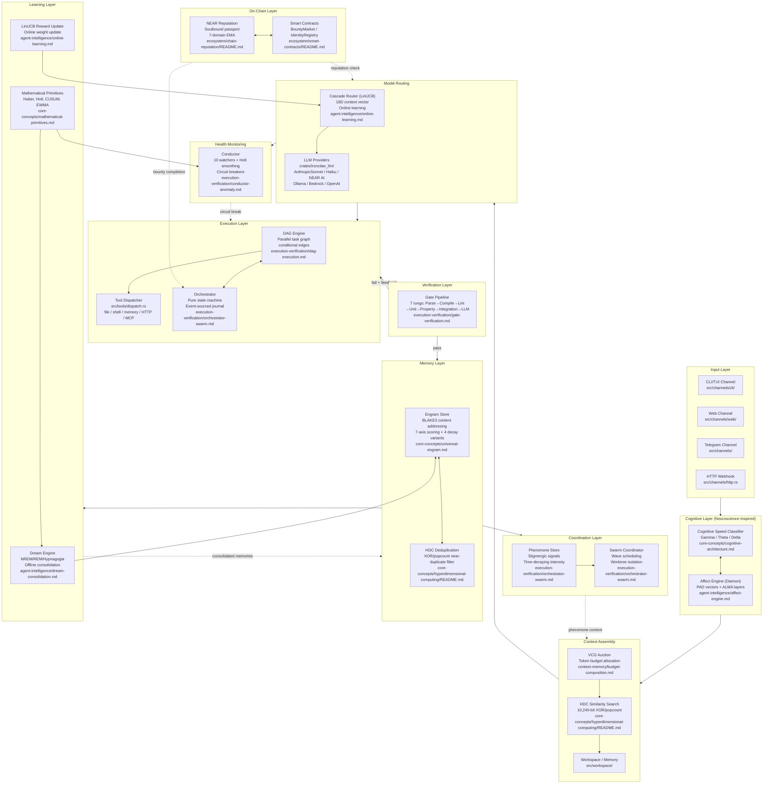

# End-to-End Data Flow: How All Concepts Connect

This document is the "big picture" map. It traces a single user request through every
concept in this knowledge base, then does the same for three additional scenarios:
multi-agent task coordination, background maintenance, and on-chain interaction.

Every concept below has a canonical deep-dive document linked in the
[concept overview](../README.md). Read this document first to understand how pieces
fit together, then follow the links for implementation depth.

---

## Table of Contents

1. [System Components and Their Roles](#1-system-components-and-their-roles)
2. [A User Request Journey — Step by Step](#2-a-user-request-journey--step-by-step)
3. [Mermaid Sequence Diagram — Full Request Flow](#3-mermaid-sequence-diagram--full-request-flow)
4. [Mermaid Architecture Diagram — All Components](#4-mermaid-architecture-diagram--all-components)
5. [Data Type Flow — What Enters and Exits Each Component](#5-data-type-flow--what-enters-and-exits-each-component)
6. [Where Each Concept Lives in IronClaw](#6-where-each-concept-lives-in-ironclaw)
7. [Scenario: Multi-Agent Task](#7-scenario-multi-agent-task)
8. [Scenario: Background Maintenance](#8-scenario-background-maintenance)
9. [Scenario: On-Chain Interaction](#9-scenario-on-chain-interaction)

---

## 1. System Components and Their Roles

Before tracing any flow, here is a compact reference for every component you will
encounter. Each row links to the canonical concept document.

| Component | What It Does | Concept Document |
|-----------|--------------|-----------------|
| **Cognitive Speed Classifier** | Classifies every incoming tick as Gamma (reactive, 5-15s), Theta (reflective, 75s-3min), or Delta (consolidation, hours) — determines inference tier T0/T1/T2 | [Cognitive Architecture](../core-concepts/cognitive-architecture.md) |
| **Affect Engine (Daimon)** | Maintains a PAD (Pleasure-Arousal-Dominance) vector + ALMA temporal layers; appraises emotional significance of events; modulates dispatch strategy | [Affect Engine](../agent-intelligence/affect-engine.md) |
| **VCG Auction / Budget Composer** | Allocates token budget across competing context sources (identity, memory, tools, history, skills, pheromones) using Vickrey-Clarke-Groves mechanism | [Budget Composition](../context-memory/budget-composition.md) |
| **Cascade Router (LinUCB)** | Contextual bandit that selects LLM provider and model tier using an 18-dimensional feature vector; updates online after each reward signal | [Online Learning](../agent-intelligence/online-learning.md) |
| **DAG Engine** | Executes tool calls and multi-step plans as a directed acyclic graph; handles parallelism, conditional edges, budget tracking | [DAG Execution](../execution-verification/dag-execution.md) |
| **Gate Pipeline** | 7-rung progressive verification: Parse → Compile → Lint → Unit → Property → Integration → LLM-Judge; each rung catches a different error class | [Gate Verification](../execution-verification/gate-verification.md) |
| **Conductor** | 10-watcher ensemble using Holt exponential smoothing and Thompson Sampling; fires circuit breakers and intervention policies on anomalies | [Conductor Anomaly](../execution-verification/conductor-anomaly.md) |
| **Universal Engram / Signal** | Content-addressed data object: BLAKE3 hash identity, 7-axis score, 4 decay variants, provenance taint, lineage DAG, HDC fingerprint | [Universal Engram](../core-concepts/universal-engram.md) |
| **HDC Engine** | 10,240-bit binary hypervectors; XOR/popcount similarity; O(ns) deduplication and semantic search without model inference | [Hyperdimensional Computing](../core-concepts/hyperdimensional-computing/README.md) |
| **Pheromone Store** | Stigmergic coordination signal: tagged intensity values with time decay; deposited by agents, read by peers and the scheduler | [Orchestrator Swarm](../execution-verification/orchestrator-swarm.md) |
| **Dream Engine** | Offline consolidation: NREM replay (Mattar-Daw utility scoring), REM imagination (counterfactual synthesis), Hypnagogia (creative combination), Threat Rehearsal | [Dream Consolidation](../agent-intelligence/dream-consolidation.md) |
| **Chain Reputation** | Soulbound passport + 7-domain EMA reputation on NEAR; TraceRank collusion detection; BountyMarket smart contract | [Chain Reputation](../ecosystem/chain-reputation/README.md) |
| **Smart Contracts** | NEAR-native Rust contracts: IdentityRegistry, WorkerRegistry, BountyMarket, ReputationRegistry, InsightBoard | [Smart Contracts](../ecosystem/smart-contracts/README.md) |
| **Orchestrator** | Pure-function state machine driven by event-sourced journal; BLAKE3 hash-linked audit chain; wave scheduling | [Orchestrator Swarm](../execution-verification/orchestrator-swarm.md) |
| **Agent Patterns** | Metacognitive monitor, resumable checkpoints, composable scorers, retry policy, budget guardrails | [Agent Patterns](../agent-intelligence/agent-patterns.md) |
| **Mathematical Primitives** | Huber M-estimator, Holt-Winters smoothing, CUSUM change detection, EWMA, TDA sheaves | [Mathematical Primitives](../core-concepts/mathematical-primitives.md) |

---

## 2. A User Request Journey — Step by Step

### Setup

The user is running IronClaw in the CLI/TUI channel. They type:

> "Refactor the payment handler to extract the retry logic into a separate module and add tests."

This is a non-trivial code task. IronClaw currently exists; the components below describe
what the fully-integrated system does with that message.

---

### Step 1 — Inbound Normalization

**What happens**: The message arrives through the CLI channel as an
`IncomingMessage { user_id, thread_id, content: String }`. The submission
parser in `src/agent/submission.rs` classifies it as a `NaturalLanguage`
variant (not a `/command`) and routes it to the agentic loop via
`src/agent/dispatcher.rs`.

**Cognitive Speed Classification — Gamma tick starts**

The Cognitive Speed Classifier fires a Gamma tick (~5-15s cadence). It runs
the 16 T0 probes (zero-cost, no LLM):

- `config_changed`: no
- `gate_failed_recently`: no
- `pheromone_detected`: no pheromones yet
- `heartbeat_timeout`: no
- ... all 16 return "no change" for the environment itself

However, the new user message IS surprise — the classifier escalates to T1
(fast model) to assess the request, then recognizes "refactor + test generation"
as a T2 (full model) task because it requires multi-step code reasoning. The
Gamma tick registers a T2 dispatch.

**Data entering this step**: `IncomingMessage { content: String }`
**Data leaving this step**: `CognitiveSpeed::Gamma(tier: T2)`, `SubmissionKind::NaturalLanguage`

**IronClaw location**: `src/agent/submission.rs`, `src/agent/dispatcher.rs`
**Concept doc**: [Cognitive Architecture](../core-concepts/cognitive-architecture.md) §3

---

### Step 2 — Affect Appraisal

**What happens**: The Affect Engine receives an `AffectEvent::UserRequestReceived`
event from the dispatch pipeline. The OCC appraisal computes:

- **Desirability**: positive — helping with code refactoring is goal-congruent
- **Likelihood of success**: medium — refactoring is achievable but non-trivial
- **Effort expectation**: high — multiple files, test generation

The appraisal produces a PAD delta:

```
P (Pleasure)   +0.15   // positive expectation of task completion
A (Arousal)    +0.30   // high effort required, increased activation
D (Dominance)  +0.10   // agent is capable of this task
```

The ALMA temporal layers update:
- **Mood layer** (minutes scale): shifts toward mild activation
- **Personality baseline** (days scale): unchanged

The resulting `DispatchStrategy` advises: use full-capability model (T2 confirmed),
standard tool access, 45-turn budget (not the conservative 20-turn limit that
fires under low pleasure / low dominance).

**Data entering this step**: `AffectEvent::UserRequestReceived { complexity: High }`
**Data leaving this step**: `DaimonState { pad: PadVector { p: +0.15, a: +0.30, d: +0.10 }, dispatch: DispatchStrategy { tier: T2, budget: 45 } }`

**IronClaw location**: `src/agent/dispatcher.rs` (future: `crates/ironclaw_affect/`)
**Concept doc**: [Affect Engine](../agent-intelligence/affect-engine.md) §5, §8

---

### Step 3 — Context Assembly with VCG Auction

**What happens**: The Budget Composer assembles the system prompt. Eight competing
context sources each bid for tokens from a 12,000-token budget (half the model's
context window reserved for output):

| Bidder | Score | Tokens Bid | Tokens Won |
|--------|-------|-----------|-----------|
| Identity (SOUL.md, AGENTS.md) | 0.95 (always needed) | 1,200 | 1,200 |
| Task context (current request) | 0.90 | 800 | 800 |
| Relevant memory (workspace search) | 0.82 | 2,500 | 2,100 |
| Tool definitions (file, shell, apply_patch) | 0.78 | 1,800 | 1,800 |
| Conversation history (last 8 turns) | 0.71 | 2,000 | 2,000 |
| Code intelligence (AST context) | 0.65 | 1,500 | 1,200 |
| Active skills (relevant SKILL.md files) | 0.60 | 1,200 | 900 |
| Pheromone signals (coordination hints) | 0.30 | 400 | 0 (below reserve price) |

The VCG mechanism allocates tokens to maximize total weighted value within the
budget constraint. The pheromone bidder loses because no relevant coordination
signals exist yet. The `PositionAttentionModel` (U-shaped attention curve) arranges
winners so that identity appears at the start (primacy effect) and task context
appears at the end (recency effect).

The memory search uses **HDC similarity** (not vector embeddings): the query
"refactor payment handler retry logic" is encoded as a 10,240-bit hypervector;
workspace documents are recalled by popcount XOR similarity in ~50μs. The top-3
recalled memories are:

1. "payment_handler.rs uses exponential backoff with jitter" (score 0.84)
2. "project uses #[tokio::test] for async tests" (score 0.79)
3. "retry configuration lives in config/payment.rs" (score 0.71)

**Data entering this step**: `TaskContext`, `BudgetConfig { total_tokens: 12_000 }`
**Data leaving this step**: `ComposedPrompt { sections: Vec<PromptSection>, total_tokens: 10_000, allocation_log: Vec<AuctionResult> }`

**IronClaw location**: `src/agent/dispatcher.rs`, `src/workspace/search.rs`
**Concept docs**: [Budget Composition](../context-memory/budget-composition.md) §6, [Hyperdimensional Computing](../core-concepts/hyperdimensional-computing/README.md) §11

---

### Step 4 — Cascade Router Selects LLM Provider

**What happens**: The Cascade Router receives an 18-dimensional context vector:

```
[task_complexity: 0.82, code_file_count: 3, test_generation: 1.0,
 budget_remaining: 0.95, latency_budget: 30s, user_priority: 0.8,
 last_provider_latency: 0.3, last_provider_error_rate: 0.01,
 pad_arousal: 0.30, confidence: 0.72, novelty: 0.55,
 time_of_day: 0.4, session_cost_so_far: 0.02, ...]
```

The LinUCB bandit computes an upper confidence bound for each available provider:

```
UCB(a) = theta_hat * x + alpha * sqrt(x^T A^{-1} x)
```

Where `theta_hat` is the learned weight vector from prior routing episodes,
`x` is the current context vector, and `alpha * sqrt(...)` is the exploration bonus.
For the current feature pattern (complex code task, moderate latency budget), the
learned weights favor Claude Sonnet-class models with ~95% confidence.

The 3-stage cascade:
1. **Stage 1 check**: Is this low-complexity? No (complexity = 0.82). Escalate.
2. **Stage 2 check**: Is this within cost budget for Sonnet? Yes. Select.
3. **Stage 3**: Route to `claude-sonnet-4-6` (or configured Sonnet-tier model).

The router records a `RoutingEpisode { context_vector, action: Provider::Sonnet, timestamp }` for later reward signal update.

**Data entering this step**: `ContextVector([f64; 18])`, `ProviderCatalog`
**Data leaving this step**: `RoutingDecision { provider: Provider::AnthropicSonnet, model: "claude-sonnet-4-6", episode_id: Uuid }`

**IronClaw location**: `crates/ironclaw_llm/src/routing.rs` (future `SmartRoutingProvider` extension)
**Concept doc**: [Online Learning](../agent-intelligence/online-learning.md) §4–6

---

### Step 5 — Conductor Watches the Turn

**What happens**: The Conductor launches in parallel with the LLM call. Its 10
watchers begin observing the turn:

| Watcher | Monitoring |
|---------|-----------|
| `GhostTurnWatcher` | Are tool calls producing file changes? |
| `BudgetWatcher` | Is token/cost spend within bounds? |
| `LatencyWatcher` | Is provider response time normal? |
| `ErrorRateWatcher` | Are tool calls returning errors? |
| `ContextWindowWatcher` | Is context pressure building? |
| `StuckPatternWatcher` | Is the agent repeating identical actions? |
| `ProviderHealthWatcher` | Is the selected provider degrading? |
| `TurnCountWatcher` | Are we within the 45-turn budget? |
| `CostRunawayWatcher` | Is per-turn cost spiking? |
| `CompoundPatternDetector` | Are multiple watchers trending bad simultaneously? |

Each watcher uses **Holt exponential smoothing** to maintain a trend estimate:

```
L_t = alpha * y_t + (1 - alpha) * (L_{t-1} + T_{t-1})   // level
T_t = beta  * (L_t - L_{t-1}) + (1 - beta) * T_{t-1}    // trend
```

If any watcher forecasts a threshold breach N steps ahead, the Conductor fires a
predictive circuit breaker rather than waiting for the actual failure.

**Data entering this step**: Stream of `ConductorSignal { watcher, metric, timestamp }`
**Data leaving this step**: `ConductorDecision::Continue` (or `Intervene` if anomaly detected)

**IronClaw location**: `src/agent/self_repair.rs`, `src/agent/cost_guard.rs` (future `crates/ironclaw_conductor/`)
**Concept doc**: [Conductor Anomaly](../execution-verification/conductor-anomaly.md) §5–8

---

### Step 6 — Tool Execution Through the DAG Engine

**What happens**: The LLM generates a multi-step plan that the DAG Engine executes:

```
Plan: Refactor payment handler
  Task A: Read current payment_handler.rs
  Task B: Read config/payment.rs
  Task C [depends A,B]: Generate refactored payment_handler.rs + retry_logic.rs
  Task D [depends C]:  Generate tests in payment_handler_test.rs
  Task E [depends C]:  Apply patch to payment_handler.rs
  Task F [depends C]:  Apply patch to retry_logic.rs
  Task G [depends D,E,F]: Run gate pipeline
```

Tasks A and B execute in parallel (no dependency between them). Once both complete,
Task C begins. The DAG Engine tracks:
- **Budget**: tokens consumed, wall-clock time, estimated cost
- **Conditional edges**: if Task C fails → branch to retry with simplified plan
- **State**: each node transitions through `Queued → Running → Complete | Failed`

The DAG Engine does NOT perform I/O directly. It returns `Vec<Action>` from
`tick()` and the runtime harness (IronClaw's tool dispatcher) executes each action
and feeds results back as events. This pure-function design enables deterministic
replay after crashes.

**Data entering this step**: `PlanDefinition { nodes: Vec<TaskNode>, edges: Vec<DependencyEdge> }`
**Data leaving this step**: `Vec<Action>` per tick → `ExecutorEvent` fed back → final `PlanOutcome { success: bool, artifacts: Vec<Artifact> }`

**IronClaw location**: `src/tools/dispatch.rs`, `src/worker/job.rs`, `src/orchestrator/`
**Concept doc**: [DAG Execution](../execution-verification/dag-execution.md) §4–13

---

### Step 7 — Gate Pipeline Validates Output

**What happens**: Task G triggers the 7-rung Gate Pipeline on the generated code.
The `GatePipeline` selects rungs based on task complexity (code modification with
test generation = moderate-to-high complexity):

| Rung | Command | Result |
|------|---------|--------|
| 1 Parse | AST parse of changed files | Pass — valid Rust syntax |
| 2 Compile | `cargo build` | Pass — no type errors |
| 3 Lint | `cargo clippy --all` | Pass — zero warnings |
| 4 Unit | `cargo test payment` | Pass — 6/6 tests pass |
| 5 Property | Skip (complexity threshold not met) | — |
| 6 Integration | Skip (no integration test coverage path) | — |
| 7 LLM-Judge | N/A (unit tests sufficient for confidence) | — |

The Gate Pipeline is **progressive** — it stops running rungs once sufficient
confidence is reached or a failure is detected. Each rung produces a `GateVerdict`:

```rust
GateVerdict {
    rung: GateRung::UnitTest,
    passed: true,
    confidence: 0.91,
    evidence: "6/6 payment handler tests pass, including retry exhaustion case",
    cost_tokens: 0,  // local execution, no LLM cost
}
```

The **Gate Ratchet** records the highest rung passed. Future changes to these files
must reach at least Rung 4 (Unit) — they cannot regress to compile-only verification.

**Data entering this step**: `Artifact { files_changed: Vec<PathBuf>, diff: String }`
**Data leaving this step**: `GatePipelineResult { verdict: Pass, highest_rung: UnitTest, confidence: 0.91 }`

**IronClaw location**: `src/evaluation/` (future `crates/ironclaw_gate/`)
**Concept doc**: [Gate Verification](../execution-verification/gate-verification.md) §7–11

---

### Step 8 — Memory Stored as Engram with BLAKE3 Hash

**What happens**: The successful task produces three pieces of knowledge worth
persisting. Each is stored as an **Engram** (content-addressed, scored, decaying):

**Engram 1 — Code fact**:
```rust
Engram {
    id: ContentHash::of(b"retry_logic extracted to retry_logic.rs"),  // BLAKE3
    kind: Kind::Fact,
    body: Body::Text("Payment retry logic extracted to retry_logic.rs; uses exponential backoff with jitter from config/payment.rs"),
    score: Score {
        confidence: 0.92,
        novelty: 0.75,      // new knowledge not previously stored
        utility: 0.85,      // likely to be useful in future payment tasks
        reputation: 1.0,    // produced by trusted agent
        precision: 0.88,
        salience: 0.70,
        coherence: 0.95,
    },
    decay: Decay::Ebbinghaus { stability: 0.8, initial_retrievability: 1.0 },
    provenance: Provenance { source: ProvenanceSource::AgentGenerated, taint: Taint::LlmGenerated },
    parents: vec![],    // root engram, not derived
    hdc_fingerprint: HdcVector([u64; 160]),  // precomputed for fast similarity search
}
```

**Engram 2 — Test pattern**:
Stores the pattern "retry exhaustion tests use #[tokio::test] + mock provider"
for future test generation tasks.

**Engram 3 — Routing feedback**:
Stores the reward signal `(episode_id, reward: 0.91)` for the Cascade Router to
update its LinUCB weights.

The BLAKE3 hash identity means: if the same factual content is written again
(user asks something similar next week), the `id` will match and the write is
deduplicated. The HDC fingerprint enables fuzzy search — semantically similar
content is found via XOR/popcount without any embedding model.

**Data entering this step**: `TaskOutcome { success: true, artifacts: Vec<Artifact> }`
**Data leaving this step**: `Vec<Engram>` stored to `src/workspace/` (PostgreSQL or libSQL)

**IronClaw location**: `src/workspace/document.rs`, `src/workspace/repository.rs`
**Concept doc**: [Universal Engram](../core-concepts/universal-engram.md) §3–4, §13

---

### Step 9 — HDC Fingerprint and Deduplication

**What happens**: Before each Engram write, the HDC Engine checks for near-duplicates
in the workspace using the precomputed fingerprint:

```
query_fingerprint = HdcVector::from_seed(content_bytes)
for each existing_engram in workspace:
    hamming_similarity = 1.0 - popcount(query XOR existing) / 10240
    if hamming_similarity > 0.85:
        candidate_duplicate = true
```

For Engram 1 (retry logic fact): no near-duplicates found (novelty confirmed).
For a hypothetical re-submission: Hamming similarity would be 0.91 → deduplicate
rather than write a new entry.

The full deduplication pipeline:
1. **Exact match** (BLAKE3 hash): identical content → skip write
2. **Near-duplicate** (HDC similarity > 0.85): link as `duplicate_candidate`
3. **Semantically related** (HDC similarity 0.65-0.85): note lineage relationship
4. **New knowledge** (HDC similarity < 0.65): write as fresh Engram

This entire pipeline runs in microseconds — no model inference, no network call.
For a workspace with 10,000 documents, the full deduplication scan completes in
~500μs (10,000 × 50ns per XOR/popcount comparison).

**Data entering this step**: `HdcVector` (new), `HdcIndex` (existing workspace)
**Data leaving this step**: `DeduplicationResult { action: WriteNew | SkipDuplicate | LinkRelated, candidates: Vec<ContentHash> }`

**IronClaw location**: `src/workspace/search.rs` (future `crates/ironclaw_hdc/`)
**Concept doc**: [Hyperdimensional Computing](../core-concepts/hyperdimensional-computing/README.md) §15

---

### Step 10 — Pheromone Deposited for Coordination

**What happens**: The successful refactoring deposits a pheromone in the
`PheromoneStore` — a stigmergic coordination signal for any peer agents or
future agent runs that touch this area of the codebase:

```rust
Pheromone {
    subnet: SubnetId("payment-module"),
    tag: PheromoneKind::TaskComplete,
    intensity: 0.85,    // high confidence in the change
    payload: "retry_logic extracted; tests passing; retry_config in config/payment.rs",
    decay_rate: 0.05,   // intensity halves every ~14 steps
    deposited_at: Instant::now(),
    depositor: AgentId::current(),
}
```

Future agents working in the `payment` module will see this pheromone in their
T0 probe (`pheromone_detected: true`), escalate to at least T1, and include the
pheromone payload in their budget composition (as a context bidder). The pheromone
saves them from re-discovering the extracted module structure.

Pheromones decay via the `intensity *= (1 - decay_rate)^steps` formula. After
~20 steps the signal fades to 0.36 (natural log decay), ensuring coordination
signals stay fresh rather than accumulating as stale noise.

**Data entering this step**: `TaskOutcome { success: true, scope: "payment-module" }`
**Data leaving this step**: `Pheromone` written to `PheromoneStore` (in-memory HashMap, synced via MeshRelay to peers)

**IronClaw location**: `src/orchestrator/` (future `coordination.rs`)
**Concept doc**: [Orchestrator Swarm](../execution-verification/orchestrator-swarm.md) §13, [Cognitive Architecture](../core-concepts/cognitive-architecture.md) §7

---

### Step 11 — Cascade Router Reward Update

**What happens**: The routing reward signal is computed:

```
reward = quality_gate_score * 0.4    // gate pipeline result: 0.91
       + speed_factor       * 0.3    // response within latency budget: 0.95
       + cost_efficiency    * 0.2    // cost / complexity ratio: 0.80
       + user_signal        * 0.1    // no negative feedback: 1.0
       = 0.91*0.4 + 0.95*0.3 + 0.80*0.2 + 1.0*0.1
       = 0.364 + 0.285 + 0.160 + 0.100
       = 0.909
```

The LinUCB bandit updates its `A` matrix and `b` vector:

```
A += x * x^T      // add outer product of context vector
b += reward * x   // add reward-weighted context vector
theta_hat = A^{-1} * b  // updated weights for next routing decision
```

Next time a similar code refactoring task arrives (high complexity, moderate
latency budget, code domain), the Sonnet-tier route will have higher learned
confidence and lower exploration bonus — the system converges toward the best
provider for this task type.

**Data entering this step**: `RoutingEpisode { episode_id, context_vector }`, `RewardSignal { value: 0.909 }`
**Data leaving this step**: Updated `LinUCBState { A: Matrix<18,18>, b: Vector<18>, theta_hat: Vector<18> }`

**IronClaw location**: `crates/ironclaw_llm/src/routing.rs`
**Concept doc**: [Online Learning](../agent-intelligence/online-learning.md) §4, §9

---

### Step 12 — Dream Consolidation Processes It Overnight

**What happens**: Hours later (Delta-speed cycle), the Dream Engine fires an
`IdleTrigger` (no user activity for 30+ minutes). The four-stage dream cycle runs:

**Stage 1 — NREM Replay (Mattar-Daw utility scoring)**:

The Engrams from today's session are scored for replay priority:

```
utility(e) = gain(e) * need(e) * spacing(e)
```

- `gain(e)`: how much the agent's model improved when this was first learned
- `need(e)`: how likely this knowledge will be needed soon
- `spacing(e)`: inverse of how recently this was replayed (spacing effect)

The retry logic Engrams score high on `need` (payment code is touched frequently)
and `spacing` (first time stored today). They are replayed: the Dream Engine runs
a T1 (fast model) pass that checks for consistency with related memories, promotes
`confidence` from 0.92 to 0.95, and marks the `stability` parameter higher in the
Ebbinghaus decay function (next forgetting will be slower).

**Stage 2 — REM Imagination (counterfactual synthesis)**:

The Dream Engine generates a counterfactual: "What if the payment handler
had multiple retry strategies per payment provider?" It creates a new
speculative Engram tagged `Kind::Hypothesis` with low confidence (0.35) —
a seed for future work, not a committed fact.

**Stage 3 — Hypnagogia (creative combination)**:

The HDC Engine combines the retry logic Engram with an unrelated "circuit
breaker pattern" Engram from a previous session using HDC bundle:

```
combined = HdcVector::bundle([retry_engram.hdc, circuit_breaker.hdc])
```

The combined vector is searched against the workspace — it finds a moderate
similarity to an existing Engram about "payment provider health checks." The
system notes this latent connection for potential integration.

**Stage 4 — Knowledge Promotion**:

Working-tier memories that have been replayed twice and have confidence > 0.85
are promoted to Consolidated tier, reducing their decay rate by 50%.

At dawn (next user session), the workspace contains higher-confidence, lower-decay
memories than it did at dusk — the same mechanism as mammalian sleep consolidation.

**Data entering this step**: `Vec<Engram>` (today's session), `StagingBuffer`
**Data leaving this step**: `ConsolidationReport { replayed: 3, promoted: 2, imagined: 1, pruned: 0 }`

**IronClaw location**: `src/agent/heartbeat.rs` (future `crates/ironclaw_dreams/`)
**Concept doc**: [Dream Consolidation](../agent-intelligence/dream-consolidation.md)

---

### Request Journey Summary

```
User message
    ↓
[1] Inbound normalization → SubmissionKind::NaturalLanguage
    ↓
[2] Cognitive Speed → Gamma tick → T2 dispatch
    ↓
[3] Affect appraisal → PAD delta → DispatchStrategy
    ↓
[4] VCG auction → ComposedPrompt (10,000 tokens)
    ↓
[5] Cascade Router → Provider::AnthropicSonnet
    ↓
[6] Conductor watchers activate
    ↓
[7] LLM generates plan → DAG Engine executes
    ↓
[8] Gate Pipeline → GateVerdict::Pass (Rung 4: Unit)
    ↓
[9] Memory → Vec<Engram> with BLAKE3 hashes
    ↓
[10] HDC dedup → WriteNew (no near-duplicates)
    ↓
[11] Pheromone deposited → PheromoneStore
    ↓
[12] Router reward update → LinUCB weights updated
    ↓ (hours later)
[13] Dream consolidation → memories promoted, hypotheses generated
```

---

## 3. Mermaid Sequence Diagram — Full Request Flow

```mermaid
sequenceDiagram
    actor User
    participant CLI as CLI Channel<br/>src/channels/cli/
    participant Sub as Submission Parser<br/>src/agent/submission.rs
    participant Cog as Cognitive Speed<br/>core-concepts/cognitive-architecture.md
    participant Affect as Affect Engine<br/>agent-intelligence/affect-engine.md
    participant VCG as Budget Composer<br/>context-memory/budget-composition.md
    participant HDC as HDC Engine<br/>core-concepts/hyperdimensional-computing/README.md
    participant WS as Workspace<br/>src/workspace/
    participant Router as Cascade Router<br/>agent-intelligence/online-learning.md
    participant Cond as Conductor<br/>execution-verification/conductor-anomaly.md
    participant LLM as LLM Provider<br/>crates/ironclaw_llm/
    participant DAG as DAG Engine<br/>execution-verification/dag-execution.md
    participant Gate as Gate Pipeline<br/>execution-verification/gate-verification.md
    participant Engram as Engram Store<br/>core-concepts/universal-engram.md
    participant Pheromone as Pheromone Store<br/>execution-verification/orchestrator-swarm.md
    participant Dream as Dream Engine<br/>agent-intelligence/dream-consolidation.md

    User->>CLI: "Refactor payment handler..."
    CLI->>Sub: IncomingMessage { content }
    Sub->>Cog: classify_tick()
    Cog-->>Sub: Gamma tick → T2 dispatch
    Sub->>Affect: AffectEvent::UserRequestReceived
    Affect-->>Sub: DaimonState { pad, DispatchStrategy { tier: T2, budget: 45 } }

    Sub->>VCG: compose_prompt(budget=12_000)
    VCG->>HDC: encode_query("payment retry refactor")
    HDC->>WS: similarity_search(fingerprint)
    WS-->>HDC: top-3 matching Engrams
    HDC-->>VCG: MemoryBidder wins 2,100 tokens
    VCG-->>Sub: ComposedPrompt (10,000 tokens)

    Sub->>Router: route(context_vector: [f64;18])
    Router-->>Sub: RoutingDecision { provider: AnthropicSonnet, episode_id }

    Sub->>Cond: watch_turn_begin()
    activate Cond

    Sub->>LLM: complete(prompt, model=claude-sonnet-4-6)
    LLM-->>Sub: plan: TaskGraph { 7 nodes, dependency edges }

    Sub->>DAG: execute(plan)
    loop For each wave of ready tasks
        DAG->>LLM: file_read / apply_patch / shell
        LLM-->>DAG: ToolOutput
        Cond->>Cond: tick watchers (Holt smoothing)
    end
    DAG-->>Sub: PlanOutcome { artifacts }

    Sub->>Gate: verify(artifacts)
    Gate->>Gate: Rung 1: Parse → Pass
    Gate->>Gate: Rung 2: Compile → Pass
    Gate->>Gate: Rung 3: Lint → Pass
    Gate->>Gate: Rung 4: Unit Tests → Pass (6/6)
    Gate-->>Sub: GatePipelineResult { verdict: Pass, confidence: 0.91 }

    deactivate Cond

    Sub->>Engram: write(Engram { blake3_hash, score, decay, hdc_fingerprint })
    Engram->>HDC: check_near_duplicates(fingerprint)
    HDC-->>Engram: DeduplicationResult::WriteNew
    Engram-->>Sub: stored

    Sub->>Pheromone: deposit(PheromoneKind::TaskComplete, intensity: 0.85)
    Sub->>Router: update_reward(episode_id, reward: 0.909)

    Sub-->>CLI: ResponseMessage { content: "Refactoring complete..." }
    CLI-->>User: Display response + tool output summary

    Note over Dream: Hours later — Delta cycle
    Dream->>Engram: fetch_recent_engrams()
    Engram-->>Dream: Vec<Engram>
    Dream->>Dream: NREM replay (Mattar-Daw scoring)
    Dream->>Dream: REM imagination (counterfactual)
    Dream->>Dream: Knowledge promotion
    Dream->>Engram: update_scores(promoted, imagined)
```

---

## 4. Mermaid Architecture Diagram — All Components



---

## 5. Data Type Flow — What Enters and Exits Each Component

This table traces the **concrete data types** that flow through the pipeline.
Types marked `(future)` describe the target state; types marked `(current)` exist
in IronClaw today.

| Stage | Component | Input Type | Output Type | Key Fields |
|-------|-----------|------------|-------------|------------|
| 1 | Channel ingest | Raw HTTP/WS/stdin | `IncomingMessage` (current) | `user_id`, `thread_id`, `content: String` |
| 2 | Submission parser | `IncomingMessage` | `SubmissionKind` (current) | `NaturalLanguage(String)` \| `Command(...)` |
| 3 | Cognitive Speed | `SubmissionKind` | `CognitiveTick { speed: Speed, tier: InferenceTier }` (future) | `speed: Gamma\|Theta\|Delta`, `tier: T0\|T1\|T2` |
| 4 | Affect appraisal | `AffectEvent` | `DaimonState` (future) | `pad: PadVector { p, a, d }`, `dispatch: DispatchStrategy` |
| 5 | VCG auction | `BudgetConfig`, `BidderSet` | `ComposedPrompt` (future) | `sections: Vec<PromptSection>`, `total_tokens: usize` |
| 6 | HDC search | `HdcVector` (query) | `Vec<(Engram, f64)>` (future) | sorted by Hamming similarity |
| 7 | Cascade Router | `ContextVector([f64;18])` | `RoutingDecision` (future) | `provider`, `model`, `episode_id: Uuid` |
| 8 | LLM call | `ComposedPrompt`, `RoutingDecision` | `LlmResponse` (current) | `content`, `tool_calls: Vec<ToolCall>`, `usage: TokenUsage` |
| 9 | Conductor tick | `ConductorSignal` stream | `ConductorDecision` (future) | `Continue \| Intervene { policy: Policy }` |
| 10 | DAG execution | `PlanDefinition` | `PlanOutcome` (future) | `success: bool`, `artifacts: Vec<Artifact>` |
| 11 | Tool dispatch | `ToolCall { name, params }` | `ToolOutput` (current) | `success: bool`, `content: String` |
| 12 | Gate pipeline | `Artifact { files, diff }` | `GatePipelineResult` (future) | `verdict: Pass\|Fail`, `rung: GateRung`, `confidence: f64` |
| 13 | Engram write | `TaskOutcome` | `Engram` (future) | `id: ContentHash` (BLAKE3), `score: Score`, `decay: Decay`, `hdc_fingerprint: HdcVector` |
| 14 | HDC dedup | `HdcVector` (new) | `DeduplicationResult` (future) | `WriteNew \| SkipDuplicate \| LinkRelated` |
| 15 | Pheromone deposit | `TaskOutcome` | `Pheromone` (future) | `tag`, `intensity: f64`, `decay_rate: f64` |
| 16 | Router update | `RewardSignal { value: f64 }` | `LinUCBState` update (future) | `A: Matrix<18,18>`, `b: Vector<18>` |
| 17 | Dream replay | `Vec<Engram>` | `ConsolidationReport` (future) | `replayed: usize`, `promoted: usize`, `imagined: usize` |

**Current IronClaw data types for memory** (`src/workspace/document.rs`):

```rust
// Today
pub struct MemoryDocument {
    pub id: Uuid,
    pub user_id: String,
    pub path: String,
    pub content: String,
    pub created_at: DateTime<Utc>,
    pub updated_at: DateTime<Utc>,
    pub metadata: serde_json::Value,
}

// Target (Engram integration)
pub struct Engram {
    pub id: ContentHash,           // BLAKE3(canonical_bytes)
    pub kind: Kind,                // Fact | Observation | Hypothesis | Skill | ...
    pub body: Body,                // Text | Json | Bytes
    pub score: Score,              // 7-axis: confidence, novelty, utility, ...
    pub decay: Decay,              // None | HalfLife | Ttl | Ebbinghaus
    pub provenance: Provenance,    // source, taint, agent_id
    pub parents: Vec<ContentHash>, // lineage DAG
    pub hdc_fingerprint: HdcVector,// precomputed for fast similarity
}
```

---

## 6. Where Each Concept Lives in IronClaw

This table maps every concept from the knowledge base to **current IronClaw source
files** (what exists today) and **target integration files** (where the concept
should land).

| Concept | Current IronClaw Location | Target Integration | Concept Doc |
|---------|--------------------------|-------------------|------------|
| Cognitive Speed (Gamma/Theta/Delta) | Implicit in `src/agent/dispatcher.rs` — no explicit tier classification | Add `CognitiveSpeedClassifier` to `src/agent/dispatcher.rs` | [Cognitive Architecture](../core-concepts/cognitive-architecture.md) |
| Affect Engine (PAD vectors) | None | New `crates/ironclaw_affect/` or `src/agent/affect.rs` | [Affect Engine](../agent-intelligence/affect-engine.md) |
| VCG Auction / Budget Composer | Basic system prompt assembly in `src/agent/dispatcher.rs` | Extend `src/agent/dispatcher.rs` with `BudgetComposer` trait | [Budget Composition](../context-memory/budget-composition.md) |
| Cascade Router (LinUCB) | `SmartRoutingProvider` in `crates/ironclaw_llm/` — static routing | Add `LinUCBRouter` layer above existing routing in `crates/ironclaw_llm/src/routing.rs` | [Online Learning](../agent-intelligence/online-learning.md) |
| DAG Execution Engine | `src/orchestrator/job_manager.rs` — sequential jobs | Extend `src/orchestrator/` with `ParallelExecutor` + DAG topology | [DAG Execution](../execution-verification/dag-execution.md) |
| Gate Pipeline | `src/evaluation/` — binary pass/fail success evaluator | New `crates/ironclaw_gate/` with 7-rung progressive pipeline | [Gate Verification](../execution-verification/gate-verification.md) |
| Conductor Anomaly Detection | `src/agent/self_repair.rs` — stuck detection only | Extend `src/agent/self_repair.rs` + `src/agent/cost_guard.rs` with Holt smoothing | [Conductor Anomaly](../execution-verification/conductor-anomaly.md) |
| Universal Engram / Signal | `src/workspace/document.rs` — `MemoryDocument` flat struct | Add `Engram` struct alongside `MemoryDocument`; migrate `memory_write` to use it | [Universal Engram](../core-concepts/universal-engram.md) |
| BLAKE3 Content Addressing | `src/tools/wasm/storage.rs` — BLAKE3 already in `Cargo.toml` | Add `ContentHash::of()` to workspace writes in `src/workspace/repository.rs` | [Universal Engram](../core-concepts/universal-engram.md) §4 |
| HDC Fingerprinting | `src/workspace/search.rs` — FTS + vector embeddings | New `crates/ironclaw_hdc/` with `HdcVector([u64; 160])` | [Hyperdimensional Computing](../core-concepts/hyperdimensional-computing/README.md) |
| Pheromone Store | None | New module in `src/orchestrator/coordination.rs` | [Orchestrator Swarm](../execution-verification/orchestrator-swarm.md) §13 |
| Dream Consolidation | `src/agent/heartbeat.rs` — HEARTBEAT.md polling only | Extend heartbeat with 4-stage dream cycle using `crates/ironclaw_llm/` for T1 replay | [Dream Consolidation](../agent-intelligence/dream-consolidation.md) |
| Decay / Ebbinghaus | None (memories never decay) | Add `Decay` enum to `MemoryDocument`; apply decay in `search.rs` ranking | [Universal Engram](../core-concepts/universal-engram.md) §6 |
| On-Chain Reputation | None | New `crates/ironclaw_chain/` + NEAR Rust contracts in `contracts/` | [Chain Reputation](../ecosystem/chain-reputation/README.md) |
| Smart Contracts | None | NEAR-native Rust: `IdentityRegistry`, `BountyMarket`, `ReputationRegistry` | [Smart Contracts](../ecosystem/smart-contracts/README.md) |
| Metacognitive Monitor | `src/agent/self_repair.rs` — limited stuck detection | Extend `DuplicateToolCallTracker` + add alternating-failure detection | [Agent Patterns](../agent-intelligence/agent-patterns.md) §7 |
| Resumable Checkpoints | `src/agent/undo.rs` — turn-level undo | Add `Checkpoint` with full `PlanState` serialization to `src/worker/job.rs` | [Agent Patterns](../agent-intelligence/agent-patterns.md) §6 |
| Composable Scorers | `src/evaluation/` — hardcoded evaluators | Refactor to `trait Scorer` + `ComposedScorer(Vec<Box<dyn Scorer>>)` | [Agent Patterns](../agent-intelligence/agent-patterns.md) §9 |
| Mathematical Primitives | `src/estimation/` — arithmetic mean | Replace with `HuberEstimator` + `HoltSmoother` | [Mathematical Primitives](../core-concepts/mathematical-primitives.md) |
| Wave Scheduling | `src/agent/scheduler.rs` — sequential job queue | Add wave topological sort to `src/orchestrator/` | [Orchestrator Swarm](../execution-verification/orchestrator-swarm.md) §6 |
| Event-Sourced Journal | `src/orchestrator/job_manager.rs` — partial | Extend with BLAKE3 hash-chain audit log | [Orchestrator Swarm](../execution-verification/orchestrator-swarm.md) §4, §9 |

---

## 7. Scenario: Multi-Agent Task

### Setup

The user asks IronClaw to "build a complete REST API for the orders service:
endpoints, database schema, tests, and documentation." This is too large for a
single agent turn. The Orchestrator decomposes it into a swarm task.

---

### Phase 1 — Task Decomposition and Wave Scheduling

The `ParallelExecutor` receives the composite task and builds a
`UnifiedTaskDag`:

```
Wave 1 (parallel, no dependencies):
  Agent-Schema: design database schema for orders
  Agent-API-Types: define request/response types

Wave 2 (parallel, depends on Wave 1):
  Agent-Endpoints: implement CRUD endpoints (depends Agent-API-Types)
  Agent-Migrations: write SQL migrations (depends Agent-Schema)

Wave 3 (parallel, depends on Wave 2):
  Agent-Tests: write integration tests (depends Agent-Endpoints, Agent-Migrations)
  Agent-Docs: write API documentation (depends Agent-Endpoints)

Wave 4 (sequential, depends on Wave 3):
  Agent-Review: final code review + gate pipeline
```

The `FileConflictInferencer` scans for overlapping file paths between agents in
the same wave. Agent-Endpoints writes `src/routes/orders.rs`;
Agent-Migrations writes `migrations/001_orders.sql` — no conflict. Both can
run in parallel.

**Concept docs**: [Orchestrator Swarm](../execution-verification/orchestrator-swarm.md) §5–6

---

### Phase 2 — Worktree Isolation

Each agent in Wave 1 and Wave 2 gets an isolated Git worktree:

```
.git/worktrees/
  agent-schema/     ← Agent-Schema works here
  agent-api-types/  ← Agent-API-Types works here
```

Agents cannot see each other's intermediate changes. Only after Wave 1 completes
and both agents' outputs pass their local gate checks does the Orchestrator
merge both worktrees into the shared branch.

The merge queue enforces dependency order: schema migrations must merge before
the endpoint code (which references the schema column names). The
`OrderedMergeQueue` sorts by dependency edges and checks for conflicts before
each merge.

**Concept doc**: [Orchestrator Swarm](../execution-verification/orchestrator-swarm.md) §12

---

### Phase 3 — Pheromone-Based Coordination

As agents complete tasks, they deposit pheromones:

- Agent-Schema deposits: `{ tag: SchemaComplete, payload: "orders table: id, user_id, status, created_at, items JSONB", intensity: 0.9 }`
- Agent-API-Types deposits: `{ tag: TypesComplete, payload: "CreateOrderRequest, OrderResponse defined in src/types/orders.rs", intensity: 0.85 }`

Agent-Endpoints (Wave 2) reads these pheromones during its T0 probe
(`pheromone_detected: true`), escalates to T1, and includes both pheromone
payloads in its VCG auction bid — it now knows the schema and types without
reading any files. This reduces its context budget consumption by ~30%.

Agent-Tests (Wave 3) reads Agent-Endpoints's pheromone
(`EndpointsComplete: "POST /orders, GET /orders/:id, DELETE /orders/:id"`)
and generates integration tests targeting exactly those three routes — without
needing to discover them by reading the source.

**Concept doc**: [Cognitive Architecture](../core-concepts/cognitive-architecture.md) §7, [Orchestrator Swarm](../execution-verification/orchestrator-swarm.md) §13

---

### Phase 4 — Three-Level Recovery

If Agent-Endpoints (Wave 2) fails three times on the same sub-task:

1. **Level 1 — Retry**: Orchestrator dispatches the same task to a fresh agent
   with a `retry_context` Engram describing what failed
2. **Level 2 — Escalate**: If Level 1 fails, escalate model tier (Haiku → Sonnet)
   and provide additional context from the Gate Pipeline's failure evidence
3. **Level 3 — Decompose**: If Level 2 fails, decompose the failing task into
   smaller sub-tasks and re-insert into the DAG

The `RecoveryEngine` reads the `AuditChain` (BLAKE3 hash-linked event journal)
to reconstruct exact state at the point of failure. No work already completed is
lost — only the failing sub-task is retried.

**Concept doc**: [Orchestrator Swarm](../execution-verification/orchestrator-swarm.md) §8

---

### Phase 5 — C-Factor Measurement

At completion, the Orchestrator measures the **collective intelligence factor**
of the swarm:

```
C-factor = (actual_parallelism / theoretical_max_parallelism)
         × success_rate
         × coordination_efficiency
```

Where `coordination_efficiency = 1 - (pheromone_misses / total_coordination_events)`.

A C-factor > 0.7 indicates healthy swarm coordination. Values below 0.5 suggest
the task was under-decomposed (agents spent too much time waiting for dependencies).
This metric feeds back into the Cascade Router — future similar tasks will be
decomposed into a different wave structure.

**Concept doc**: [Cognitive Architecture](../core-concepts/cognitive-architecture.md) §10

---

### Multi-Agent Flow Summary

```
User request: "Build orders API"
    ↓
Orchestrator decomposes → UnifiedTaskDag (7 nodes, 4 waves)
    ↓
FileConflictInferencer → no conflicts in Wave 1, Wave 2
    ↓
Wave 1: Agent-Schema ∥ Agent-API-Types (isolated worktrees)
    ↓ pheromones deposited
Wave 2: Agent-Endpoints ∥ Agent-Migrations (read pheromones)
    ↓ pheromones deposited
Wave 3: Agent-Tests ∥ Agent-Docs (read pheromones)
    ↓
Wave 4: Agent-Review (Gate Pipeline runs full 7 rungs)
    ↓
OrderedMergeQueue → merge worktrees in dependency order
    ↓
BLAKE3 audit chain sealed → all Engrams stored
    ↓
C-factor measured → feeds future decomposition decisions
```

---

## 8. Scenario: Background Maintenance

### Setup

No user is active. IronClaw is idle. Two background processes fire: the Delta
Dream cycle and the Theta reflection cycle.

---

### Phase 1 — Theta Reflection (every ~2 minutes during idle)

The Theta cycle fires even with no active user. It performs lightweight
housekeeping using a T1 (fast model) call:

1. **Summarize**: Condense the day's conversation turns into a `DailySummary`
   Engram. This is stored at the `/daily/YYYY-MM-DD` workspace path.
2. **Update Daimon PAD**: Recalculate the PAD vector from outcomes:
   - 2 tasks succeeded (pleasant: P +0.1)
   - 0 tasks failed (low anxiety: A -0.05)
   - User was responsive (dominant: D +0.05)
3. **Check calibration**: Review predictions made earlier. "Will the payment
   refactor tests pass?" — Yes, they did. Calibration score improves.
4. **Knowledge promotion**: Engrams with `confidence > 0.85` and 2+ replays
   are promoted from Working to Consolidated tier.

The Theta cycle consumes no more than 20 LLM turns (budget-controlled) and
is skipped if the workspace was recently processed (`heartbeat_timeout: false`).

**IronClaw today**: `src/agent/heartbeat.rs` reads `HEARTBEAT.md` and runs
proactively. The Theta formalization adds: PAD update, calibration check,
explicit knowledge tier promotion.

**Concept docs**: [Cognitive Architecture](../core-concepts/cognitive-architecture.md) §3.3, [Agent Patterns](../agent-intelligence/agent-patterns.md) §7

---

### Phase 2 — Delta Dream Cycle (nightly, after 30+ minutes idle)

The Dream Engine's `IdleTrigger` fires. Four stages run sequentially:

**NREM Replay** (30 minutes compute budget):

The `MatTarDawScorer` ranks all Engrams from the past 7 days by:

```
utility(e) = gain(e) × need(e) × spacing(e)
           = 0.15    × 0.70   × 0.85      = 0.089  (payment retry Engram)
           = 0.05    × 0.30   × 0.95      = 0.014  (low-value note)
```

The top-N Engrams by utility are replayed using T1 (fast model) to:
- Verify consistency with related workspace content
- Update `confidence` scores based on coherence checks
- Promote high-confidence Working-tier Engrams to Consolidated

**REM Imagination** (10 minutes compute budget):

The Dream Engine generates counterfactuals:
- "What if the payment retry had no exponential backoff?" → creates
  `Hypothesis` Engram: "Linear retry may overwhelm provider during outage"
- "What if the orders schema needed soft-delete?" → creates
  `Hypothesis` Engram: "Consider adding `deleted_at TIMESTAMP` to orders table"

These hypotheses have low initial confidence (0.30-0.40) but are stored for
potential future use. If the user later asks about payment resilience or
schema design, these hypotheses surface as relevant context.

**Hypnagogia** (5 minutes compute budget):

HDC bundles combine disparate Engrams:
- `payment_retry` ⊕ `orders_schema` → bundle vector
- Bundle searched against workspace → finds moderate similarity to
  `"transactional consistency during payment retries"` (existing Engram)
- New connection noted in lineage DAG: payment and orders knowledge linked

**Staging Buffer promotion** (1 minute):

Engrams that have accumulated 3+ coherence checks and confidence > 0.90 are
promoted from Consolidated to Persistent tier — they get a lower decay rate and
are always included in the identity prompt injection regardless of context budget.

**Concept doc**: [Dream Consolidation](../agent-intelligence/dream-consolidation.md)

---

### Phase 3 — Ebbinghaus Decay Applied

During the dream cycle, all Engrams have their `retrievability` score updated
by the Ebbinghaus formula:

```
R(t) = e^{-t / (S × stability)}
```

Where `t` = days since last retrieval, `S` = stability parameter (higher for
frequently-accessed Engrams). An Engram not accessed for 30 days with stability
0.5 has:

```
R(30) = e^{-30/(30×0.5)} = e^{-2.0} = 0.135
```

Its effective score drops to 13.5% of original. It will still appear in search
results but will be ranked below fresher memories of similar semantic content.

Engrams that decay below 5% effective score are **not deleted** (LLM data is
never deleted — see `CLAUDE.md`). They are marked `Kind::Archived` and excluded
from active search but retained for forensic audit and potential rehydration.

**Concept doc**: [Universal Engram](../core-concepts/universal-engram.md) §6

---

### Background Maintenance Flow Summary

```
No user activity (30+ min)
    ↓
[Every 2 min] Theta cycle fires
    → DailySummary Engram written
    → PAD vector updated
    → Calibration scores updated
    → Working → Consolidated promotions
    ↓
[Nightly] Delta Dream cycle fires (IdleTrigger)
    → NREM replay: top-N Engrams replayed, confidence updated
    → REM imagination: counterfactual Hypothesis Engrams created
    → Hypnagogia: cross-domain HDC bundles reveal latent connections
    → Staging buffer: Consolidated → Persistent promotions
    ↓
[During dream] Ebbinghaus decay applied
    → All Engrams' retrievability updated by R(t) = e^{-t/(S×stability)}
    → Low-score Engrams archived (not deleted)
    ↓
Next user session:
    → Workspace has higher-confidence, lower-decay memories
    → Memory search surfaces better results
    → Relevant hypotheses available for related questions
```

---

## 9. Scenario: On-Chain Interaction

### Setup

The user asks IronClaw to take on a coding bounty posted to the Spore marketplace
on NEAR Protocol: "Fix the memory leak in the JSON parser — 500 NEAR reward."
This scenario covers on-chain reputation verification, bounty claiming, work
execution, and reward claiming.

---

### Phase 1 — Reputation Check Before Committing

Before claiming the bounty, IronClaw checks its own on-chain reputation to
confirm it meets the bounty's minimum requirements:

```rust
// src/tools/builtin/chain.rs (future)
let passport = near_client.get_passport(agent_id).await?;
let reputation = near_client.get_reputation(agent_id, Domain::CodeFix).await?;

// Check against bounty requirements
let bounty = near_client.get_bounty(bounty_id).await?;
assert!(reputation.score >= bounty.min_reputation_score); // 0.75 required
assert!(passport.stake >= bounty.min_stake);              // 10 NEAR required
```

IronClaw's `ReputationRegistry` holds EMA-weighted scores across 7 domains:

```
Domain::CodeFix:          score: 0.87, ema_period: 30 days
Domain::TestGeneration:   score: 0.82
Domain::Documentation:    score: 0.75
Domain::ArchitectureReview: score: 0.68
...
```

With a code-fix score of 0.87 (above the 0.75 threshold), IronClaw claims the
bounty. The `BountyMarket` contract locks IronClaw's stake (10 NEAR) in escrow
and issues a `ClaimReceipt { bounty_id, claimer: agent_id, deadline: +72h }`.

**Concept docs**: [Chain Reputation](../ecosystem/chain-reputation/README.md) §3–4, [Smart Contracts](../ecosystem/smart-contracts/README.md) §4.7

---

### Phase 2 — TraceRank Collusion Check

Before the `BountyMarket` accepts the claim, the `ConsortiumValidator` runs a
`TraceRank` check — a PageRank-inspired algorithm that detects whether the
claiming agent has inflated its reputation through collusion:

```
TraceRank: analyze the reputation graph
  - IronClaw has been rated highly by 12 agents
  - Of those 12, 3 have also been rated highly by IronClaw
  - Mutual-rating fraction: 3/12 = 0.25 (below 0.35 collusion threshold)
  - Conclusion: no collusion pattern detected
```

The check completes in ~200ms (off-chain computation, on-chain verification via
ZK proof commitment). The `BountyMarket` proceeds with claim acceptance.

**Concept doc**: [Chain Reputation](../ecosystem/chain-reputation/README.md) §5–6

---

### Phase 3 — Work Execution

IronClaw runs the standard request flow (Steps 1-12 from Section 2) on the
memory leak fix task. The key difference is the **acceptance contract**:

The bounty's `AcceptanceCriteria` are embedded in the Gate Pipeline as an
additional rung:

```rust
GateRung::AcceptanceContract {
    criteria: vec![
        "valgrind --leak-check=full reports 0 leaks",
        "existing test suite passes (no regressions)",
        "fix is < 200 lines of diff",
    ],
    contract_id: bounty.contract_id,
}
```

The Gate Pipeline includes this rung only for bounty-sourced tasks. The
acceptance contract gates are cryptographically signed — the `ConsortiumValidator`
requires a ZK proof that the stated criteria were evaluated, not just claimed.

**Concept doc**: [Gate Verification](../execution-verification/gate-verification.md) §18

---

### Phase 4 — Reward Claiming

After the Gate Pipeline passes (including the acceptance contract rung), IronClaw
submits the work proof to the `ValidationRegistry` on NEAR:

```rust
// Proof of work: BLAKE3 hash of the patch + gate pipeline results
let work_proof = WorkProof {
    bounty_id,
    patch_hash: ContentHash::of(patch_bytes),     // BLAKE3
    gate_results: GatePipelineResult { verdict: Pass, rungs: [...] },
    acceptance_proofs: vec![valgrind_output_hash, test_results_hash],
};

near_client.submit_work_proof(work_proof).await?;
```

The `ConsortiumValidator` (2-of-3 multi-sig committee) reviews the proof:
- Validator A: verifies patch compiles and tests pass (automated)
- Validator B: verifies valgrind output format and zero-leak claim (automated)
- Validator C: samples patch for correctness (LLM-based spot check)

Upon 2-of-3 approval:
1. `BountyMarket` releases 500 NEAR to IronClaw's wallet
2. `ReputationRegistry` updates IronClaw's `Domain::CodeFix` EMA score upward
3. IronClaw's stake (10 NEAR) is returned
4. `InsightBoard` emits a pheromone-style on-chain signal: "memory leak in JSON
   parser fixed — see PR #4421" — future agents reading InsightBoard gain
   coordination knowledge for free

**Concept docs**: [Smart Contracts](../ecosystem/smart-contracts/README.md) §4.7–4.9, [Chain Reputation](../ecosystem/chain-reputation/README.md) §4

---

### Phase 5 — Reputation Update Feeds Back to Router

The reputation score update (`Domain::CodeFix: 0.87 → 0.89`) is ingested as a
reward signal by the Cascade Router. The routing context vector now includes:

```
reputation_code_fix: 0.89   // up from 0.87
recent_bounty_success: 1.0  // binary flag
```

This nudges the LinUCB bandit toward using IronClaw (or similar agents in a
multi-agent context) for future code-fix tasks. The on-chain reputation becomes
a persistent cross-session feature that improves routing over time.

**Concept doc**: [Online Learning](../agent-intelligence/online-learning.md) §5

---

### On-Chain Flow Summary

```
User: "Claim bounty #4421 — fix JSON parser memory leak"
    ↓
Reputation check: Domain::CodeFix score 0.87 >= 0.75 threshold
    ↓
TraceRank collusion check: mutual-rating fraction 0.25 < 0.35
    ↓
BountyMarket.claim() → ClaimReceipt + stake escrow (10 NEAR)
    ↓
Standard request flow (Sections 2.1-2.12)
    ↓ (Gate Pipeline includes AcceptanceCriteria rung)
Gate Pipeline: Parse → Compile → Lint → Unit → AcceptanceContract
    All pass; valgrind: 0 leaks
    ↓
WorkProof submitted: BLAKE3(patch) + gate results
    ↓
ConsortiumValidator: 2-of-3 approval (automated + LLM spot check)
    ↓
BountyMarket releases 500 NEAR → IronClaw wallet
    ↓
ReputationRegistry: Domain::CodeFix 0.87 → 0.89
    ↓
InsightBoard deposits on-chain coordination signal (permanent)
    ↓
Router reward update: reputation_code_fix: 0.89 in context vector
```

---

## Appendix: Quick Lookup — Concept to Source File

| Concept | Primary Source Files (IronClaw) |
|---------|--------------------------------|
| Cognitive Speed (Gamma/Theta/Delta) | `src/agent/dispatcher.rs`, `src/agent/heartbeat.rs` |
| Affect Engine | `src/agent/dispatcher.rs` (future: `crates/ironclaw_affect/`) |
| VCG Auction | `src/agent/dispatcher.rs` (future: prompt composer module) |
| HDC Engine | `src/workspace/search.rs` (future: `crates/ironclaw_hdc/`) |
| Cascade Router | `crates/ironclaw_llm/src/` |
| DAG Engine | `src/orchestrator/`, `src/worker/job.rs` |
| Gate Pipeline | `src/evaluation/` (future: `crates/ironclaw_gate/`) |
| Conductor | `src/agent/self_repair.rs`, `src/agent/cost_guard.rs` |
| Universal Engram | `src/workspace/document.rs`, `src/workspace/repository.rs` |
| BLAKE3 Hashing | `src/tools/wasm/storage.rs` (BLAKE3 already in `Cargo.toml`) |
| Pheromone Store | `src/orchestrator/` (future: `coordination.rs`) |
| Dream Engine | `src/agent/heartbeat.rs` (future: `crates/ironclaw_dreams/`) |
| Ebbinghaus Decay | `src/workspace/document.rs` (future: add `decay` field) |
| Metacognitive Monitor | `src/agent/self_repair.rs` |
| Resumable Checkpoints | `src/agent/undo.rs`, `src/worker/job.rs` |
| Composable Scorers | `src/evaluation/` |
| Mathematical Primitives | `src/estimation/` |
| Wave Scheduling | `src/orchestrator/job_manager.rs` |
| Event-Sourced Journal | `src/orchestrator/job_manager.rs` |
| On-Chain Reputation | (future: `crates/ironclaw_chain/`) |
| Smart Contracts | (future: `contracts/near/`) |

---

## Further Reading

Each concept has a full deep-dive document. The recommended reading order for
understanding the full system:

1. [Cognitive Architecture](../core-concepts/cognitive-architecture.md) — Three speeds, five layers, pheromones, VSM
2. [Universal Engram](../core-concepts/universal-engram.md) — The universal data type
3. [Online Learning](../agent-intelligence/online-learning.md) — Cascade Router, LinUCB, reward signals
4. [Budget Composition](../context-memory/budget-composition.md) — VCG auction, attention curves
5. [DAG Execution](../execution-verification/dag-execution.md) — Workflow engine
6. [Gate Verification](../execution-verification/gate-verification.md) — 7-rung pipeline
7. [Conductor Anomaly](../execution-verification/conductor-anomaly.md) — 10-watcher ensemble
8. [Orchestrator Swarm](../execution-verification/orchestrator-swarm.md) — Multi-agent coordination
9. [Dream Consolidation](../agent-intelligence/dream-consolidation.md) — Offline learning
10. [Affect Engine](../agent-intelligence/affect-engine.md) — PAD vectors, dispatch modulation
11. [Hyperdimensional Computing](../core-concepts/hyperdimensional-computing/README.md) — O(ns) similarity
12. [Chain Reputation](../ecosystem/chain-reputation/README.md) — On-chain identity and reputation
13. [Smart Contracts](../ecosystem/smart-contracts/README.md) — NEAR contract suite
14. [Agent Patterns](../agent-intelligence/agent-patterns.md) — Design patterns for agent loops
15. [Mathematical Primitives](../core-concepts/mathematical-primitives.md) — Huber, Holt, CUSUM, TDA

For implementation guidance: [implementation/README.md](../implementation/README.md)
For the full academic bibliography: [Research Citations](research-citations/README.md)
For the integration roadmap: [18-integration-roadmap.md](../strategy/integration-roadmap.md)
