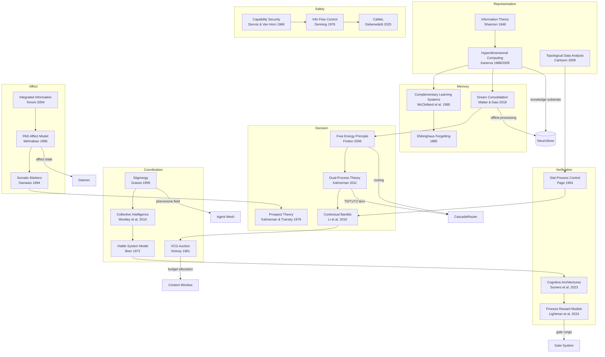

# Research Citations: Comprehensive Bibliography

This directory catalogs every academic and technical reference found across the Roko codebase — a cognitive AI agent framework for autonomous software development. Roko draws from neuroscience, economics, topology, cybernetics, and philosophy to build agents that learn, feel, forget, dream, and cooperate. Every architectural decision traces to published research.

> **Source note**: Roko implementation references in this document point to the public GitHub repository at ```.` These are provenance identifiers, not local filesystem paths.

---

## Files in This Directory

| File | Contents |
|------|----------|
| [hdc-and-vsa.md](hdc-and-vsa.md) | Hyperdimensional computing, Vector Symbolic Architectures, random projection, HNSW |
| [memory-and-learning.md](memory-and-learning.md) | Dream consolidation, offline learning, memory consolidation, Ebbinghaus, contextual bandits, self-learning systems |
| [affect-and-cognition.md](affect-and-cognition.md) | PAD model, somatic markers, ALMA, cognitive architectures, dual-process, cybernetics, IIT, philosophy |
| [verification-and-safety.md](verification-and-safety.md) | SPC (CUSUM/EWMA/BOCPD), process reward models, capability security, information flow control, calibration |
| [agents-and-orchestration.md](agents-and-orchestration.md) | Agent harnesses, stigmergy, FIPA lifecycle, biological analogues, evolutionary dynamics, temporal reasoning |
| [blockchain-and-economics.md](blockchain-and-economics.md) | Mechanism-design diagnostics, density allocation, Gesellian demurrage, protocol standards (MCP/A2A), market microstructure |
| [context-and-search.md](context-and-search.md) | Prompt composition, RAG, attention patterns, information theory, predictive processing |
| [math-and-statistics.md](math-and-statistics.md) | TDA/persistent homology, Johnson-Lindenstrauss, submodularity, ergodicity, changepoint detection, control theory |

---

## Research Landscape Overview

The following Mermaid diagram shows how the major research areas in this bibliography connect to each other and to the core components of the Roko/IronClaw architecture.



The diagram reveals three major intellectual lineages:

1. **Neuroscience lineage** (HDC -> Memory -> Dream -> FEP -> Decision): Kanerva's distributed representations flow into McClelland's memory theory, which grounds the dream consolidation system, which connects to Friston's free energy principle for routing.

2. **Economics lineage** (Mechanism Design -> Market Microstructure -> Prospect Theory): budget-allocation diagnostics, Kelly criterion for budget sizing, and Kahneman-Tversky loss aversion in affective appraisal.

3. **Cybernetics lineage** (VSM -> Cognitive Architectures -> Verification): Beer's Viable System Model shapes the conductor hierarchy, which CoALA extends for language agents, verified by process reward models.

---

## Key Papers (Top 20)

These 20 papers are the most foundational to understanding the Roko architecture. A researcher reading only these would grasp the complete theoretical framework.

| # | Paper | Core Concept | Used In |
|---|-------|-------------|---------|
| 1 | **Kanerva (2009)** — Hyperdimensional Computing. _Cognitive Computation_, 1(2). [DOI](https://doi.org/10.1007/s12559-009-9009-8) | Binding (XOR), bundling (majority-vote), permutation. 10,240-bit BSC substrate. | `roko-core`, `roko-neuro`, `roko-index` |
| 2 | **Friston (2006)** — Free Energy Principle. _Journal of Physiology-Paris_, 100(1-3). [DOI](https://doi.org/10.1016/j.jphysparis.2006.10.001) | All self-organizing systems minimize variational free energy. Principled routing objective. | `roko-learn`, `roko-orchestrator` |
| 3 | **McClelland et al. (1995)** — Complementary Learning Systems. _Psychological Review_, 102(3). [DOI](https://doi.org/10.1037/0033-295X.102.3.419) | Fast episodic memory (hippocampus) consolidates into slow semantic memory (neocortex). | `roko-neuro`, `roko-dreams` |
| 4 | **Mattar & Daw (2018)** — Prioritized Memory Access. _Nature Neuroscience_, 21(11). [DOI](https://doi.org/10.1038/s41593-018-0232-z) | Episodes replayed in order of utility (gain × need). Unified planning/learning/consolidation. | `roko-dreams` (replay module) |
| 5 | **Kahneman (2011)** — _Thinking, Fast and Slow_. Farrar, Straus and Giroux. | System 1 (fast) / System 2 (slow) dual-process theory. T0/T1/T2 cascade. | `roko-orchestrator` |
| 6 | **Damasio (1994)** — _Descartes' Error_. Putnam. | Somatic markers guide decision-making before deliberation. k-d tree SomaticLandscape. | `roko-daimon` |
| 7 | **Woolley et al. (2010)** — Collective Intelligence Factor. _Science_, 330(6004). [DOI](https://doi.org/10.1126/science.1193147) | C-Factor: group intelligence not predicted by individual IQ. Five C-Factor metrics. | `roko-core` (`cfactor.rs`) |
| 8 | **Beer (1972)** — _Brain of the Firm_. Allen Lane. | Viable System Model: five recursively nested subsystems (S1-S5). Conductor hierarchy. | `roko-conductor` |
| 9 | **Vickrey (1961)** — Second-Price Auctions. _Journal of Finance_, 16(1). [DOI](https://doi.org/10.1111/j.1540-6261.1961.tb02789.x) | Truthful bidding is a dominant strategy. VCG for context-window token allocation. | `roko-compose` |
| 10 | **Grasse (1959)** — Stigmergy. _Insectes Sociaux_, 6(1). | Coordination through environmental traces. Seven typed pheromone signals. | `roko-core` (pheromone types) |
| 11 | **Richards & Frankland (2017)** — Forgetting as Regularization. _Neuron_, 94(6). [DOI](https://doi.org/10.1016/j.neuron.2017.04.037) | Active forgetting ≡ L1 regularization. Knowledge decay schedules. | `roko-neuro`, `roko-core` |
| 12 | **Sumers et al. (2023)** — CoALA. [arXiv:2309.02427](https://arxiv.org/abs/2309.02427) | 9-step cognitive pipeline for language agents. Universal Loop adds Gate and Daimon. | `roko-orchestrator`, `roko-agent` |
| 13 | **Lee et al. (2026)** — Meta-Harness. [arXiv:2603.28052](https://arxiv.org/abs/2603.28052) | "The scaffold IS the product." 6x performance gap from scaffold design alone. | Architecture philosophy |
| 14 | **Ebbinghaus (1885)** — Forgetting Curve. | R = e^(-t/S). Spaced repetition. Per-type half-lives: Episodes 48h, Insights 7d. | `roko-core` (`decay.rs`) |
| 15 | **Kahneman & Tversky (1979)** — Prospect Theory. _Econometrica_, 47(2). [DOI](https://doi.org/10.2307/1914185) | Losses weighted 2.25x gains. Gate failures produce 2x affect delta of gate passes. | `roko-daimon` |
| 16 | **Wilson & McNaughton (1994)** — Hippocampal Replay. _Science_, 265(5172). [DOI](https://doi.org/10.1126/science.8036517) | First demonstration of sequential hippocampal replay during sleep. NREM phase. | `roko-dreams` (NREM phase) |
| 17 | **Andrychowicz et al. (2017)** — Hindsight Experience Replay. NeurIPS. [arXiv:1707.01495](https://arxiv.org/abs/1707.01495) | Re-label failed trajectories as successes for different goals. Recovers 45%+ episodes. | `roko-dreams` (Phase 2) |
| 18 | **Gebhard (2005)** — ALMA Temporal Affect. AAMAS. [DOI](https://doi.org/10.1145/1082473.1082478) | Three-layer temporal affect: emotion (tau=0.1), mood (tau=0.5), personality (tau=0.9). | `roko-daimon` |
| 19 | **Schaul et al. (2016)** — Prioritized Experience Replay. ICLR. [arXiv:1511.05952](https://arxiv.org/abs/1511.05952) | Priority proportional to TD error. 41/49 Atari games improved. | `roko-dreams` (replay module) |
| 20 | **Lacaux et al. (2021)** — Sleep Onset Creativity. _Science Advances_, 7(50). [DOI](https://doi.org/10.1126/sciadv.abj5866) | 83% vs 30% rule discovery in N1 hypnagogia. 2.8x creative advantage. | `roko-dreams` (hypnagogia) |

---

## Reading Guide

### For the ML Researcher

**Goal**: Understand how the system connects ML theory to cognitive architecture.

1. **Start with representation**: Kanerva (2009), Kleyko et al. (2022) — understand why hyperdimensional computing, not float embeddings
2. **Memory architecture**: McClelland et al. (1995), Richards & Frankland (2017), Schaul et al. (2016) — learn the biological foundation for tiered memory
3. **Offline learning**: Wilson & McNaughton (1994), Mattar & Daw (2018), Ha & Schmidhuber (2018), Hafner et al. (2025) — dream cycles as offline compute
4. **Online routing**: Li et al. (2010), Chen et al. (2023), Friston et al. (2015) — from bandits to active inference
5. **Verification**: Lightman et al. (2024), Huang et al. (2024), Song et al. (2025) — why external gates are necessary
6. **Self-improvement**: Shinn et al. (2023), Zhao et al. (2024), Lee et al. (2026) — how the scaffold evolves

---

### For the Systems Engineer

**Goal**: Understand the runtime architecture and implementation decisions.

1. **Cognitive architecture**: Sumers et al. (2023), Kahneman (2011) — the 9-step pipeline and T0/T1/T2 tiers
2. **Process control**: Page (1954), Roberts (1959), Adams & MacKay (2007) — CUSUM/EWMA/BOCPD for monitoring
3. **Resource allocation**: Vickrey (1961), Nemhauser et al. (1978), Simon (1971) — context-token allocation and displacement diagnostics
4. **Coordination**: Grasse (1959), Dorigo & Gambardella (1997) — pheromone-based multi-agent coordination
5. **Security**: Dennis & Van Horn (1966), Denning (1976), Debenedetti et al. (2025) — capability security and IFC
6. **Cybernetics**: Beer (1972), Wiener (1948), Ashby (1956) — VSM and requisite variety

---

### For the Neuroscience-Curious Developer

**Goal**: Understand why the biological metaphors are load-bearing, not decorative.

1. **Why emotion matters**: Damasio (1994), Bechara et al. (2000), Zhang et al. (2024) — somatic markers as pre-cognitive heuristics
2. **Why sleep matters**: Wilson & McNaughton (1994), Walker & van der Helm (2009), Lacaux et al. (2021) — replay, depotentiation, and creativity
3. **Why forgetting matters**: Richards & Frankland (2017), Tononi & Cirelli (2014), Ebbinghaus (1885) — forgetting as regularization
4. **Why collective intelligence differs**: Woolley et al. (2010), Holldobler & Wilson (2008) — emergence of group cognition
5. **Why prediction error drives learning**: Clark (2013), Friston (2006), Rescorla & Wagner (1972) — predictive processing
6. **The theoretical unifier**: Parr, Pezzulo & Friston (2022) — active inference as a complete cognitive framework

---

### For the Blockchain Developer

**Goal**: Understand the economic and coordination mechanisms.

1. **Knowledge economics**: Gesell (1916), Hayek (1945) — demurrage and distributed knowledge aggregation
2. **Market design**: Vickrey (1961), Clarke (1971), Groves (1973) — VCG mechanism for truthful allocation
3. **Ergodicity and bet sizing**: Peters (2019), Kelly (1956) — log-wealth maximization for agent budget allocation
4. **Reputation and trust**: Lo (2004), Taleb (2012) — adaptive markets and antifragile reputation systems
5. **Protocol context**: MCP Specification (Anthropic 2024), A2A Protocol (Google 2025), ERC-8004, x402 Protocol
6. **Collective action**: Ostrom (1990), Woolley et al. (2010) — governing knowledge commons

---

## Summary Statistics

| Metric | Value |
|--------|-------|
| Total unique references | 200+ |
| Topic sections (original) | 37 |
| Time span | 1868 (Maxwell) — 2026 (Zhang ACE, Lee Meta-Harness) |
| Disciplines | Neuroscience, cognitive psychology, economics, computer science, philosophy, evolutionary biology, control theory, algebraic topology, mechanism design, information theory, signal processing, market microstructure |
| Papers with DOI or arXiv links | ~160 |
| Roko crates with research-grounded implementations | roko-core, roko-daimon, roko-dreams, roko-learn, roko-neuro, roko-conductor, roko-gate, roko-compose, roko-primitives, roko-chain, roko-index, roko-agent, roko-orchestrator, roko-graph |
| IronClaw subsystems with direct applicability | `crates/ironclaw_safety/`, `src/tools/mcp/`, `src/tools/wasm/`, `src/workspace/`, `src/agent/`, context management |

---

*Generated 2026-07-03. All Roko implementation references point to ```` — no local filesystem paths are used in this document.*
