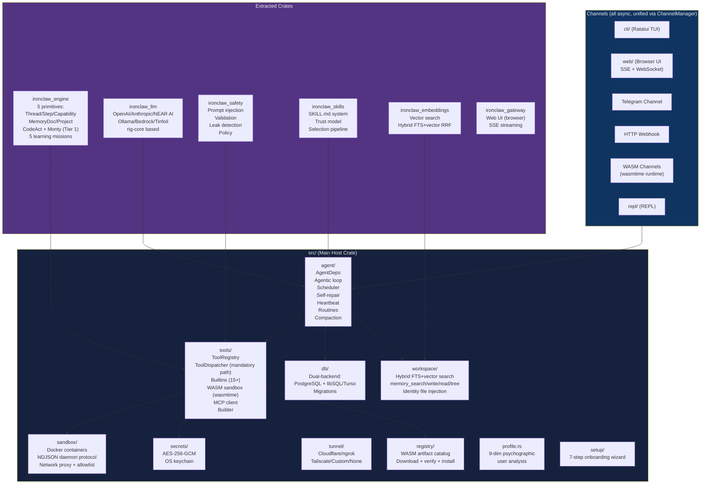
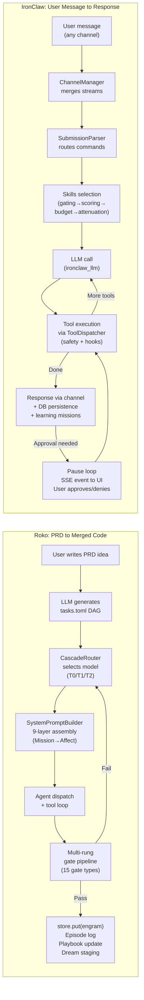

# Roko vs IronClaw: Comprehensive Feature Comparison

**Last updated:** July 3, 2026

This document compares the captured source corpus with the local IronClaw
workspace. Roko names, paths, and feature descriptions are captured-source
provenance labels; they are not live public repository facts. Absence phrases
such as "not identified" mean this reference set does not show a matching
feature, not that an inaccessible repository could never contain one.

Related reference documents in this directory:
- [architecture-overview.md](./architecture-overview.md) — Roko full architecture reference
- [plans-catalog.md](./plans-catalog.md) — Roko integration plans catalog
- [research-citations/README.md](./research-citations/README.md) — Academic and technical citations

IronClaw project root: `CLAUDE.md`, `src/agent/CLAUDE.md`, `crates/ironclaw_engine/CLAUDE.md`

---

## Table of Contents

1. [System Identity](#1-system-identity)
2. [Side-by-Side Comparison Table](#2-side-by-side-comparison-table)
3. [Architecture Diagrams](#3-architecture-diagrams)
4. [What IronClaw Does Better](#4-what-ironclaw-does-better)
5. [What Roko Does Better](#5-what-roko-does-better)
6. [Complementary Strengths](#6-complementary-strengths)
7. [Gap Analysis: Captured Roko Capabilities Not Matched in IronClaw References](#7-gap-analysis)

---

## 1. System Identity

| | Roko | IronClaw |
|---|---|---|
| **Tagline** | "Agents that build themselves" | "User-first security, self-expanding tools, defense in depth" |
| **Primary user** | Developer-operator running automated agent swarms | Individual user with multi-channel personal assistant access |
| **Core metaphor** | A system sophisticated enough to improve its own codebase | A secure personal AI assistant with proactive background execution |
| **Development mode** | Self-hosting: Roko builds Roko by generating PRDs, plans, and code | Human-directed: IronClaw assists humans with tasks across channels |
| **Scale** | Large captured corpus with many crates, app binaries, and tests; exact counts are not relied on here | Significant local Rust workspace with extracted crates and dual-backend persistence |
| **Primary language** | Rust (edition 2024, rustc 1.85+) | Rust (edition 2021, tokio async) |
| **Source set** | captured source corpus | `/Users/will/dev/near/ironclaw/` workspace |

---

## 2. Side-by-Side Comparison Table

### 2.1 Language, Framework, Runtime

| Dimension | Roko | IronClaw |
|-----------|------|----------|
| **Language** | Rust 2024 edition, rustc 1.85+ | Rust 2021 edition |
| **Async runtime** | Tokio (all async I/O) | Tokio (all async I/O) |
| **HTTP framework** | Axum (`roko-serve` captured HTTP surface) | Axum (web gateway, webhook server) |
| **TUI framework** | Ratatui (F1-F7 tabbed dashboard in roko-cli) | Ratatui (full TUI in `src/channels/cli/`) |
| **Error handling** | `thiserror`; `unwrap_used = "deny"` workspace lint | `thiserror`; no `.unwrap()` in production policy |
| **Shared state** | `Arc<T>`, `parking_lot::RwLock`, `dashmap` | `Arc<T>`, `RwLock` (tokio), custom session locks |
| **Build tooling** | `cargo-dist` for release binaries, `cargo-deny` for audit | `cargo fmt`, `cargo clippy --all-features` |
| **CI-enforced architecture** | Layer check script (`scripts/layer_check.rs`) verifies L0-L4 deps | Pre-commit hook (`scripts/pre-commit-safety.sh`) for dispatch path |
| **Embedded scripting** | None | Monty (embedded Python, Tier 1 CodeAct/RLM) in `ironclaw_engine` |

### 2.2 Core Abstraction Model

| Dimension | Roko | IronClaw |
|-----------|------|----------|
| **Universal data type** | `Engram` — content-addressed, decaying, scored, traced, cryptographically attested | No single universal type; domain-specific structs + DB rows |
| **Core trait set** | 1 noun + 9 verbs: `Store`, `Score`, `Verify`, `Route`, `Compose`, `React`, `Bus`, `ColdStore`, `Observe`/`Connect`/`Trigger` | Named traits: `Channel`, `Tool`, `LlmProvider`, `Database`, `EmbeddingProvider`, `Hook`, `Observer`, `Tunnel`, `SuccessEvaluator` |
| **Universal loop** | `loop_tick(store, scorer, gate, router, composer, policy, query, budget, ctx)` — same function for all capabilities | `run_agentic_loop()` in `src/agent/agentic_loop.rs` and `ExecutionLoop::run()` in `crates/ironclaw_engine/` |
| **Layered architecture** | Five strict layers L0-L4 declared in `Cargo.toml`, CI-enforced | Module-based with CLAUDE.md specs per module; pre-commit hooks |
| **Crate shape** | Captured layered crate/app family | Extracted crates plus main `src/` host crate |
| **Primitives layer** | `roko-primitives` (L0): HDC, manifold, TDA, PAD, tropical geometry, robust stats | No dedicated primitives layer; utility types in `ironclaw_common` |

### 2.3 LLM Providers and Routing

| Dimension | Roko | IronClaw |
|-----------|------|----------|
| **LLM backends** | Claude (HTTP + CLI), OpenAI, Codex, Cursor (HTTP + CLI), Ollama, Gemini, Perplexity, OpenAI-compatible, Mock | OpenAI, Anthropic, NEAR AI, Ollama, OpenAI-compatible, Tinfoil, Bedrock (`crates/ironclaw_llm/`) |
| **Routing strategy** | `CascadeRouter` (3-stage adaptive): confidence threshold → UCB exploration → LinUCB contextual bandit, updated after each task | Static configuration via `src/config/llm.rs`; `ironclaw_llm/src/smart_routing.rs` stub exists |
| **Model tiers** | T0 (fast/cheap), T1 (balanced), T2 (powerful/expensive) from `roko-primitives` `TierRouter` | No tier routing; single model per session |
| **A/B testing** | `ExperimentStore` with Thompson sampling over prompt sections and models | Not implemented |
| **Provider health tracking** | `provider_health` module in `roko-learn` adjusts routing weights | Not implemented |
| **Cheap LLM path** | No explicit T0/cheap path for background tasks | `cheap_llm` in `AgentDeps` for heartbeat and lightweight tasks |

### 2.4 Memory System

| Dimension | Roko | IronClaw |
|-----------|------|----------|
| **Memory model** | Neuro: 3-tier progression (Ephemeral Pulse → Durable Engram → Core insight); distillation via LLM; archival to `ArchiveColdSubstrate` | Workspace: flat document store with FTS + vector hybrid search (RRF); identity files injected into system prompt |
| **Search** | HDC similarity (10,240-bit vectors, Hamming distance); temporal indexing; admission control | Hybrid FTS + vector via RRF (`memory_search` tool); 4 tools: `memory_search`, `memory_write`, `memory_read`, `memory_tree` |
| **Embeddings** | HDC fingerprints in `roko-primitives`; `HdcSubstrate` for similarity queries | `crates/ironclaw_embeddings/` — pluggable embedding provider |
| **Knowledge decay** | First-class: every `Engram` has a `Decay` (None / HalfLife / Exponential); cold store archival on weight drop | Not applicable; no decay; `workspace/` rows retained indefinitely |
| **Distillation** | `roko-neuro` distiller runs LLM-driven compression of episodic memory into durable insights | `ironclaw_engine` skill extraction mission distills conversation learnings |
| **Identity files** | Not applicable | `AGENTS.md`, `SOUL.md`, `USER.md`, `IDENTITY.md` injected into system prompt |
| **Knowledge admission** | Admission control gates novelty and utility before persisting | No admission gate is identified in the referenced workspace-memory path |
| **Psychographic profiling** | Not applicable | `src/profile.rs`: 9-dimension psychographic analysis of user |

### 2.5 Tool System

| Dimension | Roko | IronClaw |
|-----------|------|----------|
| **Tool trait** | `ToolDef`, `ToolHandler`, `ToolRegistry`, `ToolContext` in `roko-core`; `EpsilonGreedyBandit` for relevance-based tool selection | `Tool` trait in `src/tools/tool.rs`; `ToolRegistry` for discovery; `ToolDispatcher::dispatch()` as mandatory call path |
| **Built-in tools** | `roko-std` captures tools including `apply_patch`, `bash`, `edit_file`, `glob`, `grep`, `ls`, `read_file`, `run_tests`, `sandbox`, `task_agent`, `web_fetch`, `web_search`, `write_file`, `notebook_edit`, `multi_edit`, `exit_plan_mode`, `todo_write`, `isfr` | `src/tools/builtin/` includes `echo`, `time`, `json`, `http`, `web_fetch`, `file`, `shell`, `memory`, `message`, `job`, `routine`, `extension_tools`, `skill_tools`, `secrets_tools` |
| **Tool execution path** | `ToolDispatcher` in `roko-agent`: parallel execution, timeout, dedup cache, hook chains, validation, truncation, metric emission, cancellation | `ToolDispatcher::dispatch()` in `src/tools/dispatch.rs` — mandatory for all callers, enforced by pre-commit hook |
| **WASM tools** | `sandbox` built-in tool (constrained execution) | Full WASM sandbox: `wasmtime`, fuel metering, memory limits, network allowlist, credential injection, per-tool rate limiting (`src/tools/wasm/`) |
| **WASM channels** | Not applicable | WASM channel runtime (`src/channels/wasm/`) — channels implemented as WASM modules |
| **Dynamic tool building** | Not applicable | `src/tools/builder/` — dynamic WASM tool building, project scaffolding, test harness integration |
| **Rate limiting** | Token-bucket limiter via `governor` crate | Sliding-window rate limiter in `src/tools/rate_limiter.rs`, per-tool rate limiting in WASM |
| **Tool approval** | Hooks and validation | `requires_approval` flag; loop pauses, stores `PendingApproval`, sends SSE; web UI prompts user |
| **Capability leases** | Not applicable | `CapabilityLease` in `crates/ironclaw_engine/`: scoped, time-limited, use-limited grants per thread |

### 2.6 Extension / Plugin System

| Dimension | Roko | IronClaw |
|-----------|------|----------|
| **Plugin model** | `roko-plugin`: event sources implementing `Trigger` trait (cron, filesystem watch, glob); feedback collectors implementing `React` | `src/registry/` extension registry: WASM artifacts with `ExtensionManifest`, download/verify/install via `RegistryInstaller` |
| **Extension identity** | Not applicable | Two-part identity: `credential_name` (backend storage) vs `extension_name` (UI routing) — must not be conflated |
| **First-party extensions** | `roko-mcp-github`, `roko-mcp-slack` as MCP servers | `crates/ironclaw_first_party_extensions/`: GitHub, Gmail, and others with full prompt templates |
| **Auth flow** | JWT/JWKS (`roko-serve`); HMAC-SHA256 for webhooks | OAuth flow with `credential_name`/`extension_name` identity split; auth gate with `request_id` (v2) vs legacy pending_auth (v1) |
| **Extension marketplace** | Not applicable | Registry catalog with embedded JSON + filesystem loading |

### 2.7 Skills System

| Dimension | Roko | IronClaw |
|-----------|------|----------|
| **Skills concept** | `skill_library` in `roko-learn`: learned skill patterns extracted from successful episodes; `playbook` rules extracted and injected into future prompts | `SKILL.md` files: markdown prompt extensions in `~/.ironclaw/skills/` or workspace `skills/`; injected into system prompt |
| **Skill trust model** | Not applicable | Trusted (full tool access) vs Installed (registry, read-only tools) |
| **Skill selection** | Semantic matching via HDC fingerprints; playbook pattern matching | Gating (bin/env/config requirements) → scoring (keywords/patterns/tags) → budget (token limit) → attenuation (trust-based ceiling) |
| **Skill tools** | Not applicable | `skill_list`, `skill_search`, `skill_install`, `skill_remove` |
| **Automated skill extraction** | `roko-learn` playbook: pattern discovered from episode corpus, triggered when similar tasks appear | `ironclaw_engine` skill-extraction mission: fires when a thread succeeds with 5+ steps and 3+ tool actions; stores `DocType::Skill` MemoryDoc |
| **Skill versioning** | Not applicable | `SkillTracker` in `ironclaw_engine/memory/skill_tracker.rs`: confidence tracking, versioned updates, rollback |

### 2.8 Channels

| Dimension | Roko | IronClaw |
|-----------|------|----------|
| **CLI / TUI** | Ratatui TUI with F1-F7 tabs: dashboard, agents, knowledge, learn, plan, research, deploy | Full Ratatui TUI (`src/channels/cli/`); simple REPL (`src/channels/repl.rs`) |
| **Web UI** | `roko-serve` HTTP server; no SSE streaming browser client | Full browser UI via `ironclaw_gateway`; SSE + WebSocket; `src/channels/web/` |
| **Telegram** | Not built-in (could be added via MCP or plugin) | Telegram channel (`credential_name=telegram_bot_token`, `extension_name=telegram`) |
| **HTTP webhook** | HMAC-SHA256 verified webhooks in `roko-serve` | HTTP webhook channel (`src/channels/http.rs`) with secret validation |
| **WASM channels** | Not applicable | WASM channel runtime (`src/channels/wasm/`) — any channel can be a WASM module |
| **Channel trait** | Not a first-class abstraction; HTTP routes are the surface | `Channel` trait (`src/channels/channel.rs`) with `IncomingMessage` / `OutgoingResponse`; `ChannelManager` merges streams |
| **Channel multiplexing** | Multiple HTTP routes; not unified behind a single trait | `ChannelManager` merges all channel streams into one async stream |
| **Editor integration** | `roko-acp` (Agent Client Protocol) for VS Code, JetBrains | Not applicable |
| **Pairing** | Not applicable | Device pairing (`src/cli/pairing.rs`) |

### 2.9 Verification and Safety

| Dimension | Roko | IronClaw |
|-----------|------|----------|
| **Output verification** | Captured multi-rung gate pipeline (`roko-gate`): CompileGate, TestGate, GeneratedTestGate, PropertyTestGate, IntegrationGate, ClippyGate, DiffGate, LlmJudgeGate, BenchmarkGate, SecurityScanGate, FormatCheckGate, FactCheckGate, SymbolGate, VerifyChainGate, ShellGate | No equivalent multi-rung gate pipeline identified; success evaluation in `src/evaluation/` is rule-based + LLM-based |
| **Adaptive thresholds** | EMA-based threshold adaptation per gate; persisted to `.roko/learn/gate-thresholds.json` | `src/estimation/`: cost/time/value estimation with EMA learning; not applied to verification gates |
| **Statistical quality control** | SPC (control charts), PELT (changepoint detection), Hotelling T-squared, Ratchet (quality ratchet) | Not applicable |
| **Prompt injection** | `roko-agent/src/safety/` pre/post execution checks; `QuarantineVault` for suspicious inputs | `crates/ironclaw_safety/`: prompt injection detection, validation, leak detection, policy |
| **Secrets** | JWT/JWKS for HTTP API; chain-based identity (not AES secret storage) | AES-256-GCM encryption, OS keychain for master key (`src/secrets/`) |
| **Anomaly detection** | `ImmuneSystem` with `AnomalyScore`; `QuarantineVault` for isolation | Not applicable |
| **Forensic replay** | `ForensicReplay` and `GateVerdictRecord` for post-incident causal reconstruction | Not applicable |
| **Log scrubbing** | `LogScrubber` in `roko-core` | Sensitive-param redaction in `ToolDispatcher` output sanitization |
| **Role policy** | `RolePolicyManifest` per agent role; `AgentContract` safety contracts | `PolicyEngine` in `crates/ironclaw_engine/capability/policy.rs`: deterministic effect-level allow/deny/approve |
| **Effect types** | `ToolCapabilityPolicy` per role | `EffectType`: `ReadLocal`, `ReadExternal`, `WriteLocal`, `WriteExternal`, `CredentialedNetwork`, `Compute`, `Financial` |

### 2.10 Sandbox

| Dimension | Roko | IronClaw |
|-----------|------|----------|
| **Sandboxing model** | `sandbox` tool in `roko-std` for constrained single-tool execution | Docker-based per-project sandbox; host dir bind-mounted at `/project/`; `sandbox_daemon` binary inside container speaks NDJSON over `docker exec -i` |
| **Sandbox policy** | Not specified | `SandboxPolicy` enum: `ReadOnly`, `WorkspaceWrite`, `FullAccess` |
| **Network proxy** | No in-process network proxy | Network proxy in `src/sandbox/proxy/`: domain allowlist, credential injection, CONNECT tunnel |
| **WASM sandbox** | No wasmtime integration | Full wasmtime-based WASM tool sandbox with fuel metering, memory limits, allowlist |

### 2.11 Orchestration and Multi-Agent

| Dimension | Roko | IronClaw |
|-----------|------|----------|
| **Multi-agent** | `ProcessSupervisor` (roko-runtime): manages agent lifecycle with restart policies; `AgentPool` and `MultiPool` for connection pooling; `hermes` for agent-to-agent messaging; `agent-relay` for WebSocket presence + message forwarding | `Scheduler` in `src/agent/scheduler.rs`: parallel job scheduling; `JobDelegate` for background jobs; Claude Code bridge (`src/worker/claude_bridge.rs`) spawns claude CLI |
| **Orchestration model** | `roko-orchestrator` (L3): plan discovery, task DAG management, Git worktree isolation, parallel execution, merge queue, replanning on failure | `Orchestrator` in `src/orchestrator/`: internal HTTP API for sandbox containers; per-job bearer token store; container lifecycle |
| **DAG execution** | `roko-graph`: cell-based DAG engine with TOML loader, topological sort (petgraph), fan-out/fan-in, conditional edges, hot reloading, cell registry | Not applicable; jobs are independent, not DAG-linked |
| **Plan format** | `tasks.toml` TOML DAG files; PRD → plan → execution pipeline | Not applicable |
| **Replanning** | `replan` module in `roko-orchestrator`: replanning on gate failure with new context | Self-repair (`src/agent/self_repair.rs`): detects stuck jobs, attempts recovery |
| **Worktree isolation** | `worktree` module in `roko-orchestrator`: Git worktree per task for parallel isolation | Not applicable |
| **ERC-8004 agent cards** | `roko-agent-server` handles agent card registration | Not applicable |

### 2.12 Reactive Intelligence

| Dimension | Roko | IronClaw |
|-----------|------|----------|
| **Reactive layer** | `roko-conductor` (L3): watcher layer monitoring execution in real time | No matching reactive intelligence layer identified; `context_monitor.rs` covers memory pressure |
| **Watchers** | `compile_fail_repeat`, `context_window_pressure`, `cost_overrun`, `ghost_turn`, `iteration_loop`, `review_loop`, `spec_drift`, `stuck_pattern`, `test_failure_budget`, `time_overrun` | Context monitor (`src/agent/context_monitor.rs`) detects memory pressure only |
| **Circuit breaker** | Pause, Escalate, Replan, Request human intervention, Abort | Not applicable |
| **Yerkes-Dodson** | Inverted-U arousal modeling to prevent over-escalation | Not applicable |
| **Adaptive thresholds** | `threshold_learner` in conductor adapts watcher trigger thresholds | Not applicable |
| **Federation** | `federation` module: federated conductor coordination across deployments | Not applicable |

### 2.13 Learning and Self-Improvement

| Dimension | Roko | IronClaw |
|-----------|------|----------|
| **Learning model** | Structural: routing weights, gate thresholds, prompt sections, context packs, playbook rules — no LLM fine-tuning | Structural: learning missions in `ironclaw_engine` (5 event-driven missions); skill extraction + repair |
| **Model routing** | `CascadeRouter`: 3-stage adaptive (confidence → UCB → LinUCB bandit); updated after every task | Static LLM configuration; `smart_routing` stub in `ironclaw_llm` |
| **Episode logging** | Structured JSONL at `.roko/episodes.jsonl` with HDC fingerprints for clustering | `ActionRecord` via `ToolDispatcher`; execution trace in `ironclaw_engine/executor/trace.rs` |
| **Playbook extraction** | Automated: pattern discovery from episode corpus → extracted as playbook rules → injected into L5 of next matching prompt | Not applicable |
| **A/B testing** | `ExperimentStore` with Thompson sampling; persisted to `.roko/learn/experiments.json` | Not applicable |
| **Efficiency tracking** | Per-turn: cost, latency, tokens, quality → `.roko/learn/efficiency.jsonl` | `src/estimation/`: EMA-based cost/time/value estimation |
| **HDC clustering** | Episode fingerprinting and clustering by semantic similarity | Not applicable |
| **Active inference** | Exploration-exploitation balance via active inference module | Not applicable |
| **WAL for learning** | Write-ahead log for learning state durability | Not applicable |
| **Learning missions (IronClaw)** | Not applicable | Error diagnosis, skill repair, skill extraction, conversation insights, expected behavior — event-driven, wired in `MissionManager` |

### 2.14 Configuration and Secrets

| Dimension | Roko | IronClaw |
|-----------|------|----------|
| **Configuration** | TOML workspace config; env vars; hot-reload via `config_watcher` in `roko-serve` | Env vars; `src/config/` split by subsystem (agent, llm, channels, database, sandbox, skills, etc.); `~/.ironclaw/settings.json` |
| **Secrets management** | JWT for HTTP; chain-based identity; no AES secret store | AES-256-GCM encryption, OS keychain integration (`src/secrets/`); safe credential injection for WASM tools |
| **Secrets tools** | Not applicable | `secrets_tools` built-in in `src/tools/builtin/` |
| **Base directory** | `.roko/` | `~/.ironclaw/` (via `src/bootstrap.rs`) |
| **Hot reload** | `config_watcher` in `roko-serve` | Not applicable (requires restart) |

### 2.15 Database and Persistence

| Dimension | Roko | IronClaw |
|-----------|------|----------|
| **Storage backend** | JSONL append-only files (`.roko/signals.jsonl`); `FileSubstrate` via `Store` trait; optional `HdcSubstrate` for similarity queries; `ArchiveColdSubstrate` for archival | Dual-backend: PostgreSQL + libSQL/Turso; all new persistence must support both; SQL migrations |
| **Data model** | Universal `Engram` (content-addressed, decaying, lineage DAG) | Conventional DB rows; never deleted (timestamps, filterable) |
| **Content addressing** | BLAKE3 hash of content-bearing fields; lineage chain; Git-like audit trail | Not used |
| **Decay / archival** | First-class: weight(t) = score.effective() × decay.apply(t); cold store on drop | Not applicable; rows retained indefinitely |
| **In-memory index** | `parking_lot::RwLock` JSONL index; HDC-indexed similarity (optional) | In-memory HashMaps as cache; DB is source of truth |
| **Query interface** | `Store::query(q: &Query, ctx: &Context) -> Vec<Engram>` | SQL queries via database trait; workspace FTS + vector search |
| **LLM data retention** | Engrams are persisted; cold store archives rather than deletes | "LLM data is never deleted" policy; turns/steps/events always in DB |
| **Dual backend** | Not applicable (JSONL only) | PostgreSQL + libSQL parity required for all new features |

### 2.16 Testing Infrastructure

| Dimension | Roko | IronClaw |
|-----------|------|----------|
| **Test shape** | Captured suite includes unit, integration, and property-based tests (`proptest`) | Unit + integration (PostgreSQL via `--features integration`); Reborn integration tests; Python/Playwright E2E |
| **Test discipline** | Wire-don't-build; existing code first; no duplicate test coverage | Test-first (TDD); consolidate don't proliferate; test through the caller |
| **Property tests** | `proptest` framework appears in the captured suite | Not identified in this comparison |
| **E2E tests** | Demo environment (`roko-demo`) with scenario manifests | Python/Playwright suite (`tests/e2e/`) |
| **Reborn integration tests** | Not applicable | `tests/support/reborn/`: scripted multi-turn conversation scenarios |
| **Test harness** | `harness/` in `roko-agent` for backend testing; `mock_dispatcher` in `roko-std` | Integration tests via testcontainers for PostgreSQL |
| **Pre-commit hooks** | Not mentioned | `scripts/pre-commit-safety.sh` enforces dispatch path; commit-msg hook requires regression test |
| **Regression policy** | Gate pipeline is the regression check | Every bug fix requires a regression test; enforced by commit-msg hook |

### 2.17 On-Chain Integration

| Dimension | Roko | IronClaw |
|-----------|------|----------|
| **Blockchain support** | `roko-chain` (L2): `ChainClient` trait for reads, `ChainWallet` trait for signed writes; optional `alloy-backend` for real JSON-RPC; `mirage-rs` in-process EVM simulator | Not applicable; OAuth-based identity, local credentials |
| **On-chain verification** | `VerifyChainGate` in `roko-gate` | Not applicable |
| **On-chain storage** | `ChainSubstrate` implementing `Store` trait for on-chain engram persistence | Not applicable |
| **Agent cards** | ERC-8004 agent card registration in `roko-agent-server` | Not applicable |
| **Chain watcher** | `roko-chain-watcher` app: subscribes to chain via JSON-RPC, posts insights via HTTP | NEAR AI is one of the LLM backend options; no chain monitoring |
| **Ethereum simulation** | `mirage-rs`: lazy upstream reads, copy-on-write branching, JSON-RPC server, HDC-indexed knowledge | Not applicable |
| **Cryptographic attestations** | Ed25519 signatures in `roko-core/src/attestation.rs`; provenance + taint chain | Not applicable |
| **Stigmergy** | `mirage-rs` optional `chain` feature includes pheromone subsystems | Not applicable |

### 2.18 MCP Support

| Dimension | Roko | IronClaw |
|-----------|------|----------|
| **MCP client** | `mcp/` in `roko-agent`; JSON-RPC over stdio transport via `roko-mcp-stdio` | `src/tools/mcp/`: client (HTTP), factory (transport dispatch), session management (Mcp-Session-Id header) |
| **MCP servers** | 5 standalone servers: `roko-mcp-stdio`, `roko-mcp-github`, `roko-mcp-slack`, `roko-mcp-scripts`, `roko-mcp-code` | MCP server consumption only; no bundled MCP servers |
| **Transports** | stdio JSON-RPC | HTTP/stdio/Unix (all request-response; no streaming) |
| **Code intelligence MCP** | `roko-mcp-code`: code intel tools backed by `roko-index` (symbol graph, PageRank) | Not applicable |
| **Streaming** | Not mentioned as a limitation | Limitation: no streaming MCP support |
| **Session management** | Not mentioned | `session.rs`: per-server state, Mcp-Session-Id header handling |

### 2.19 Affect / Emotion

| Dimension | Roko | IronClaw |
|-----------|------|----------|
| **Affect model** | `roko-daimon` (L2): PAD (Pleasure-Arousal-Dominance) vectors; somatic marker hypothesis; k-d tree indexed by task feature vectors; mortality modeling; goal tracking; life review | No matching agent affect model identified |
| **User emotion model** | Not applicable | `src/profile.rs`: 9-dimension psychographic profile analysis of the *user* (not the agent) |
| **Behavioral modulation** | High arousal + low dominance → conservative; high pleasure + high dominance → exploratory; PAD-modulated decisions | Not applicable |
| **Yerkes-Dodson** | Conductor uses inverted-U curve to prevent over-arousal and over-escalation | Not applicable |
| **Deadline pressure** | `mortality.rs` models temporal urgency | Not applicable |
| **Self-reflection** | `life_review.rs` retrospective performance analysis | `ironclaw_engine` learning missions; `/expected` command fires expected-behavior mission |

### 2.20 Dream / Consolidation

| Dimension | Roko | IronClaw |
|-----------|------|----------|
| **Offline consolidation** | `roko-dreams` (L2): 6-phase dream cycle (Hypnagogia, Imagination, Rehearsal, Replay, Staging, Routing Advice); scheduled via `cron`; threat simulation | Not applicable |
| **Background learning** | Dream daemon (`roko daemon install`); manual `roko knowledge dream run` | Heartbeat system (default 30 min, reads `HEARTBEAT.md`); `src/agent/heartbeat.rs` |
| **Counterfactuals** | `imagination` phase: "what if we had used a different approach?" | Not applicable |
| **Threat simulation** | `threat` module simulates adversarial scenarios, prepares defensive strategies | Not applicable |
| **Context preloading** | `rehearsal` phase: pre-assembles prompts for upcoming tasks | Not applicable |
| **Experience replay** | `replay` phase: re-evaluates past decisions with current knowledge | Not applicable |

### 2.21 Code Intelligence

| Dimension | Roko | IronClaw |
|-----------|------|----------|
| **Code indexing** | `roko-index` (L2): multi-language parsing, symbol extraction, dependency graph, PageRank scoring, HDC fingerprinting, SQLite persistence | Not applicable (no code indexing engine) |
| **Language providers** | `roko-lang-rust` (tree-sitter), `roko-lang-typescript` (regex), `roko-lang-go` (regex) | Not applicable |
| **Symbol graph** | PageRank-scored symbol dependency graph via petgraph | Not applicable |
| **Code similarity** | HDC fingerprinting of code symbols | Not applicable |
| **Code MCP server** | `roko-mcp-code`: exposes code intelligence via MCP | Not applicable |

### 2.22 Context Management / Compaction

| Dimension | Roko | IronClaw |
|-----------|------|----------|
| **Context monitoring** | `context_window_pressure` conductor watcher (85% utilization threshold); adaptive | `src/agent/context_monitor.rs`: detects memory pressure, suggests `CompactionStrategy` |
| **Compaction strategies** | Not specified as named strategies | Three strategies: `MoveToWorkspace` (80-85%), `Summarize` (85-95%), `Truncate` (>95%) |
| **Progressive disclosure** | Not applicable | Flag-gated progressive tool disclosure (feature: default off, PR #5149) |
| **Context composition** | 9-layer `SystemPromptBuilder` in `roko-compose`: Mission, Role policy, Domain, Task brief, Playbook, Research, Episodes, Knowledge, Affect | Injected identity files + skills + tool descriptions; `ironclaw_engine/executor/context.rs` |
| **Prompt budget allocator** | Density allocation with VCG-style displacement diagnostics in `roko-compose` | Skills selection pipeline and context builder |
| **Token counting** | `tiktoken-rs` and HuggingFace tokenizers in `roko-compose` | Word-count × 1.3 + 4 overhead per message (estimation) |

### 2.23 Deployment

| Dimension | Roko | IronClaw |
|-----------|------|----------|
| **OS service** | `roko daemon install` → launchd (macOS) / systemd (Linux) | `src/service.rs`: launchd / systemd daemon install (`service` CLI subcommand) |
| **Cloud deployment** | Railway (`railway.json`/`toml`), Fly.io (`fly.toml`), Docker | Not specified |
| **Binary distribution** | `cargo-dist` prebuilt binaries for 4 targets (macOS ARM/Intel, Linux glibc/musl) | Not specified |
| **Tunnel support** | Not built-in; HTTP routes are the surface | `src/tunnel/`: Cloudflare, ngrok, Tailscale, custom, none |
| **Doctor / status CLI** | Not applicable | `src/cli/doctor.rs`, `src/cli/status.rs` |
| **Onboarding wizard** | Not applicable | 7-step onboarding wizard (`src/setup/`) |

### 2.24 Prompt System

| Dimension | Roko | IronClaw |
|-----------|------|----------|
| **Prompt templates** | 9 role templates in `roko-compose/src/templates/`; inline assembly | Prompt files in `crates/ironclaw_engine/prompts/*.md`, loaded via `include_str!()` — multi-line strings must live in files |
| **Prompt layers** | 9-layer system: L1 Mission, L2 Role policy, L3 Domain, L4 Task brief, L5 Playbook, L6 Research, L7 Episodes, L8 Knowledge, L9 Affect | Skills injected as prompt extension; identity files; CodeAct preamble/postamble |
| **Prompt experiments** | `ExperimentStore` A/B tests prompt sections | Not applicable |
| **Prompt assembly** | `SystemPromptBuilder` with density allocation and diagnostics | Skills selection pipeline → token budget; context builder in `ironclaw_engine` |

### 2.25 Observability

| Dimension | Roko | IronClaw |
|-----------|------|----------|
| **Observability backend** | `MetricRegistry`, `ProbeRegistry`, `HealthStatus`, `Histogram` in `roko-core`; SSE streaming from `roko-serve` | `src/observability/`: pluggable event/metric recording (noop, log, multi) |
| **OpenTelemetry** | Not mentioned | Limitation: only `log` and `noop` backends; no OpenTelemetry |
| **Tracing** | Not mentioned as custom | Custom tracing formatter (`src/tracing_fmt.rs`); logging levels critical for REPL/TUI |
| **Dashboard** | TUI with F1-F7 tabs (ratatui); `DashboardSnapshot`, `AgentTopology`, `DashboardEvent` | Not applicable (no agent-activity dashboard) |
| **Cost tracking** | `run_ledger` in `roko-runtime`; per-turn `efficiency.jsonl` | `src/agent/cost_guard.rs`: daily budget (cents) + hourly call rate; `src/estimation/` EMA |

### 2.26 Lifecycle Hooks

| Dimension | Roko | IronClaw |
|-----------|------|----------|
| **Hook points** | Pre/post execution hooks in `ToolDispatcher`; `React` trait for conductor watchers | 6 hook points: `BeforeInbound`, `BeforeToolCall`, `BeforeOutbound`, `OnSessionStart`, `OnSessionEnd`, `TransformResponse` |
| **Hook failure mode** | Not specified | Fail-open: hook errors logged, processing continues |

### 2.27 Background Execution

| Dimension | Roko | IronClaw |
|-----------|------|----------|
| **Routine / cron** | `roko-plugin` cron scheduling; dream cycle cron | `src/agent/routine.rs`: `Trigger` (cron/event/system_event/manual) + `RoutineAction` (lightweight/full_job) + `RoutineGuardrails` |
| **Heartbeat** | Heartbeat protocol in `roko-runtime` for health monitoring | `src/agent/heartbeat.rs`: proactive periodic execution, reads `HEARTBEAT.md`, notifies via channel |
| **Filesystem watching** | `notify` crate in `roko-plugin` | Not applicable |
| **Event sources** | `EventSource` implementing `Trigger` trait in `roko-plugin` | Extension events; webhook triggers; channel inbound messages |

### 2.28 Session and Thread Management

| Dimension | Roko | IronClaw |
|-----------|------|----------|
| **Session model** | Agent lifecycle states: Idle, Active, Suspended, Terminated (via `roko-runtime`) | `Session → Thread → Turn` hierarchy; `SessionManager` maps (user_id, channel, external_thread_id) → internal UUID |
| **Thread model** | `roko-core` `namespace`: `CognitiveNamespace`, `Channel` isolation | `ironclaw_engine` `Thread`: unit of work with lifecycle, parent-child tree, capability leases |
| **Undo/redo** | Not applicable | `src/agent/undo.rs`: turn-based undo/redo with max 20 checkpoints |
| **Auth interception** | Not applicable | Auth mode: pending_auth on thread intercepts next message before turn creation |
| **Group chat** | Not applicable | `MEMORY.md` excluded from system prompt for group/channel/supergroup chats |
| **Resume** | `--resume` flag for executor state snapshots in `roko-orchestrator` | `/resume <uuid>` submission command |

### 2.29 Cryptographic and Content Integrity

| Dimension | Roko | IronClaw |
|-----------|------|----------|
| **Content hashing** | BLAKE3 for engram identity; Git-like audit trail | Not used for content identity |
| **Ed25519 attestations** | Every stored engram can have a cryptographic provenance proof | Not applicable |
| **HMAC** | HMAC-SHA256 for webhook verification | Not applicable |
| **Taint chain** | `Provenance` + `Taint` + `TaintInfo` tracking through lineage | Not applicable |
| **Secp256k1** | `mirage-rs` Ethereum-compatible signing | Not applicable |

### 2.30 Self-Hosting / Self-Improvement

| Dimension | Roko | IronClaw |
|-----------|------|----------|
| **Self-hosting** | Core design goal: Roko builds Roko via PRD → plan → agent → gate pipeline | Not a design goal; IronClaw assists humans |
| **PRD workflow** | `roko prd idea`, `roko prd draft`, `roko prd plan` CLI pipeline | Not applicable |
| **Plan generation** | `plan_generate.rs`, `plan_validate.rs` in `roko-cli` | Not applicable |
| **Self-repair** | `roko-conductor` circuit breaker; `self_healing` module; replan on gate failure | `src/agent/self_repair.rs`: detects stuck jobs, broken tools; attempts recovery; `rebuild_broken_tools` via `SoftwareBuilder` |
| **Tool versioning** | Not mentioned | Limitation: no tool versioning or rollback |

---

## 3. Architecture Diagrams

### 3.1 Roko Five-Layer Architecture

```mermaid
graph TB
    subgraph L4["L4 — Applications"]
        CLI["roko-cli\nsubcommands\nratatui TUI"]
        SERVE["roko-serve\nHTTP routes\nSSE + WebSocket"]
        ACP["roko-acp\nEditor integration\n(VS Code, JetBrains)"]
        AGENT_SRV["roko-agent-server\nPer-agent sidecar\nERC-8004 cards"]
    end

    subgraph L3["L3 — Orchestration"]
        ORCH["roko-orchestrator\nDAG executor\nWorktree isolation\nMerge queue"]
        GATE["roko-gate\nGate pipeline\nAdaptive thresholds"]
        COND["roko-conductor\nWatchers\nCircuit breaker\nYerkes-Dodson"]
    end

    subgraph L2["L2 — Capabilities"]
        AGENT["roko-agent\n9 LLM backends\nToolDispatcher\nHermes messaging"]
        COMPOSE["roko-compose\n9-layer prompts\nBudget allocation\nToken counting"]
        LEARN["roko-learn\nCascadeRouter\nEpisode logger\nPlaybooks\nA/B testing"]
        NEURO["roko-neuro\nKnowledge store\nDistillation\nTier progression"]
        DAIMON["roko-daimon\nPAD affect\nSomatic markers\nMortality"]
        DREAMS["roko-dreams\n6 dream phases\nThreat simulation\nExperience replay"]
        FS["roko-fs\nJSONL FileSubstrate\nArchiveColdSubstrate"]
        STD["roko-std\nBuilt-in tools\nNoop defaults"]
        CHAIN["roko-chain\nChainClient\nChainWallet\nmirage-rs EVM"]
        GRAPH["roko-graph\nDAG engine\nCell registry\nHot reload"]
        INDEX["roko-index\nSymbol graph\nPageRank\nHDC fingerprints"]
        MCP["roko-mcp-*\nMCP servers\n(github, slack,\nscripts, code)"]
        LANG["roko-lang-*\nRust, TS, Go\nlanguage providers"]
    end

    subgraph L1["L1 — Kernel + Runtime"]
        CORE["roko-core\nEngram + core traits\nForensic replay\nImmune system"]
        RUNTIME["roko-runtime\nPulseBus (ephemeral)\nProcessSupervisor\nWorkflowEngine"]
    end

    subgraph L0["L0 — Primitives"]
        PRIM["roko-primitives\nHDC 10,240-bit vectors\nManifold geometry\nTDA / Sheaf\nPAD vectors\nTropical geometry"]
    end

    L0 --> L1 --> L2 --> L3 --> L4

    style L0 fill:#1a1a2e,color:#eee
    style L1 fill:#16213e,color:#eee
    style L2 fill:#0f3460,color:#eee
    style L3 fill:#533483,color:#eee
    style L4 fill:#e94560,color:#fff
```

### 3.2 IronClaw Architecture

### 3.3 Side-by-Side Data Flow Comparison

---

## 4. What IronClaw Does Better

### 4.1 User-Facing Security

IronClaw's `crates/ironclaw_safety/` (prompt injection, validation, leak detection, policy) combined with `src/secrets/` (AES-256-GCM, OS keychain) and the Docker sandbox proxy with domain allowlist and credential injection forms a defense-in-depth stack purpose-built for personal user data. Roko's security model focuses on agent-to-agent trust and chain attestations but lacks AES secret storage, OS keychain integration, and an in-process network proxy.

### 4.2 Multi-Channel Access

IronClaw's `Channel` trait unifies CLI TUI, browser web UI (SSE + WebSocket), Telegram, HTTP webhooks, WASM channels, and REPL behind a single abstraction. `ChannelManager` merges all streams so the agent is channel-agnostic. The captured Roko materials emphasize CLI and HTTP routes; no matching channel abstraction, Telegram channel, or WASM channel support is identified here.

### 4.3 WASM Extension Model

IronClaw's full wasmtime-based WASM sandbox (`src/tools/wasm/`) with fuel metering, memory limits, network allowlist, credential injection, per-tool rate limiting, and linear memory persistence is substantially more sophisticated than Roko's `sandbox` built-in tool. IronClaw also supports WASM channels — the entire channel abstraction can be implemented in WASM, enabling community-developed channels without recompiling the host.

### 4.4 Dual-Backend Persistence

IronClaw's PostgreSQL + libSQL/Turso dual-backend (`src/db/`) provides SQL query capabilities, transactional integrity, standard DB tooling, and production-grade operational stories (backups, migrations, replicas). Roko's JSONL `FileSubstrate` is simple and durable but does not scale to high-volume deployments and lacks SQL join semantics.

### 4.5 Secrets and Credential Management

AES-256-GCM encrypted secret storage with OS keychain master key management (`src/secrets/`) is a first-class feature in IronClaw. Extension credentials are injected into WASM tools' linear memory safely. No equivalent AES secret store is identified in the captured Roko materials.

### 4.6 Embedded Scripting (CodeAct / Monty)

IronClaw's Tier 1 execution path (`ironclaw_engine/executor/scripting.rs`) embeds a Python interpreter (Monty), enabling the RLM (Recursive Language Model) pattern: context as variables, recursive `llm_query()` calls, VM suspension for tool execution, and compact output metadata between steps. No captured Roko equivalent for embedded scripting is identified.

### 4.7 Progressive Tool Disclosure

IronClaw implements flag-gated progressive tool disclosure (`crates/ironclaw_engine/`, PR #5149) — the agent's visible tool surface expands as context complexity grows, reducing prompt bloat on simple tasks. The captured Roko tool model does not show the same progressive-disclosure abstraction.

### 4.8 Extension Registry and Onboarding

IronClaw's onboarding wizard (`src/setup/`) and extension registry catalog (`src/registry/`) with WASM artifact download, verification, and install create a lifecycle for user-installable extensions. The credential\_name vs extension\_name identity split is a local onboarding invariant. No equivalent onboarding/registry lifecycle is identified in the captured Roko materials.

### 4.9 Tunnel Abstraction

IronClaw's `src/tunnel/` provides a `Tunnel` trait with Cloudflare, ngrok, Tailscale, Custom (arbitrary command), and None implementations, making self-hosted deployments easier to expose. The captured Roko materials show HTTP routes, not a tunnel abstraction.

### 4.10 Session Undo/Redo

Turn-based undo/redo with checkpoints (`src/agent/undo.rs`) is a user-facing IronClaw feature. No captured Roko session undo path is identified.

---

## 5. What Roko Does Better

### 5.1 Multi-Rung Gate Pipeline (Mechanical Verification)

Roko's captured `roko-gate` design is a major architectural differentiator. Generated artifacts can be routed through compile, test, clippy, diff, LLM judge, property test, benchmark, security scan, format check, fact check, symbol resolution, on-chain verification, and shell gates before acceptance. Thresholds are learned via EMA. Statistical process control (SPC, PELT, Hotelling T-squared) monitors quality trends. A ratchet prevents regressions. No equivalent multi-rung pipeline is identified in IronClaw.

### 5.2 Adaptive Model Routing (CascadeRouter)

Roko's `CascadeRouter` (in `roko-learn`) is a 3-stage adaptive model selection system: confidence threshold → UCB exploration → LinUCB contextual bandit. It updates routing weights after every task completion based on gate outcomes and episode history. IronClaw's LLM routing is static configuration; `ironclaw_llm/src/smart_routing.rs` exists but is a stub.

### 5.3 Affect Engine (Daimon)

`roko-daimon` models agent affect using PAD (Pleasure-Arousal-Dominance) vectors and somatic markers. Past failure experiences are stored in a k-d tree and blended into behavior modulation. IronClaw has a psychographic *user* profile, but no matching agent affect model is identified here.

### 5.4 Offline Consolidation (Dreams)

`roko-dreams` runs during idle periods through 6 phases: hypnagogia (creative recombination), imagination (counterfactuals), rehearsal (task pre-loading), replay (experience replay with current knowledge), staging (insight integration), and routing advice (updating `CascadeRouter`). The threat simulation module prepares defensive strategies before encountering adversarial scenarios. IronClaw's heartbeat system is a periodic execution trigger, not a multi-phase consolidation pipeline.

### 5.5 Code Intelligence (Index)

`roko-index` provides multi-language source parsing (Rust via tree-sitter, TypeScript and Go via regex), symbol extraction, PageRank-scored symbol dependency graphs, HDC fingerprinting for code similarity, and SQLite persistence. This is exposed via `roko-mcp-code` as an MCP server agents can use for codebase navigation. No matching IronClaw code-indexing engine is identified here.

### 5.6 Content-Addressed Immutability and Audit Trail

Every `Engram` is identified by a BLAKE3 hash of its content-bearing fields. Updates create new engrams with lineage links, forming a Git-like DAG. Ed25519 attestations provide cryptographic provenance proofs. `ForensicReplay` enables causal reconstruction for post-incident analysis. IronClaw uses mutable DB rows with timestamps — fully retained, but not content-addressed.

### 5.7 Reactive Intelligence (Conductor)

`roko-conductor` watchers monitor execution in real time and trigger adaptive interventions: pausing, escalating to a higher model tier, replanning, requesting human intervention, or aborting. The Yerkes-Dodson inverted-U model prevents over-escalation. Threshold learning makes watcher triggers adaptive. IronClaw's referenced `context_monitor.rs` path covers memory pressure; no matching reactive intelligence layer is identified here.

### 5.8 Layered Architecture with CI Enforcement

Roko's L0-L4 layer system is declared in `Cargo.toml` and verified by a CI script (`scripts/layer_check.rs`). No crate can depend on a higher layer. This prevents accidental coupling and makes refactoring safe at scale. IronClaw relies on CLAUDE.md conventions and pre-commit hooks, which are softer enforcement mechanisms.

### 5.9 On-Chain Integration

`roko-chain`, `mirage-rs` (in-process EVM simulator with HDC-indexed knowledge and pheromone subsystems), `ChainSubstrate`, `VerifyChainGate`, `roko-chain-watcher`, and ERC-8004 agent card registration form the captured blockchain integration set. It targets agent reputation, on-chain task verification, and decentralized coordination. No matching IronClaw on-chain integration is identified in the referenced local docs.

### 5.10 Structural Learning at Scale

Roko's captured learning mechanisms (CascadeRouter, episode logger, playbook extraction, A/B experiments, efficiency tracking) update persisted JSON/JSONL state. Pattern discovery, HDC clustering, active inference, error pattern learning, and context pack caching are designed to compound over time. IronClaw's learning missions are event-driven; no structural learner that updates routing or gate thresholds is identified here.

### 5.11 DAG-Based Execution and Parallelism

`roko-graph`'s cell-based DAG engine includes TOML graph definitions, topological sort, fan-out/fan-in parallelism, conditional edges, hot reloading, and a cell registry. `roko-orchestrator` adds Git worktree isolation so parallel tasks do not share one working tree. IronClaw's scheduler runs parallel jobs, but no DAG-linked, worktree-isolated equivalent is identified here.

### 5.12 Knowledge Decay and Archival

Engram decay (HalfLife / Exponential functions with domain-specific defaults) plus cold store archival prevents unbounded knowledge growth while preserving the audit trail. A compiler warning decays in hours; a design insight decays over weeks. The active store stays bounded; retrieval quality improves as stale data loses weight. IronClaw retains all workspace rows indefinitely.

### 5.13 Scale and Test Coverage

The captured materials show a broad self-hosting surface: layered crates, app binaries, plan-runner workflows, and property-based tests via `proptest`. Exact LOC, test-count, and CLI-count claims are intentionally not used as evidence here.

---

## 6. Complementary Strengths

Where IronClaw could adopt captured Roko patterns without taking a `roko-*`
dependency:

### 6.1 Gate-Verified Personal Assistant

IronClaw's multi-channel frontend (Telegram, web UI, WASM channels) could adopt a Roko-style multi-rung gate pipeline for code outputs. A first IronClaw-native version would start with compile/lint/test gates around generated artifacts before expanding to security, benchmark, or fact-check gates.

**Integration point:** Wire a `GateRunner` into `crates/ironclaw_engine/src/executor/loop_engine.rs` after tool execution; store gate verdicts as `ThreadEvent` entries.

### 6.2 Adaptive Routing for Personal Use

Roko's `CascadeRouter` (adaptive model selection from gate outcomes) combined with IronClaw's multi-provider `ironclaw_llm` (7 backends) would route simple queries to fast/cheap models and complex coding tasks to powerful models, learning the boundary from actual outcomes. IronClaw's `ironclaw_llm/src/smart_routing.rs` is the natural extension point.

**Integration point:** Implement `CascadeRouter` as an `LlmProvider` wrapper in `crates/ironclaw_llm/`; episode data from `ToolDispatcher` feeds routing updates.

### 6.3 Affect-Aware Personal Assistant

IronClaw's 9-dimension psychographic user profile (`src/profile.rs`) combined with Roko's PAD affect model (`roko-daimon`) would create an assistant that tracks both the user's psychological state and the agent's own internal state. When the user is frustrated (high arousal, low pleasure in their profile) and the agent is stuck (high arousal + low dominance in PAD), the system would adapt communication style and problem-solving strategy simultaneously — a level of social intelligence neither system achieves alone.

**Integration point:** New `AffectBridge` in `crates/ironclaw_engine/` reads user profile from `src/profile.rs`; PAD state modulates prompt assembly in `executor/context.rs`.

### 6.4 Code Intelligence for Channel-Based Workflows

Roko's captured `roko-index` pattern (symbol graph, PageRank, HDC code fingerprints) could be reimplemented as an IronClaw-native MCP server or workspace indexer. This would give IronClaw codebase awareness without requiring the user to name every relevant file.

**Integration point:** Add an IronClaw-native code-index MCP server or workspace service; verify config reaches `src/tools/mcp/factory.rs` and all dispatch paths.

### 6.5 Dual-Backend Persistence for Roko

The captured `Store` trait pattern is cleanly separated from storage details. IronClaw's dual-backend pattern (PostgreSQL + libSQL with SQL migrations) could inform an IronClaw-native content-addressed memory store with SQL joins, full-text search, transactional integrity, and standard operational tooling.

**Integration point:** Implement an IronClaw-owned store facade using the DB abstraction patterns from `src/db/CLAUDE.md`.

### 6.6 Dream Consolidation for Personal Memory

Roko's captured dream-cycle pattern (hypnagogia → imagination → rehearsal → replay → staging → routing advice) could guide IronClaw workspace-memory consolidation. The IronClaw version should be heartbeat-bounded and write derived memories through the existing workspace/memory APIs.

**Integration point:** Add an IronClaw-owned consolidation crate or module, scheduled via the routine engine (`src/agent/routine_engine.rs`); outputs written as durable workspace memories.

### 6.7 On-Chain Agent Reputation for IronClaw

The captured ERC-8004 agent card pattern could be combined with IronClaw's extension/credential model if IronClaw later needs chain-native agent identity. That would require a dedicated security and product review because it changes identity, reputation, and external coordination assumptions.

### 6.8 Shared Safety Crate

`crates/ironclaw_safety/` (prompt injection detection, validation, leak detection, policy) is already an extracted crate. The captured Roko `QuarantineVault` / `ImmuneSystem` concepts are useful design inputs, but any sharing should happen through explicit crate boundaries and compatibility tests.

---

## 7. Gap Analysis: Captured Roko Capabilities Not Matched in IronClaw References

This section lists captured Roko capabilities with no matching IronClaw feature identified in the local references above. Treat them as adoption candidates, not as proof about any live external source.

### 7.1 Multi-Rung Gate Pipeline

**Roko:** `roko-gate` with 15 gate types, adaptive EMA thresholds, SPC/PELT/Hotelling statistical quality control, ratchet, process reward model.

**IronClaw gap:** No matching mechanical output verification pipeline is identified. Code changes, factual claims, and security-relevant outputs do not appear to pass through automated multi-rung gates.

**Severity:** High. This is the most significant missing capability for any agent system that produces code or makes verifiable claims.

### 7.2 Adaptive Model Routing

**Roko:** `CascadeRouter` with 3-stage learning: confidence threshold → UCB → LinUCB contextual bandit. Updated from gate outcomes. Persisted to `.roko/learn/cascade-router.json`.

**IronClaw gap:** Static LLM configuration. `smart_routing.rs` stub exists but is not identified as a learned router. No outcome-based model-selection loop is identified.

**Severity:** Medium. The cost/quality impact grows as task volume increases; at low volume, static routing is acceptable.

### 7.3 Affect Engine and Behavioral Modulation

**Roko:** `roko-daimon` PAD model, somatic markers, k-d tree indexed by task features, mortality modeling, goal tracking.

**IronClaw gap:** No agent affect model is identified. Past failure-derived risk modulation is not shown in the referenced paths.

**Severity:** Medium. Affects long-running workflows where behavioral adaptation prevents frustration spirals.

### 7.4 Offline Consolidation (Dreams)

**Roko:** `roko-dreams` 6-phase dream cycle with hypnagogia, imagination, rehearsal, replay, staging, routing advice; threat simulation.

**IronClaw gap:** Heartbeat system runs periodic execution but is not identified as a multi-phase consolidation pipeline. Counterfactual exploration, experience replay, and pre-task rehearsal are not shown in the referenced paths.

**Severity:** Medium. Most impactful for long-running personal assistant deployments where accumulated experience should compound.

### 7.5 Code Intelligence Engine

**Roko:** `roko-index` multi-language parser, symbol graph, PageRank, HDC fingerprints, SQLite index; exposed via `roko-mcp-code`.

**IronClaw gap:** No code-indexing engine is identified. The agent can search files manually via shell/file tools, but this comparison does not identify automatic symbol-level relevance ranking.

**Severity:** Medium-High for developer use cases. IronClaw's `web_fetch` and `shell` tools partially compensate but do not provide symbol-level precision.

### 7.6 DAG-Based Parallel Execution

**Roko:** `roko-graph` cell-based DAG engine + `roko-orchestrator` worktree isolation + merge queue.

**IronClaw gap:** Jobs are not identified as DAG-linked. No dependency-aware scheduling plus per-task worktree isolation is shown in the referenced paths.

**Severity:** Medium. Primarily relevant for long multi-step agentic workflows, less relevant for conversational use cases.

### 7.7 Reactive Intelligence (Conductor Watchers)

**Roko:** `roko-conductor` with 10 adaptive watchers, circuit breaker, Yerkes-Dodson arousal modeling, federation.

**IronClaw gap:** `context_monitor.rs` handles memory pressure. This comparison does not identify watchers for repeated compilation failure, cost overrun, ghost turns, infinite loops, spec drift, test failure budgets, or time overrun.

**Severity:** High for long-running autonomous jobs. Without these watchers, stuck or runaway jobs consume budget without user awareness until the next check-in.

### 7.8 On-Chain Integration

**Roko:** `roko-chain`, `mirage-rs` EVM simulator, `ChainSubstrate`, `VerifyChainGate`, `roko-chain-watcher`, ERC-8004 agent cards, Ed25519 attestations, secp256k1 signing.

**IronClaw gap:** No chain-native integration is identified in the referenced docs. Agent identity is OAuth/credential oriented rather than on-chain reputation oriented.

**Severity:** Low for current IronClaw use cases. High if IronClaw intends to participate in decentralized agent economies.

### 7.9 Property-Based Testing

**Roko:** Captured test materials include `proptest` for invariant testing across input spaces.

**IronClaw gap:** No property-based tests are identified in this comparison; most referenced tests are example-based unit, integration, or E2E tests.

**Severity:** Low for user-facing features; Medium for cryptographic, encoding, and protocol code where edge cases matter.

### 7.10 Content-Addressed Audit Trail

**Roko:** BLAKE3 hashing, lineage DAGs, Ed25519 attestations, `ForensicReplay` for causal reconstruction.

**IronClaw gap:** Mutable DB rows with timestamps provide history but not content integrity guarantees or causal provenance chains.

**Severity:** Low for current use cases; High for security-sensitive or compliance-relevant deployments.

### 7.11 A/B Testing for Prompts

**Roko:** `ExperimentStore` with Thompson sampling over prompt sections and model choices; persisted to `.roko/learn/experiments.json`.

**IronClaw gap:** No systematic A/B testing of prompt variants. Skills system allows manual prompt extension but no controlled experiments.

**Severity:** Low at small scale; higher as IronClaw serves more users or operates autonomous workflows at volume.

### 7.12 Knowledge Decay and Cold Store Archival

**Roko:** Per-engram decay functions (HalfLife / Exponential); `ArchiveColdSubstrate` archives aged-out engrams; active store remains bounded.

**IronClaw gap:** All workspace rows retained indefinitely. No decay; no archival. The workspace grows without bound, degrading retrieval quality as signal-to-noise ratio drops over years.

**Severity:** Low in the short term; High in long-running personal assistant deployments where workspace accumulates years of history.

---

*This document was authored July 3, 2026. Roko reference: [architecture-overview.md](./architecture-overview.md). IronClaw reference: `CLAUDE.md`, `src/agent/CLAUDE.md`, `crates/ironclaw_engine/CLAUDE.md`.*
