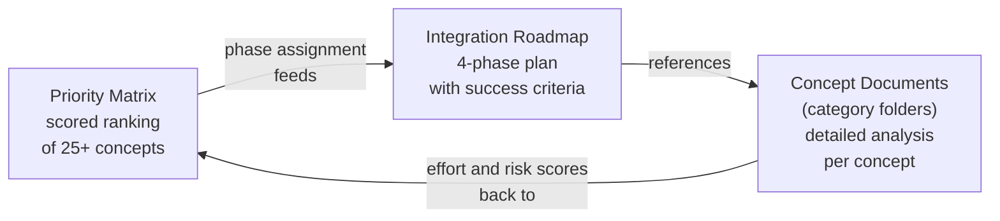

# Strategy

This category synthesizes the 28 concept analyses into actionable decisions: a four-phase phased adoption roadmap and a scored priority matrix that ranks every concept by composite ROI. Read these documents when deciding what to build next, how to sequence it, and how to measure success.

## Documents

| Document | Summary |
|----------|---------|
| [Integration Roadmap](integration-roadmap.md) | Four-phase adoption plan with specific files, trait signatures, test strategies, rollback procedures, and measurable success criteria for each phase. Phase 1: quick wins (robust statistics, metacognitive monitor, Ebbinghaus decay, BLAKE3 dedup). Phase 2: core enhancements (cascade router, HDC, gate pipeline rungs 1–4, enhanced heartbeat/dreams). Phase 3: architecture evolution (DAG engine, conductor, cognitive speeds, full dreams). Phase 4: advanced features (NEAR identity, pheromones, code intelligence, affect engine, VCG auction). |
| [Priority Matrix](priority-matrix/README.md) | Impact vs. effort quadrant ranking of 25+ concepts, scored on five axes (user impact 30%, system impact 20%, implementation effort 25%, risk 15%, dependency burden 10%). Stars (high impact, low effort): metacognitive monitor, Ebbinghaus decay, BLAKE3 dedup, robust statistics. Big bets: cascade router, DAG engine, full dream consolidation, gate pipeline. Estimated ~5,250–5,950 LOC for the top 10 features. |

The `priority-matrix/` folder contains focused sub-documents:

| Sub-document | Contents |
|-------------|----------|
| [priority-matrix/README.md](priority-matrix/README.md) | Methodology, scoring table, quadrant diagram, top-5 summary, decision flowchart, LOC estimates |
| [priority-matrix/detailed-rankings.md](priority-matrix/detailed-rankings.md) | All 25 items with full justifications, moonshots, and implementation location reference |
| [priority-matrix/implementation-sketches.md](priority-matrix/implementation-sketches.md) | Complete Rust code for top 10 priorities, ready to drop into the source tree |
| [priority-matrix/quick-wins.md](priority-matrix/quick-wins.md) | Five Stars-tier items with first-PR instructions, review checklists, and a Week 1 schedule |
| [priority-matrix/synergy-analysis.md](priority-matrix/synergy-analysis.md) | Four synergy clusters, dependency graph, combined value analysis, ROI calculations, before/after scenarios |
| [priority-matrix/benchmarking-plans.md](priority-matrix/benchmarking-plans.md) | Metrics, baselines, targets, SQL schemas, and alerting thresholds for each top-10 priority |
| [priority-matrix/references.md](priority-matrix/references.md) | Cross-references to source docs, IronClaw files touched, migration table, academic citations |

## Decision Flow

## Quick Start

Read [priority-matrix/README.md](priority-matrix/README.md) first if you need to make a prioritization decision quickly. The composite ROI scores let you pick a starting point without reading all concept documents.

Read [priority-matrix/quick-wins.md](priority-matrix/quick-wins.md) if you are ready to start coding today — it has first-PR instructions for each of the five Stars-tier features with review checklists and a Week 1 schedule.

Read [Integration Roadmap](integration-roadmap.md) once you have chosen a set of features and need concrete implementation guidance: what files to touch, what tests to write, and what rollback looks like.

Both documents are self-contained — they include enough context to understand each concept without requiring the full concept documents.
