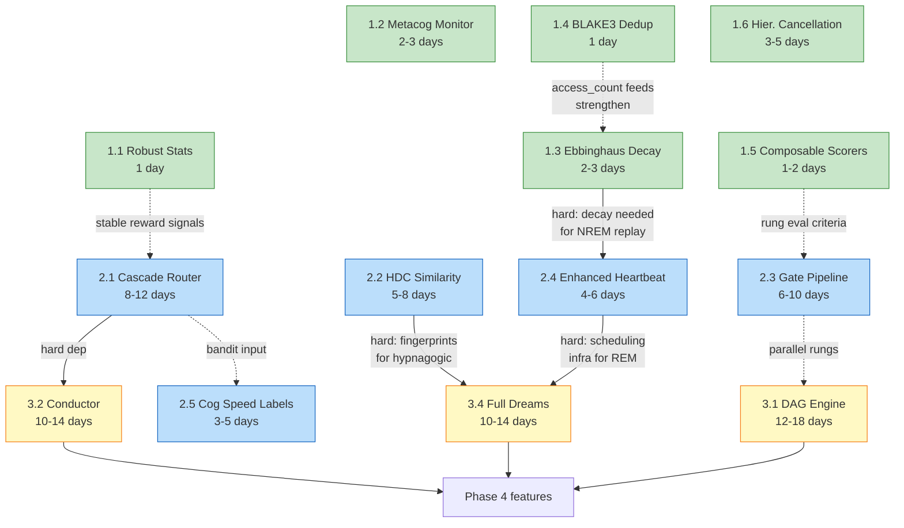
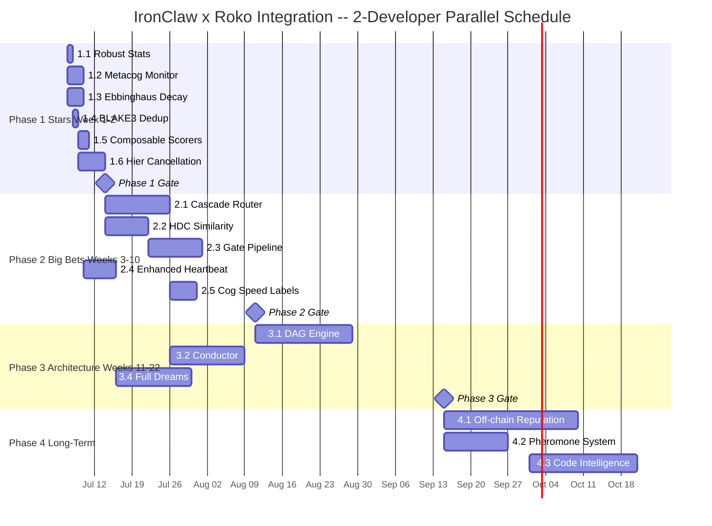

# Integration Roadmap: Roko Concepts into IronClaw

> **Role of this document**: The *how and when* — which files to touch, what
> tests to write, what rollback looks like, and in what order to proceed.
>
> **Priority Matrix** ([priority-matrix.md](./priority-matrix/README.md)) handles the
> *what and why* — composite ROI scores and tier rankings for all 25 items.
> Read it first to confirm your starting point, then return here for execution.
>
> **Implementation Blueprints** ([../implementation/](../implementation/)) contain
> full Rust code for each feature. This roadmap links to them rather than
> reproducing code inline.

---

## Table of Contents

1. [Quick Start](#1-quick-start)
2. [Current IronClaw State](#2-current-ironclaw-state)
3. [Phase Dependency Graph and Critical Path](#3-phase-dependency-graph-and-critical-path)
4. [Timeline](#4-timeline)
5. [Phase 1: Quick Wins](#5-phase-1-quick-wins)
6. [Phase 2: Big Bets](#6-phase-2-big-bets)
7. [Phase 3: Architecture Evolution](#7-phase-3-architecture-evolution)
8. [Phase 4: Long-Term](#8-phase-4-long-term)
9. [Risk Mitigation](#9-risk-mitigation)
10. [Implementation Principles](#10-implementation-principles)
11. [Feature Flag Inventory](#11-feature-flag-inventory)
12. [Validation Checkpoints](#12-validation-checkpoints)
13. [Cross-Reference Index](#13-cross-reference-index)

---

## 1. Quick Start

**If you have one day:**
Build [1.1 Robust Statistics](#51-robust-statistics) and [1.4 BLAKE3 Dedup](#54-blake3-content-deduplication) together. Both are under 200 lines, touch narrow areas (`src/util.rs`, `src/estimation/learner.rs`, `src/workspace/mod.rs`), require zero new dependencies, and produce measurable immediate improvements. See the implementation: [../implementation/01-rust-core-blueprints.md](../implementation/01-rust-core-blueprints.md).

**If you have one week:**
Complete all of Phase 1: add 1.1 + 1.4 on day 1, [1.3 Ebbinghaus Decay](#53-ebbinghaus-memory-decay) on days 2-3, and [1.2 Metacognitive Monitor](#52-metacognitive-monitor) on days 4-5. All four are independent. By end of week: workspace is self-curating, outlier estimation is dampened, and stuck loops are detected earlier. Items 1.5 and 1.6 can follow immediately after.

**If you have one month:**
Complete Phase 1 (week 1), then run [2.1 Cascade Router](#61-cascade-router--online-learning) in shadow mode (weeks 2-3), and simultaneously build [2.3 Gate Pipeline](#63-gate-verification-pipeline) rungs 1-2 (compile + lint). By end of month: LLM routing data collected for bandit warm-up, basic code-edit verification active.

**Dependency shortcut**: [1.3 Ebbinghaus Decay](#53-ebbinghaus-memory-decay) must ship before [2.4 Enhanced Heartbeat](#64-enhanced-heartbeat) and [3.4 Full Dream Consolidation](#73-full-dream-consolidation). Everything else in Phase 1 is parallel.

---

## 2. Current IronClaw State

Understanding what already exists prevents re-implementing solved problems.

### What already exists (each phase builds on these)

| Capability | Current Location | Maturity |
|-----------|-----------------|----------|
| Estimation with EMA learning | `src/estimation/learner.rs` | Production. Phase 1.1 adds outlier dampening on top. |
| Stuck-loop detection | `DuplicateToolCallTracker` in `src/agent/agentic_loop.rs` | Production. Catches exact consecutive repeats only. Phase 1.2 extends it to alternating patterns and cost runaway. |
| Workspace memory (FTS + vector RRF) | `src/workspace/` | Production. `MemoryDocument.metadata` is already a JSON column — no migration needed for decay or hash fields. |
| BLAKE3 | Already in `Cargo.toml` via WASM storage | Phase 1.4 requires zero new deps. |
| LLM routing | `SmartRoutingProvider` in `crates/ironclaw_llm/src/smart_routing.rs` | Production. Static 13-D scorer. Phase 2.1 wraps it with a learning bandit. |
| Circuit breaker | `crates/ironclaw_llm/src/circuit_breaker.rs` | Production. Reactive (trips after 5 failures). Phase 3.2 adds predictive layer. |
| Heartbeat | `src/agent/heartbeat.rs` | Production. Runs every 30 min, reads `HEARTBEAT.md`. Phase 2.4 adds consolidation subsystems. |
| Job-level stuck detection | `src/agent/self_repair.rs` | Production. Phase 1.2 Metacognitive Monitor adds turn-level detection alongside it. |
| Tool dispatch audit trail | `src/tools/dispatch.rs` | Production. All new features must dispatch through `ToolDispatcher::dispatch()`. |
| Progressive tool disclosure | `crates/ironclaw_engine/` (flag-gated) | Partial. Phase 4.5 budget composition enhances this. |
| WASM tool sandbox | `src/tools/wasm/` | Production. Phase 3.1 DAG engine uses this for cell execution. |
| Dual-backend DB | `src/db/` (PostgreSQL + libSQL) | Production. Every new DB migration must run on both. |
| Evaluation system | `src/evaluation/` | Production. Phase 1.5 Composable Scorers formalizes the ad-hoc scoring with a reusable trait. |

### What is missing (what we are building)

- No outlier-resistant estimation (Phase 1.1)
- No memory decay or deduplication (Phase 1.3, 1.4)
- No alternating-pattern or cost-runaway detection (Phase 1.2)
- No reusable scorer trait (Phase 1.5)
- No hierarchical session/tool cancellation (Phase 1.6)
- No adaptive model routing (Phase 2.1)
- No compositional memory search (Phase 2.2)
- No progressive code verification (Phase 2.3)
- No predictive provider health monitoring (Phase 3.2)
- No DAG workflow execution (Phase 3.1)
- No offline memory consolidation beyond the basic heartbeat (Phase 2.4, 3.4)

---

## 3. Phase Dependency Graph and Critical Path

Solid arrows are hard dependencies. Dashed arrows are soft dependencies (beneficial but not required).



**Critical paths:**

```
Dream Consolidation (longest, ~13 weeks):
  1.3 Decay (3d) → 2.4 Heartbeat (6d) → 3.4 Full Dreams (14d)

Cascade Router / Conductor (parallel path):
  2.1 Router (12d) → 3.2 Conductor (14d)

Optimal parallel schedule (2 developers):
  Week 1-2:   Dev A + B: [1.1]+[1.2]+[1.3]+[1.4]+[1.5]+[1.6]  (all parallel)
  Week 3-10:  Dev A: [2.1] then [3.2]
              Dev B: [2.2] + [2.3] + [2.4]
  Week 11-22: Dev A: [3.1]
              Dev B: [2.5] then [3.4]
  Total: ~14 weeks wall-clock with 2 devs (vs ~26 weeks serial)
```

---

## 4. Timeline



---

## 5. Phase 1: Quick Wins

**Rationale**: All six items are Stars tier in the [priority matrix](./priority-matrix/README.md) (composite ROI 3.50-4.55, ranks 1-6). Each is independent, low-risk, touches a narrow area of the codebase, and delivers immediate value. Complete these first — they establish patterns (decay, hashing, monitoring, scoring) that Phases 2-3 build on.

**PR structure**: One PR per item. No blocking dependencies between them (1.4 before 1.3 is optimal but not required).

**Implementation code**: [../implementation/01-rust-core-blueprints.md](../implementation/01-rust-core-blueprints.md), [../implementation/03-ironclaw-integration-recipes.md](../implementation/03-ironclaw-integration-recipes.md)

---

### 5.1 Robust Statistics

**Priority matrix rank**: #4 (composite 4.20)
**Concept doc**: [../core-concepts/mathematical-primitives.md](../core-concepts/mathematical-primitives.md)
**Implementation**: [../implementation/01-rust-core-blueprints.md](../implementation/01-rust-core-blueprints.md)

**What**: Add `trimmed_mean()`, `median()`, and `mad()` (Median Absolute Deviation) to `src/util.rs`. Wire into `src/estimation/learner.rs` to dampen EMA updates when a cost ratio is more than 3 MAD from the recent median.

**Why IronClaw needs it**: LLM response costs are heavy-tailed. A single anomalous $50 call can distort the EMA `cost_factor` by 50%+, inflating estimates for the next 20+ requests. `src/estimation/learner.rs` currently uses raw EMA with no outlier guard.

**Files to touch:**

| File | Change |
|------|--------|
| `src/util.rs` | Add `trimmed_mean()`, `median()`, `mad()` as `pub(crate)` |
| `src/estimation/learner.rs` | Dampen alpha when ratio > 3 MAD from recent median; add `recent_cost_ratios: VecDeque<f64>` window (capacity 50) |
| `src/estimation/cost.rs` | Use `trimmed_mean` for tool cost aggregation |
| `src/estimation/time.rs` | Use `trimmed_mean` for tool time aggregation |

**PR checklist:**
- [ ] `cargo test` passes with all existing estimation tests
- [ ] `cargo clippy --all-features` zero warnings
- [ ] 6 unit tests in `util.rs` (trimmed mean, median, MAD with edge cases)
- [ ] Outlier test: 10x cost spike dampens EMA update to < 10% of undampened value
- [ ] No behavioral change for non-outlier inputs (verified by EMA convergence check)

**Rollback**: Revert commit. No DB changes, no config changes, no new deps.

**Estimated effort**: 1 developer-day.

---

### 5.2 Metacognitive Monitor

**Priority matrix rank**: #1 (composite 4.55)
**Concept doc**: [../agent-intelligence/agent-patterns.md](../agent-intelligence/agent-patterns.md)
**Implementation**: [../implementation/03-ironclaw-integration-recipes.md](../implementation/03-ironclaw-integration-recipes.md)

**What**: Extend `DuplicateToolCallTracker` in `src/agent/agentic_loop.rs` into a `MetacognitiveMonitor` with two new detection modes:
- **Diversity check**: sliding window detects alternating A/B/A/B/... stuck patterns the current tracker misses
- **Cost runaway**: projects whether the current turn will exhaust its per-turn budget before completion

**What already exists**: `DuplicateToolCallTracker` catches exact consecutive identical failing batches. It misses alternating patterns (A fails, B fails, A fails...) and cost-trend projection.

**Files to touch:**

| File | Change |
|------|--------|
| `src/agent/agentic_loop.rs` | Evolve `DuplicateToolCallTracker` into `MetacognitiveMonitor` with diversity window and spend tracking |
| `src/agent/cost_guard.rs` | Add `remaining_daily_budget_cents() -> u32` accessor |

**PR checklist:**
- [ ] All existing agentic loop tests pass (no regression)
- [ ] 4 new unit tests: alternating A/B/A/B pattern detected; diverse tools no false positive; cost runaway at 90% projection; consecutive duplicate still works
- [ ] Pattern detected within 10 iterations for A/B/A/B alternation (33% threshold)
- [ ] All internal state logging uses `debug!`, never `info!`

**Rollback**: The monitor is a strict superset of the old tracker. Remove the two new mode fields to return to baseline behavior.

**Estimated effort**: 1-2 developer-days.

---

### 5.3 Ebbinghaus Memory Decay

**Priority matrix rank**: #2 (composite 4.50)
**Concept doc**: [../core-concepts/universal-engram.md](../core-concepts/universal-engram.md)
**Implementation**: [../implementation/01-rust-core-blueprints.md](../implementation/01-rust-core-blueprints.md)

**What**: Forgetting curve for workspace memory entries. Decay state lives in `MemoryDocument.metadata["decay"]` — no DB migration required (the column is already a JSON field in both backends). Memories accessed frequently double their stability period (`strengthen()`). Entries below 1% strength are archived, not deleted.

**Why IronClaw needs it**: After months of use, the workspace accumulates stale entries that dilute `memory_search` quality. Decay keeps the workspace sharp without any data loss.

**Architecture note**: Decay state is stored entirely in the existing `MemoryDocument.metadata` JSON column. No new columns, no migration, no dual-backend burden.

**Files to touch:**

| File | Change |
|------|--------|
| `src/workspace/document.rs` | Add `DecayVariant` enum and `DecayState` helper |
| `src/workspace/mod.rs` | Set default decay on write; add `archive_decayed()` |
| `src/workspace/search.rs` | Factor strength into ranking; filter archived entries |
| `src/tools/builtin/memory.rs` | Bump stability on each `memory_read` access |

**Identity files must never decay**: paths starting with `identity/`, `system/`, or named `SOUL.md`, `USER.md`, `AGENTS.md`, `IDENTITY.md`, `HEARTBEAT.md` use `DecayVariant::None`.

**PR checklist:**
- [ ] All existing workspace tests pass
- [ ] New entries get `DecayVariant::Ebbinghaus` (1h initial stability) by default
- [ ] Identity files get `DecayVariant::None`
- [ ] 6 unit tests for `DecayVariant` (variants, strengthen doubles stability, archive threshold)
- [ ] Entries accessed 5 times have `stability_seconds = 115200` (3600 * 2^5 = 32 hours)
- [ ] `archive_decayed()` runs in heartbeat context only, never during active sessions
- [ ] No `DELETE` SQL anywhere — archival is `metadata.status = "archived"`
- [ ] No database migrations required (confirmed: metadata is existing JSON column)

**Rollback**: Remove decay metadata handling. Existing entries with decay metadata in JSON are ignored if code is reverted.

**Estimated effort**: 2-3 developer-days.

---

### 5.4 BLAKE3 Content Deduplication

**Priority matrix rank**: #3 (composite 4.30)
**Concept doc**: [../core-concepts/universal-engram.md](../core-concepts/universal-engram.md)
**Implementation**: [../implementation/01-rust-core-blueprints.md](../implementation/01-rust-core-blueprints.md)

**What**: BLAKE3 hash of memory content before writing. When a duplicate is detected, merge with the existing entry (bump `access_count`) rather than creating a second entry.

**Why IronClaw needs it**: LLM agents frequently re-learn the same fact across sessions. "User prefers dark mode" can accumulate as 5+ near-identical workspace entries, diluting search and wasting context window.

**Prerequisite check**: BLAKE3 is already in `Cargo.toml` via WASM storage. Zero new dependencies.

**Files to touch:**

| File | Change |
|------|--------|
| `src/workspace/document.rs` | Add `content_hash: Option<String>` field |
| `src/workspace/mod.rs` | Hash content before write; `find_by_content_hash()`; merge on match |
| `src/tools/builtin/memory.rs` | Return "Merged with existing memory at <path>..." on dedup |

**PR checklist:**
- [ ] Duplicate content creates one entry, not two
- [ ] Existing entry's `access_count` incremented on dedup
- [ ] Tool output explicitly reports merge path
- [ ] Different content (even 1 character change) creates separate entries
- [ ] BLAKE3 overhead < 1ms per write (it is ~13ns/KB)
- [ ] No new `Cargo` dependencies

**Rollback**: Remove the `find_by_content_hash()` call. Content hash remains in metadata as inert JSON on existing entries.

**Estimated effort**: 1-2 developer-days.

---

### 5.5 Composable Scorers

**Priority matrix rank**: #5 (composite 3.90)
**Concept doc**: [../agent-intelligence/agent-patterns.md](../agent-intelligence/agent-patterns.md)
**Implementation**: [../implementation/03-ironclaw-integration-recipes.md](../implementation/03-ironclaw-integration-recipes.md)

**What**: A `Scorer` trait in `src/evaluation/` that formalizes quality scoring with a reusable, composable pipeline. Each scorer returns `Score { value: f64, confidence: f64, label: &str }`. Scorers compose via `CompositeScorer` using configurable weights.

**Why IronClaw needs it**: The evaluation module has scattered quality checks. Formalizing the trait enables Phase 2.3's gate pipeline to share the same evaluation infrastructure, and makes it easy to add new quality criteria consistently.

**Files to touch:**

| File | Change |
|------|--------|
| `src/evaluation/scorer.rs` | New file: `Scorer` trait, `Score` type, `CompositeScorer` |
| `src/evaluation/mod.rs` | Export new types |

**PR checklist:**
- [ ] `CompositeScorer` with two scorers produces weighted average
- [ ] Zero-weight scorer contributes nothing to composite
- [ ] Score confidence propagates correctly
- [ ] 4 unit tests

**Rollback**: Remove new file. Existing evaluation code is unchanged.

**Estimated effort**: 1-2 developer-days.

---

### 5.6 Hierarchical Cancellation

**Priority matrix rank**: #6 (composite 3.50)
**Concept doc**: [../execution-verification/runtime-infrastructure.md](../execution-verification/runtime-infrastructure.md)
**Implementation**: [../implementation/02-runtime-workflow-blueprints.md](../implementation/02-runtime-workflow-blueprints.md)

**What**: Extend tokio's `CancellationToken` with a tree structure: cancelling a session token automatically cancels all child tool-call tokens. Wire into `ToolDispatcher` so in-flight tool calls stop when the session is cancelled.

**Why IronClaw needs it**: Currently, cancelling a session does not guarantee that running subprocesses (shell commands, HTTP fetches) stop. This creates orphaned processes and resource leaks.

**Files to touch:**

| File | Change |
|------|--------|
| `src/context/mod.rs` | Add `CancellationTree` — parent/child token relationships |
| `src/tools/dispatch.rs` | Pass child token to each tool call |
| `src/tools/builtin/shell.rs` | Honor cancellation token in subprocess wait loop |

**PR checklist:**
- [ ] Cancelling session token stops all in-flight tool calls within 100ms
- [ ] No orphaned child processes after cancellation (verified with `ps`)
- [ ] Cancellation propagates through nested tool calls
- [ ] Integration test: start shell `sleep 10`, cancel session, verify process exits

**Rollback**: Remove `CancellationTree`; revert dispatcher to current token handling.

**Estimated effort**: 3-5 developer-days.

---

## 6. Phase 2: Big Bets

**Rationale**: These are Ranks 7-10 in the [priority matrix](./priority-matrix/README.md) (composite 3.85-4.15), plus Enhanced Heartbeat (Rank 11, 3.30) which depends on Phase 1.3, and Cognitive Speed Labels (Rank 8, 3.50). All require a new crate or substantial new module. All default to disabled.

**PR structure**: One PR per item. Design review required before starting 2.1, 2.2, and 2.3. Link this document and the companion concept doc in every PR description.

**Implementation code**: [../implementation/01-rust-core-blueprints.md](../implementation/01-rust-core-blueprints.md), [../implementation/02-runtime-workflow-blueprints.md](../implementation/02-runtime-workflow-blueprints.md)

---

### 6.1 Cascade Router / Online Learning

**Priority matrix rank**: #7 (composite 4.15)
**Concept doc**: [../agent-intelligence/online-learning.md](../agent-intelligence/online-learning.md)
**Implementation**: [../implementation/01-rust-core-blueprints.md](../implementation/01-rust-core-blueprints.md)

**What**: A contextual bandit (LinUCB algorithm) that learns which LLM model to route each request type to. Wrapped in a 3-stage cascade: (1) static safety rules, (2) confidence check, (3) bandit selection. Wraps `SmartRoutingProvider` — the static scorer remains the fallback.

**What already exists**: `SmartRoutingProvider` uses hand-tuned static thresholds that never adapt. The cascade router wraps it rather than replacing it.

**New files:**

| File | What |
|------|------|
| `crates/ironclaw_llm/src/bandit.rs` | `LinUCBArm`, `LinUCBBandit` |
| `crates/ironclaw_llm/src/cascade_router.rs` | `CascadeRouter` implementing `LlmProvider` |
| `crates/ironclaw_llm/src/routing_features.rs` | 8-dimensional feature vector from `CompletionRequest` |
| `crates/ironclaw_llm/src/routing_episode.rs` | `RoutingEpisode`, reward computation |

**Feature vector (8 dimensions, all normalized to [0, 1])**: estimated complexity (from existing 13-D scorer), log-scale message count, tool count, image presence, average message length, time-of-day sin, time-of-day cos, recent error rate.

**Reward function**: task success (50%) + cost savings vs baseline (30%) + latency improvement (20%).

**Staged rollout (required before active routing)**:
1. Shadow mode (`LLM_CASCADE_SHADOW=true`): log decisions but don't act on them, for 200+ requests
2. Never bypass the static safety override that pins Frontier tier for auth, security, and sandbox paths
3. Active routing only after warmup_requests threshold is met

**PR checklist:**
- [ ] LinUCB unit test: arm A always reward 1.0, arm B 0.5; after 100 examples, arm A selected > 90%
- [ ] Feature encoding: 8-dimensional output, all values in [0, 1]
- [ ] Integration test with `StubLlm`: 50 requests, bandit converges toward higher-reward model
- [ ] `LLM_CASCADE_ROUTER_ENABLED=false` leaves `SmartRoutingProvider` behavior unchanged
- [ ] Shadow mode logs decisions without changing provider selection
- [ ] Cascade router never bypasses Frontier tier for security/auth-sensitive patterns
- [ ] Episode DB table works on both PostgreSQL and libSQL

**Benchmarking targets** (take baseline before enabling):

| Metric | Baseline | Target |
|--------|----------|--------|
| Cost per request | measure first | -20% or better |
| Quality pass rate | measure first | no worse than -2pp |
| Simple-query cheap-model selection | ~0% | >80% after 200-request warmup |
| Shadow mode overhead | — | <2ms per request |

**Rollback**: Set `LLM_CASCADE_ROUTER_ENABLED=false`. The `model_routing_episodes` table remains inert.

**Estimated effort**: 8-12 developer-days.

---

### 6.2 Hyperdimensional Computing

**Priority matrix rank**: #9 (composite 3.85)
**Concept doc**: [../core-concepts/hyperdimensional-computing/README.md](../core-concepts/hyperdimensional-computing/README.md)
**Implementation**: [../implementation/01-rust-core-blueprints.md](../implementation/01-rust-core-blueprints.md)

**What**: New crate `crates/ironclaw_hdc/` implementing 10,240-bit binary vectors with bind (XOR), bundle (majority vote), permute (rotation), and Hamming distance. Becomes a third search signal in the workspace RRF merge alongside FTS and vector search.

**Why IronClaw needs it**: HDC adds compositional queries ("Rust AND async" as a single vector op) and is ~1000x faster than cosine similarity (~13ns vs ~2.5us per comparison). Adding HDC as a third RRF signal improves recall for compositional queries without disturbing existing search.

**Key property**: The codebook is deterministic — same token always maps to the same vector (seeded from BLAKE3 hash of the token). No persistent storage needed for codebook.

**New crate:**

```
crates/ironclaw_hdc/
├── Cargo.toml
└── src/
    ├── lib.rs       — HdcVector, Codebook, HdcIndex (public API)
    ├── vector.rs    — [u64; 160], POPCNT ops via u64::count_ones()
    ├── codebook.rs  — deterministic token-to-vector mapping via BLAKE3 seed
    ├── encoder.rs   — text-to-fingerprint
    └── index.rs     — brute-force scan
```

**PR checklist:**
- [ ] `similarity("rust async tokio", "tokio async runtime")` > 0.70
- [ ] `similarity("rust async tokio", "cooking pasta recipe")` < 0.30
- [ ] 100K vector brute-force scan < 10ms on Apple Silicon
- [ ] Codebook determinism: same token, same vector across two cold starts
- [ ] `experimental.hdc_memory_search=false` leaves existing search unchanged
- [ ] Memory search regression: quality unchanged when HDC disabled

**Benchmarking targets:**

| Metric | Target |
|--------|--------|
| Fingerprint generation | <50us per document |
| 100K vector scan | <10ms |
| Retrieval lift for compositional queries | +5% relevant@10 vs FTS-only |

**Rollback**: Disable `experimental.hdc_memory_search`. HDC fingerprints remain in metadata as inert JSON.

**Estimated effort**: 5-8 developer-days.

---

### 6.3 Gate Verification Pipeline

**Priority matrix rank**: #10 (composite 3.85)
**Concept doc**: [../execution-verification/gate-verification.md](../execution-verification/gate-verification.md)
**Implementation**: [../implementation/02-runtime-workflow-blueprints.md](../implementation/02-runtime-workflow-blueprints.md)

**What**: New crate `crates/ironclaw_gate/` implementing a progressive 4-rung verification pipeline for generated code: Compile -> Lint -> Tests -> Symbol resolution. Rungs 5-7 (LLM-generated tests, property tests, integration) deferred to Phase 4.

**What already exists**: `src/tools/builder/validation.rs` does basic WASM build validation. The gate pipeline extends this with a structured, multi-language, complexity-adaptive pipeline.

**New crate:**

```
crates/ironclaw_gate/
├── Cargo.toml
└── src/
    ├── lib.rs         — GatePipeline, Rung trait, RungResult, GateContext
    ├── complexity.rs  — ComplexityAssessor: Trivial/Simple/Standard/Complex
    └── rungs/
        ├── compile.rs — cargo check / tsc --noEmit / python -m py_compile
        ├── lint.rs    — cargo clippy / eslint / ruff
        ├── test.rs    — cargo test / npm test / pytest
        └── symbol.rs  — unresolved symbol extraction
```

**Complexity to rungs mapping:**
- `Trivial` (<5 lines changed): compile + lint
- `Simple` (<50 lines, single file): + symbol check
- `Standard` (50+ lines or multiple files): + tests
- `Complex` (public API, security-sensitive paths): all rungs + additional scrutiny

**Security requirement**: All subprocess invocations MUST use `tokio::process::Command::new()` with explicit args — never `sh -c` or string interpolation into a shell command. File paths from user input validated before being passed to any command.

**Wire into**: `src/tools/builder/validation.rs` — gate pipeline replaces the existing WASM-only validation.

**PR checklist:**
- [ ] Integration test: Rust project with compile error — Rung 1 catches it
- [ ] Integration test: Rust project with failing test — Rung 3 catches it
- [ ] No shell string interpolation anywhere (explicit PR review sign-off required)
- [ ] `stdout_preview` and `stderr_preview` truncated to 2048 chars
- [ ] Secrets never appear in diagnostic output (checked against secret patterns)
- [ ] Feature flag `experimental.progressive_gates` defaults to `off`
- [ ] `ComplexityAssessor` correctly classifies auth-touching files as `Complex`

**Benchmarking targets:**

| Metric | Target |
|--------|--------|
| Rungs 1-2 latency (small Rust project) | <30 seconds |
| Defect detection vs baseline | +20% catch rate |
| False failure rate on unchanged good code | <3% |

**Rollback**: Set `experimental.progressive_gates=false`. Falls back to existing WASM validation.

**Estimated effort**: 6-10 developer-days.

---

### 6.4 Enhanced Heartbeat

**Priority matrix rank**: #11 (composite 3.30)
**Concept doc**: [../agent-intelligence/dream-consolidation.md](../agent-intelligence/dream-consolidation.md)
**Implementation**: [../implementation/03-ironclaw-integration-recipes.md](../implementation/03-ironclaw-integration-recipes.md)

**What**: Extend the existing heartbeat with two dream consolidation subsystems:
- **NREM replay**: Strengthen high-utility recent memories without any LLM calls. Uses Mattar-Daw utility (need x gain x probability) to select entries.
- **Threat rehearsal**: Analyze recent failed jobs and write defensive strategies to the workspace. Hard cap: 3 LLM calls per cycle maximum.

**Prerequisite (hard)**: Phase 1.3 Ebbinghaus Decay — NREM replay calls `DecayVariant::strengthen()`. This must ship first.

**What already exists**: `src/agent/heartbeat.rs` reads `HEARTBEAT.md` every 30 minutes and notifies on findings. The consolidation engine runs in the same background context.

**New files:**

| File | What |
|------|------|
| `src/agent/consolidation.rs` | `ConsolidationEngine` — orchestrates both subsystems |
| `src/agent/consolidation_replay.rs` | NREM replay: Mattar-Daw utility, `strengthen()` calls |
| `src/agent/consolidation_rehearsal.rs` | Threat rehearsal: failed jobs to defensive memories |

**Config** (additions to `src/config/heartbeat.rs`):

```
CONSOLIDATION_ENABLED=false      (default off)
CONSOLIDATION_INTERVAL_HOURS=2   (default 2h)
```

**PR checklist:**
- [ ] NREM replay strengthens entries via `DecayVariant::strengthen()` (Phase 1.3 required)
- [ ] Threat rehearsal uses `StubLlm` in tests, real LLM in production
- [ ] Defensive memories written to `daily/consolidation/YYYY-MM-DD.md`
- [ ] Consolidation never runs during active agent sessions
- [ ] Hard budget cap: max 3 LLM calls per cycle (enforced in code, not advisory)
- [ ] `CONSOLIDATION_ENABLED=false` leaves existing heartbeat behavior unchanged
- [ ] All logging uses `debug!`, never `info!`

**Benchmarking targets:**

| Metric | Target |
|--------|--------|
| Background cost per cycle | <$0.05 (3 cheap model calls) |
| NREM replay latency (20 entries, no LLM) | <2 seconds |
| Promoted memory precision (manual sample) | 80% accepted |

**Rollback**: Set `CONSOLIDATION_ENABLED=false`. No data loss — memories written by consolidation are tagged; existing memories are unaffected.

**Estimated effort**: 4-6 developer-days.

---

### 6.5 Cognitive Speed Labels

**Priority matrix rank**: #8 (composite 3.50)
**Concept doc**: [../core-concepts/cognitive-architecture.md](../core-concepts/cognitive-architecture.md)
**Implementation**: [../implementation/03-ironclaw-integration-recipes.md](../implementation/03-ironclaw-integration-recipes.md)

**What**: Formalize IronClaw's request processing into three cognitive speeds — Gamma (reactive, Flash/Standard, <15s), Theta (reflective, Pro, <75s), Delta (consolidation, Frontier, background) — with a `SpeedClassifier` that classifies each incoming request. The speed label feeds as a feature dimension into the cascade router (Phase 2.1).

**Placement note**: The priority matrix ranks this #8 (Big Bets tier). It is placed in Phase 2 (rather than Phase 3 as the prior roadmap had it) because it is a soft dependency of Phase 2.1 and adds a meaningful feature to the bandit early.

**Files to touch:**

| File | Change |
|------|--------|
| `src/agent/cognitive_speed.rs` | New: `CognitiveSpeed` enum, `SpeedClassifier` |
| `src/agent/dispatcher.rs` | Classify each turn and attach to `TurnContext` |
| `crates/ironclaw_llm/src/routing_features.rs` | Add speed label as 9th feature dimension if cascade router already shipped |

**PR checklist:**
- [ ] Background / heartbeat turns classify as `Delta`
- [ ] Simple single-turn greetings classify as `Gamma`
- [ ] Multi-step planning, prior failure recovery classify as `Theta`
- [ ] Speed label feeds cascade router feature vector when both are enabled
- [ ] Unit tests: 10 known inputs mapped to expected classification

**Rollback**: Remove `SpeedClassifier` call from dispatcher. Cascade router falls back to 8-dimensional features.

**Estimated effort**: 3-5 developer-days.

---

## 7. Phase 3: Architecture Evolution

**Rationale**: These items introduce significant new capabilities with hard dependencies on Phase 1-2 work. Each warrants a design review before implementation begins. Link this document and the companion concept doc in every PR description.

---

### 7.1 DAG Execution Engine

**Priority matrix rank**: #12 (composite 3.35, Nice to Have)
**Concept doc**: [../execution-verification/dag-execution.md](../execution-verification/dag-execution.md)
**Implementation**: [../implementation/02-runtime-workflow-blueprints.md](../implementation/02-runtime-workflow-blueprints.md)

**What**: New crate `crates/ironclaw_graph/` — a declarative workflow engine where workflows are defined in TOML as DAGs. All cell execution dispatches through `ToolDispatcher::dispatch()`, never directly through `workspace` or other internal state.

**Soft dependency**: Phase 2.3 Gate Pipeline (gate rungs can become DAG nodes for parallel verification).

**Key constraint**: `ToolCell::execute()` MUST call `ctx.dispatcher.dispatch()`, not `workspace.read()` directly. This preserves the audit trail for all workflow-initiated mutations.

**New crate:**

```
crates/ironclaw_graph/
├── Cargo.toml
└── src/
    ├── lib.rs         — DAGWorkflow, Cell trait, CellInput, CellOutput
    ├── loader.rs      — TOML workflow parser and validator
    ├── executor.rs    — topological sort, wave-parallel execution
    ├── budget.rs      — per-workflow cost/token/time limits
    └── cells/
        ├── tool_cell.rs  — dispatches through ToolDispatcher
        ├── llm_cell.rs   — calls LLM with prompt template
        └── shell_cell.rs — goes through sandbox, never bare subprocess
```

**Workflow location**: `~/.ironclaw/workflows/` (user-defined) and `crates/ironclaw_graph/workflows/` (built-in examples).

**PR checklist:**
- [ ] `ToolCell` dispatches through `ToolDispatcher`, never directly
- [ ] Cycle detection at workflow load time (topological sort fails on cycles)
- [ ] Budget exhaustion mid-workflow returns partial results gracefully
- [ ] Integration test: 5-node DAG with 3 parallel steps executes correctly
- [ ] `ShellCell` goes through sandbox, never bare subprocess
- [ ] Feature flag `experimental.dag_workflow_runner` defaults to `off`

**Benchmarking targets:**

| Metric | Target |
|--------|--------|
| 5-node workflow with 3 parallel steps | <15% wall-clock overhead vs serial |
| Independent node execution | All parallel nodes execute in same wave |

**Rollback**: Set `experimental.dag_workflow_runner=false`. No data impact.

**Estimated effort**: 12-18 developer-days.

---

### 7.2 Conductor Anomaly Detection

**Priority matrix rank**: #14 (composite 3.25, Nice to Have)
**Concept doc**: [../execution-verification/conductor-anomaly.md](../execution-verification/conductor-anomaly.md)
**Implementation**: [../implementation/02-runtime-workflow-blueprints.md](../implementation/02-runtime-workflow-blueprints.md)

**What**: Extend `CircuitBreakerProvider` with predictive health monitoring using Holt double exponential smoothing. The conductor predicts provider degradation before the reactive circuit breaker trips, eliminating the 5-failure detection lag.

**Prerequisite (hard)**: Phase 2.1 Cascade Router — the conductor's `ProviderHealth::Degraded` state biases the bandit's arm selection.

**What already exists**: `crates/ironclaw_llm/src/circuit_breaker.rs` uses reactive Closed/Open/HalfOpen states. The conductor adds a `Degraded` state that sits between `Closed` and `Open`.

**Holt double exponential smoothing equations:**
```
Level:    L_t = alpha * y_t + (1 - alpha) * (L_{t-1} + T_{t-1})
Trend:    T_t = beta  * (L_t - L_{t-1}) + (1 - beta) * T_{t-1}
Forecast: F_{t+h} = L_t + h * T_t
```
Default: alpha = 0.3 (level smoothing), beta = 0.1 (trend smoothing).

**New files:**

| File | What |
|------|------|
| `crates/ironclaw_llm/src/holt.rs` | `HoltForecast` struct, update, forecast methods |
| `crates/ironclaw_llm/src/conductor.rs` | `ProviderConductor`, `ProviderHealth` enum |

**PR checklist:**
- [ ] Conductor warns at least 1 request before the reactive circuit breaker would trip (test with injected latency ramp)
- [ ] `ProviderHealth::Degraded` biases cascade router away from the degraded provider
- [ ] False positive rate < 5% per provider-hour on synthetic healthy traffic
- [ ] Observe-only mode available: logs warnings without changing routing
- [ ] Feature flag `experimental.provider_conductor` defaults to observe-only

**Benchmarking targets:**

| Metric | Target |
|--------|--------|
| Lead time before reactive circuit breaker trip | >= 1 request warning |
| False positives on healthy traffic | <5% per provider-hour |

**Rollback**: Disable conductor; reactive circuit breaker handles failures as before.

**Estimated effort**: 10-14 developer-days.

---

### 7.3 Full Dream Consolidation

**Priority matrix rank**: #18 (composite 2.80, Long-Term — placed here due to hard deps on Phase 2)
**Concept doc**: [../agent-intelligence/dream-consolidation.md](../agent-intelligence/dream-consolidation.md)
**Implementation**: [../implementation/03-ironclaw-integration-recipes.md](../implementation/03-ironclaw-integration-recipes.md)

**What**: New crate `crates/ironclaw_dreams/` completing the consolidation system with:
- **REM imagination**: Generates counterfactual scenarios for recent negative experiences (2-3 LLM calls per cycle)
- **Hypnagogic creativity**: Finds cross-domain connections between memories using HDC similarity vectors

**Prerequisites (both hard)**:
- Phase 2.4 Enhanced Heartbeat — scheduling infrastructure for REM cycles
- Phase 2.2 HDC — fingerprints required for cross-domain resonance detection

**Prompt templates** (must live in files per project rules):

```
crates/ironclaw_dreams/prompts/
├── counterfactual.md   — "Given X, what if Y instead?"
├── insight_eval.md     — "Is this connection genuinely useful or noise?"
└── insight_synth.md    — "What does this connection suggest?"
```

**Memory confidence staging** (stored in `metadata.confidence_stage`):
`raw` -> (NREM replay) -> `replayed` -> (cross-reference check) -> `validated` -> (access_count > 5) -> `promoted`

**PR checklist:**
- [ ] Prompt templates in `crates/ironclaw_dreams/prompts/*.md`, not inline Rust strings
- [ ] REM memories written to `daily/consolidation/counterfactuals/`
- [ ] Hypnagogic pipeline requires HDC feature flag to be enabled
- [ ] Total daily cost < $1 with default settings (budget gate enforced in test)
- [ ] Memory archival uses `metadata.status = "archived"` — never `DELETE`
- [ ] `CONSOLIDATION_REM_ENABLED=false` reverts to Phase 2.4 behavior

**Rollback**: Set `CONSOLIDATION_REM_ENABLED=false`. REM-generated memories remain in workspace as normal entries tagged with `confidence_stage: "raw"`.

**Estimated effort**: 10-14 developer-days.

---

## 8. Phase 4: Long-Term

Items with external prerequisites or research-grade complexity. Each needs its own design document before implementation begins.

| Item | Summary | Prerequisites | Concept Doc | Impl Blueprint | Effort |
|------|---------|---------------|-------------|----------------|--------|
| **4.1 Off-chain Reputation** | 7-domain EMA reputation tracker for extensions and tools in `src/registry/`. Off-chain only to start; NEAR bridge deferred. | None for off-chain | [../ecosystem/chain-reputation/README.md](../ecosystem/chain-reputation/README.md) | [../implementation/04-reputation-contract-blueprints.md](../implementation/04-reputation-contract-blueprints.md) | 15-25d off-chain; +20-30d on-chain |
| **4.2 Pheromone Coordination** | 7 pheromone types as workspace memories with HalfLife decay (Threat, Opportunity, Wisdom, Alpha, Pattern, Anomaly, Consensus). Uses `memory_write` with pheromone-prefixed paths. | Multi-agent support | [../core-concepts/cognitive-architecture.md](../core-concepts/cognitive-architecture.md) | [../implementation/03-ironclaw-integration-recipes.md](../implementation/03-ironclaw-integration-recipes.md) | 8-12d |
| **4.3 Code Intelligence** | 4-mode indexing (Symbol, PageRank graph, HDC fingerprint, FTS5) with RRF merge. Start with Rust-only using `syn`. | HDC (Phase 2.2) | [../context-memory/code-intelligence.md](../context-memory/code-intelligence.md) | [../implementation/01-rust-core-blueprints.md](../implementation/01-rust-core-blueprints.md) | 15-20d Rust-only; +5-10d per language |
| **4.4 Affect Engine** | PAD vectors (Pleasure-Arousal-Dominance). Start with engagement tracker in `src/profile.rs`. | User engagement data | [../agent-intelligence/affect-engine.md](../agent-intelligence/affect-engine.md) | [../implementation/01-rust-core-blueprints.md](../implementation/01-rust-core-blueprints.md) | 6-10d engagement tracker; +15-20d full engine |
| **4.5 Budget Composition** | Cache-aware prompt ordering: static content first with Anthropic cache breakpoints, dynamic content second. VCG auction for full implementation. | Progressive tool disclosure (partially implemented in `crates/ironclaw_engine/`) | [../context-memory/budget-composition.md](../context-memory/budget-composition.md) | [../implementation/01-rust-core-blueprints.md](../implementation/01-rust-core-blueprints.md) | 8-12d cache ordering; +15-25d VCG |

---

## 9. Risk Mitigation

Specific, actionable mitigations tied to features in this roadmap.

### 9.1 Database Parity Risk (applies to: 1.4, 2.1, 4.1)

**Risk**: New DB schema works on PostgreSQL but breaks on libSQL, or vice versa.

**Mitigation**:
- Phase 1 features (1.1-1.6) deliberately store new state in `MemoryDocument.metadata` (existing JSON column) rather than new columns. This sidesteps migration entirely.
- For Phase 2+ features requiring new tables (e.g., `model_routing_episodes` for 2.1): write migration in `src/db/migrations/` with explicit PostgreSQL and libSQL variants. Run `cargo test --features integration` against a testcontainer before merging.
- Every PR touching `src/db/` must pass both-backend tests. The CI `integration` feature gate enforces this.

**Trigger to escalate**: If a migration causes diverging behavior between backends in the integration test suite, stop and resolve before proceeding.

### 9.2 LLM Cost Runaway Risk (applies to: 2.4, 3.4)

**Risk**: Dream consolidation or REM imagination exhausts the daily budget.

**Mitigation**:
- `ConsolidationEngine` checks `CostGuard::remaining_daily_budget_cents()` before each cycle; aborts if below 20% of daily budget.
- Hard caps enforced in code: max 3 LLM calls per Enhanced Heartbeat cycle (2.4); max 5 per Full Dreams cycle (3.4).
- Consolidation never runs during active agent sessions (checked against `SessionManager::is_active()`).
- Default: `CONSOLIDATION_ENABLED=false`. Must be explicitly opted in.
- In tests: always use `StubLlm` for consolidation tests; never call real LLM in CI.

**Trigger to escalate**: If daily consolidation cost exceeds $0.10/day on a production instance, reduce `max_rehearsal_calls` to 1 and open an issue.

### 9.3 Model Routing Regression Risk (applies to: 2.1)

**Risk**: The LinUCB bandit learns a bad policy (routes complex security tasks to cheap models).

**Mitigation**:
- Static safety overrides are hard-coded as pre-bandit rules: file paths containing `auth`, `secret`, `safety`, `sandbox`, `crypto` always route to Frontier regardless of bandit selection.
- Shadow mode runs for minimum 200 requests before active routing is enabled.
- Quality guardrail: if task success rate drops more than 2pp vs the 7-day baseline in the first 72h of active routing, automatically disable and alert.

**Trigger to escalate**: Any routing decision that sends a request classified as Complex or security-sensitive to a sub-Frontier model.

### 9.4 Memory Quality Regression Risk (applies to: 1.3, 1.4, 2.4)

**Risk**: Ebbinghaus decay archives a memory the user needs; dedup merges entries that should be kept separate.

**Mitigation (decay)**:
- Archive threshold is 1% strength. At default 1-hour initial stability, this takes ~7 hours without any access — firmly in stale territory.
- Identity files (`SOUL.md`, `USER.md`, `AGENTS.md`, `IDENTITY.md`, `HEARTBEAT.md`) and paths under `identity/` or `system/` use `DecayVariant::None` — they never archive.
- `archive_decayed()` runs only in background heartbeat context. Never during an active session.
- "Archived" means `metadata.status = "archived"` — the row is never deleted. Recovery is possible by clearing the status field.

**Mitigation (dedup)**:
- Dedup is exact content-hash matching (BLAKE3). Two entries with any content difference keep separate existence.
- The user sees the merge path in the tool output and can write a new entry with different content if needed.

**Trigger to escalate**: If user reports memory loss, check `metadata.status` first — it will be `"archived"`, not deleted, and can be restored.

### 9.5 Security Risk in Gate Pipeline (applies to: 2.3)

**Risk**: Gate pipeline executes user-supplied code with insufficient isolation, or leaks secrets via diagnostic output.

**Mitigation**:
- All subprocess invocations use `tokio::process::Command::new()` with explicit args — never `sh -c` or string interpolation.
- File paths from `GateContext.changed_files` are validated against an allowlist before passing to any command.
- `stdout_preview` and `stderr_preview` truncated to 2048 chars.
- Before returning diagnostics, a secret scanner checks for known secret formats (API keys, tokens, private keys). On match: abort with generic "diagnostic withheld" message and log at `warn!`.
- PR review checklist includes explicit "no shell string interpolation" sign-off.

**Trigger to escalate**: Any diagnostic output that matches a secret pattern — immediate incident, not a normal bug.

### 9.6 Feature Flag Drift Risk (applies to: all phases)

**Risk**: A feature flag is set to `on` in production before the feature is ready, or a flag is never cleaned up.

**Mitigation**:
- All new flags default to `off` (fail-closed). The [Feature Flag Inventory](#11-feature-flag-inventory) is the authoritative list.
- Kill switch validation before production promotion: (1) enable feature, verify behavior; (2) enable kill switch, verify baseline returns; (3) verify data readable after kill switch.
- Feature flag cleanup: once a Phase 1 feature is stable (30 days, no regressions), the runtime flag is promoted to "always on" and the env var is deprecated with a `warn!` if still set.

---

## 10. Implementation Principles

Every PR for every phase must satisfy all of these.

1. **Test-first**: Write the failing test before writing the implementation. Every bug fix requires a regression test. See [../../.claude/rules/testing.md](../../.claude/rules/testing.md).

2. **Consolidate, don't proliferate**: Before adding a new test file, check if an existing test can absorb the scenario. Justify new test files with a comment explaining why an existing one cannot be extended.

3. **Feature flags, fail-closed**: All new features default to off. See [Feature Flag Inventory](#11-feature-flag-inventory).

4. **Tools pipeline for all mutations**: Every new feature that mutates state dispatches through `ToolDispatcher::dispatch()`. Annotate exceptions with `// dispatch-exempt: <reason>` on the same line.

5. **Both database backends**: Any DB schema change requires explicit support for PostgreSQL and libSQL. Phase 1 sidesteps migrations via `metadata` JSON. Phase 2+ requires dual-backend migration and integration tests.

6. **No `info!` for internals**: All new subsystem diagnostics use `debug!` or `trace!`. `info!` corrupts the REPL display. Background tasks must never use `info!`.

7. **No `.unwrap()` or `.expect()` in production**: Use `?` with `thiserror`-based error mapping. Tests are exempt.

8. **Prompt templates in files**: Multi-line prompts go in `prompts/*.md` loaded via `include_str!()`. Single-line format strings are fine inline.

9. **LLM data is never deleted**: Archival means `metadata.status = "archived"`, not `DELETE FROM`. No `DELETE` SQL for workspace entries — ever.

10. **New crates only when necessary**: Phase 2 introduces `ironclaw_hdc` and `ironclaw_gate`. Phase 3 introduces `ironclaw_graph` and `ironclaw_dreams`. Everything else is a module in an existing crate.

---

## 11. Feature Flag Inventory

All flags default to `off` unless stated. Precedence: hardcoded default < config file < env/bootstrap.

| Feature | Flag / Env Var | Type | Default | Phase |
|---------|---------------|------|---------|-------|
| Robust Stats | (always compiled, always on) | N/A | on | 1.1 |
| Metacog Monitor | `METACOG_ENABLED` | env | true (set false to disable) | 1.2 |
| Ebbinghaus Decay | `MEMORY_DECAY_ENABLED` | env | true (set false to disable) | 1.3 |
| BLAKE3 Dedup | `MEMORY_DEDUP_ENABLED` | env | true (set false to disable) | 1.4 |
| Composable Scorers | (always compiled) | N/A | on | 1.5 |
| Hierarchical Cancellation | (always compiled) | N/A | on | 1.6 |
| Cascade Router | `LLM_CASCADE_ROUTER_ENABLED` | env | false | 2.1 |
| Cascade Shadow Mode | `LLM_CASCADE_SHADOW` | env | false | 2.1 |
| HDC Memory Search | `experimental.hdc_memory_search` | DB-backed | off | 2.2 |
| Progressive Gates | `experimental.progressive_gates` | DB-backed | off | 2.3 |
| Dream Consolidation | `CONSOLIDATION_ENABLED` | env | false | 2.4 |
| Cognitive Speed Labels | (always compiled when 2.1 ships) | N/A | on | 2.5 |
| DAG Workflow Runner | `experimental.dag_workflow_runner` | DB-backed | off | 3.1 |
| Provider Conductor | `experimental.provider_conductor` | env | observe (logs only) | 3.2 |
| REM Imagination | `CONSOLIDATION_REM_ENABLED` | env | false | 3.4 |
| Hypnagogic Creativity | `CONSOLIDATION_CREATIVITY_ENABLED` | env | false | 3.4 |
| Code Search | `experimental.workspace_code_search` | DB-backed | off | 4.3 |
| Local Reputation | `experimental.local_reputation` | DB-backed | off | 4.1 |

**Kill switch validation (required before production promotion):**
1. Enable feature — verify candidate behavior
2. Enable kill switch — verify baseline behavior returns immediately
3. Verify data remains readable after kill switch

---

## 12. Validation Checkpoints

Measurable gates before moving to the next phase.

### After Phase 1 (Week 2)

- [ ] `cargo test --all` passes with 30+ new test functions
- [ ] `cargo clippy --all --benches --tests --examples --all-features` zero warnings
- [ ] Estimation MAE down 15%+ on outlier test set (10x cost spike scenario)
- [ ] Alternating A/B stuck pattern detected within 10 iterations
- [ ] Workspace duplicate entries reduced 50%+ on test workspace
- [ ] Infrequently accessed memory strength < 0.05 after 3 hours without access
- [ ] All identity files verified to have `DecayVariant::None`
- [ ] Session cancellation stops in-flight tool calls within 100ms

### After Phase 2 (Week 10)

- [ ] LLM cost per request down 20%+ vs Phase 1 baseline (after 200-request warmup)
- [ ] Quality pass rate no worse than -2pp vs baseline
- [ ] `memory_search` recall up 5%+ for compositional queries when HDC enabled
- [ ] Gate pipeline catches 90%+ of compile errors in generated Rust
- [ ] Consolidation produces 5+ strengthened memories + 2 defensive strategies per day
- [ ] All Phase 2 features independently disableable without affecting others
- [ ] No regression in existing RRF search quality when HDC is disabled

### After Phase 3 (Week 22)

- [ ] 5-node TOML workflow executes with parallel steps correctly
- [ ] Conductor warns at least 1 request before reactive circuit breaker trips in test scenario
- [ ] Cognitive speed classification matches expected labels in 85%+ of test cases
- [ ] Dream consolidation generates 1+ actionable insight per week
- [ ] All Phase 3 features independently disableable

---

## 13. Cross-Reference Index

Every phase item cross-references its source documentation. All paths are relative to this file (`tmp/strategy/integration-roadmap.md`).

| Phase Item | Concept Doc | Implementation Blueprint | Rollout Runbook |
|-----------|-------------|--------------------------|-----------------|
| 1.1 Robust Stats | [../core-concepts/mathematical-primitives.md](../core-concepts/mathematical-primitives.md) | [../implementation/01-rust-core-blueprints.md](../implementation/01-rust-core-blueprints.md) | [../implementation/rollout/02-security-and-risk-register.md](../implementation/rollout/02-security-and-risk-register.md) |
| 1.2 Metacog Monitor | [../agent-intelligence/agent-patterns.md](../agent-intelligence/agent-patterns.md) | [../implementation/03-ironclaw-integration-recipes.md](../implementation/03-ironclaw-integration-recipes.md) | [../implementation/rollout/01-feature-rollout-runbooks.md](../implementation/rollout/01-feature-rollout-runbooks.md) |
| 1.3 Ebbinghaus Decay | [../core-concepts/universal-engram.md](../core-concepts/universal-engram.md) | [../implementation/01-rust-core-blueprints.md](../implementation/01-rust-core-blueprints.md) | [../implementation/rollout/04-feature-threat-models.md](../implementation/rollout/04-feature-threat-models.md) |
| 1.4 BLAKE3 Dedup | [../core-concepts/universal-engram.md](../core-concepts/universal-engram.md) | [../implementation/01-rust-core-blueprints.md](../implementation/01-rust-core-blueprints.md) | [../implementation/rollout/04-feature-threat-models.md](../implementation/rollout/04-feature-threat-models.md) |
| 1.5 Composable Scorers | [../agent-intelligence/agent-patterns.md](../agent-intelligence/agent-patterns.md) | [../implementation/03-ironclaw-integration-recipes.md](../implementation/03-ironclaw-integration-recipes.md) | [../implementation/rollout/01-feature-rollout-runbooks.md](../implementation/rollout/01-feature-rollout-runbooks.md) |
| 1.6 Hier. Cancellation | [../execution-verification/runtime-infrastructure.md](../execution-verification/runtime-infrastructure.md) | [../implementation/02-runtime-workflow-blueprints.md](../implementation/02-runtime-workflow-blueprints.md) | [../implementation/rollout/02-security-and-risk-register.md](../implementation/rollout/02-security-and-risk-register.md) |
| 2.1 Cascade Router | [../agent-intelligence/online-learning.md](../agent-intelligence/online-learning.md) | [../implementation/01-rust-core-blueprints.md](../implementation/01-rust-core-blueprints.md) | [../implementation/rollout/03-feature-flag-inventory.md](../implementation/rollout/03-feature-flag-inventory.md) |
| 2.2 HDC Similarity | [../core-concepts/hyperdimensional-computing/README.md](../core-concepts/hyperdimensional-computing/README.md) | [../implementation/01-rust-core-blueprints.md](../implementation/01-rust-core-blueprints.md) | [../implementation/rollout/04-feature-threat-models.md](../implementation/rollout/04-feature-threat-models.md) |
| 2.3 Gate Pipeline | [../execution-verification/gate-verification.md](../execution-verification/gate-verification.md) | [../implementation/02-runtime-workflow-blueprints.md](../implementation/02-runtime-workflow-blueprints.md) | [../implementation/rollout/02-security-and-risk-register.md](../implementation/rollout/02-security-and-risk-register.md) |
| 2.4 Enhanced Heartbeat | [../agent-intelligence/dream-consolidation.md](../agent-intelligence/dream-consolidation.md) | [../implementation/03-ironclaw-integration-recipes.md](../implementation/03-ironclaw-integration-recipes.md) | [../implementation/rollout/01-feature-rollout-runbooks.md](../implementation/rollout/01-feature-rollout-runbooks.md) |
| 2.5 Cog Speed Labels | [../core-concepts/cognitive-architecture.md](../core-concepts/cognitive-architecture.md) | [../implementation/03-ironclaw-integration-recipes.md](../implementation/03-ironclaw-integration-recipes.md) | [../implementation/rollout/01-feature-rollout-runbooks.md](../implementation/rollout/01-feature-rollout-runbooks.md) |
| 3.1 DAG Engine | [../execution-verification/dag-execution.md](../execution-verification/dag-execution.md) | [../implementation/02-runtime-workflow-blueprints.md](../implementation/02-runtime-workflow-blueprints.md) | [../implementation/rollout/03-feature-flag-inventory.md](../implementation/rollout/03-feature-flag-inventory.md) |
| 3.2 Conductor | [../execution-verification/conductor-anomaly.md](../execution-verification/conductor-anomaly.md) | [../implementation/02-runtime-workflow-blueprints.md](../implementation/02-runtime-workflow-blueprints.md) | [../implementation/rollout/02-security-and-risk-register.md](../implementation/rollout/02-security-and-risk-register.md) |
| 3.4 Full Dreams | [../agent-intelligence/dream-consolidation.md](../agent-intelligence/dream-consolidation.md) | [../implementation/03-ironclaw-integration-recipes.md](../implementation/03-ironclaw-integration-recipes.md) | [../implementation/rollout/04-feature-threat-models.md](../implementation/rollout/04-feature-threat-models.md) |
| 4.1 Reputation | [../ecosystem/chain-reputation/README.md](../ecosystem/chain-reputation/README.md) | [../implementation/04-reputation-contract-blueprints.md](../implementation/04-reputation-contract-blueprints.md) | [../implementation/rollout/04-feature-threat-models.md](../implementation/rollout/04-feature-threat-models.md) |
| 4.2 Pheromones | [../core-concepts/cognitive-architecture.md](../core-concepts/cognitive-architecture.md) | [../implementation/03-ironclaw-integration-recipes.md](../implementation/03-ironclaw-integration-recipes.md) | [../implementation/rollout/02-security-and-risk-register.md](../implementation/rollout/02-security-and-risk-register.md) |
| 4.3 Code Intelligence | [../context-memory/code-intelligence.md](../context-memory/code-intelligence.md) | [../implementation/01-rust-core-blueprints.md](../implementation/01-rust-core-blueprints.md) | [../implementation/rollout/04-feature-threat-models.md](../implementation/rollout/04-feature-threat-models.md) |
| 4.4 Affect Engine | [../agent-intelligence/affect-engine.md](../agent-intelligence/affect-engine.md) | [../implementation/01-rust-core-blueprints.md](../implementation/01-rust-core-blueprints.md) | [../implementation/rollout/02-security-and-risk-register.md](../implementation/rollout/02-security-and-risk-register.md) |
| 4.5 Budget Composition | [../context-memory/budget-composition.md](../context-memory/budget-composition.md) | [../implementation/01-rust-core-blueprints.md](../implementation/01-rust-core-blueprints.md) | [../implementation/rollout/03-feature-flag-inventory.md](../implementation/rollout/03-feature-flag-inventory.md) |

**Additional references:**
- Priority ranking and ROI scores: [priority-matrix.md](./priority-matrix/README.md)
- Per-file IronClaw action matrix: [../implementation/05-per-file-action-matrix.md](../implementation/05-per-file-action-matrix.md)
- Implementation readiness contract: [../implementation/07-implementation-readiness-contract.md](../implementation/07-implementation-readiness-contract.md)
- Caller-level test matrix: [../implementation/08-caller-test-matrix.md](../implementation/08-caller-test-matrix.md)
- Benchmarking framework: [../implementation/benchmarking/01-measurement-framework.md](../implementation/benchmarking/01-measurement-framework.md)
- Per-feature measurement plans: [../implementation/benchmarking/02-feature-playbooks.md](../implementation/benchmarking/02-feature-playbooks.md)
- Rollout runbooks: [../implementation/rollout/01-feature-rollout-runbooks.md](../implementation/rollout/01-feature-rollout-runbooks.md)
- Security risk register: [../implementation/rollout/02-security-and-risk-register.md](../implementation/rollout/02-security-and-risk-register.md)
- Roko architecture overview: [../reference/architecture-overview.md](../reference/architecture-overview.md)
