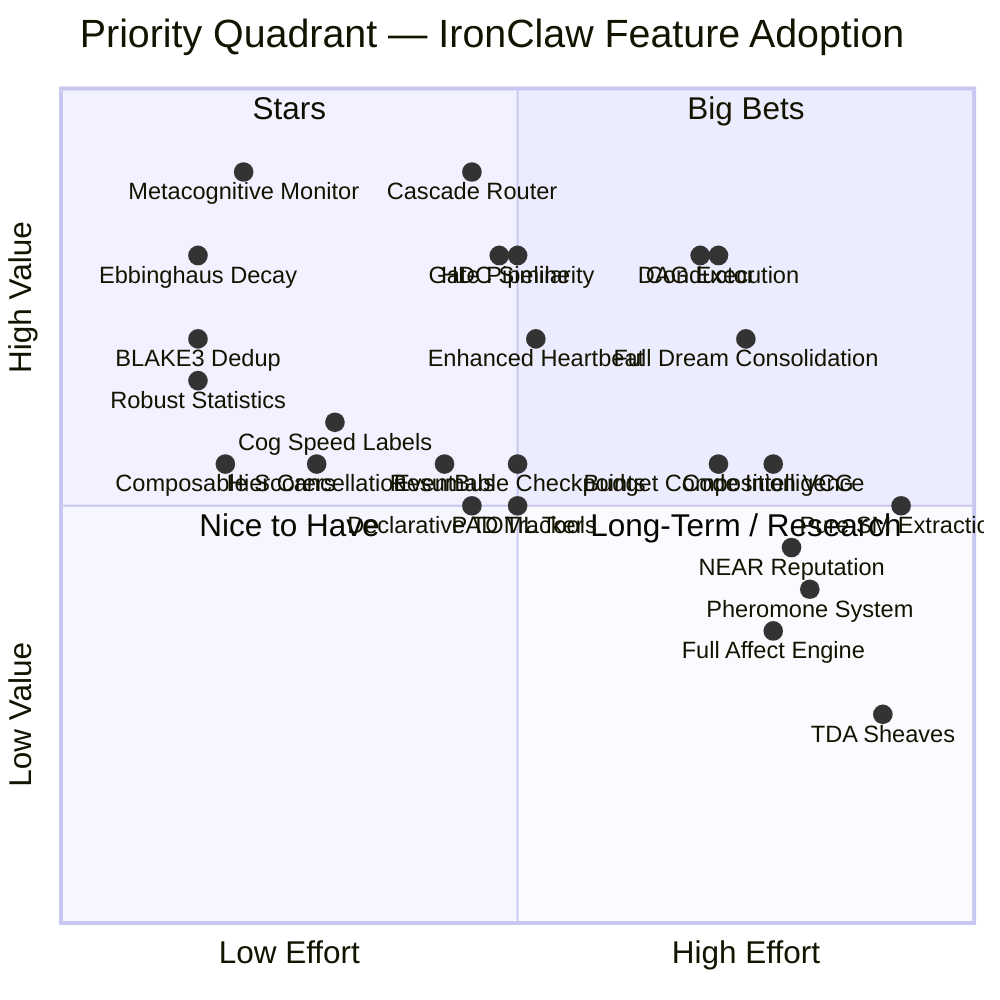
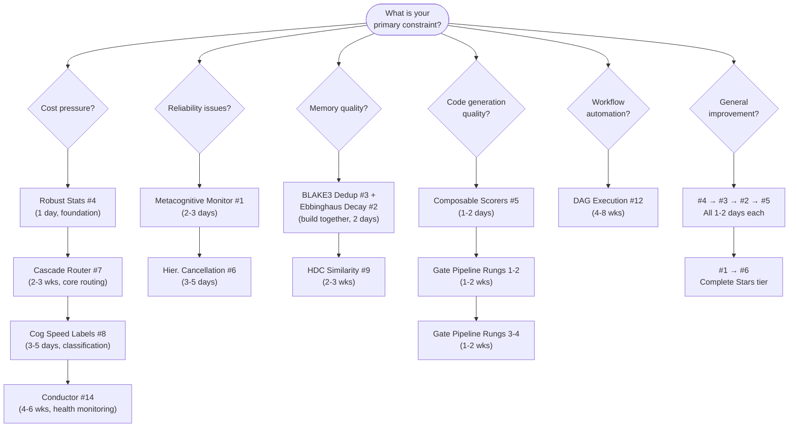

# Priority Matrix: Roko Concepts for IronClaw Adoption

> **Navigation**: [Knowledge base root](../../README.md) | [Integration roadmap](../integration-roadmap.md)

---

## Purpose and Audience

This document ranks all 25 concepts extracted from the Roko source corpus
([https://github.com/wpank/roko](https://github.com/wpank/roko))
for adoption into IronClaw. The corpus spans 18+ crates, 200K+ lines, and 155+ research documents.
This matrix answers three questions:

1. **What to build first** — quick wins that deliver high ROI in 1–5 days
2. **What to plan carefully** — high-impact Big Bets requiring 2–8 weeks each
3. **What to defer** — research-grade items or features blocked by prerequisites

**Companion documents:**

| Document | Path | Purpose |
|----------|------|---------|
| Full priority matrix | [priority-matrix/README.md](README.md) | Complete scoring table with implementation sketches |
| Integration roadmap | [../integration-roadmap.md](../integration-roadmap.md) | 4-phase engineering plan |
| Architecture overview | [../../reference/architecture-overview.md](../../reference/architecture-overview.md) | Roko system design |
| Implementation recipes | [../../implementation/03-ironclaw-integration-recipes.md](../../implementation/03-ironclaw-integration-recipes.md) | IronClaw-native build plans |
| Benchmarking framework | [../../implementation/benchmarking/01-measurement-framework.md](../../implementation/benchmarking/01-measurement-framework.md) | Measurement methodology |
| Feature playbooks | [../../implementation/benchmarking/02-feature-playbooks.md](../../implementation/benchmarking/02-feature-playbooks.md) | Per-feature measurement plans |

---

## Methodology

### Scoring Criteria

Every concept is evaluated on five axes, each scored 1–5. Higher numbers are always better on every
axis, which avoids confusion when comparing rows.

| Axis | Weight | Scale | What It Measures |
|------|--------|-------|-----------------|
| **User Impact** | 30% | 1–5 | Direct, observable improvement: fewer failures, lower cost, better answers |
| **System Impact** | 20% | 1–5 | Reliability, observability, maintainability, extensibility |
| **Ease of Implementation** | 25% | 1–5 | Inverse of effort. 5 = trivial (1 day), 1 = very hard (8+ weeks) |
| **Safety** | 15% | 1–5 | Inverse of risk. 5 = purely additive, easy to flag. 1 = research-grade |
| **Independence** | 10% | 1–5 | Inverse of dependency burden. 5 = ships alone, 1 = blocked by 3+ features |

### Scoring Rubric

**User Impact:**
- 5 (Critical): Fixes an active pain point or unlocks a capability users explicitly ask for
- 4 (High): Measurably improves a common workflow or eliminates a class of failures
- 3 (Medium): Improves quality or efficiency in ways users would notice over time
- 2 (Low): Nice polish; most users would not notice its absence
- 1 (Minimal): Primarily of academic interest; no near-term user benefit

**System Impact:**
- 5 (Critical): Eliminates a systemic weakness or enables an entire class of future features
- 4 (High): Substantially improves reliability, observability, or extensibility
- 3 (Medium): Meaningful internal improvement; reduces tech debt or enables specific features
- 2 (Low): Minor internal benefit; nice cleanup
- 1 (Minimal): No significant internal benefit

**Ease of Implementation** (inverted effort):
- 5 (Trivial): Under 200 lines, 1–2 files, no migrations, done in 1 day
- 4 (Low): 200–500 lines, 2–4 modules, possibly a migration, done in a week
- 3 (Medium): 500–1,500 lines, new module or crate, integration across subsystems, 2–4 weeks
- 2 (Hard): 1,500–3,000 lines, new crate with multiple modules, 4–8 weeks
- 1 (Very Hard): 3,000+ lines or major refactor of existing systems, 8+ weeks

**Safety** (inverted risk):
- 5 (Very Safe): Purely additive, no behavior change to existing code, easy to feature-flag
- 4 (Safe): Additive with minor integration points, straightforward to test
- 3 (Medium): Touches existing behavior, requires careful testing and tuning
- 2 (Risky): Changes core flows, introduces new failure modes, hard to test without production data
- 1 (Very Risky): Research-grade, uncertain feasibility, may require fundamental architecture changes

**Independence** (inverted dependency burden):
- 5 (Fully Independent): Ships alone, no prerequisites
- 4 (Mostly Independent): Minor soft dependency on one other feature
- 3 (Moderate): Benefits significantly from 1–2 other features
- 2 (Dependent): Requires 1–2 features to be built first
- 1 (Heavily Dependent): Blocked by 3+ other features or infrastructure changes

### ROI Formula

```
Composite ROI = UserImpact  * 0.30
              + SystemImpact * 0.20
              + Ease         * 0.25
              + Safety       * 0.15
              + Independence * 0.10
```

This is a weighted average of five 1–5 scores producing a composite between 1.0 and 5.0.
The value axes (User Impact + System Impact = 50%) are weighted slightly above the cost axes
(Ease + Safety + Independence = 50%), because a high-impact feature is worth building even
if moderately difficult, while a low-impact feature is not worth building even if trivial.

**Verification example — Rank 1 (Metacognitive Monitor):**
U=5, S=4, E=4, Sa=5, I=5 → 5(0.30) + 4(0.20) + 4(0.25) + 5(0.15) + 5(0.10) =
1.50 + 0.80 + 1.00 + 0.75 + 0.50 = **4.55**

### IronClaw Calibration Notes

IronClaw is a personal AI assistant with multi-channel access (CLI, web, Telegram), background
execution (heartbeat), workspace memory (hybrid FTS + vector search via RRF), WASM-sandboxed tool
extensions, and multi-provider LLM integration. Scores are calibrated to this specific architecture:

| Existing System | Location | Scoring Effect |
|----------------|----------|---------------|
| Self-repair / stuck job detection | `src/agent/self_repair.rs` | Metacognitive Monitor extends turn-level detection atop existing job-level detection |
| CostGuard | `src/agent/cost_guard.rs` | Metacognitive Monitor adds EWMA trend forecasting on top |
| SmartRoutingProvider | `crates/ironclaw_llm/src/smart_routing.rs` | Cascade Router replaces static 13-dim scorer with LinUCB bandit learning |
| Heartbeat | `src/agent/heartbeat.rs` | Dream consolidation extends with replay and rehearsal |
| BLAKE3 dependency | `Cargo.toml` (`blake3 = "1"`) | Content dedup requires zero new deps |
| RRF merge in memory search | `src/workspace/search.rs` | HDC adds a third signal to existing fusion — incremental |
| Progressive tool disclosure | `crates/ironclaw_engine/` (flag-gated) | Budget composition enhances a partially-implemented feature |
| Dual-backend DB | `src/db/` (PostgreSQL + libSQL) | Every DB migration must be implemented and tested twice |
| Evaluation system | `src/evaluation/` | Composable scorers replace ad-hoc scoring with a reusable trait |
| Circuit breaker + retry + failover | `crates/ironclaw_llm/` | Conductor formalizes health monitoring feeding these decorators |
| Estimation module | `src/estimation/` | Uses arithmetic EMA; robust statistics replace with trimmed mean / MAD |

---

## Priority Quadrant

The x-axis is composite effort (average of inverted Ease and inverted Safety: higher = more
effort/risk). The y-axis is composite value (average of User Impact and System Impact). Items in
the upper-left have the best ROI.



---

## Detailed Scoring Table

All 25 items. Plug any row into `Composite = U*0.30 + S*0.20 + E*0.25 + Sa*0.15 + I*0.10`.

| Rank | Concept | User (U) | System (S) | Ease (E) | Safety (Sa) | Indep (I) | **Composite** | Tier | Source |
|------|---------|----------|------------|----------|-------------|-----------|--------------|------|--------|
| 1 | Metacognitive Monitor | 5 | 4 | 4 | 5 | 5 | **4.55** | Stars | [17](../../agent-intelligence/agent-patterns.md) |
| 2 | Ebbinghaus Decay | 4 | 4 | 5 | 5 | 5 | **4.50** | Stars | [10](../../core-concepts/universal-engram.md) |
| 3 | BLAKE3 Content Dedup | 4 | 3 | 5 | 5 | 5 | **4.30** | Stars | [10](../../core-concepts/universal-engram.md) |
| 4 | Robust Statistics | 3 | 4 | 5 | 5 | 5 | **4.20** | Stars | [11](../../core-concepts/mathematical-primitives.md) |
| 5 | Composable Scorers | 2 | 4 | 5 | 5 | 5 | **3.90** | Stars | [17](../../agent-intelligence/agent-patterns.md) |
| 6 | Hierarchical Cancellation | 2 | 4 | 4 | 4 | 5 | **3.50** | Stars | [14](../../execution-verification/runtime-infrastructure.md) |
| 7 | Cascade Router | 5 | 4 | 3 | 4 | 5 | **4.15** | Big Bets | [07](../../agent-intelligence/online-learning.md) |
| 8 | Cognitive Speed Labels | 3 | 3 | 4 | 4 | 4 | **3.50** | Big Bets | [13](../../core-concepts/cognitive-architecture.md) |
| 9 | HDC Similarity Engine | 4 | 4 | 3 | 4 | 5 | **3.85** | Big Bets | [01](../../core-concepts/hyperdimensional-computing/README.md) |
| 10 | Gate Pipeline (Rungs 1–4) | 4 | 4 | 3 | 4 | 5 | **3.85** | Big Bets | [05](../../execution-verification/gate-verification.md) |
| 11 | Enhanced Heartbeat | 4 | 3 | 3 | 3 | 3 | **3.30** | Nice to Have | [02](../../agent-intelligence/dream-consolidation.md) |
| 12 | DAG Execution Engine | 4 | 4 | 2 | 3 | 4 | **3.35** | Nice to Have | [04](../../execution-verification/dag-execution.md) |
| 13 | EventBus | 2 | 4 | 3 | 4 | 5 | **3.25** | Nice to Have | [14](../../execution-verification/runtime-infrastructure.md) |
| 14 | Conductor | 4 | 4 | 2 | 3 | 3 | **3.25** | Nice to Have | [06](../../execution-verification/conductor-anomaly.md) |
| 15 | Resumable Checkpoints | 3 | 3 | 3 | 3 | 5 | **3.20** | Nice to Have | [17](../../agent-intelligence/agent-patterns.md) |
| 16 | Declarative TOML Tools | 3 | 2 | 3 | 4 | 5 | **3.15** | Nice to Have | [16](../../ecosystem/plugin-extension.md) |
| 17 | User Engagement PAD | 3 | 2 | 3 | 3 | 5 | **3.00** | Nice to Have | [03](../../agent-intelligence/affect-engine.md) |
| 18 | Full Dream Consolidation | 4 | 3 | 2 | 2 | 2 | **2.80** | Long-Term | [02](../../agent-intelligence/dream-consolidation.md) |
| 19 | Budget Composition (VCG) | 3 | 3 | 2 | 3 | 3 | **2.75** | Long-Term | [09](../../context-memory/budget-composition.md) |
| 20 | Code Intelligence | 3 | 3 | 2 | 3 | 2 | **2.65** | Long-Term | [12](../../context-memory/code-intelligence.md) |
| 21 | NEAR On-Chain Reputation | 3 | 2 | 2 | 2 | 2 | **2.30** | Long-Term | [08](../../ecosystem/chain-reputation/README.md) |
| 22 | Pheromone System | 2 | 3 | 2 | 3 | 1 | **2.25** | Long-Term | [13](../../core-concepts/cognitive-architecture.md) |
| 23 | Pure SM Extraction | 2 | 4 | 1 | 1 | 4 | **2.20** | Long-Term | [14](../../execution-verification/runtime-infrastructure.md) |
| 24 | Full Affect Engine | 2 | 2 | 2 | 2 | 3 | **2.10** | Long-Term | [03](../../agent-intelligence/affect-engine.md) |
| 25 | TDA / Sheaves | 1 | 2 | 1 | 2 | 3 | **1.55** | Long-Term | [11](../../core-concepts/mathematical-primitives.md) |

---

## Priority Tiers

| Tier | Ranks | Composite Range | When to Build | Rationale |
|------|-------|----------------|---------------|-----------|
| **Stars** | 1–6 | 3.50–4.55 | Week 1–2 | All low-effort (1–5 days), high-safety, high-independence |
| **Big Bets** | 7–10 | 3.85–4.15 | Weeks 3–8 | High value but require significant engineering (2–4 weeks each) |
| **Nice to Have** | 11–17 | 3.00–3.35 | As convenient | Between major projects; most have soft dependencies |
| **Long-Term** | 18–25 | 1.55–2.80 | Research phase | Prerequisites missing or value uncertain |

> Note: Cascade Router (Rank 7, composite 4.15) is placed in Big Bets rather than Stars because
> its Ease score of 3 indicates 2–3 weeks of work. All Stars can be completed in 1–5 days each.
> The ranking system explicitly separates "when to build" from "how valuable is it."

---

## Top-5 Summary

| # | Feature | Composite | Time | Why First |
|---|---------|-----------|------|-----------|
| 1 | Metacognitive Monitor | 4.55 | 2–3 days | Fixes the #1 agentic failure mode (stuck loops); purely additive |
| 2 | Ebbinghaus Decay | 4.50 | 1–2 days | Makes memory self-curating; backward-compatible (existing entries default to `None`) |
| 3 | BLAKE3 Content Dedup | 4.30 | 1 day | Eliminates duplicate memory entries; `blake3` already in `Cargo.toml` |
| 4 | Robust Statistics | 4.20 | 1 day | Replaces EMA-mean with trimmed mean/MAD; zero dependencies; pure functions |
| 5 | Composable Scorers | 3.90 | 1–2 days | Replaces scattered ad-hoc scoring logic with a testable trait framework |

**Recommended build order for Week 1:** #4 (30 min) → #3 (1 day) → #2 (1–2 days) → #5 (1–2 days) → #1 (2–3 days).
Build #4 first because the trimmed-mean from Robust Statistics is used by #1's EWMA cost tracking.
Build #3 and #2 together to immediately realize the access-bump synergy (Cluster A).

---

## Decision Flowchart

Use this when deciding which feature to work on next.



---

## Estimated LOC by Tier

### Stars (Ranks 1–6) — Build in Week 1–2

| # | Feature | Est. Lines | Time |
|---|---------|-----------|------|
| 1 | Metacognitive Monitor | 400–500 | 2–3 days |
| 2 | Ebbinghaus Decay | 150 + migration | 1–2 days |
| 3 | BLAKE3 Dedup | 100 + migration | 1 day |
| 4 | Robust Statistics | 100–200 | 1 day |
| 5 | Composable Scorers | 200 | 1–2 days |
| 6 | Hierarchical Cancellation | 200–300 | 3–5 days |
| | **Total** | **~1,150–1,450** | **~9–14 days** |

### Big Bets (Ranks 7–10) — Build in Weeks 3–8

| # | Feature | Est. Lines | Time |
|---|---------|-----------|------|
| 7 | Cascade Router | 1,500 | 2–3 weeks |
| 8 | Cognitive Speed Labels | 200–300 | 3–5 days |
| 9 | HDC Similarity | 800–1,200 | 2–3 weeks |
| 10 | Gate Pipeline (1–4) | 1,000 | 2–4 weeks |
| | **Total** | **~3,500–4,000** | **~7–11 weeks** |

### Grand Total

| Tier | Lines | Time |
|------|-------|------|
| Stars | ~1,300 | 2 weeks |
| Big Bets | ~3,750 | 7–11 weeks |
| Nice to Have | ~7,700 | 18–28 weeks |
| Long-Term | ~12,250 | 35–55 weeks |
| **All 25** | **~25,000** | **~62–96 weeks** |
