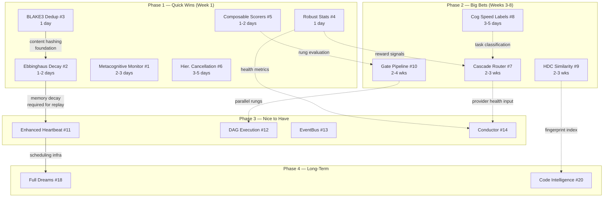

# Synergy Analysis: Clusters, Dependencies, and Combined Value

> **Navigation**:
> [README](README.md) |
> [Detailed Rankings](detailed-rankings.md) |
> [Implementation Sketches](implementation-sketches.md) |
> [Quick Wins](quick-wins.md) |
> [Synergy Analysis (you are here)](synergy-analysis.md) |
> [Benchmarking Plans](benchmarking-plans.md) |
> [References](references.md)

---

## Synergy Clusters

Four feature clusters where combination value exceeds the sum of individual values.

```mermaid
graph TD
    subgraph ClusterA["Cluster A — Self-Managing Memory"]
        B3["BLAKE3 Dedup #3"]
        EB["Ebbinghaus Decay #2"]
        HDC["HDC Similarity #9"]
        B3 -->|"dedup bumps access_count\n→ strengthens stability"| EB
        EB -->|"decay-weighted scores"| HDC
        HDC -->|"compositional search signal"| MemResult["Memory: deduped,\nself-curating, relevant"]
        B3 --> MemResult
        EB --> MemResult
    end

    subgraph ClusterB["Cluster B — Cost Optimization"]
        RS["Robust Stats #4"]
        CR["Cascade Router #7"]
        CS["Cog Speed Labels #8"]
        CO["Conductor #14"]
        RS -->|"stable reward signals"| CR
        CS -->|"task classification\nfeatures for bandit"| CR
        CO -->|"provider health\navoids degraded routing"| CR
        CR --> CostResult["30–60% LLM cost reduction"]
    end

    subgraph ClusterC["Cluster C — Verification"]
        Sc["Composable Scorers #5"]
        GP["Gate Pipeline #10"]
        DAG["DAG Execution #12"]
        Sc -->|"rung pass/fail criteria"| GP
        GP -->|"rungs as DAG nodes\nenable parallelism"| DAG
        DAG --> VResult["Parallel verified code gen"]
    end

    subgraph ClusterD["Cluster D — Proactive Learning"]
        EBD["Ebbinghaus Decay #2"]
        EH["Enhanced Heartbeat #11"]
        FD["Full Dreams #18"]
        EBD -->|"replay strengthens\naccess-counted memories"| EH
        EH -->|"scheduling infra\nfor consolidation"| FD
        FD --> LResult["Agent learns from experience"]
    end
```



---

## Dependency Chain

Solid arrows are hard dependencies (must be built first). Dashed arrows are soft dependencies
(the later feature benefits from but does not require the earlier one).



---

## Cluster A: Self-Managing Memory Stack

Features: BLAKE3 Dedup (#3) + Ebbinghaus Decay (#2) + HDC Similarity (#9)

**Why combination value exceeds individual value:**

Without all three features, the memory system has compounding failure modes. Duplicates inflate
the stale entry count (dedup needed), stale entries pollute search results (decay needed), and
poor search ranking causes the agent to miss relevant memories (HDC needed). The three problems
create a vicious cycle: the agent fails to find a memory → writes a new one → it's now a
duplicate → decay doesn't help because both the original and duplicate are stale.

**Key synergy:** When BLAKE3 dedup detects a duplicate, it bumps the existing entry's access
count. If Ebbinghaus Decay is also active, this bump doubles the entry's stability.
Genuinely repeated knowledge (accessed 10 times) reaches 2^10 × 3600s ≈ 40-day stability
automatically. Without both features, the "frequently mentioned" signal has no effect.

**Build order:** BLAKE3 Dedup (1 day) → Ebbinghaus Decay (1–2 days) → HDC Similarity (2–3 weeks).
The first two should ship together to immediately realize the access-bump synergy.

**Combined monthly value ($100 LLM baseline):** $8–20/month (vs $3–8 + $2–5 = $5–13 for each alone).

**Before/After: Cluster A combined**

```
Before (no memory features):
  Session 1: memory_write("prefs/rust", "User prefers async Rust...")  → entry #1
  Session 2: memory_write("prefs/rust", "User prefers async Rust...")  → entry #2
  Session 3: ...                                                         → entry #3
  After 6 months: 500 entries, 40% are stale, 20% are duplicates
  memory_search("rust style"): returns 5 results, 3 are stale/duplicate noise

After (BLAKE3 + Ebbinghaus + HDC):
  Session 1: INSERT entry #1 (access_count=1, stability=3600s)
  Session 2: MERGE with entry #1 (access_count=2, stability=7200s)
  Session 3: MERGE with entry #1 (access_count=3, stability=14400s)
  After 6 months: 300 entries, 0 duplicates, stale entries auto-filtered
  memory_search("rust style"): returns 3 results, all relevant
```

---

## Cluster B: Cost Optimization Stack

Features: Robust Stats (#4) + Cascade Router (#7) + Cognitive Speed Labels (#8) + Conductor (#14)

**Why combination value exceeds individual value:**

The bandit's learning speed is critically dependent on signal quality. Robust Statistics
prevents outlier LLM responses (timeouts, malformed outputs) from poisoning the bandit's reward
estimates — without it, the bandit may take 3–5× longer to converge.

Cognitive Speed Labels give the bandit three separate learning problems (one per speed tier)
instead of one noisy global problem. A bandit that learns "Gamma requests → cheap model" and
"Delta requests → expensive model" separately converges 3× faster than one that tries to learn
a single global policy across all request types.

The Conductor provides real-time provider health that the router uses to avoid degraded providers.
Without it, the bandit learns "Provider A is best for Gamma" but cannot react when Provider A
degrades to 10s latency.

**Projected combined savings:**
- Cascade Router alone: 30–50% cost reduction
- + Speed Labels: +5–10% routing accuracy
- + Conductor: prevents 5–15% waste from degraded provider routing
- **Combined: 35–60% total cost reduction**

**Build order within cluster:**
1. Robust Statistics (#4) — 1 day, needed first for reliable reward signals
2. Cognitive Speed Labels (#8) — 3–5 days, gives bandit structured task context
3. Cascade Router (#7) — 2–3 weeks, core routing intelligence
4. Conductor (#14) — 4–6 weeks, adds provider health awareness

---

## Cluster C: Verification Stack

Features: Composable Scorers (#5) + Gate Pipeline (#10) + DAG Execution (#12)

**Why combination value exceeds individual value:**

Gate rungs (compile, lint, test, symbol) are a natural DAG: lint and test are independent of
each other but both depend on compile. Running them sequentially wastes wall-clock time when
compile passes — lint and test could run in parallel. Without the DAG engine, the gate always
runs sequentially: 60s compile + 30s lint + 120s test + 90s symbol = 300s total. With the DAG
engine: 60s compile → [30s lint || 120s test] → 90s symbol = 60 + 120 + 90 = 270s. A modest
improvement, but the architecture enables future parallelism of more expensive rungs.

Composable Scorers allow per-project gate configuration without code changes. A research project
might require only compile + lint; a production service requires all four with specific thresholds.

**Build order:** Composable Scorers (1–2 days) → Gate Pipeline (2–4 weeks) → DAG Engine (4–8 weeks).

---

## Cluster D: Proactive Learning Stack

Features: Ebbinghaus Decay (#2) + Enhanced Heartbeat (#11) + Full Dreams (#18)

**Why combination value exceeds individual value:**

The heartbeat's NREM Replay (review recent interactions, strengthen patterns) only delivers
value if bumping access counts has an effect on retrieval. Without Ebbinghaus Decay, bumped
access counts are no-ops. With Decay, each NREM Replay strengthens the stability of actively-
used memories, making the agent demonstrably better at frequently-performed tasks over time.

**Gate structure:** Each layer only delivers value if the previous one is working. Validate each
before proceeding:
1. Does Ebbinghaus Decay improve search quality? (4-week measurement window)
2. If yes: Does NREM Replay produce useful patterns? (4-week window)
3. If yes: Do Full Dreams generate genuine insight? (4-week window)

Never skip a validation gate — the Full Dreams LLM cost is high enough that running it without
validated prerequisites is a reliable way to waste budget and erode user trust.

---

## ROI Calculations

### Methodology

ROI is calculated as: `ROI = (Annual Benefit - Annual Cost) / Annual Cost`

- "Annual Benefit" = direct cost savings + quality value (dev time saved debugging) + opportunity value
- "Annual Cost" = developer hours × $150/hr (senior Rust developer rate)

### Metacognitive Monitor (Rank 1)

| Category | Value | Calculation |
|----------|-------|-------------|
| **Implementation cost** | $600–$900 | 4–6 hours × $150/hr |
| **Monthly LLM savings** | $5–15 | 70–80% reduction in stuck-loop costs |
| **Developer time saved** | $200/month | 1.3 hr/month debugging stuck jobs × $150/hr |
| **Annual benefit** | $2,400–$3,780 | ($5–15 savings + $200 dev time) × 12 |
| **ROI** | 167–530% | Annual benefit / Implementation cost |

**Justification:** Stuck loops are the most frequent failure mode in agentic systems. A
5-turn stuck loop on an expensive model costs $0.20 per occurrence. At 5–10 per month × 12
months = 60–120 occurrences/year × $0.20 = $12–$24/year in direct LLM cost. Developer time
investigating 1–2 loops per month × 15 min each = ~6 hours/year × $150 = $900/year.
**Pays for itself in 3–4 months.**

### Ebbinghaus Decay + BLAKE3 Dedup (Ranks 2–3, built together)

| Category | Value | Calculation |
|----------|-------|-------------|
| **Implementation cost** | $450–$750 | 3–5 hours total (both features share migration work) |
| **Monthly context window savings** | $3–8 | ~200 tokens/query saved × 50 queries/day × $0.00001/token × 30 days |
| **Search quality improvement value** | $50–$100/month | Fewer wrong-context errors: 2 fewer per month × 30 min debug × $150/hr = $75 |
| **Annual benefit** | $636–$1,296 | |
| **ROI** | 41–188% | |

**Justification:** The real value is developer/user time: 2 sessions per month where wrong
context causes 30 min of debugging × $150/hr × 12 months = $1,800/year.
**The quality improvement pays for itself in 1–2 months.**

### Cascade Router (Rank 7)

| Category | Value | Calculation |
|----------|-------|-------------|
| **Implementation cost** | $6,750–$11,250 | 45–75 hours × $150/hr |
| **Monthly LLM savings** (at $100/month baseline) | $30–50 | 30–50% routing to cheaper models |
| **Annual savings** | $360–$600 | |
| **Months to break even** | 11–37 months | Cost / monthly savings |

**At scale (100 users):**

| Category | Value |
|----------|-------|
| **Monthly savings** (100 users × $30–50) | $3,000–5,000 |
| **Break-even** | 2–4 months |
| **5-year NPV** | $160,000–$263,000 |
| **ROI at 5 years** | 1,322–2,240% |

**Justification:** The Cascade Router is a net negative ROI for a single-user deployment
at $100/month LLM spend. It becomes highly positive at scale or for users spending $500+/month.
This is why it is placed in Big Bets: high value but requires significant investment and is
most valuable as a platform feature serving many users.

### Robust Statistics (Rank 4)

| Category | Value | Calculation |
|----------|-------|-------------|
| **Implementation cost** | $150–$225 | 1–1.5 hours × $150/hr |
| **Monthly benefit** | $25–50 | Better estimates → fewer user interventions (1–2 per month × 30 min × $150/hr) |
| **Annual benefit** | $300–$600 | |
| **ROI** | 33–300% | |

**Justification:** Robust statistics is the highest-ROI investment in the entire matrix:
1–1.5 hours of work that improves accuracy across every subsystem that computes statistics.
**Best ROI per hour of any item in the matrix.**

### Gate Verification Pipeline (Rank 10)

| Category | Value | Calculation |
|----------|-------|-------------|
| **Implementation cost** | $6,000–$12,000 | 40–80 hours × $150/hr |
| **Monthly savings from catching errors pre-deploy** | $75–150 | 5 errors caught × 30 min debug each × $150/hr = $75 min |
| **Annual benefit** | $900–$1,800 | |
| **ROI** | -85% to -70% (narrow use) | |
| **If agent generates code 10× more frequently** | ROI 12–80% | |

**Justification:** Gate pipeline ROI depends heavily on code generation frequency.
For a developer using IronClaw to write production code, catching 5+ compile errors
per week saves 20+ minutes/week × $150/hr × 52 weeks = $2,600/year. **Highly context-dependent;
prioritize if the user does regular code generation.**

---

## Before/After Scenarios: Top 5

### Scenario 1: Metacognitive Monitor (Rank 1)

**Task:** User asks IronClaw to "deploy my web service to production."

**Before (no monitor):**

```
Turn 1:  agent → shell("ssh prod 'systemctl restart app'")   # fails: wrong host
Turn 2:  agent → shell("ssh prod 'systemctl restart app'")   # fails: same error
Turn 3:  agent → shell("ssh prod 'systemctl restart app'")   # fails: stuck
Turn 4:  agent → shell("ssh prod 'systemctl restart app'")   # fails: still stuck
...
Turn 18: max_turns reached, job fails
         Cost: 18 turns × $0.04/turn = $0.72
         User: frustrated, deployment not done
```

**After (monitor active, window=10, threshold=0.25):**

```
Turn 1:  agent → shell("ssh prod 'systemctl restart app'")   # fails
Turn 2:  agent → shell("ssh prod 'systemctl restart app'")   # fails
Turn 3:  agent → shell("ssh prod 'systemctl restart app'")   # fails
Turn 4:  Monitor detects: unique_ratio=0.0 < 0.25 → StuckLoop
         Injection: "You are repeating the same failing action. Try listing available
                     hosts first or ask the user for the correct hostname."
Turn 5:  agent → shell("cat ~/.ssh/config")  # new approach: reads SSH config
Turn 6:  agent → shell("ssh prod-us-east-1 'systemctl restart app'")  # succeeds
         Cost: 6 turns × $0.04/turn = $0.24 (67% savings)
         User: deployment succeeds
```

### Scenario 2: Ebbinghaus Decay (Rank 2)

**Context:** User has been using IronClaw for 6 months. Memory has accumulated 2,000 entries.

**Before (no decay):**

```
memory_search("deploy web service"):
  Result 1: "User prefers blue UI themes" (6 months old, never used again — noise)
  Result 2: "Deploy command: systemctl restart app" (used weekly — relevant)
  Result 3: "User's favorite coffee shop is on 3rd St" (3 months old — noise)
  Result 4: "Production hostname: prod-us-east-1" (used monthly — relevant)
  Result 5: "User prefers snake_case" (2 weeks old, used daily — relevant)
  Top result is noise. Agent uses incorrect context, makes mistakes.
```

**After (Ebbinghaus decay, 1-hour initial stability):**

```
memory_search("deploy web service"):
  Stability after 6 months never accessed:  exp(-4320h / 1h) ≈ 0.0 → filtered
  Stability after weekly access (7 accesses): 2^7 × 3600s = 460,800s (~5 days)
    Elapsed 3 days: exp(-72h / 128h) ≈ 0.57 → strong

  Result 1: "Deploy command: systemctl restart app" (score: 0.72 × 0.57 = 0.41)
  Result 2: "Production hostname: prod-us-east-1" (score: 0.68 × 0.45 = 0.31)
  Result 3: "User prefers snake_case" (score: 0.61 × 0.92 = 0.56)
  Stale entries are filtered automatically. Only relevant context reaches the agent.
```

### Scenario 3: BLAKE3 Content Dedup (Rank 3)

**Context:** Agent runs 10 sessions over a week on a project. Each session it learns the same preference.

**Before (no dedup):**

```
Session 1: memory_write("prefs/rust", "User prefers async Rust patterns...")  → entry #1
...
Session 10: entry #10

memory_search("rust coding style"):
  Returns 10 identical entries, each consuming context window tokens.
  10 × 50 tokens = 500 tokens wasted on duplicates.
  Cost: 500 tokens × $0.000015/token = $0.0075 per query × 100 queries/month = $0.75/month waste
```

**After (BLAKE3 dedup):**

```
Session 1: memory_write → content_hash = 0xa3f2b1...  → INSERT entry #1
Session 2: memory_write → same hash → MERGE with entry #1, access_count: 1→2
...
Session 10: access_count: 1→10, stability strengthened by Ebbinghaus (if also enabled)

memory_search("rust coding style"):
  Returns 1 entry (canonical, access_count=10 → high stability).
  50 tokens used, not 500. Zero duplicates forever.
```

### Scenario 4: Cascade Router (Rank 7)

**Context:** User sends 100 messages per week across varying complexity.

**Before (static SmartRoutingProvider):**

```
Static scorer routes by 13 fixed dimensions:
  70% of requests → expensive model (claude-opus @ $0.075/1K tokens)
  30% of requests → cheap model (claude-haiku @ $0.00025/1K tokens)
  "What time is it?" → expensive model (classifier not sure → defaults to primary)
  Monthly cost: $50
```

**After (Cascade Router, 2 months of learning):**

```
After 800 requests, bandit has learned user-specific patterns:
  "What time is it?" → cheap model (saves $0.074/1K tokens)
  "Translate hello to Spanish" → cheap model (saves $0.074/1K tokens)
  "Write a full REST API" → expensive model (correct, no degradation)
  Monthly cost: $28 (44% reduction, $22/month saved)
```

### Scenario 5: Robust Statistics (Rank 4)

**Context:** IronClaw estimates LLM task duration for the user's dashboard.

**Before (arithmetic mean EMA):**

```
Observed task durations (seconds): [25, 28, 30, 27, 29, 180, 26, 31, 28, 29]
The 180s outlier: network timeout on one LLM call

Running EMA (alpha=0.3): After the timeout: EMA = 0.3 × 180 + 0.7 × 28 = 73.6s estimate
Dashboard shows: "Estimated: ~74 seconds"
Reality: most tasks take 25–31 seconds
User frustration: estimates are 2-3× too high for weeks after each outlier
```

**After (trimmed mean + robust stats):**

```
Same observations: [25, 26, 27, 28, 28, 29, 29, 30, 31, 180]
Trimmed mean (10%): remove 25 (bottom 10%) and 180 (top 10%)
Trimmed mean = (26+27+28+28+29+29+30+31) / 8 = 28.5s

MAD = median(|x - 28.5|) = 1.0s
Dashboard shows: "Estimated: ~29 seconds (±1s)"
Outlier has zero effect on the estimate. User sees accurate predictions.
```
