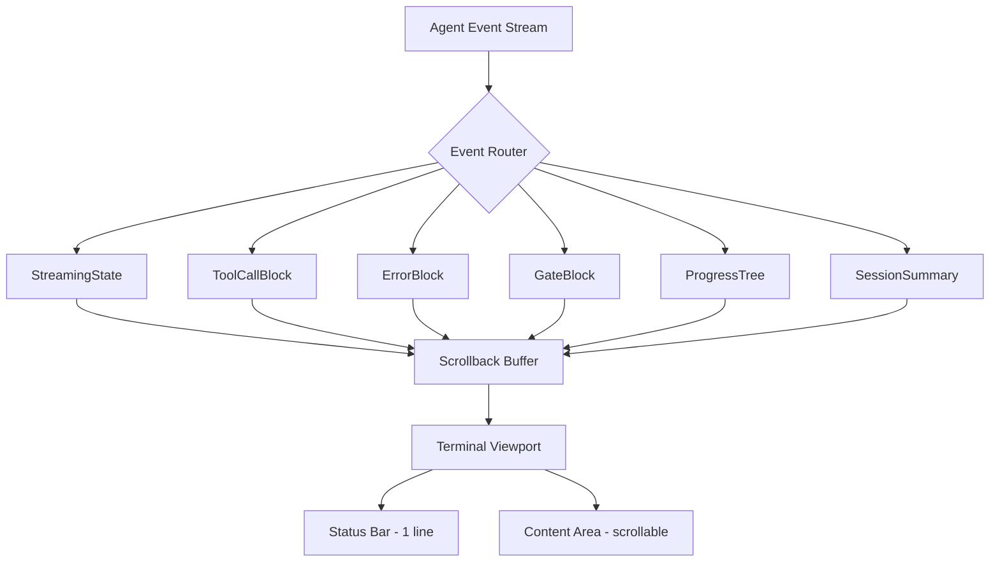
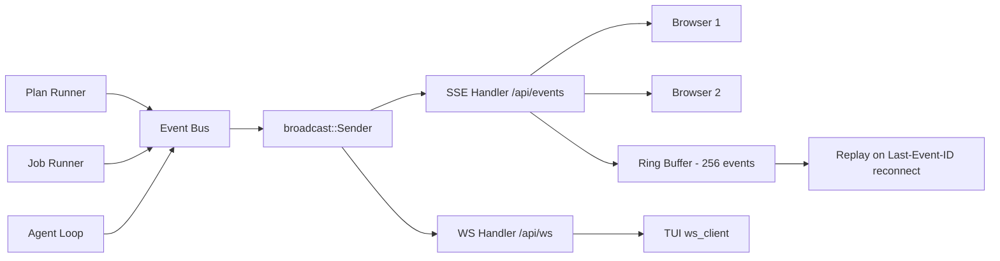
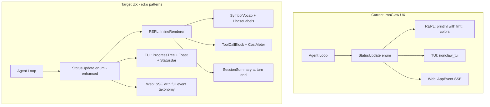
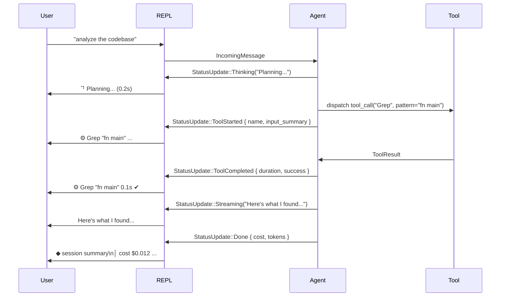

# IronClaw UX Improvements
## Derived from roko codebase analysis

**Date:** 2026-07-03

---

## Overview

This document synthesizes UX patterns from the [roko](https://github.com/wpank/roko/blob/main/) codebase — a mature Rust AI assistant with a full TUI, inline CLI rendering system, real-time web dashboard, and structured onboarding — and maps each pattern to concrete, actionable improvements for IronClaw's three primary interfaces: REPL (`src/channels/repl.rs`), TUI (`src/channels/tui.rs`), and Web (`src/channels/web/`).

---

## 1. CLI/TUI UX Patterns from roko

### 1.1 Symbol Vocabulary and Visual Language

roko defines a deliberate, cross-command symbol set in [`crates/roko-cli/src/inline/symbols.rs`](https://github.com/wpank/roko/blob/main/crates/roko-cli/src/inline/symbols.rs). Every CLI primitive uses the same glyphs, creating a consistent visual grammar:

```rust
// roko: crates/roko-cli/src/inline/symbols.rs
pub const START: &str = "◆";        // Section start (filled diamond)
pub const START_EMPTY: &str = "◇";  // Pending/inactive (empty diamond)
pub const BAR: &str = "│";          // Vertical continuation
pub const BRANCH: &str = "├";       // Branch connector
pub const END: &str = "└";          // Last item connector
pub const PASS: &str = "✔";         // Success
pub const FAIL: &str = "✖";         // Failure
pub const WARN: &str = "⚠";         // Warning
pub const INFO: &str = "ℹ";         // Info
pub const PENDING: &str = "⏳";     // Waiting
pub const TOOL: &str = "⚙";         // Tool execution
pub const CURSOR: &str = "█";       // Text cursor (blinking)
pub const SPINNER_FRAMES: [&str; 8] = ["⠋", "⠙", "⠹", "⠸", "⠼", "⠴", "⠦", "⠧"];
```

IronClaw's current `src/cli/fmt.rs` has good foundations (emerald green accent `#34d399`, `✓`/`✗` status icons, `NO_COLOR` support, `COLORTERM` truecolor detection) but lacks a unified symbol vocabulary. Tool calls, thinking states, and structured output each use ad-hoc formatting.

### 1.2 Progress Bar Rendering

roko renders progress bars with filled/empty segments:

```rust
// roko: crates/roko-cli/src/inline/symbols.rs
pub const PROGRESS_FILL: &str = "━";
pub const PROGRESS_EMPTY: &str = "░";

pub fn progress_bar(progress: f64, width: usize) -> String {
    let filled = (progress * width as f64).round() as usize;
    let empty = width.saturating_sub(filled);
    format!("{}{}", PROGRESS_FILL.repeat(filled), PROGRESS_EMPTY.repeat(empty))
}
```

The TUI widget version additionally uses semantic coloring with a heartbeat pulse effect:

```rust
// roko: crates/roko-cli/src/tui/widgets/task_progress.rs
// Color shifts red->amber->green based on completion fraction
let color = Theme::semantic_color(pct);  // EMBER / WARNING / SAGE
// Leading edge pulses with heartbeat oscillator
let scale = hb.clamp(0.9, 1.1);
Color::Rgb((r * scale).min(255.0) as u8, ...)
```

### 1.3 Spinner with Elapsed Time

roko uses `indicatif` for simple CLI spinners:

```rust
// roko: crates/roko-cli/src/spinner.rs
pub fn cli_spinner(msg: impl Into<String>) -> ProgressBar {
    let pb = ProgressBar::new_spinner().with_style(
        ProgressStyle::default_spinner()
            .template("{spinner:.cyan} {msg} ({elapsed})")
            .unwrap(),
    );
    pb.set_message(msg.into());
    pb.enable_steady_tick(std::time::Duration::from_millis(80));
    pb
}
```

For the full TUI, the `StreamingState` struct tracks tick count for the braille spinner and renders a phase label alongside elapsed time and cost:

```rust
// roko: crates/roko-cli/src/inline/primitives/streaming.rs
// Phase labels cycle through: "Thinking" -> "Streaming" (on first token) -> tool phase names
pub fn set_phase(&mut self, label: impl Into<String>) {
    self.phase_label = label.into();
}
// Status bar: "6.2s  ·  $0.031  ·  12,121 tok  ·  haiku"
```

### 1.4 Tool Call Display (Collapsed/Expanded)

[`crates/roko-cli/src/inline/primitives/tool_call.rs`](https://github.com/wpank/roko/blob/main/crates/roko-cli/src/inline/primitives/tool_call.rs) implements a two-mode tool call renderer:

**Collapsed (default — one line):**
```
⚙ ReadFile  src/main.rs  0.3s
⚙ Bash      cargo test --workspace  2.1s
⚙ Grep      "fn main"  0.1s
```

**Expanded (user can toggle):**
```
▾ ReadFile  src/main.rs  0.3s
  { "file_path": "src/main.rs", "limit": 100 }
  ─── result ───
  // file contents (first 5 lines)
  ... +245 more lines
```

Each tool has a `summarize_tool_input` function that extracts the most meaningful argument:

```rust
// roko: crates/roko-cli/src/inline/primitives/tool_call.rs
match name {
    "ReadFile" | "Read" => shorten_path(path),          // "src/main.rs (100 lines)"
    "Bash"    => truncate_cmd(cmd, 50),                  // "cargo test --workspace"
    "Grep"    => format!("\"{pattern}\""),               // "\"fn main\""
    "WebSearch" => format!("\"{query}\""),               // "\"roko docs\""
    _ => first_string_value(input),                      // fallback
}
```

### 1.5 Progress Tree (Hierarchical Plan Display)

[`crates/roko-cli/src/inline/primitives/progress_tree.rs`](https://github.com/wpank/roko/blob/main/crates/roko-cli/src/inline/primitives/progress_tree.rs) renders a hierarchical task/wave structure:

```
◆ plan  deploy-audit  ·  8 tasks  ·  3 waves
├ wave 1  ━━━━━━━━━━ 3/3 ✔
│ ├ T01 dependency-scan    ✔  $0.012  2.1s
│ ├ T02 secret-scan        ✔  $0.008  1.4s
│ └ T03 policy-check       ✔  $0.031  4.2s
├ wave 2  ━━━━━━░░░░ 1/3
│ ├ T04 integration-test   ━━━━━━ running (6.2s)
│ ├ T05 diff-review        ⏳ blocked by T04
│ └ T06 cost-analysis      ⏳ blocked by T04
└ wave 3  ⏳ 0/2
  ├ T07 episode-log        ⏳
  └ T08 chain-anchor       ⏳
```

Task states have distinct visual treatments:
- `Pending` — muted, `⏳ pending`
- `Blocked { blocked_by }` — muted, `⏳ blocked by T04`
- `Running { elapsed_s }` — accent color, `━━━━━━ running (6.2s)`
- `Done { cost_usd, duration_s }` — success + cost + time, `✔  $0.012  2.1s`
- `Failed { reason }` — danger color, `✖  error message`
- `Skipped` — muted, `skipped`

### 1.6 Gate Pipeline Display

[`crates/roko-cli/src/inline/primitives/gate_block.rs`](https://github.com/wpank/roko/blob/main/crates/roko-cli/src/inline/primitives/gate_block.rs) renders sequential verification gates:

```
◆ gates      7 rungs  ·  policy: prod-sec
├ compile    ✔  0 errors (142 crates, 2.1s)
├ clippy     ✔  0 warnings (0.8s)
├ test       ━━━━━━░░░░ 4/11 tests  (3.2s)
├ secret_scan  ⏳ pending
└ verify     ⏳ pending
```

### 1.7 Error Block with Retry Context

[`crates/roko-cli/src/inline/primitives/error_block.rs`](https://github.com/wpank/roko/blob/main/crates/roko-cli/src/inline/primitives/error_block.rs) shows structured errors with location, context, and retry state:

```
│ ✖  compile: error[E0308]: expected `i32`, found `String`
│    → src/handler.rs:42:18
│    42 │     let cost: i32 = calculate_cost();
│       │                     ^^^^^^^^^^^^^^^^ expected i32, found String
│
│    retry in 10s (attempt 1/3, exponential backoff)
```

The `ErrorSeverity` enum maps to distinct display: `Fatal`, `Error`, `Warning`, `Info`.

### 1.8 Session Summary

[`crates/roko-cli/src/inline/primitives/session_summary.rs`](https://github.com/wpank/roko/blob/main/crates/roko-cli/src/inline/primitives/session_summary.rs) renders an end-of-session roll-up:

```
◆ session summary
│ runs          3
│ total cost    $0.084  ·  baseline: $2.61  ·  savings: 31.1x
│ cache hit     87%  (↑ from 0% on first run)
│ tokens        12,121 in / 3,193 out
│ gates         24/24 passed  (2 replans, both succeeded)
└ model         haiku (97% of tokens)
```

The `CostMeter` struct tracks `total_cost`, `input_tokens`, `output_tokens`, `cache_hits`, `cache_misses`, per-model token counts, `naive_baseline` (what it would have cost at full Opus rates), and computed `savings_ratio()`.

### 1.9 TUI Theme System

[`crates/roko-cli/src/tui/theme.rs`](https://github.com/wpank/roko/blob/main/crates/roko-cli/src/tui/theme.rs) defines the "ROSEDUST" palette with three modes:

- `Theme::dark()` — warm rose/indigo aesthetic, default
- `Theme::high_contrast()` — WCAG 2.1 AA compliant, triggered by `ROKO_HIGH_CONTRAST`
- `Theme::no_color()` — all `Color::Reset`, triggered by `NO_COLOR`

Semantic color helpers enforce consistent usage patterns across all widgets:

```rust
theme.text()      // primary foreground
theme.muted()     // secondary/dim text
theme.accent()    // highlights, active items
theme.success()   // done, healthy — bold SAGE green
theme.warning()   // degraded, gating — bold WARNING amber
theme.danger()    // failed, critical — bold EMBER red
theme.info()      // active, in-flight — bold DREAM indigo
theme.selection() // selected item — BONE on BG_HIGHLIGHT
```

`Theme::semantic_color(t: f64)` produces a gradient: `t < 0.4` → EMBER, `t < 0.8` → WARNING, `t >= 0.8` → SAGE.

### 1.10 Status Bar (Four Sections)

[`crates/roko-cli/src/tui/widgets/status_bar.rs`](https://github.com/wpank/roko/blob/main/crates/roko-cli/src/tui/widgets/status_bar.rs) shows four sections separated by `│`:

```
main 3a7f2b1 2h ago │ ◦ │ 5/12  2▸ 4ag │ ↑↓:nav  a/o/d/e/g:sub-tab  Tab:panel  ?:help
```

1. **Git info** — branch name, short commit hash, last commit age
2. **Heartbeat** — animated dot (`·` → `°` → `.` → `●`) plus `PAUSED` badge when suspended
3. **Task counts** — `done/total`, active plans `▸`, live agents `ag`, warning count `⚠N`, failure count `✗N`
4. **Context-sensitive keybinds** — change per-tab (Dashboard, Plans, Agents, Git, Logs, etc.), failure-aware (adds `R:retry  D:diag` when errors present)

### 1.11 Toast Notification System

[`crates/roko-cli/src/tui/modals/notification.rs`](https://github.com/wpank/roko/blob/main/crates/roko-cli/src/tui/modals/notification.rs) renders a stacked toast system in the TUI bottom-right corner:

```rust
pub enum NotificationLevel { Info, Warn, Error, Debug }
// TTLs: Info=5s, Warn=8s, Error=10s
// Stacks up to 5 toasts, clamped to 80% screen width
// Colored borders: info=DREAM, warn=WARNING, error=EMBER, debug=muted
// Format: "[INFO] message" / "[WARN] message" / "[ERR ] message"
```

### 1.12 Approval Modal

[`crates/roko-cli/src/tui/modals/approval.rs`](https://github.com/wpank/roko/blob/main/crates/roko-cli/src/tui/modals/approval.rs) renders a centered approval dialog (60%x40% of screen):

```
┌──────────── Approval Required ─────────────┐
│                                             │
│  Agent: implementer                         │
│                                             │
│  Command:                                   │
│    cargo test --all-features                │
│                                             │
│  [y] approve    [n] reject                  │
└─────────────────────────────────────────────┘
```

### 1.13 Task Progress Widget

[`crates/roko-cli/src/tui/widgets/task_progress.rs`](https://github.com/wpank/roko/blob/main/crates/roko-cli/src/tui/widgets/task_progress.rs) is a comprehensive scrollable task widget:

```
┌ Tasks (5/12) [1-8 of 12] ──────────────────┐
│ ████████░░░░░░░░░░░░░  5/12                │
│  RUN  2 active · 5 queued                  │
│ ▲ more                                     │
│ ✓ t-001  Wire SystemPromptBuilder          │
│ ► t-002  ⏱2m  Add episode logging          │
│ · t-003  Refactor gate pipeline            │
│ ✗ t-004  Fix clippy warnings               │
│ · t-005  Blocked on dependency             │
│ ▼ more                                     │
└─────────────────────────────────────────────┘
```

Key features: scrollbar, scroll position `[N-M of total]`, compact duration `2m`/`45s`/`1h05m`, focused border (ROSE vs TEXT_DIM), active task pulse animation.

### 1.14 Dashboard Structure (Pages and Widgets)

[`crates/roko-cli/src/tui/dashboard.rs`](https://github.com/wpank/roko/blob/main/crates/roko-cli/src/tui/dashboard.rs) implements a multi-page dashboard with file-stamp-based refresh:

- Pages: `Health`, `Efficiency`, `Operations`
- Data stamped against files: `efficiency.jsonl`, `episodes.jsonl`, `experiments.json`, `cascade-router.json`, `skills.json`, `provider-health.json`
- Generation counter prevents redundant redraws
- `render_overview_text()` renders a CLI-readable summary when TUI is unavailable

Tab system from `crates/roko-cli/src/tui/tabs.rs`:
- `Dashboard`, `Plans`, `Agents`, `Git`, `Logs`, `Config`, `Inspect`, `Marketplace`, `Atelier`, `Learning`

Views include: `agents_view`, `config_view`, `context_view`, `dashboard_view`, `git_view`, `learning_view`, `logs_view`, `marketplace_view`, `plans_view`, `atelier_view`.

---

## 2. Web UI Patterns from roko-serve

### 2.1 SSE Event Taxonomy

[`crates/roko-serve/src/events.rs`](https://github.com/wpank/roko/blob/main/crates/roko-serve/src/events.rs) defines a comprehensive `ServerEvent` enum with ~45 variants covering the full lifecycle:

**Execution lifecycle:**
- `PlanStarted`, `PlanCompleted { success }`, `TaskStarted`, `TaskCompleted`, `TaskFailed`
- `TaskPhaseChanged { old_phase, new_phase }`
- `GateResult { gate, rung, passed }`
- `ReplanTriggered { strategy }`
- `PhaseTransition { from, to }`

**Agent lifecycle:**
- `AgentSpawned { agent_id, role, model }`, `AgentStarted`, `AgentStopped { reason }`
- `AgentOutput { content, done, metadata }` — sanitized for consumers
- `AgentTrace { content, tool_calls, reasoning, usage }` — raw, opt-in only

**Inference observability:**
- `InferenceStarted { request_id, model, agent_id, auto_routed }`
- `InferenceCompleted { input_tokens, output_tokens, cost_usd, duration_ms }`
- `InferenceFailed { error }`

**Job progress:**
- `JobProgress { percent: u8, message }` — 0-100 progress
- `JobAgentOutput`, `OperationStarted`, `OperationCompleted`

**Deployment:**
- `DeploymentCreated`, `DeploymentReady { url }`, `DeploymentFailed { reason }`, `DeploymentTornDown`

All events use `#[serde(tag = "type", rename_all = "snake_case")]` for consistent wire format.

### 2.2 SSE Infrastructure

[`crates/roko-serve/src/routes/sse.rs`](https://github.com/wpank/roko/blob/main/crates/roko-serve/src/routes/sse.rs) implements SSE with:

- **Reconnection with replay**: `Last-Event-ID` header replays up to 256 events from a ring buffer
- **Anti-buffering headers**: `X-Accel-Buffering: no`, `Cache-Control: no-cache, no-store`, `Connection: keep-alive` — critical for Railway/Nginx/Cloudflare proxies
- **8-second keepalive** with `text("keepalive")` to survive aggressive proxy timeouts (shorter than Railway's 30s timeout)
- **Lag handling**: `broadcast::error::RecvError::Lagged(n)` logged and skipped (client stays connected)

### 2.3 Dashboard API

[`crates/roko-serve/src/routes/status/dashboard.rs`](https://github.com/wpank/roko/blob/main/crates/roko-serve/src/routes/status/dashboard.rs) exposes a JSON dashboard endpoint:

```rust
// GET /api/dashboard
Json(json!({ "rendered": info.rendered }))

// GET /api/status
Json(json!({
    "session_id": ss.session_id,
    "daemon_running": ss.daemon_running,
    "signal_count": ss.signal_count,
    "episode_count": ss.episode_count,
    "last_episode_passed": ss.last_episode_passed,
    "supervised_processes": supervised_processes,
    "process_session_ledger": ledger_path,
    "process_sessions": sessions,
}))

// GET /api/operations/:id
Json(json!({ "id": id, "kind": handle.kind, "status": format!("{:?}", handle.status) }))
```

### 2.4 Feedback Loop

[`crates/roko-serve/src/feedback.rs`](https://github.com/wpank/roko/blob/main/crates/roko-serve/src/feedback.rs) — roko has dedicated feedback endpoints allowing users to rate agent outputs. This feeds directly into the learning system.

---

## 3. Agent Feedback UX

### 3.1 Phase Labels During Streaming

roko `StreamingState` cycles through explicit phase labels:

| Phase | When |
|-------|------|
| `Thinking...` | Before first token arrives, with animated spinner |
| `Streaming` | After first token, buffer renders with trailing cursor |
| `Analyzing` | During analysis tool calls |
| `Writing` | During file write operations |
| `Running tests` | During test execution |
| custom labels | `set_phase()` called per tool type |

The streaming viewport:
- Shows a blinking `█` cursor on the last line while active
- Renders with a `│` prefix on each content line
- Has auto-scroll that re-enables when user scrolls back to bottom
- Displays a bottom status bar: `6.2s  ·  $0.031  ·  12,121 tok  ·  haiku`

### 3.2 Live Tool Call Feedback

Tool calls appear inline between streaming text, not as a separate panel:

```
⚙ ReadFile  src/main.rs  ...          ← appears when tool starts
⚙ ReadFile  src/main.rs  0.3s         ← duration added when done
⚙ Bash      cargo test --workspace
  ── running (2.1s) ──
⚙ Bash      cargo test --workspace    2.1s  ✔
```

The `ToolCallBlock` supports toggle-to-expand for seeing full inputs/outputs.

### 3.3 Cost Transparency

The `CostMeter` struct tracks:
- `total_cost` in USD (shown as `$0.084`)
- `naive_baseline` — what the same work would cost at full Opus rates
- `savings_ratio()` — `naive / actual` (e.g., `31.1x` savings)
- `cache_hit_rate()` — percentage of prompt cache hits
- Per-model token breakdown

This data surfaces in:
1. Streaming status bar (per-turn cost)
2. Session summary block (cumulative)
3. Dashboard health page

---

## 4. Onboarding UX

### 4.1 roko's 5-Step Setup Wizard

[`crates/roko-cli/src/commands/setup.rs`](https://github.com/wpank/roko/blob/main/crates/roko-cli/src/commands/setup.rs) runs a linear wizard with explicit step numbering:

```
roko setup
==========

[1/5] Detecting available LLM providers...
  Found: claude-cli

[2/5] Default model: claude-sonnet-4-6

[3/5] Workspace already initialized (.roko/ exists)

[4/5] Running diagnostics...
  All checks passed.

[5/5] Next steps:
  roko "describe your task"     Run a one-shot task
  roko do "add feature X"       Plan and execute a feature
  roko doctor                   Re-run diagnostics anytime
  roko status                   Check workspace health
```

Key patterns:
- Numbered steps make progress legible
- `--yes` flag skips all prompts (CI/scripting mode)
- Provider auto-detection before prompting the user
- Key prefix detection for provider type (`sk-ant-` → Anthropic, otherwise OpenAI-compat)
- `doctor` runs automatically as the penultimate step
- Next-steps section always appears at the end with example commands

### 4.2 roko doctor Integration

Doctor is surfaced prominently in setup, and the failures include a `fix:` field:

```
  [fail] docker: daemon not running
         fix: open -a Docker
```

---

## 5. Configuration UX

roko's config command pattern surfaces settings with context:

- `roko config set <key> <value>` — set with validation
- `roko config get <key>` — show current value and source (env/file/default)
- `roko config list` — table of all settings with current values and sources
- Settings are grouped: agent, model, channels, safety, etc.

---

## 6. Architecture Diagrams

### 6.1 roko Inline Rendering Architecture



### 6.2 roko SSE Architecture



### 6.3 IronClaw Current vs. Target Architecture



### 6.4 User Flow: Tool Call Feedback



---

## 7. Practical Recommendations per IronClaw Channel

### 7.1 REPL Channel (`src/channels/repl.rs`)

**Current state:** Uses `fmt::` color tokens, `termimad` for markdown, basic `Thinking...` status, approval cards via `format_json_params`.

**Recommendation 1: Add symbol vocabulary module**

Create `src/cli/symbols.rs` (parallel to `src/cli/fmt.rs`):

```rust
// src/cli/symbols.rs
pub const START: &str = "◆";
pub const BAR: &str = "│";
pub const BRANCH: &str = "├";
pub const END: &str = "└";
pub const PASS: &str = "✔";
pub const FAIL: &str = "✖";
pub const WARN: &str = "⚠";
pub const PENDING: &str = "⏳";
pub const TOOL: &str = "⚙";
pub const SPINNER_FRAMES: [&str; 8] = ["⠋", "⠙", "⠹", "⠸", "⠼", "⠴", "⠦", "⠧"];
pub const PROGRESS_FILL: &str = "━";
pub const PROGRESS_EMPTY: &str = "░";

pub fn spinner_frame(tick: u64) -> &'static str {
    SPINNER_FRAMES[(tick as usize) % SPINNER_FRAMES.len()]
}

pub fn progress_bar(progress: f64, width: usize) -> String {
    let filled = (progress * width as f64).round() as usize;
    let empty = width.saturating_sub(filled);
    format!("{}{}", PROGRESS_FILL.repeat(filled), PROGRESS_EMPTY.repeat(empty))
}
```

**Recommendation 2: Enhance tool call display**

Replace the current generic tool output in `send_response` with a collapsed tool call line:

```
BEFORE:
  [debug] tool: memory_search({"query": "project structure"})

AFTER:
  ⚙ memory_search  "project structure"  ...    ← when starting
  ⚙ memory_search  "project structure"  0.3s ✔ ← when done
```

**Recommendation 3: Phase-aware thinking indicator**

Replace `Thinking...` with a phase-label system:

```rust
// Extend StatusUpdate enum or add a method to map event type to phase label
fn phase_label_for_tool(tool_name: &str) -> &'static str {
    match tool_name {
        "memory_search" | "memory_read" => "Searching memory",
        "file_read" | "list_dir" => "Reading files",
        "file_write" | "apply_patch" => "Writing files",
        "shell" => "Running command",
        "web_fetch" => "Fetching URL",
        "http" => "Calling API",
        _ => "Working",
    }
}
```

**Recommendation 4: Session summary on exit**

After each completed turn (when agent returns a final response), render a compact session summary:

```
◆ session
│ cost    $0.031  ·  3,241 tok
└ model   claude-sonnet-4-6
```

**Recommendation 5: Progress bar for multi-step jobs**

When a job is running (visible in `/job` command), show a progress bar:

```
⚙ job  abc123  ━━━━━━░░░░ 60%  Writing tests...  (14s)
```

### 7.2 TUI Channel (`src/channels/tui.rs` + `ironclaw_tui`)

**Current state:** Delegates to `ironclaw_tui` crate with `TuiLayout`, `TuiEvent`, `TuiAppConfig`, `TuiLayout`. Tool categories and skill categories are grouped by prefix.

**Recommendation 1: Status bar with four sections (matching roko pattern)**

```
◆ main  ◦  5/12  2 active  │ ↑↓:nav  Tab:panel  ?:help
```

Sections:
1. Current model + cost indicator
2. Heartbeat dot (animated)
3. Job/task counts
4. Context-sensitive keybinds

**Recommendation 2: Toast notification stack**

Add a `NotificationStack` widget that renders at the bottom-right. Map IronClaw `StatusUpdate` variants to notification levels:

```rust
// Notification level mapping
StatusUpdate::Error(_)        → NotificationLevel::Error (TTL: 10s)
StatusUpdate::ToolCompleted { success: false, .. } → NotificationLevel::Warn (TTL: 8s)
StatusUpdate::Thinking(_)     → NotificationLevel::Debug (TTL: 3s)
```

**Recommendation 3: Approval modal**

Enhance the current approval flow with a full-screen-overlay modal (matching roko's `render_approval`):

```
┌──────── IronClaw — Tool Approval ────────┐
│                                          │
│  Tool: shell                             │
│                                          │
│  Command:                                │
│    docker run --rm ubuntu:22.04          │
│    bash -c "apt-get install -y curl"     │
│                                          │
│  [y] approve   [A] always   [n] deny     │
└──────────────────────────────────────────┘
```

**Recommendation 4: Semantic progress bars in job panel**

Use `semantic_color(pct)` (red→amber→green gradient) for job progress bars, matching roko's approach.

### 7.3 Web Channel (`src/channels/web/`)

**Current state:** Full SSE system via `SseManager` + `AppEvent` enum, with `tool_started`, `tool_completed`, `thinking`, `stream_chunk`, `gate_required`, `job_progress`, etc. SSE has boot-scoped IDs, keepalive, and broadcast buffer.

**Recommendation 1: Expand inference observability events**

Add `InferenceStarted`, `InferenceCompleted`, `InferenceFailed` SSE events (matching roko):

```rust
// Add to types.rs AppEvent enum
InferenceStarted {
    request_id: String,
    model: String,
    auto_routed: bool,
},
InferenceCompleted {
    request_id: String,
    model: String,
    input_tokens: u64,
    output_tokens: u64,
    cost_usd: f64,
    duration_ms: u64,
},
```

These enable the browser UI to show per-inference cost and latency in real time.

**Recommendation 2: Task phase transition events**

Add `TaskPhaseChanged { old_phase, new_phase }` so the web UI can render a phase timeline:

```
preflight → implementing → compiling → testing → gate → done
```

**Recommendation 3: Anti-buffering SSE headers**

IronClaw's current SSE may not set anti-buffering headers needed for Railway/Nginx deployments. Add them:

```rust
// In src/channels/web/platform/sse.rs, subscriber response
headers.insert("X-Accel-Buffering", HeaderValue::from_static("no"));
headers.insert(
    "Cache-Control",
    HeaderValue::from_static("no-cache, no-store, no-transform, must-revalidate"),
);
```

**Recommendation 4: Cost/usage dashboard endpoint**

Add `GET /api/usage` returning current session costs:

```json
{
  "total_cost_usd": 0.084,
  "input_tokens": 12121,
  "output_tokens": 3193,
  "cache_hit_rate": 0.87,
  "savings_ratio": 31.1,
  "model_breakdown": { "claude-sonnet-4-6": 15314 }
}
```

**Recommendation 5: Operation status endpoint**

Add `GET /api/operations/:id` returning background operation status:

```json
{ "id": "uuid", "kind": "heartbeat", "status": "running", "progress": 60 }
```

---

## 8. Before/After Terminal Mockups

### 8.1 REPL: Thinking Indicator

**Before (current):**
```
› analyze the auth flow
  Thinking...
```

**After (roko-inspired):**
```
› analyze the auth flow
⠙ Thinking... (0.3s)
│
│ Looking at the authentication flow across the codebase.
│ I'll start with the bridge layer.
```

### 8.2 REPL: Tool Call Display

**Before (current with /debug):**
```
  [debug] tool: memory_search
  params: {"query": "auth flow", "limit": 10}
  result: [{"id": "abc", "content": "..."}, ...]
```

**After:**
```
  ⚙ memory_search  "auth flow"  0.3s ✔
  ⚙ file_read  src/bridge/auth_manager.rs  0.1s ✔
  ⚙ grep  "fn resolve_extension"  0.1s ✔
```

(Expand any line with a keystroke for full input/output.)

### 8.3 REPL: Approval Card

**Before (current):**
```
  ─────────────────────────────
  ▷ shell — approval required
  ─────────────────────────────
  command: "rm -rf /tmp/test-build"
  ─────────────────────────────
  > yes / no / always:
```

**After:**
```
◆ approval required
│ tool     shell
│ command  rm -rf /tmp/test-build
│
│ [yes] approve   [no] deny   [always] always allow
└ > _
```

### 8.4 REPL: Session Summary (End of Turn)

**Before:**
```
  (no summary — response just ends)
```

**After:**
```
◆ done  ·  $0.031  ·  4,241 tok in · 1,203 out  ·  claude-sonnet-4-6  ·  2.3s
```

(One line at turn end — easily ignorable, but always there.)

### 8.5 REPL: Multi-step Job Progress

**Before:**
```
  [job started] abc123
  (silence for 30 seconds)
  [job result] Done
```

**After:**
```
⚙ job  abc123  ━━━░░░░░░░ 30%  Running tests (14s)
⚙ job  abc123  ━━━━━━░░░░ 60%  Reviewing output (28s)
⚙ job  abc123  ━━━━━━━━━━ 100% Complete (41s) ✔
```

### 8.6 Setup Wizard: Numbered Steps

**Before (current):**
```
Welcome to IronClaw setup!
What LLM provider would you like to use?
  1. NEAR AI
  2. Anthropic
  3. OpenAI
  ...
```

**After (roko-style):**
```
ironclaw onboard
================

[1/9] Checking database...
  ✔ libSQL initialized at ~/.ironclaw/db.sqlite

[2/9] Configuring secrets...
  ✔ Master key found in OS keychain

[3/9] Configuring LLM provider...
  Detected: ANTHROPIC_API_KEY

[4/9] Selecting model...
  Default: claude-sonnet-4-6 (change with: ironclaw models set)

[5/9] Configuring embeddings...
  Skip? [Y/n]: Y
  Skipped (search will use FTS only)

[6/9] Configuring channels...
  [✔] CLI/TUI   [✔] Web gateway   [ ] HTTP webhook   [ ] Telegram

[7/9] Installing extensions...
  Skip? [Y/n]: Y

[8/9] Configuring Docker sandbox...
  Docker: not running — start Docker for sandbox support
  Skip? [Y/n]: Y

[9/9] Running diagnostics...
  ✔ LLM provider connected
  ✔ Database initialized
  ○ Docker (optional — not running)

Setup complete.

Next steps:
  ironclaw run             Start the agent
  ironclaw doctor          Re-run diagnostics
  ironclaw config list     View all settings
  ironclaw models status   Show provider and model
```

### 8.7 Status Bar (TUI)

**Before (current — varies by ironclaw_tui impl):**
```
[basic bottom bar with model info]
```

**After (roko-style four sections):**
```
main 3a7f2b1 2h ago │ ◦ 3/12  2 active │ $0.084  12.1k tok │ ↑↓:scroll  ?:help
```

---

## 9. Implementation Plan

### Priority 1 — Quick wins, no new dependencies

| Change | File | Effort |
|--------|------|--------|
| Add `src/cli/symbols.rs` with symbol vocabulary | New file | 1h |
| Phase-aware thinking label in REPL | `src/channels/repl.rs` | 2h |
| Collapsed tool call line in REPL | `src/channels/repl.rs` | 3h |
| Compact turn summary line (cost+tokens) | `src/channels/repl.rs` | 2h |
| Anti-buffering SSE headers | `src/channels/web/platform/sse.rs` | 30m |
| Step-numbered setup wizard output | `src/setup/wizard.rs` + `src/setup/prompts.rs` | 4h |

### Priority 2 — Meaningful UX lift, bounded scope

| Change | File | Effort |
|--------|------|--------|
| Job progress bar in REPL (`/job` command) | `src/channels/repl.rs`, `src/cli/status.rs` | 4h |
| Session summary block after turn end | `src/channels/repl.rs` | 3h |
| Approval modal refactor (roko-style) | `src/channels/repl.rs` | 3h |
| `InferenceStarted`/`Completed`/`Failed` SSE events | `src/channels/web/types.rs`, agent loop | 6h |
| Task phase transition SSE events | `src/channels/web/types.rs`, agent loop | 4h |
| `GET /api/usage` endpoint | `src/channels/web/features/status/` | 3h |
| `GET /api/operations/:id` endpoint | `src/channels/web/features/status/` | 2h |

### Priority 3 — TUI enhancements (requires `ironclaw_tui` crate changes)

| Change | File | Effort |
|--------|------|--------|
| Four-section status bar | `crates/ironclaw_tui/` | 8h |
| Toast notification stack | `crates/ironclaw_tui/` | 6h |
| Approval modal overlay | `crates/ironclaw_tui/` | 4h |
| Semantic progress bars (cost/job) | `crates/ironclaw_tui/` | 4h |
| Heartbeat animation in status bar | `crates/ironclaw_tui/` | 2h |
| Context-sensitive keybind hints | `crates/ironclaw_tui/` | 3h |

### Priority 4 — Dashboard and analytics (web UI additions)

| Change | File | Effort |
|--------|------|--------|
| Cost/usage tracking in agent loop | `src/agent/`, `src/estimation/` | 8h |
| Session cost dashboard widget | web static JS | 6h |
| Phase timeline visualization | web static JS | 8h |
| Inference latency/cost history chart | web static JS | 10h |

---

## 10. Key Design Principles Distilled from roko

1. **Consistent symbol vocabulary.** Every CLI primitive uses the same glyphs. A user who sees `◆` for section start, `│` for continuation, and `✔`/`✖` for outcomes never has to re-learn them across commands.

2. **Cost transparency is first-class.** Every interaction surfaces cost information: per-tool duration, per-turn cost, cumulative session cost, savings vs. naive baseline. Users gain confidence in the system and learn how to use it efficiently.

3. **Tool calls are visible but compact.** One line per tool call by default, expandable on demand. Users see work happening without being drowned in output.

4. **Phase labels reduce ambiguity.** "Thinking..." is less useful than "Searching memory..." or "Running tests...". The agent's current activity should be expressed as a human-readable verb phrase.

5. **Errors include retry context.** A bare error message tells the user what failed. Adding `retry in 10s (attempt 1/3, exponential backoff)` tells them what the system is doing about it.

6. **Three-stop color semantics.** `EMBER` (danger), `WARNING` (caution), `SAGE` (success) map to 0-40%/40-80%/80-100% progress ranges. Users develop intuition without reading labels.

7. **Accessibility as a first-class mode.** `NO_COLOR` and `ROKO_HIGH_CONTRAST` are not afterthoughts — they change every color token in the palette to something that passes WCAG 2.1 AA. IronClaw's `fmt.rs` already does `NO_COLOR` correctly; `HIGH_CONTRAST` is the next step.

8. **SSE reconnect is handled at the infrastructure layer.** Replay from `Last-Event-ID`, lag detection, anti-buffering headers, and short keepalive intervals are all infrastructure concerns, not application logic. They should live in `SseManager`, not scattered across handlers.

9. **Setup wizards are numbered checkpoints.** `[3/9]` at each step lets users know where they are and how much is left. Failures at step N identify exactly what went wrong. The wizard ends with an explicit "next steps" section.

10. **Dashboard data is file-stamp driven.** The TUI dashboard doesn't poll on a timer — it computes a fingerprint of file modification times and regenerates only when files change. This prevents unnecessary redraws and CPU churn while keeping the view fresh.

---

## 11. roko Source Cross-Reference

All code citations above are from:

| Symbol/Pattern | roko Source |
|---------------|-------------|
| Symbol vocabulary | [`crates/roko-cli/src/inline/symbols.rs`](https://github.com/wpank/roko/blob/main/crates/roko-cli/src/inline/symbols.rs) |
| CLI spinner | [`crates/roko-cli/src/spinner.rs`](https://github.com/wpank/roko/blob/main/crates/roko-cli/src/spinner.rs) |
| Streaming viewport | [`crates/roko-cli/src/inline/primitives/streaming.rs`](https://github.com/wpank/roko/blob/main/crates/roko-cli/src/inline/primitives/streaming.rs) |
| Tool call block | [`crates/roko-cli/src/inline/primitives/tool_call.rs`](https://github.com/wpank/roko/blob/main/crates/roko-cli/src/inline/primitives/tool_call.rs) |
| Progress tree | [`crates/roko-cli/src/inline/primitives/progress_tree.rs`](https://github.com/wpank/roko/blob/main/crates/roko-cli/src/inline/primitives/progress_tree.rs) |
| Gate block | [`crates/roko-cli/src/inline/primitives/gate_block.rs`](https://github.com/wpank/roko/blob/main/crates/roko-cli/src/inline/primitives/gate_block.rs) |
| Error block | [`crates/roko-cli/src/inline/primitives/error_block.rs`](https://github.com/wpank/roko/blob/main/crates/roko-cli/src/inline/primitives/error_block.rs) |
| Cost meter | [`crates/roko-cli/src/inline/primitives/cost_meter.rs`](https://github.com/wpank/roko/blob/main/crates/roko-cli/src/inline/primitives/cost_meter.rs) |
| Session summary | [`crates/roko-cli/src/inline/primitives/session_summary.rs`](https://github.com/wpank/roko/blob/main/crates/roko-cli/src/inline/primitives/session_summary.rs) |
| Task progress widget | [`crates/roko-cli/src/tui/widgets/task_progress.rs`](https://github.com/wpank/roko/blob/main/crates/roko-cli/src/tui/widgets/task_progress.rs) |
| Status bar | [`crates/roko-cli/src/tui/widgets/status_bar.rs`](https://github.com/wpank/roko/blob/main/crates/roko-cli/src/tui/widgets/status_bar.rs) |
| Status badge | [`crates/roko-cli/src/tui/widgets/status_badge.rs`](https://github.com/wpank/roko/blob/main/crates/roko-cli/src/tui/widgets/status_badge.rs) |
| Notification toast | [`crates/roko-cli/src/tui/modals/notification.rs`](https://github.com/wpank/roko/blob/main/crates/roko-cli/src/tui/modals/notification.rs) |
| Approval modal | [`crates/roko-cli/src/tui/modals/approval.rs`](https://github.com/wpank/roko/blob/main/crates/roko-cli/src/tui/modals/approval.rs) |
| ROSEDUST theme | [`crates/roko-cli/src/tui/theme.rs`](https://github.com/wpank/roko/blob/main/crates/roko-cli/src/tui/theme.rs) |
| Dashboard scaffold | [`crates/roko-cli/src/tui/dashboard.rs`](https://github.com/wpank/roko/blob/main/crates/roko-cli/src/tui/dashboard.rs) |
| Setup wizard | [`crates/roko-cli/src/commands/setup.rs`](https://github.com/wpank/roko/blob/main/crates/roko-cli/src/commands/setup.rs) |
| SSE events | [`crates/roko-serve/src/events.rs`](https://github.com/wpank/roko/blob/main/crates/roko-serve/src/events.rs) |
| SSE handler | [`crates/roko-serve/src/routes/sse.rs`](https://github.com/wpank/roko/blob/main/crates/roko-serve/src/routes/sse.rs) |
| Dashboard API | [`crates/roko-serve/src/routes/status/dashboard.rs`](https://github.com/wpank/roko/blob/main/crates/roko-serve/src/routes/status/dashboard.rs) |

---

## 12. IronClaw Files to Modify

| File | Change |
|------|--------|
| `src/cli/symbols.rs` (new) | Symbol vocabulary and `progress_bar()` |
| `src/cli/fmt.rs` | Add `high_contrast()` mode, `IRONCLAW_HIGH_CONTRAST` env var |
| `src/channels/repl.rs` | Phase labels, collapsed tool calls, turn summary, progress bars |
| `src/setup/wizard.rs` | Step-numbered output, `[N/9]` prefixes |
| `src/setup/prompts.rs` | `print_step(n, total, label)` helper |
| `src/channels/web/platform/sse.rs` | Anti-buffering response headers |
| `src/channels/web/types.rs` | Add `InferenceStarted/Completed/Failed`, `TaskPhaseChanged` SSE events |
| `src/channels/web/features/status/mod.rs` | Add `GET /api/usage`, `GET /api/operations/:id` |
| `src/agent/` | Emit inference observability events, track cost per turn |
| `crates/ironclaw_tui/` (if exists) | Four-section status bar, toast notifications, approval modal |
